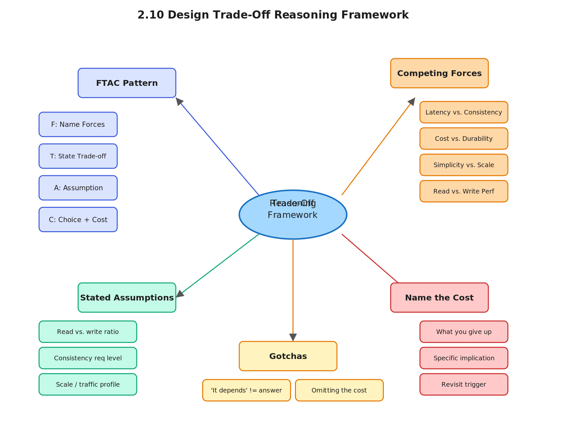

# 2.10 Design Trade-Off Reasoning Framework

> **Topic:** Topic 2 — System Design Core Principles & Scalability Fundamentals
> **Phase:** A — Core First Principles
> **Date studied:** 2026-05-05

---

## 1. 🎯 Goal of This Subtopic

> *Why are you studying this? What should you be able to do after this session?*

Be able to walk through any design decision in a structured, vocal way — identifying competing forces, stating your assumptions, committing to a choice, and explaining what you're giving up. Understand why top candidates don't just pick an answer but *reason aloud through the trade-off space*. Internalize a repeatable 4-step framework so that under interview pressure you never freeze at "it depends" — you always have a next move.

---

## 2. ✅ What Mastery Looks Like

> *Concrete, testable proof that you own this concept — not just familiarity.*

- [ ] Can articulate a trade-off out loud in under 60 seconds using the FTAC framework (Forces → Tradeoff → Assumption → Choice) without notes
- [ ] Can identify at least three competing forces for any given design decision (e.g., latency vs. consistency vs. cost)
- [ ] Can state a concrete assumption, tie it to the system's requirements, and use it to break a tie between two valid options
- [ ] Can explain the cost of the chosen option — not just what you gain, but what you give up — in one crisp sentence
- [ ] Can recognize when an interviewer is probing for trade-off reasoning vs. expecting a single correct answer

> 💡 **Rule of thumb:** If you can teach it to someone else and field their follow-up questions, you've mastered it.

---

## 3. 🗓️ Study Phases to Achieve Mastery

> *A progressive plan from first exposure to interview-ready. Work through each phase in order. Don't move to the next until you can honestly tick every item.*

### Phase 1 — Acquire 📖 💪💪
*Goal: Read deeply enough that you could explain the concept without the doc.*

- [x] Read **Designing Data-Intensive Applications** Ch. 1 (Kleppmann) — the framing of reliability, scalability, and maintainability as competing forces
- [ ] Read **System Design Interview Vol. 1** (Alex Xu) — Chapter 1: Scale From Zero — observe how the author frames each choice as a trade-off
- [ ] Read through **Sections 5–9** (Core Definition → How It Works) carefully — don't skim
- [ ] Re-read the **Cheatsheet** (Section 4) and try to recite it from memory after

### Phase 2 — Consolidate ✍️ 💪💪💪
*Goal: Verify you can reproduce the knowledge in your own words without looking.*

- [ ] Close the doc — write out the **Core Definition** from memory, then compare
- [ ] Explain **First Principles** out loud without notes — what problem does this solve and why?
- [ ] Reconstruct the **How It Works** mechanics step by step from memory
- [ ] Restate each **Trade-off** row in your own words — if you can't explain the cost, you don't own it yet

### Phase 3 — Apply 🔧 💪💪💪💪
*Goal: Connect to real systems and simulate interview scenarios.*

- [ ] Go through **Real-World System Examples** (Section 10) — verify each claim independently and add anything missed to **My Notes**
- [ ] Practice the **Interview Application** (Section 12) out loud — say the trigger phrases and your response as if in a live interview
- [ ] Work through **Common Misconceptions** (Section 13) — for each, make sure you can explain *why* the misconception is wrong, not just that it is
- [ ] Trace the **Relationships to Other Concepts** (Section 14) — can you explain each connection without looking?

### Phase 4 — Validate 🧪 💪💪💪💪💪
*Goal: Confirm you actually own it, not just recognize it.*

- [ ] Answer every **Self-Check Quiz** question (Section 15) out loud without looking at your notes
- [ ] Recite the **Cheatsheet** (Section 4) from memory — if you can't, re-do Phase 2
- [ ] Tick off items in **What Mastery Looks Like** (Section 2) — only check a box if you can demonstrate it on demand, not just if it sounds familiar
- [ ] Teach this concept out loud to an imaginary interviewer for 2 minutes without hesitation or notes

---

## 4. 📋 Cheatsheet

> *Everything you need to recall this concept in 30 seconds — for quick review before an interview.*



```
ONE-LINER
  Every design decision is a negotiation between competing forces — your job
  is to name the forces, state an assumption, pick a side, and own the cost.

KEY PROPERTIES / RULES
  1. Forces first: identify what is pulling in opposite directions (latency vs.
     consistency, cost vs. durability, simplicity vs. flexibility).
  2. Assumptions break ties: when two choices are both valid, a stated
     assumption about the system's priorities makes your choice defensible.
  3. Always name the cost: the choice isn't complete until you say what you
     gave up. Interviewers are probing whether you know the downside.
  4. One-sentence commitment: after reasoning, commit clearly — don't hedge
     with "it depends" as your final answer.
  5. Revisit when requirements change: a trade-off that was correct at 1K RPS
     may be wrong at 1M RPS.

DECISION RULE
  Use this framework when: any design decision where two or more valid options
  exist — storage engine choice, consistency model, sync vs. async, monolith
  vs. microservices, cache placement, replication factor.
  Avoid freestyle "it depends" answers when: you've already been given enough
  requirements to make a defensible call — at that point, pick and justify.

NUMBERS / FORMULAS
  FTAC framework: Forces -> Tradeoff -> Assumption -> Choice+Cost
  3 forces minimum: always identify at least three before committing
  1 assumption: one stated assumption is enough to break any tie cleanly

GOTCHA TO NEVER FORGET
  "It depends" is the start of an answer, not the end — you MUST follow it
  with what it depends on, your assumption, and a concrete choice.
```

---

## 5. 🧠 Core Definition

> *What is it, in one sentence?*

The design trade-off reasoning framework is a structured method for making and justifying system design decisions by explicitly naming the competing forces at play, stating an assumption that reflects the system's priorities, committing to a choice, and articulating the cost of that choice — turning "it depends" from a dead-end into a disciplined analytical move.

---

## 6. 📦 Core Concepts

> *The essential building blocks of this subtopic — the terms and ideas you must have solid before going deeper.*

### Competing Forces
Every meaningful design decision involves at least two valid but conflicting goals — latency vs. consistency, cost vs. durability, simplicity vs. scalability, read performance vs. write performance. Recognizing these forces is the first and most important step; candidates who jump straight to a choice without naming the forces appear to be guessing rather than reasoning. For example, choosing between SQL and NoSQL is not a preference — it's a negotiation between schema flexibility, query expressiveness, and horizontal scalability.

### Stated Assumptions
An assumption is a claim about the system's priorities that you make explicit before committing to a choice — "assuming this is a read-heavy workload with a 10:1 read/write ratio" or "assuming strong consistency is non-negotiable for financial transactions." Assumptions are not weaknesses; they demonstrate that you understand the design space is context-dependent. A well-stated assumption also gives the interviewer a hook to redirect you ("what if the ratio were 1:1?") without making it feel like a failure.

### The Cost Statement
The cost statement is what separates senior-level reasoning from junior-level reasoning. After choosing option A over option B, you must articulate what you're giving up — not just vaguely ("it's slower") but precisely ("this gives us better write throughput at the cost of stale reads up to 500ms behind on replicas"). The cost statement proves you're not blindly advocating for a technology; you're making a deliberate engineering trade.

### Revisiting Under Changing Requirements
A good trade-off is context-bound. The right database choice at 100K users may be wrong at 10M. The right consistency model for a startup may be wrong after adding a financial product. Acknowledging that trade-offs are not permanent — and signaling to the interviewer that you'd revisit them as requirements evolve — demonstrates engineering maturity and systems thinking over time.

### The FTAC Pattern
FTAC (Forces → Trade-off → Assumption → Choice+Cost) is the concrete verbal pattern to internalize. Forces: "The main tension here is between write latency and read freshness." Trade-off: "If we go strongly consistent, reads are always fresh but writes block on quorum. If we go eventually consistent, writes are fast but reads may lag." Assumption: "Since this is a user-facing feed where a 500ms staleness window is acceptable, I'll assume eventual consistency is fine." Choice+Cost: "I'll go with eventual consistency — the cost is that a user may briefly see stale data, but we gain significantly better write throughput and availability."

---

## 7. 🔍 First Principles — Why Does This Exist?

> *What fundamental problem does this concept solve? Why was it invented?*

System design interviews exist not to test encyclopedic knowledge of technologies, but to evaluate how a senior engineer thinks under ambiguity. The core problem is that most system design problems have no single correct answer — they have a space of valid answers, each with different trade-offs. Without a structured approach to navigating that space, candidates either freeze at "it depends," guess at the "right" answer the interviewer wants, or pick a technology they're familiar with without justifying it.

The trade-off reasoning framework exists because distributed systems are fundamentally about constraint satisfaction under partial failure. CAP theorem, PACELC, Little's Law, and consistency spectra all exist because you cannot simultaneously optimize all dimensions of a system. The framework gives you a repeatable process to navigate that reality — one that works whether you're choosing a storage engine, a consistency model, a deployment topology, or a message delivery guarantee. It transforms design from a trivia contest into a principled engineering conversation.

---

## 8. 🗺️ Mental Models

> *Intuition frames that help you reason about this concept fast — especially under interview pressure.*

### Model 1: The Dial, Not the Switch
Think of each design dimension — consistency, latency, cost, durability — as a dial that you turn up or down, not a binary switch you flip on or off. When you turn the consistency dial up, the latency dial goes up too. The framework forces you to name which dials you're turning, in which direction, and by how much — making your reasoning legible to the interviewer. This model breaks down when considering genuinely binary decisions (sync vs. async, stateful vs. stateless), but for most continuous dimensions it works well.

### Model 2: The Contract with the Interviewer
Every trade-off statement is a mini-contract: "Given assumption X, I choose Y, and I accept cost Z." The interviewer can then push on any of the three terms — change the assumption, question the choice, or probe the cost. This model makes clear why vague answers ("it depends on the use case") are frustrating: they offer no contract to push on, and they signal that the candidate can't commit under pressure. A specific, wrong assumption that you can reason from is better than a safe, uncommitted "it depends."

### Model 3: The Two-Column Board
Before answering any design decision, mentally draw a two-column table: left column is what you gain, right column is what you give up. Force yourself to fill both columns before speaking. This prevents the most common mistake: articulating only the upside of your choice while leaving the cost invisible. The model breaks down for multi-way trade-offs (three or more competing options) where a 2D table can't capture the full decision space — at that point, you need the full FTAC pattern.

---

## 9. ⚙️ How It Works — Mechanics

> *Step-by-step or layered explanation of the internal mechanism.*

**The FTAC flow in practice:**

**Step 1 — Name the Forces.** When a design decision arises, pause and identify the competing pressures. There are always at least two — usually three. Common force pairs: read latency vs. write throughput, consistency vs. availability, storage cost vs. query flexibility, operational simplicity vs. scalability. Say them aloud: "The tension here is between X and Y." This alone signals mature engineering thinking.

**Step 2 — State the Trade-off Space.** Describe what each option gives you and costs you — briefly. "If we go with approach A, we get [benefit] but sacrifice [cost]. If we go with approach B, we get [benefit] but sacrifice [cost]." Keep this to one sentence per option. The goal is to demonstrate that you understand the design space, not to enumerate every possible technology.

**Step 3 — State Your Assumption.** This is the pivot. Choose one assumption about the system's requirements or priorities that makes one option clearly better than the other. "Assuming this is a read-heavy system with 10:1 read/write ratio and sub-100ms p99 latency requirements..." The assumption should come from the requirements you clarified at the start of the interview or from a reasonable inference about the system type.

**Step 4 — Commit and Name the Cost.** Make a clear choice and immediately follow it with its cost. "I'll go with [X]. The trade-off is that we accept [cost] — [specific implication for the system]." Do not hedge. Do not say "or we could also do Y." You can acknowledge that Y is revisitable if requirements change, but land on a single choice.

**Handling pushback:** If the interviewer challenges your choice, don't abandon it — use their challenge to update your assumption. "If you're saying the write rate is actually 10x higher than I assumed, then the consistency cost of approach A becomes too high, and I'd move toward approach B instead." This demonstrates adaptability without appearing to have guessed in the first place.

**The revisit signal:** End significant trade-off discussions with one sentence about what would change your mind: "I'd revisit this if the write volume grows past X, if we add a financial product that requires stronger guarantees, or if read latency SLOs tighten to under 50ms." This shows systems thinking over time and makes you sound like a Staff engineer who plans for evolution.

---

## 10. 🏭 Real-World System Examples

> *Where does this appear in production systems you know?*

| System | How This Concept Applies | Notes |
|--------|--------------------------|-------|
| DynamoDB | AWS explicitly chose AP (eventual consistency) as the default, prioritizing availability and write throughput over strong consistency — a stated trade-off documented in the Dynamo paper | Strong consistency is available but at higher latency and cost; the default reflects Amazon's assumption that most shopping cart workloads tolerate stale reads |
| Google Spanner | Chose external consistency (stronger than linearizability) at the cost of globally coordinated TrueTime and higher write latency — the trade-off is documented as necessary for financial and inventory systems | The forces were: global consistency vs. write latency; the assumption was that correctness was non-negotiable for these workloads |
| Cassandra | Tunable consistency via R + W > N gives operators a dial to turn — teams make the trade-off explicitly per query type | Read-heavy paths often use ONE; write-heavy paths use QUORUM; the framework is baked into the API |
| Kafka | Chose durability and ordering within a partition over global ordering across partitions — a deliberate trade-off to enable horizontal scale | The assumption: most consumers care about per-key ordering (e.g., a user's events), not global ordering across all users |
| Netflix CDN (Open Connect) | Chose to pre-position popular content (push CDN) over pull CDN — accepting higher storage cost to reduce origin load and egress latency | Forces: origin load vs. storage cost; assumption that a small catalog of titles accounts for 80%+ of traffic (Pareto distribution) |

---

## 11. ⚖️ Trade-offs

> *Every design decision has a cost. What are you giving up?*

| ✅ Benefit | ❌ Cost / Limitation |
|-----------|---------------------|
| Forces explicit reasoning — the interviewer sees your thought process, not just your conclusion | Takes more time per decision — a 45-minute interview has limited bandwidth; over-applying the framework to trivial decisions wastes time |
| Stated assumptions make your answer defensible and revisable — the interviewer can redirect rather than dismiss | Assumptions can be wrong — if your assumption is far from the actual system context, your entire reasoning chain may be correct but irrelevant |
| Naming the cost demonstrates Senior+ level thinking — most candidates omit this step | Naming costs can sound pessimistic if done poorly — framing matters; "we accept X cost" is better than "unfortunately X" |
| Structured verbal pattern reduces cognitive load under pressure — you don't have to improvise the structure | Can sound formulaic if over-rehearsed — the framework should be internalized, not recited robotically |

---

## 12. 🎯 Interview Application

> *How do you use this concept in a design interview? What triggers it?*

**When an interviewer asks / says:**
- "Which approach would you choose here?" or "How would you decide between X and Y?"
- "What are the trade-offs of that design?"
- "Why not just use [technology X]?"
- "How would this perform at 10x the scale you designed for?"

**What you say / do:**
Use the FTAC pattern whenever you reach a fork — storage choice, consistency model, sync vs. async, caching strategy. In the interview flow, this typically surfaces during the high-level design phase and the deep dive. Don't wait for the interviewer to ask; proactively surface trade-offs at each major decision point — it demonstrates ownership of the design space.

**The trade-off statement (memorize this pattern):**
> "If we choose eventual consistency, we get lower write latency and higher availability, but we pay with the possibility of stale reads up to a few hundred milliseconds. For a social feed where users can tolerate slight staleness, eventual consistency is the right call — but I'd revisit this if we add a financial product where read-after-write correctness is required."

---

## 13. ⚠️ Common Misconceptions & Gotchas

> *What do candidates get wrong? What nuance is the interviewer probing for?*

- ❌ **Misconception:** "It depends" is a complete answer that demonstrates flexibility.
  ✅ **Reality:** "It depends" is the *start* of an answer. It must be immediately followed by: what it depends on, your assumption about this system's priorities, your concrete choice, and the cost. Leaving an interviewer with only "it depends" signals inability to commit under ambiguity — a red flag at senior levels.

- ❌ **Misconception:** The goal is to find the "correct" answer the interviewer is looking for.
  ✅ **Reality:** Most experienced interviewers don't have a single correct answer in mind — they're evaluating *how* you reason, not what you conclude. A well-reasoned choice for option A is often more impressive than arriving at option B through guesswork or familiarity.

- ❌ **Misconception:** Naming the cost of your choice makes you look indecisive or pessimistic.
  ✅ **Reality:** Naming the cost is the most important signal of engineering seniority. It proves you understand the full design space, not just the happy path. Interviewers specifically probe for this — "what are the downsides?" — precisely because junior candidates tend to omit it.

- ❌ **Misconception:** You should apply the full trade-off framework to every single decision in the interview.
  ✅ **Reality:** Reserve the full FTAC pattern for the 3–4 most significant design decisions. For minor choices (e.g., "I'll use JSON over XML for readability"), a one-sentence justification suffices. Applying the full framework everywhere signals poor calibration of what matters.

---

## 14. 🔗 Relationships to Other Concepts

> *How does this connect to adjacent subtopics in this topic or across the roadmap?*

- **Builds on:** CAP theorem (2.1), PACELC (2.2), consistency vs. availability spectrum (2.5), latency vs. throughput (2.3) — all of these provide the *vocabulary* of competing forces that the trade-off framework operates on. Without understanding CAP and consistency models, you don't have the forces to reason about.
- **Enables:** Every subsequent topic in the roadmap — load balancing (3), caching (4), sharding (7), replication (15-16), consistency models (17) — is an application domain where this framework will be invoked. Mastering the framework here means you have a meta-skill that makes all later topics more useful in interviews.
- **Tension with:** The natural human tendency toward premature commitment — people often reach for a familiar technology (e.g., "I'll use Kafka") before naming the forces. The framework's discipline of naming forces first is in direct tension with the impulse to answer quickly; learning to slow down at decision points is the practical challenge.

---

## 15. 🧪 Self-Check Quiz

> *Can you answer these without looking? If not, you haven't internalized it yet.*

1. What are the four steps of the FTAC framework, and what does each step accomplish in a design conversation?

   > 💡 *Think through your answer before expanding — if you hesitate, revisit Section 9.*

```markdown
1. What are the four steps of the FTAC framework, and what does each step accomplish in a design conversation?

1. Name the forces. It's usually three common force paths that are in tension with each other, and we will need to say the tension here is between X and Y. 

2. State the trade-off. We need to define what each option gives us and costs us. Briefly, if we go with approach A, we get benefit A but sacrifice cost A. If we go with approach B, we get benefit B but sacrifice cost B. 

3.  State your assumption. We need to state clearly the assumptions about the systems and how this assumption makes one choice clearly better than the other. The assumption should come from the requirements you clarify at the start of the process. 

4. Commit and name the cost. We need to make a clear choice and follow up with the cost of making our choice. To say I'll go with X and the trade-off is that we accept the cost of this choice on this system. Lastly we also need to make sure that we are open to revisiting our choice if the assumptions above change. 
```

2. An interviewer asks whether you'd use SQL or NoSQL for a social media user profile service. Walk through the trade-off using FTAC — name at least two competing forces, state an assumption, make a choice, and name the cost.

   > 💡 *If you default to "it depends" without completing the pattern, revisit Section 6 (Competing Forces and Stated Assumptions).*

```markdown
Forces
Between a relational database and document store, there are two main tensions here:

1. horizontal vs vertical scalability
2. schema flexibility vs query expressiveness

Tradeoff

For the first tension, if we choose horizontal scalability, we basically have no cap on ability to scale we pay with the additional coordination costs and consistency costs. If we choose vertical scalability, we get a much simpler system architecture, and we will probably have a faster go-to-market response time, but in this case we will reach a hardware ceiling. In addition, we have a single point of failure. On the other hand, if we choose a flexible schema, which is what MongoDB is characterized as, we basically are able to add additional features on demand. The downside is we will need to maintain different versions of the schema and factor in reconciliations between previous versions of the schema. If we favor query expressiveness, then a relational database will be a good choice because that allows us to craft targeted SQL queries that will give us exactly what we want and we get more targeted search. The downside is that this query comes at a cost of latency. We will have higher latency the more complicated the queries are.

Assumption

Assuming the feed is really heavy we have a 10 to 1 ratio. The polls are fetched by user ID and timestamp with no complex joins. The data model will evolve as we add reactions, stories, and polls. I'll go with MongoDB. The cause is we lose a seed transition guarantee across documents 

Choice + Cost

I will go with MongoDB as our database store. The cause is that we now get horizontal scalability, but we pay for it with extra coordination overhead, and that complicates the systems. And the reason we are choosing MongoDB is that we expect to add new features to our service over time, and that will translate to adding new columns and adding new constraints to our database fields. In this case, MongoDB has a more relaxed field adding a column, and this will better serve our needs.
I'll revisit my choice if above assumptions change.
```

3. Why is the cost statement the single most differentiating part of a trade-off discussion, and what do senior interviewers specifically listen for when evaluating it?

   > 💡 *If you're unsure, revisit Section 13 (misconception #3) and Section 6 (The Cost Statement).*

Most candidates enumerate benefits and either omit the cost entirely or mention it vaguely ("it's a bit slower," "there's some overhead"). This is what junior and mid-level candidates do — they advocate for a technology without owning its downside, which signals they're pattern-matching to familiar tools rather than reasoning through the design space.
Senior interviewers listen for two things specifically. First, precision — not "it has higher latency" but "writes block until a quorum of replicas acknowledges, which adds 50–200ms to p99 depending on replication topology." Vague costs suggest shallow understanding. Second, self-awareness — whether the candidate can articulate what they're giving up as a deliberate choice, not as an unfortunate side effect. "We accept stale reads up to 500ms on replicas" is a deliberate engineering decision. "It might be slightly inconsistent" is a hope.
Interviewers also probe the cost statement directly — "what are the downsides of that choice?" — precisely because candidates tend to skip it. If you've already named the cost unprompted, that question has no teeth. If you haven't, it exposes you immediately.

4. Name a real production system (from Section 10 or your own knowledge) that made a documented, explicit trade-off in its architecture — describe what forces they balanced and what assumption drove their choice.

   > 💡 *Bonus: can you explain why the same trade-off might be made differently by a startup vs. an enterprise?*

Google Spanner is the canonical example. The forces in tension were global strong consistency vs. write latency and infrastructure cost. Every distributed database faces this — you can have fast writes or globally consistent reads, not both without significant engineering cost.
The force that made Spanner unusual is what they chose to pay: TrueTime, a globally synchronized clock using GPS and atomic clocks in every data center. Every write waits for the TrueTime uncertainty window to close before committing — typically 7–14ms added to every write — to guarantee that timestamps are globally ordered without ambiguity. That's an expensive engineering bet.
The assumption that drove it: Google's Ads and Finance teams needed external consistency — a guarantee stronger than linearizability — because a monetary transaction processed in a US data center and read milliseconds later in a European data center must never show a different result. A double source of truth in financial data isn't a bug to fix; it's a regulatory and trust failure.
The contrasting system is worth knowing: Amazon's Dynamo paper (2007) made the opposite assumption — that shopping cart data can tolerate stale reads — and chose AP accordingly. Same forces, different assumption, completely different architecture. That contrast is what makes the Spanner example powerful in an interview.

5. An interviewer pushes back on your consistency choice: "What if the write volume is 10x higher than you assumed?" Walk through how you'd respond without abandoning your original reasoning chain.

   > 💡 *The key is updating your assumption, not starting over — revisit Section 9 (Handling Pushback) if this feels awkward.*

That's a real constraint — 10x write volume changes the economics of quorum-based consistency significantly. But before I change my choice, I want to check whether it breaks my core requirement, which was that we cannot have a double source of truth on financial data. Higher write volume makes that requirement more expensive to satisfy, not less valid. So I'd keep the consistency requirement and tackle the throughput problem architecturally. Specifically: scope the synchronous quorum to the local region — two of three nodes in the same availability zone — which drops coordination latency dramatically. Replicate asynchronously to remote regions, but with idempotency keys and a reconciliation process to detect any divergence before it propagates. That gives us the write throughput headroom we need without relaxing the consistency guarantee. I'd update my assumption: the system now requires a regional quorum topology rather than a global one, and I'd add a conflict detection layer on cross-region sync. I'd only fully relax consistency if the requirement itself changed — for example, if the product team told us that eventual consistency within a 500ms window is acceptable for this transaction type.

---

## 16. 📚 Further Reading

> *Optional: links, chapters, or resources for deeper understanding.*

- [ ] **Designing Data-Intensive Applications** — Martin Kleppmann, Chapter 1 (Reliable, Scalable, and Maintainable Applications) — the canonical framing of competing system properties
- [ ] **System Design Interview Vol. 1** — Alex Xu, Chapter 1 (Scale From Zero to Millions of Users) — observe how trade-offs are framed at each scaling inflection point
- [ ] **Amazon's Dynamo paper** (2007) — DeCandia et al. — real engineering document showing how Amazon explicitly traded consistency for availability, with stated assumptions about shopping cart workloads
- [ ] **Google's Spanner paper** (2012) — Corbett et al. — the opposite trade-off from Dynamo, choosing external consistency at the cost of TrueTime overhead
- [ ] **ByteByteGo — "A Framework for System Design Interviews"** — Alex Xu (YouTube/newsletter) — practical walkthrough of applying structured reasoning in a mock interview context

---

## 17. ✍️ My Notes

> *Personal observations, things that confused me, analogies that helped.*

