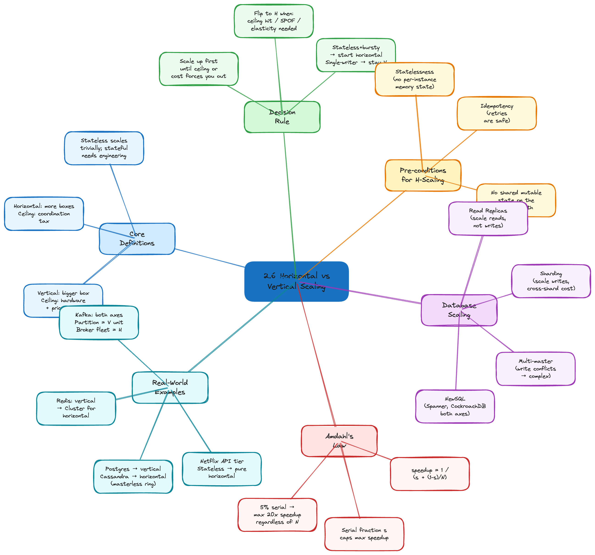

# 2.6 Horizontal vs. Vertical Scaling — When Each Applies

> **Topic:** Topic 2 — System Design Core Principles & Scalability Fundamentals
> **Phase:** A — Core First Principles
> **Date studied:** 2026-04-28

---

## 1. 🎯 Goal of This Subtopic

> *Why are you studying this? What should you be able to do after this session?*

- Be able to **classify** any scaling decision as **vertical (scale up)** or **horizontal (scale out)** and justify the classification using cost, fault-tolerance, and ceiling arguments.
- Understand the **physical and economic limits of vertical scaling** — why a single box always tops out and why the price-per-unit-capacity curve goes superlinear at the high end.
- Understand the **coordination tax of horizontal scaling** — why scaling out is "free in capacity, expensive in complexity" (state distribution, consistency, partitioning, network failure).
- Identify which **system components** scale horizontally easily (stateless web tiers, CDNs, read replicas) and which scale horizontally only with deliberate engineering (databases, stateful services, in-memory caches).
- Walk through a scaling trade-off out loud in a structured way: name the bottleneck, choose the axis (up vs. out), explain the cost, and identify when the choice flips.

---

## 2. ✅ What Mastery Looks Like

> *Concrete, testable proof that you own this concept — not just familiarity.*

- [x] Can define **vertical** vs. **horizontal** scaling crisply and explain the physical/economic ceiling of each (single-box limits vs. coordination overhead).
- [ ] Can classify any system component (web tier, RDBMS, Redis, Kafka, S3, queue worker) as "easy to scale horizontally", "hard to scale horizontally", or "must scale vertically" — and explain why.
- [x] Can recite the **scaling decision rule**: scale up first until cost or ceiling forces you out, then scale out — and explain the two scenarios where this rule flips.
- [x] Can identify the **three canonical pre-conditions** that make a service horizontally scalable (statelessness, idempotent operations, no shared mutable state) and name a violation for each.
- [x] Can explain why **databases are the hardest to scale horizontally** and name the four standard approaches (read replicas, sharding, multi-master, NewSQL) with their trade-offs.
- [x] Can articulate the **trade-off statement** out loud in under 30 seconds for any scaling decision in an interview.

> 💡 **Rule of thumb:** If you can teach it to someone else and field their follow-up questions, you've mastered it.

---

## 3. 🗓️ Study Phases to Achieve Mastery

> *A progressive plan from first exposure to interview-ready. Work through each phase in order. Don't move to the next until you can honestly tick every item.*

### Phase 1 — Acquire 📖 💪💪
*Goal: Read deeply enough that you could explain the concept without the doc.*

- [x] Read **DDIA Chapter 1** ("Reliable, Scalable, and Maintainable Applications") — the section on "Scalability" and "Approaches for coping with load."
- [x] Read **DDIA Chapter 6** ("Partitioning") — the introduction explains why horizontal scaling of databases is uniquely hard.
- [x] Read Martin Fowler's **"Scaling Architectures"** notes — https://martinfowler.com/articles/patterns-of-distributed-systems/
- [x] Read AWS's **"Scaling Up vs. Scaling Out"** whitepaper / blog post — https://aws.amazon.com/blogs/architecture/
- [x] Watch **ByteByteGo — "Vertical vs. Horizontal Scaling"** on YouTube.
- [x] Read through **Sections 5–9** (Core Definition → How It Works) carefully — don't skim.
- [x] Re-read the **Cheatsheet** (Section 4) and try to recite it from memory after.

### Phase 2 — Consolidate ✍️ 💪💪💪
*Goal: Verify you can reproduce the knowledge in your own words without looking.*

- [x] Close the doc — write out the **Core Definition** from memory, then compare.
- [x] Explain **First Principles** out loud without notes — what problem does this solve and why does the choice exist?
- [x] Reconstruct the **How It Works** mechanics step by step from memory — including the three pre-conditions for horizontal scaling.
- [x] Restate each **Trade-off** row in your own words — if you can't explain the cost, you don't own it yet.

### Phase 3 — Apply 🔧 💪💪💪💪
*Goal: Connect to real systems and simulate interview scenarios.*

- [x] Go through **Real-World System Examples** (Section 10) — verify each claim independently and add anything missed to **My Notes**.
- [x] Practice the **Interview Application** (Section 12) out loud — say the trigger phrases and your response as if in a live interview.
- [x] Work through **Common Misconceptions** (Section 13) — for each, make sure you can explain *why* the misconception is wrong, not just that it is.
- [x] Trace the **Relationships to Other Concepts** (Section 14) — can you explain each connection without looking?

### Phase 4 — Validate 🧪 💪💪💪💪💪
*Goal: Confirm you actually own it, not just recognize it.*

- [x] Answer every **Self-Check Quiz** question (Section 15) out loud without looking at your notes.
- [x] Recite the **Cheatsheet** (Section 4) from memory — if you can't, re-do Phase 2.
- [x] Tick off items in **What Mastery Looks Like** (Section 2) — only check a box if you can demonstrate it on demand, not just if it sounds familiar.
- [x] Teach this concept out loud to an imaginary interviewer for 2 minutes without hesitation or notes.

---

## 4. 📋 Cheatsheet


> *Everything you need to recall this concept in 30 seconds — for quick review before an interview.*

```
ONE-LINER
  Vertical scaling buys a bigger box; horizontal scaling buys more
  boxes. Vertical is simpler but has a hard ceiling; horizontal is
  unbounded in capacity but pays a coordination tax.

KEY PROPERTIES / RULES
  - Vertical (scale up):   add CPU/RAM/SSD to ONE machine.
                           Limit: physical hardware ceiling + price
                           goes superlinear at the top end.
  - Horizontal (scale out): add MORE machines behind a load balancer
                           or partitioner. Limit: coordination cost
                           (state, consistency, network failure).
  - Stateless services scale horizontally trivially. Stateful
    services (databases, in-memory caches, sticky-session servers)
    require deliberate engineering to scale out.
  - The three pre-conditions for cheap horizontal scaling:
      1) Statelessness (no per-instance memory state)
      2) Idempotency (retries are safe)
      3) No shared mutable state on the critical path
  - Most real systems use BOTH: scale up the database (vertical),
    scale out the web tier (horizontal).

DECISION RULE
  Use VERTICAL scaling when:
    - The workload still fits on one box and you have budget headroom.
    - The component is hard to distribute (RDBMS leader, in-memory
      analytics, single-writer system).
    - Time-to-market matters more than long-term cost.
  Use HORIZONTAL scaling when:
    - You're past the single-box ceiling (CPU, RAM, NIC, IOPS).
    - You need fault tolerance — one machine = single point of failure.
    - You need elasticity — auto-scale up and down with traffic.
    - Cost-per-unit-capacity matters and commodity hardware wins.
  FLIP THE RULE when:
    - The service is stateless and traffic is bursty → start horizontal.
    - The component is fundamentally single-writer → stay vertical
      (or shard, which is "horizontal scaling done the hard way").

NUMBERS / FORMULAS
  - Vertical ceiling on cloud (2026): ~448 vCPU, ~24 TB RAM,
    ~100 Gbps NIC on the largest instance types (e.g. AWS u7i, x2gd).
  - Price-per-vCPU on the largest instances is typically 2–4x the
    price-per-vCPU on commodity instances (the "premium tier" tax).
  - Amdahl's Law:   speedup = 1 / (s + (1-s)/N)
                    where s = serial fraction, N = number of nodes.
                    Caps the benefit of horizontal scaling when there
                    is any serial bottleneck.
  - Coordination overhead grows roughly O(N²) for chatty consensus
    (Paxos/Raft) — that's why most consensus groups stay at 3–7 nodes.

GOTCHA TO NEVER FORGET
  "Horizontal scaling" is NOT free capacity — it's a TRADE: you swap
  the hardware ceiling for a coordination/consistency/network-failure
  tax. If your system is fundamentally single-writer or has shared
  mutable state, "just adding more boxes" makes it slower, not faster.
```

---

## 5. 🧠 Core Definition

> *What is it, in one sentence?*

**Vertical scaling (scale up)** is increasing the capacity of a single machine by adding more CPU, RAM, disk, or network bandwidth to it; **horizontal scaling (scale out)** is increasing total system capacity by adding more machines and distributing work across them. Vertical scaling is bounded by the physical and economic ceiling of one box; horizontal scaling is bounded by the coordination, consistency, and network-failure tax of distributing state across many boxes.

---

## 6. 📦 Core Concepts

> *The essential building blocks of this subtopic — the terms and ideas you must have solid before going deeper.*

### Vertical Scaling (Scale Up)
You take the existing machine running the workload and make it bigger — more vCPUs, more RAM, faster SSDs, a faster NIC. The application code is **untouched**: it still sees a single OS, a single process, a single memory space. There is no distributed-systems work to do, no consistency protocols, no partition keys. The trade-off is the **single-box ceiling**: you eventually hit a hardware limit (CPU sockets, memory channels, PCIe lanes), and well before that hardware limit, the **price curve goes superlinear** — the largest cloud instances cost 2–4x per vCPU compared to commodity sizes. You also keep a **single point of failure**: one box dies, the service dies. **Example:** moving a Postgres primary from `db.r6g.large` (2 vCPU, 16 GB) → `db.r6g.16xlarge` (64 vCPU, 512 GB) is pure vertical scaling. The schema, query patterns, and client code don't change.

### Horizontal Scaling (Scale Out)
You add **more machines** (replicas, shards, partitions, workers) behind a load balancer, a partitioner, or a coordinator, and distribute work across them. Capacity grows **roughly linearly with node count** — *if* the workload distributes cleanly. The trade-off is the **coordination tax**: you now have to handle network failure between nodes, replicate state, agree on ordering, route requests to the right shard, and rebalance when nodes are added or removed. You also need a deployment story (config management, service discovery, rolling restarts) that simply doesn't exist for one box. **Example:** running 50 stateless API servers behind an ALB is trivial horizontal scaling; sharding a Postgres cluster across 10 nodes is also horizontal scaling but is dramatically harder.

### Stateless vs. Stateful (the pre-condition that decides everything)
The single biggest predictor of how easy horizontal scaling will be is whether the service is **stateless**. A stateless service holds no per-instance memory state — every request can be served by any instance because all the relevant state lives in a downstream system (database, cache, object store). Web servers, API gateways, image-resize workers, and most microservices are stateless by design and scale horizontally trivially. **Stateful** services (databases, in-memory caches with shard-local data, WebSocket servers with live connections, sticky-session app servers) require deliberate engineering — partitioning, replication, leader election, session affinity — to scale horizontally. The interview lesson: when asked "how do you scale this?", first ask "is it stateful?" — that determines 80% of the answer.

### Replication vs. Partitioning
Two distinct mechanisms inside horizontal scaling, often confused. **Replication** = the same data lives on multiple nodes (for read throughput, fault tolerance, geographic latency). **Partitioning (sharding)** = different data lives on different nodes (for write throughput and storage capacity that exceeds one box). Replication scales reads but not writes (the leader still bottlenecks). Partitioning scales writes but introduces cross-shard transactions and rebalancing pain. Most large systems use **both**: data is partitioned across N shards, and each shard is replicated 3 ways. **Example:** Cassandra partitions by hashing the row key across nodes (each node owns a token range), and each partition is replicated to RF=3 other nodes.

### Auto-scaling and Elasticity
Horizontal scaling unlocks **elasticity** — the ability to add and remove capacity in response to load. Vertical scaling typically requires a planned restart (resizing a VM is not instant, and the box goes down during the swap). Horizontal scaling lets you spin up a new instance behind the LB in seconds and tear it down when traffic subsides — pay only for what you use. This is the cost story behind cloud-native architectures: a horizontally scaled stateless tier can shrink to 5 instances overnight and grow to 500 during peak, where a vertically scaled box pays for the peak shape 24/7. Elasticity *is* horizontal scaling's killer feature for variable workloads.

---

## 7. 🔍 First Principles — Why Does This Exist?

> *What fundamental problem does this concept solve? Why was it invented?*

Every system runs on physical hardware, and physical hardware has hard limits — a CPU socket holds at most so many cores, a motherboard supports at most so many DIMMs, a NIC pushes at most so many bits per second. The very first systems handled load growth by **buying a bigger box** because that was the only option that didn't require rewriting the code. This works beautifully — until it doesn't.

Three forces broke vertical scaling and forced horizontal scaling into existence:

1. **The hardware ceiling is real.** Even today (2026), the absolute largest cloud VM tops out around 448 vCPUs and 24 TB of RAM. Workloads at Google/Meta/Netflix scale need orders of magnitude more capacity than that. There is no "buy a bigger box" answer at internet scale.

2. **The price curve goes superlinear.** Long before you hit the absolute ceiling, the **cost-per-unit-capacity** on the largest instance types is 2–4x the cost of commodity instances. A `u7i.metal-32tb` is ridiculously expensive per vCPU compared to two dozen `m6i.16xlarge`. For an application that distributes cleanly, commodity hardware wins on dollars-per-throughput long before it hits the wall on absolute capacity.

3. **A single box is a single point of failure.** A vertically scaled service has one machine — when it dies (hardware fault, kernel panic, AZ outage, AWS rack failure), the service dies with it. Horizontal scaling is not just about capacity; it's the *only* way to get fault tolerance, because fault tolerance fundamentally requires more than one machine.

Horizontal scaling, then, is the answer to "we cannot fit on one box, we cannot afford the premium-tier price curve, and we cannot tolerate a single point of failure." It introduces a new tax — the **coordination tax** of distributed state, consensus, and network failure — but it's the only path forward at scale. The history of distributed systems engineering is largely the history of paying that coordination tax cleverly.

---

## 8. 🗺️ Mental Models

> *Intuition frames that help you reason about this concept fast — especially under interview pressure.*

### Model 1: The Tractor vs. The Combine Harvester
A **tractor** (vertical scaling) is one machine — buy a bigger one, plow more field per hour. Simple. One driver, one engine, one fuel tank. But: you can only build a tractor so big before the wheels can't carry the weight. A **combine harvester fleet** (horizontal scaling) is many smaller machines working in parallel — coordinate them with a foreman (load balancer / coordinator), and you can plow an arbitrarily large field. But: now you need radios, dispatchers, refuelers, GPS tracking, and a way to handle the case where one machine breaks down mid-field. The fleet has effectively unlimited capacity but a higher operational tax. **Where it breaks down:** the analogy implies tractors and combines do the same job — but in software, some workloads (single-leader databases, in-memory consensus) are inherently single-tractor jobs and *cannot* be parallelized cleanly without rebuilding the whole machine.

### Model 2: The Restaurant Kitchen
**Vertical scaling** is hiring a faster, more experienced chef and giving them a bigger stove. They cook every dish themselves, in order, with no coordination overhead — but throughput caps at "how fast can one human cook." **Horizontal scaling** is hiring more chefs, splitting the kitchen into stations (grill, pastry, salad), and using an expediter to coordinate the line. Throughput grows with the number of chefs, but now you need the expediter (load balancer), shared mise en place (cache layer), tickets (request queue), and a head chef to settle disputes when two chefs need the same ingredient (distributed lock / leader election). **Where it breaks down:** in real distributed systems, chefs (servers) are sometimes secretly sharing a single fridge (database). When the fridge becomes the bottleneck, hiring more chefs makes things *worse*, not better — because the fridge is the actual constraint. This is exactly why "scaling the web tier" doesn't help when the database is saturated.

### Model 3: The Highway and the Toll Booth
**Vertical scaling** is widening the highway — adding lanes from 4 to 12. More cars per second, but the toll booth at the entrance is still one booth and becomes the bottleneck. **Horizontal scaling** is splitting the toll booth into 12 booths, each handling its own lane. Cars are routed (load balanced) into the booth with the shortest queue. The bottleneck moves elsewhere — maybe to the merge point on the other side, maybe to the off-ramps. **Where it breaks down:** this assumes cars can be routed to any booth — which is only true if the booths don't need to coordinate (i.e., the service is *stateless*). If car #5 must go to the same booth as car #3 because the booth is holding their session, the model collapses into "you need sticky routing", which limits how cleanly you can scale.

---

## 9. ⚙️ How It Works — Mechanics

> *Step-by-step or layered explanation of the internal mechanism.*

### Vertical scaling — the mechanic
1. **Identify the bottleneck resource** on the current box: CPU, RAM, disk IOPS, network bandwidth, or file descriptors. Use observability (CPU%, memory used, IOPS, network saturation) to pinpoint which resource is saturating.
2. **Pick a larger instance type** that has more of that resource. On AWS this means moving up the instance family (e.g. `r6g.large` → `r6g.4xlarge`) or switching family entirely (e.g. compute-optimized `c-class` to memory-optimized `r-class` if RAM is the bottleneck).
3. **Plan the swap.** For stateful services (databases), this almost always means a brief downtime or a failover: provision the bigger instance, replicate state to it, cut traffic over, retire the old box. Cloud-native services (RDS, Aurora) automate this with minimal downtime, but it's not free.
4. **Verify** that the bottleneck moved. If you scaled up CPU but the real bottleneck was disk IOPS, the bigger box doesn't help.

### Horizontal scaling — the mechanic
1. **Verify the service is horizontally scalable** — i.e., it satisfies the three pre-conditions: statelessness, idempotency, no shared mutable critical-path state. If any pre-condition fails, you're either going to fix it (refactor to externalize state, add idempotency keys) or you're going to take the harder path (sharding, replication, leader election).
2. **Add a load balancer or partitioner** in front of the service. Stateless services use a load balancer (round-robin, least-connections, etc.). Stateful services use a partitioner (consistent hashing, range partitioning, etc.) to route each request to the right shard.
3. **Add more instances** behind the LB/partitioner. For stateless services this is trivial — start the new container, register it with service discovery, the LB picks it up and starts routing traffic. For stateful services this involves rebalancing (moving partitions), bootstrapping (replicating data to the new node), and possibly leader-election changes.
4. **Handle the failure modes that didn't exist before.** Now any single instance can die without taking the system down — but the LB needs health checks, retries need to be idempotent, and the system needs to handle partial failures (some nodes responding, others not).
5. **Set up auto-scaling** if elasticity is desired: the LB or orchestrator monitors load and adds/removes instances based on thresholds (e.g., target CPU 60%).

### The three pre-conditions for cheap horizontal scaling
1. **Statelessness** — no per-instance memory state. All persistent state lives in a database or cache; all session state is either in a cookie/token or in a shared store. Any instance can serve any request.
2. **Idempotency** — operations are safe to retry. Network failure under horizontal scaling means retries are inevitable; non-idempotent operations (e.g. "increment counter by 1" without a deduplication key) double-charge under retry.
3. **No shared mutable state on the critical path** — instances should not coordinate on every request. If every request takes a global lock, adding more instances makes things *worse* (lock contention grows). Shared state should be partitioned, replicated, or made immutable.

### Amdahl's Law — the ceiling on horizontal scaling
The maximum speedup from horizontal scaling is bounded by the **serial fraction** of the workload:

```
speedup(N) = 1 / (s + (1 - s)/N)
```

Where `s` is the fraction of the workload that *cannot* be parallelized (locks, single-writer paths, sequential I/O), and `N` is the number of nodes. As `N → ∞`, speedup → `1/s`. So if 5% of your workload is serial, your maximum theoretical speedup is **20x**, no matter how many nodes you add. This is why identifying and shrinking the serial fraction (e.g. removing global locks, sharding the database) is more important than adding more boxes once you're past the easy wins.

---

## 10. 🏭 Real-World System Examples

> *Where does this appear in production systems you know?*

| System | How This Concept Applies | Notes |
|--------|--------------------------|-------|
| **Netflix API tier** | Pure horizontal scaling — thousands of stateless service instances behind ELBs, auto-scaled by CPU/request rate. | The web tier is trivially horizontal because it's stateless. State (user profile, viewing history) lives in Cassandra and EVCache. |
| **AWS RDS / Aurora (vertical)** | The primary instance is **vertically scaled** — you choose an instance class. To scale further, you either move to a larger class (vertical) or add **read replicas** (limited horizontal). | Writes still bottleneck on the single primary. Aurora decouples storage (horizontal) from compute (still vertical for writes), which is why it scales further than vanilla RDS. |
| **Cassandra** | Horizontally scaled by design — masterless, partitioned by consistent hashing, replicated RF=3. Add a node, the ring rebalances automatically. | Optimized for *write* horizontal scaling — the case classic RDBMSes can't handle. The trade-off is consistency model (eventual / tunable). |
| **Redis (single-node vs. Cluster)** | Single-node Redis is **vertically scaled** — pick a bigger instance for more RAM. **Redis Cluster** is the horizontal answer: 16,384 hash slots distributed across nodes. | Most teams stay on vertical Redis for as long as possible because Redis Cluster has cross-slot transaction limitations and operational complexity. |
| **Kafka** | Horizontally scaled by design — topics split into partitions, partitions distributed across brokers. Each partition is *vertically* scaled (single-leader, single ordering). | Combines both axes: the cluster is horizontal, but the partition is the unit of vertical scaling — partition count is your primary scaling lever. |
| **Postgres (vanilla)** | Primarily **vertical** — the canonical answer for years was "buy a bigger box." Horizontal scaling requires manual sharding or extensions like Citus/Postgres-XL. | This is why Postgres-on-RDS scales to ~96 vCPU primaries and stops there; sharding is engineering work the application team has to own. |
| **DynamoDB** | Fully horizontal — partitioned by partition key, no concept of "instance size." Capacity is managed by RCU/WCU or on-demand. | The user never sees the underlying boxes. AWS has done the horizontal scaling for you at the cost of a constrained API (no joins, single-partition transactions only by default). |
| **WebSocket / chat servers (e.g. Discord)** | Stateful — connections are pinned to a specific server. Horizontal scaling requires **sticky routing** (consistent hashing on user ID) and a pub/sub layer (Redis, Kafka) for cross-server messages. | Classic example of "horizontal scaling that needs deliberate engineering." Naively round-robining WebSockets across servers breaks every chat feature. |

---

## 11. ⚖️ Trade-offs

> *Every design decision has a cost. What are you giving up?*

| ✅ Benefit | ❌ Cost / Limitation |
|-----------|---------------------|
| **Vertical scaling** is operationally simple — no distributed systems concerns, no LB, no consensus, no rebalancing. The app code doesn't change. | You hit a **hardware ceiling** (~448 vCPU, ~24 TB RAM in 2026), the **price curve goes superlinear** at the top end (2–4x premium per vCPU), and you keep a **single point of failure**. Resizing typically requires a brief downtime or failover. |
| **Horizontal scaling** removes the capacity ceiling, gets **fault tolerance** for free (any single box can die), and unlocks **elasticity** (auto-scale up/down with load — pay only for peak when you need it). | You pay a **coordination tax**: load balancing, service discovery, distributed state, consistency protocols, partial-failure handling. Stateful systems require deliberate engineering (partitioning, replication, leader election). Operations (deploys, debugging, observability) become harder. |
| **Horizontal scaling** lets you use **commodity hardware** — typically 2–4x cheaper per vCPU than the largest "premium tier" instances. Total cost-of-ownership at scale is much lower. | The **coordination overhead grows nonlinearly** with node count for chatty consensus protocols (Paxos/Raft are roughly O(N²) in messages). This is why most consensus groups stay at 3–7 nodes — beyond that, the consensus itself becomes the bottleneck. |
| **Horizontal scaling** lets you **scale different components independently** — e.g. scale the web tier 10x without scaling the database, because they sit at different points on the load curve. | **Amdahl's Law caps the benefit** if the workload has any serial fraction. A 5% serial workload caps at 20x speedup no matter how many nodes you add. Identifying and shrinking the serial fraction (e.g. global locks, single-writer paths) is often more important than adding boxes. |

---

## 12. 🎯 Interview Application

> *How do you use this concept in a design interview? What triggers it?*

**When an interviewer asks / says:**
- "How would you scale this to handle 10x more traffic?"
- "What if traffic spikes 50x during Black Friday?"
- "This database is becoming a bottleneck — what do you do?"
- "Why can't we just buy a bigger machine?"
- "How do you handle a node failure in this design?"

**What you say / do:**
This concept appears in **almost every system design interview**, typically during the **high-level design** phase (when you draw boxes and explain the scaling strategy) and again during **deep-dive trade-offs** (when the interviewer pushes on the bottleneck). The structured move is: (1) identify the **bottleneck component**, (2) classify it as stateless or stateful, (3) propose vertical scaling first if the component is hard to distribute (e.g. RDBMS leader) and you have headroom, (4) propose horizontal scaling for stateless tiers and bursty workloads, (5) name the **coordination tax** you're paying and which trade-off you're making (e.g. "we get elasticity but now we need a load balancer with health checks and idempotent retries").

**The trade-off statement (memorize this pattern):**
> "If we **scale vertically**, we get **operational simplicity** and **strong consistency for free**, but we pay **a hardware ceiling, a single point of failure, and a superlinear cost curve**. If we **scale horizontally**, we get **unbounded capacity, fault tolerance, and elasticity**, but we pay **a coordination tax — load balancing, distributed state, consensus, and harder operations**. For this system, **[X] is the right call** because **[bottleneck reasoning + traffic shape + fault-tolerance requirements]**."

---

## 13. ⚠️ Common Misconceptions & Gotchas

> *What do candidates get wrong? What nuance is the interviewer probing for?*

- ❌ **Misconception:** "Horizontal scaling is always better than vertical scaling."
  ✅ **Reality:** Horizontal scaling is better **only when the service is horizontally scalable** (stateless or cleanly partitionable). For workloads with strong serial dependencies (single-writer databases, in-memory consensus, real-time transactional systems), **vertical scaling is correct** — and you stay vertical until the box ceiling forces you out. The interviewer is probing whether you understand that "horizontal" is not free; it's a trade.

- ❌ **Misconception:** "Adding more nodes always increases throughput."
  ✅ **Reality:** **Amdahl's Law** says throughput is bounded by the serial fraction of the workload. If your service has a global lock, a single-writer hot path, or a saturated downstream (e.g. the database), adding more instances makes the contention *worse*, not better. Always ask "what's the bottleneck?" before adding capacity — adding nodes upstream of a bottleneck just moves the queue, doesn't shorten it.

- ❌ **Misconception:** "Horizontal scaling and sharding are the same thing."
  ✅ **Reality:** Sharding is **one specific kind** of horizontal scaling — partitioning data across nodes. The other major kind is **replication** (copying the same data to multiple nodes for read scale and fault tolerance). Stateless service horizontal scaling is a third flavor that needs neither — every instance is interchangeable. Get crisp on which mechanism you're invoking; saying "we'll just shard it" when the right answer is "we'll replicate it" gets pushback.

- ❌ **Misconception:** "Once a service is horizontally scaled, it scales linearly forever."
  ✅ **Reality:** Coordination overhead grows with node count. Consensus protocols like Paxos/Raft scale poorly past 5–7 nodes (which is why you don't see 100-node Raft groups). Even stateless tiers eventually hit downstream limits — the database, the cache, the message bus. The shape of horizontal scaling is **near-linear up to a point**, then **diminishing returns**, then **flat or negative** as coordination tax dominates.

- ❌ **Misconception:** "Stateful services can't scale horizontally."
  ✅ **Reality:** They *can*, but with deliberate engineering — partitioning (Cassandra, Kafka), replication (Redis Cluster, MongoDB), or leader-per-partition (Kafka brokers). The lazy version of "stateful services can't scale horizontally" is dangerous because it leads candidates to vertically scale the database past its ceiling, when the right move is to introduce sharding or pick a horizontally scalable database in the first place.

---

## 14. 🔗 Relationships to Other Concepts

> *How does this connect to adjacent subtopics in this topic or across the roadmap?*

- **Builds on:**
  - **2.5 Consistency vs. Availability spectrum** — horizontal scaling forces consistency choices because state is now distributed; vertical scaling lets you sidestep most consistency problems by keeping state on one box.
  - **2.4 Little's Law** — the formula L = λW tells you whether your current capacity is saturated, which informs *whether* to scale and which axis is the bottleneck.
  - **2.3 Latency vs. throughput** — horizontal scaling typically improves throughput but adds latency (LB hop, network round trips, replication lag); vertical scaling can improve both but only up to the box ceiling.

- **Enables:**
  - **2.7 Stateless vs. stateful systems** — directly determines how easy horizontal scaling is.
  - **2.8 Bottleneck identification** — you can't choose the right scaling axis without knowing which resource is saturating.
  - **Topic 3 — Load Balancing** — horizontal scaling of stateless tiers requires a load balancer; this is where L4 vs. L7 and routing algorithms become relevant.
  - **Topic 6 — Database Sharding & Partitioning** — horizontal scaling of databases is the hardest case and gets its own deep-dive topic.
  - **Topic 7 — Replication** — replication is the other half of horizontal scaling for stateful services.

- **Tension with:**
  - **Strong consistency** — horizontal scaling fundamentally fights linearizability; the more nodes, the harder it is to maintain a single global ordering. This is why CAP and PACELC apply only to horizontally scaled systems.
  - **Operational simplicity** — horizontal scaling is the right answer at scale, but it dramatically increases operational complexity (deployment, observability, debugging, on-call). Premature horizontal scaling is a real cost.
  - **Cross-shard transactions** — once you partition a database horizontally, transactions that span shards become expensive (2PC, sagas) or impossible. The vertical-scaled monolithic database had ACID for free.

---

## 15. 🧪 Self-Check Quiz

> *Mastery-diagnostic questions — answering these cleanly and without hesitation proves you own the topic. A vague or partial answer immediately reveals the gap. Answer out loud, unassisted, as if in a live interview.*

**Q1 — Core Definitions + Ceilings**
Define vertical and horizontal scaling in one sentence each. Then name the specific ceiling each one hits — not just "it has limits", but what physically or economically caps each axis.

> This tests whether you know the two ceilings by name: single-box hardware limit + superlinear price curve for vertical, and coordination/consistency/network-failure tax for horizontal. Saying "vertical runs out of space" without naming the price curve or SPOF reveals surface-level understanding.

Horizontal scaling is increasing total system capacity by adding more machines and distributing work across them. Apart from limits with horizontal scaling such as consistency, more coordination and network tolerance for failures. The bigger limitation for horizontal scaling is that due to Amdahl's law your maximum speedup with the n number of nodes is limited by the number of serial processes. So let's say if 5% of your processes is serial and cannot be distributed, and no matter how many nodes you add to your system, your theoretical maximum system speedup will be 20 times.

**Q2 — The Decision Rule + When It Flips**
You're designing a payment service with linearizable writes and predictable, steady traffic. Would you scale the database vertically or horizontally first? When, if ever, would you flip — and what triggers the flip?

> This tests the decision rule: scale up until the ceiling or cost forces you out. Candidates who say "horizontal is always better" fail immediately. The flip conditions matter — cost curve, SPOF risk, or workload exceeding box capacity.

I will vertically scale the database first because that makes operationally simplistic, easy to change and the workload still fits inside one box. Linearizable writes require a single global ordering. Distributing that across multiple nodes means you need distributed transactions (2PC), consensus protocols, or Saga patterns — all of which are expensive, slow, and complexity-multiplying. The database is fundamentally a single-writer workload. Horizontal scaling would fight the architecture, not help it. Vertical is correct because of the consistency requirement, not just because it's simpler.

Flip conditions
1.Hardware ceiling — you've maxed out the largest available instance (CPU, RAM, IOPS) and the workload still exceeds it
2.Superlinear cost — the price-per-vCPU on the largest instances becomes unjustifiable vs. sharding
3.SPOF is unacceptable — add a read replica or standby first; full horizontal sharding is the last resort

**Q3 — The Three Pre-conditions**
Name the three pre-conditions that make a service cheap to scale horizontally. For each, give one concrete violation that would break horizontal scaling if not fixed.

> This is a direct litmus test. If you can't name statelessness, idempotency, and no shared mutable critical-path state — with concrete violations — you haven't internalized the mechanics. "It needs to be distributed" is not an answer.

1. statelessnes (routing problem. wrong node, missing context)
User logs in → session token stored in Node A's memory → next request routes to Node B → Node B has no knowledge of the session → user gets a 401 or is treated as a stranger. Fix: externalize session state to Redis so any node can serve any request.

2. idempotency (retry problem. same operation, runs twice)
User clicks "Pay $100" → request times out in transit → client retries → both the original and the retry reach different nodes → no deduplication key → payment executes twice → $200 charged. Fix: attach an idempotency key to the request; any node that sees a duplicate key returns the cached result without re-executing.

3. no shared mutable state on critical paths
Let's say we have a bank account with a balance of $100. A violation on the mutable state of critical paths would mean person A withdraws $80 and it gives a successful response. Person B makes the same request to withdraw $80 to another node and it is also given a successful response. This creates a double-spending problem and then breaks the integrity of the system

**Q4 — Adding Nodes Makes It Worse**
You add 10 more instances to a stateless API tier, but throughput barely improves. What are the three most likely root causes, and how would you diagnose which one is the actual bottleneck?

> This probes Amdahl's Law, the downstream bottleneck problem (saturated DB), and coordination overhead. Candidates who don't think of the database as the real constraint, or who don't mention Amdahl's serial fraction, are missing the deepest insight in this topic.

1. Saturated downstream — the database (or any shared dependency) is the actual bottleneck, and adding API instances just means more threads queuing on the same saturated resource. More callers, same drain rate.

2. Global lock / serialized critical section — a lock in the application code (e.g. a mutex around a counter, a singleton resource) serializes all requests regardless of how many instances you have. This is Amdahl's serial fraction made concrete.

3. Downstream rate limit or blocking I/O — a third-party API, a slow external service, or a misconfigured connection pool caps throughput externally. Your instances are waiting, not working.

All this is due to Amdahl's law which states that the percentage of serial paths in your system, a theoretical limit on the amount of speedup as you add more nodes to your system.

**Q5 — Stateful Horizontal Scaling**
Postgres is classically scaled vertically; Cassandra is scaled horizontally by design. What specific architectural decision in each system causes this? And what are the four standard approaches for horizontally scaling a database that wasn't designed for it?

> This tests whether you understand that single-leader + ACID on the write path is why Postgres defaults to vertical, while Cassandra's masterless consistent-hashing ring makes it naturally horizontal. The four approaches (read replicas, sharding, multi-master, NewSQL) with their trade-offs separate those who've internalized the topic from those who've just read it.

Postgres has a single-leader write path with full ACID guarantees. All writes go through one primary. To distribute writes across multiple nodes you need distributed transactions (2PC) or a consensus protocol — both of which are expensive, slow, and complex. The single-writer + ACID model is what forces vertical scaling. The box gets bigger because distributing the write path correctly is hard enough that most teams don't do it.

Cassandra is horizontally scaled by design because it is masterless and it is partitioned by consistent hashing. The replication factor is 3. When we add a node to Cassandra DB, the hash ring will just rebalance automatically 

4 Standard approaches for horizontally scaling a database
1. Read Replicas
- Copy data to N followers; reads spread across them
  - Trade off: Writes still bottleneck on single leader, replication lag

2. Sharding
- Split data across nodes by partition key
  - Tradeoff: Cross-shard transactions become expensive or impossible

3. Multi-Master
- Multiple nodes accept writes
  - Tradeoff: Write conflicts require resolution; complext consistency

4. NewSQL
- System build for horizontal scal with ACD(Spanner, CockroachDB)
  - Tradeoff: higher latency, operational complexity, cost

---

## 16. 📚 Further Reading

> *Optional: links, chapters, or resources for deeper understanding.*

- [ ] **DDIA (Designing Data-Intensive Applications)** — Chapter 1 ("Reliable, Scalable, and Maintainable Applications"), section on "Scalability" and "Approaches for coping with load."
- [ ] **DDIA** — Chapter 6 ("Partitioning"), introduction — explains why horizontal scaling of databases is uniquely hard.
- [ ] **Martin Kleppmann's "Distributed Systems" lecture series** (Cambridge, available on YouTube) — Lecture 2 covers scaling fundamentals.
- [ ] **AWS Well-Architected Framework — Performance Efficiency Pillar** — section on scaling strategies. https://docs.aws.amazon.com/wellarchitected/latest/performance-efficiency-pillar/
- [ ] **ByteByteGo — "Vertical vs. Horizontal Scaling"** YouTube video (Alex Xu) — short, interview-focused refresher.
- [ ] **Werner Vogels' "10 Lessons from 10 Years of Amazon Web Services"** — covers horizontal scaling lessons at AWS scale. https://www.allthingsdistributed.com/

---

## 17. ✍️ My Notes

> *Personal observations, things that confused me, analogies that helped.*

