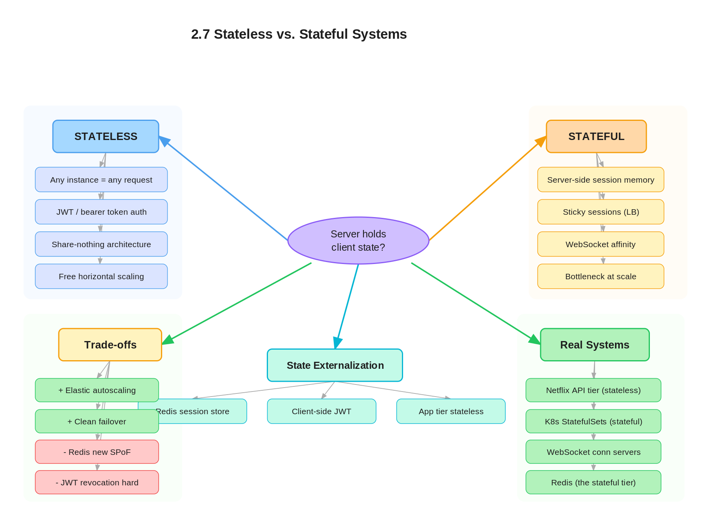

# 2.7 Stateless vs. Stateful Systems

> **Topic:** Topic 2 — System Design Core Principles & Scalability Fundamentals
> **Phase:** A — Core First Principles
> **Date studied:** 2026-04-30

---

## 1. 🎯 Goal of This Subtopic

> *Why are you studying this? What should you be able to do after this session?*

- Be able to **classify any service** as stateless or stateful and justify the classification with a precise definition of "state on the request path."
- Understand **why statelessness is the single biggest predictor** of how easily a service scales horizontally, fails over, and deploys.
- Identify the **four canonical kinds of state** in real systems (session state, application/in-memory state, persistent data, connection state) and where each is correctly placed.
- Be able to **convert a stateful service into a stateless one** by externalizing state — and know which kinds of state cannot be externalized cheaply.
- Recognize the **operational implications** of each model: deployment, scaling, fault tolerance, observability, and cost.
- Walk through a stateless-vs-stateful trade-off out loud in a structured way: name the state, explain where it lives, justify the placement, and identify the cost.

---

## 2. ✅ What Mastery Looks Like

> *Concrete, testable proof that you own this concept — not just familiarity.*

- [x] Can define **stateless** and **stateful** crisply — specifically by where request-path state lives, not by hand-wavy "remembers things" language.
- [ ] Can classify any system component (API server, Redis, Kafka broker, WebSocket server, Postgres, CDN edge, NGINX, Lambda) as stateless or stateful — and explain *which kind of state* it holds.
- [x] Can name the **four kinds of state** (session, application/in-memory, persistent, connection) and identify where each is correctly externalized.
- [x] Can describe the **stateless-ization recipe** — the standard moves to convert a stateful service into a stateless one, and the cases where it fails.
- [x] Can explain why **"stateless service" doesn't mean "no state in the system"** — it means state has been pushed to a designated stateful layer (DB, cache, object store).
- [x] Can articulate the **trade-off statement** out loud in under 30 seconds for any state-placement decision in an interview.

> 💡 **Rule of thumb:** If you can teach it to someone else and field their follow-up questions, you've mastered it.

---

## 3. 🗓️ Study Phases to Achieve Mastery

> *A progressive plan from first exposure to interview-ready. Work through each phase in order. Don't move to the next until you can honestly tick every item.*

### Phase 1 — Acquire 📖 💪💪
*Goal: Read deeply enough that you could explain the concept without the doc.*

- [x] Read **[DDIA Chapter 1](https://www.oreilly.com/library/view/designing-data-intensive-applications/9781491903063/)** ("Reliable, Scalable, and Maintainable Applications") — sidebar on shared-nothing architectures and statelessness.
- [ ] Read **[Martin Fowler — "Stateless"](https://martinfowler.com/eaaCatalog/)** entry and the related "Session State" patterns.
- [x] Read **[AWS Well-Architected — Reliability Pillar](https://docs.aws.amazon.com/wellarchitected/latest/reliability-pillar/welcome.html)** section on "Treat servers as cattle, not pets" and stateless services.
- [x] Read **[The Twelve-Factor App — Factor VI: Processes](https://12factor.net/processes)** and **[Factor IV: Backing Services](https://12factor.net/backing-services)**.
- [x] Watch **[ByteByteGo — "Stateful vs Stateless Architecture"](https://www.youtube.com/watch?v=nFpzuone9Y8)** on YouTube.
- [x] Read through **Sections 5–9** (Core Definition → How It Works) carefully — don't skim.
- [x] Re-read the **Cheatsheet** (Section 4) and try to recite it from memory after.

### Phase 2 — Consolidate ✍️ 💪💪💪
*Goal: Verify you can reproduce the knowledge in your own words without looking.*

- [x] Close the doc — write out the **Core Definition** from memory, then compare.
- [x] Explain **First Principles** out loud without notes — what problem does statelessness solve and why is it worth giving up locality for?
- [x] Reconstruct the **How It Works** mechanics step by step from memory — including the four kinds of state and where each is externalized.
- [x] Restate each **Trade-off** row in your own words — if you can't explain the cost, you don't own it yet.

### Phase 3 — Apply 🔧 💪💪💪💪
*Goal: Connect to real systems and simulate interview scenarios.*

- [x] Go through **Real-World System Examples** (Section 10) — verify each claim independently and add anything missed to **My Notes**.
- [x] Practice the **Interview Application** (Section 12) out loud — say the trigger phrases and your response as if in a live interview.
- [x] Work through **Common Misconceptions** (Section 13) — for each, make sure you can explain *why* the misconception is wrong, not just that it is.
- [x] Trace the **Relationships to Other Concepts** (Section 14) — can you explain each connection without looking?

### Phase 4 — Validate 🧪 💪💪💪💪💪
*Goal: Confirm you actually own it, not just recognize it.*

- [x] Answer every **Self-Check Quiz** question (Section 15) out loud without looking at your notes.
- [x] Recite the **Cheatsheet** (Section 4) from memory — if you can't, re-do Phase 2.
- [x] Tick off items in **What Mastery Looks Like** (Section 2) — only check a box if you can demonstrate it on demand, not just if it sounds familiar.
- [x] Teach this concept out loud to an imaginary interviewer for 2 minutes without hesitation or notes.

---

## 4. 📋 Cheatsheet

> *Everything you need to recall this concept in 30 seconds — for quick review before an interview.*



```
ONE-LINER
  A service is STATELESS if any instance can serve any request
  without prior context — all request-path state lives somewhere
  else (DB, cache, token). STATEFUL means an instance holds
  request-path state in its own memory or local disk, so requests
  must route back to that specific instance.

KEY PROPERTIES / RULES
  - Stateless does NOT mean "no state in the system" — it means
    state has been pushed to a designated stateful tier (DB,
    cache, object store, token).
  - Statelessness is the #1 enabler of cheap horizontal scaling,
    rolling deploys, fast failover, and elasticity.
  - The four kinds of state to classify:
      1) Session state    — who the user is, auth, prefs
      2) Application state — in-memory caches, counters, in-flight work
      3) Persistent state  — durable data of record (DB)
      4) Connection state  — open TCP/WebSocket/streams
  - Some state is genuinely hard to externalize (long-lived
    connections, in-memory analytics over hot data, leader state)
    and that's where stateful designs are correct.
  - "Stateless service + stateful backing store" is the dominant
    architectural pattern at scale (12-factor app pattern).

DECISION RULE
  Make the service STATELESS when:
    - The workload is request/response with no long-lived context.
    - You need elastic scaling, easy rolling deploys, or cheap HA.
    - Request volume justifies horizontal scaling.
  Keep the service STATEFUL when:
    - Long-lived connections or sessions are intrinsic
      (WebSocket chat, game servers, streaming).
    - Hot in-memory state is the whole point (Redis, in-memory
      analytics, query engines with cached plans).
    - There's a single-writer / single-leader requirement.
  HYBRID (most real systems):
    - Stateless web/API tier + stateful data tier.
    - Push session state to Redis/JWT; push durable state to DB;
      keep services restartable and interchangeable.

NUMBERS / FORMULAS
  - JWT size: 1KB
  - Redis SET/GET roundtrip: ~2ms
  - Stick sessions load inbalance: 5-15%
  - A typical websocket server concurrent connection size: 10,000 - 100,000
    - depends on RAM size and bandwidth size

GOTCHA TO NEVER FORGET
  "Stateless" applies to the SERVICE INSTANCES, not the system.
  If your "stateless" API server holds a per-user counter in
  process memory, it's stateful — and a load balancer that doesn't
  know that will route you to a node that lost your counter on
  the last deploy.
```

---

## 5. 🧠 Core Definition

> *What is it, in one sentence?*

A **stateless service** is one where any instance can serve any request because no request-path state is stored on the instance itself — all session, application, and persistent state lives in a designated external store (database, cache, token, object store). A **stateful service** holds request-path state (sessions, in-memory caches, open connections, leader state) on a specific instance, which means requests must be routed back to that instance for correctness.

---

## 6. 📦 Core Concepts

> *The essential building blocks of this subtopic — the terms and ideas you must have solid before going deeper.*

### Stateless Service
A stateless service is one whose instances are **interchangeable**: any instance can serve any request because the service holds **no state in its own memory or local disk** that is needed to process the next request. State that the request needs is either passed *in* (a JWT, a cookie, request parameters) or fetched from an external store (Redis, Postgres, S3) on demand. Crucially, this means an instance can be killed mid-deploy, replaced, auto-scaled, or moved across availability zones without breaking correctness — because nothing important lives on that instance. **Example:** a typical REST API server that authenticates via JWT, reads/writes to Postgres, and caches in Redis is fully stateless. You can run 1 or 1,000 of them behind a load balancer with round-robin and it just works.

### Stateful Service
A stateful service holds request-path state on a specific instance — and that state is needed to serve subsequent requests correctly. Examples: a WebSocket chat server holding live connections, a Redis primary holding the entire dataset in RAM, a Kafka broker holding partition leadership and the partition log on local disk, a game server holding the live world state. The defining property: **routing matters**. If the load balancer sends a request to the wrong instance, correctness breaks (the connection drops, the cache misses, the partition isn't local). Stateful services are not "bad" — they exist because some workloads (in-memory speed, long-lived connections, single-leader semantics) cannot be cleanly externalized. They simply cost more to operate: deploys are harder, scaling requires sharding/replication, and failover requires deliberate engineering.

### The Four Kinds of State
A system has at least four kinds of state, and treating them as one blob is the most common conceptual error:
1. **Session state** — who the user is, auth claims, preferences. Naturally externalized to JWT (no server-side store) or to Redis (server-side session store).
2. **Application state** — in-memory caches, in-flight work, counters, rate-limit buckets. Sometimes externalized (Redis, Memcached); sometimes intrinsically per-instance (a query engine's cached plan).
3. **Persistent state** — the durable data of record. Always lives in a designated stateful tier (database, object store). Stateless services *read and write* this but don't *hold* it.
4. **Connection state** — open TCP/WebSocket/HTTP-2 streams. Inherently bound to one instance because the OS holds the socket. This is the kind of state that's hardest to make stateless and forces sticky routing or pub/sub fan-out.

### Externalizing State (The Stateless-ization Recipe)
The standard procedure to convert a stateful service into a stateless one:
1. **Move session state out of process memory** → either embed it in a signed token (JWT) or push it to a shared cache (Redis).
2. **Move application caches out of process memory** → push to a shared cache layer (Redis, Memcached) or accept some duplicate work in exchange for instance independence.
3. **Move durable data to a database** — never store it on the instance's local disk if you want statelessness.
4. **Avoid sticky routing** unless connection state forces it; prefer round-robin or least-connections so any instance can be replaced freely.
The recipe fails when the service is fundamentally about holding state cheaply (e.g., Redis itself, an in-memory analytical engine) — at that point, you accept stateful design and pay the operational tax deliberately.

### Sticky Sessions (and why they're a smell)
Sticky sessions ("session affinity") pin a user to a specific instance using a cookie or IP hash, so subsequent requests route back to the instance that has their state. This is a **partial workaround** when you can't fully externalize session state. The cost: load distributes unevenly (a node with many "heavy" users gets hammered), one node failure drops every session pinned to it, and you can't drain a node cleanly during a deploy without some users getting kicked out. Sticky routing is the right answer for genuinely stateful traffic (WebSockets, in-memory game state) — but it's a code smell when used to paper over not-yet-externalized session state on what's supposed to be a stateless tier.

---

## 7. 🔍 First Principles — Why Does This Exist?

> *What fundamental problem does this concept solve? Why was it invented?*

The earliest web servers were stateful by accident — a user's session was held in process memory because that was the path of least resistance. Apache `mod_session`, Java `HttpSession`, PHP `$_SESSION` — each instance held a chunk of user state in its own RAM. This worked perfectly when there was one server. It broke catastrophically the moment teams tried to scale.

Three forces forced statelessness into existence:

1. **Horizontal scaling demands interchangeable instances.** If state lives on a specific server, then the load balancer must route every user's request back to *that specific server* — which means you can't actually distribute load freely. One node dies, every session on it dies. One deploy needs to drain that exact node carefully. Load is uneven because some nodes have "heavier" users than others. Horizontal scaling stops being free and becomes a coordination problem. Statelessness is the move that makes horizontal scaling actually trivial: any instance, any request, any time.

2. **Cloud-native operations need disposable instances.** The cloud-native model (auto-scaling, containers, Kubernetes, immutable infrastructure) treats instances as **cattle, not pets** — interchangeable, killable, replaceable in seconds. None of this works if instances hold state. Auto-scaling can't kill a node mid-session; rolling deploys can't replace a node holding live counters; spot instances can't be used for stateful workloads. The whole modern operational model assumes statelessness for the bulk of the fleet, with state pushed to a thin, dedicated stateful tier (the database, the cache).

3. **Fault tolerance fundamentally requires no single-instance dependency.** If a user's data lives on instance A, and instance A goes down, that user's request fails — no amount of "more instances" helps because the *right* instance is gone. Pushing state to a replicated/durable tier (database with replicas, distributed cache, object store) is the only way to get true fault tolerance. Statelessness at the service layer is a precondition for fault tolerance at the system layer.

The 12-factor app crystallized this in 2011: "**processes are stateless and share-nothing**" became the default architecture for cloud-native services. It's not the only valid pattern — there are real systems (Redis, Kafka, in-memory analytics, game servers) where state on the box is the whole point — but it's the default precisely because the operational economics of stateless services are dramatically better at scale.

---

## 8. 🗺️ Mental Models

> *Intuition frames that help you reason about this concept fast — especially under interview pressure.*

### Model 1: The Hotel Receptionist vs. The Therapist
A **stateless service** is like a hotel receptionist: the guest brings their key card (the JWT) every time, the receptionist looks up the room in the central database (the DB), and any receptionist on shift can serve any guest interchangeably. If one receptionist goes home sick, another takes over with no handoff. A **stateful service** is like a therapist: the therapist has been seeing this patient for years, has notes and context in their head, and the patient must come back to *this specific therapist* — switching to a colleague mid-treatment loses everything. The therapist model has higher quality of service (deep context) but lower availability (one therapist out = patient stuck). **Where it breaks down:** real software has cases where the "therapist" model is correct — e.g., a database holds far more useful in-memory state than a token could carry — and the analogy makes statelessness sound universally superior, which it isn't.

### Model 2: The Cattle vs. Pets Frame
Pets have names, individual care, and you grieve when one dies. **Cattle** are managed in herds, interchangeable, and you replace them without ceremony. Stateless services are cattle: kill one, spawn another, no one notices. Stateful services are pets: each one matters individually because each holds unique state, and you must replace them with care (drain connections, replicate state, hand off leadership). Modern cloud-native ops is the discipline of converting as much of your fleet to cattle as possible, while keeping a small, well-managed pet population (databases, caches, message brokers) where state genuinely lives. **Where it breaks down:** the metaphor implies cattle are "lesser" — but in operational terms, cattle are *better* (cheaper, more resilient, more elastic). The right reading is "cattle are the goal; pets are the necessary exceptions."

### Model 3: The Coat Check vs. The Wallet
**Server-side session storage** is like a coat check at a restaurant: you give the coat to the establishment, get a ticket (session ID), and the establishment holds the coat until you come back. The restaurant must remember you. **JWT (token-based stateless auth)** is like keeping your coat in your wallet (impossible in real life, but bear with the metaphor) — you carry all the relevant info on you, the establishment doesn't need to remember you, and any waiter can verify your wallet's authenticity with a stamp (signature). The trade-off: coat checks lose your coat if the establishment is robbed (Redis goes down, sessions vanish); wallets are bulkier to carry around (every request transmits the full token), and you can't easily revoke a wallet once issued (revocation is the JWT's known weakness). **Where it breaks down:** real auth systems often need a hybrid (short-lived JWTs + a server-side revocation list) because pure stateless auth has real revocation pain.

---

## 9. ⚙️ How It Works — Mechanics

> *Step-by-step or layered explanation of the internal mechanism.*

### How a stateless service handles a request
1. **Request arrives at the load balancer** — round-robin or least-connections sends it to *any* instance. No affinity logic.
2. **The instance receives the request** with everything it needs to act *attached to the request*: the auth token (JWT or session cookie), the request body, query parameters, headers.
3. **The instance fetches any required state externally**: it validates the JWT (cryptographic check, no DB hit) or looks up the session in Redis; it queries the database for the durable data needed; it reads from an object store if needed.
4. **The instance computes the response** using only request-attached data + external lookups. No in-memory user-specific state is held across requests.
5. **The instance writes back** any state changes to the appropriate stateful tier (DB, Redis, etc.) and returns the response.
6. **The instance is ready for the next request** — which can be from a completely different user, with no penalty.

### How a stateful service handles a request
1. **Request arrives at the routing layer** — but instead of pure round-robin, the router uses **affinity logic**: a sticky cookie, IP hash, consistent hashing on user ID, or partition key.
2. **The router maps the request to a specific instance** that holds the relevant state (the WebSocket connection, the in-memory cache for that user, the partition leader for that key).
3. **The instance serves the request using its local state** — no external lookup needed, which is *why* the service is stateful (speed, locality, or correctness require state to be on-box).
4. **State is mutated in the instance's memory or local disk.** Any replication to other instances happens asynchronously (Kafka follower replication, Redis replication) or synchronously via consensus (Raft, Paxos for leader-elected systems).
5. **The instance is *not* interchangeable for this request** — sending it to a different instance would either fail (no connection) or be incorrect (cache miss, wrong leader, lost session).

### Externalizing state — the standard moves
- **Session state → JWT or Redis.** JWT puts session data in a signed token the client carries; Redis puts it in a shared, fast cache that any instance can read. Pick JWT for pure statelessness, Redis when you need server-side revocation or large session payloads.
- **Application caches → Redis/Memcached.** Move per-instance LRUs to a shared cache layer. Loses some locality (network hop), gains interchangeability. Hybrid: keep a small local L1 cache for hot keys, with a distributed L2.
- **Persistent data → database/object store.** Already external in any sane design. The mistake is occasionally storing user uploads or generated artifacts on the instance's local disk — which makes the instance non-disposable.
- **Connection state → can't really be externalized.** Open TCP/WebSocket connections are bound to the instance that accepted them. The standard pattern is **sticky routing** (consistent hashing on user ID) + a **pub/sub fan-out layer** (Redis pub/sub, Kafka, NATS) so other instances can push messages to a user via the instance holding their connection.

### When stateless breaks: latency and chattiness
Pushing state out has a cost: every request that previously read from local memory now does a network round trip to Redis or the database. For ultra-low-latency workloads (HFT, real-time gaming), the latency tax of statelessness is unacceptable, and stateful designs are correct. For typical web/API workloads (10–100ms response times), the few extra milliseconds for a Redis lookup are fine, and the operational benefits of statelessness vastly outweigh the latency cost.

### Key thresholds and parameters
- **Session lookup latency** — Redis SET/GET is typically 0.5–2ms in-region; this is the latency cost of externalizing session state.
- **JWT size** — typical signed tokens are 500–1500 bytes; this is the bandwidth cost of pure-stateless auth.
- **Sticky session imbalance** — empirically 5–15% load skew vs. pure round-robin, depending on user behavior heterogeneity.
- **Connection density per stateful node** — a WebSocket server can typically hold 10,000–100,000 concurrent connections per instance (RAM and FD-limited); above that you need to shard.

---

## 10. 🏭 Real-World System Examples

> *Where does this appear in production systems you know?*

| System | How This Concept Applies | Notes |
|--------|--------------------------|-------|
| **Typical REST API tier (Netflix, Stripe, Uber)** | Stateless by design — instances hold no per-user state. Auth via JWT or short Redis lookup; durable state in DB; cache in Redis. Auto-scaled freely behind ALB/ELB. | The canonical 12-factor pattern. Any node can serve any user's request; nodes are killed and replaced with no impact. |
| **AWS Lambda / Cloud Run / serverless functions** | Forced statelessness — the runtime explicitly assumes any function invocation can land on any container, and containers are recycled aggressively. Local disk and memory don't survive between requests. | The serverless model mandates statelessness; teams that try to "cheat" by relying on warm-container memory get burned when the platform recycles. |
| **WebSocket chat servers (Discord, Slack)** | Stateful by necessity — the connection lives on a specific server. Routing uses consistent hashing on user ID or session ID. Cross-server messages flow via Redis pub/sub or Kafka. | Discord publicly described their use of consistent hashing + Cassandra for chat state. The "state" here is the open socket; you can't move it without dropping the user. |
| **Redis (single-node and Cluster)** | Inherently stateful — the entire dataset lives in RAM on specific nodes. Redis Cluster shards keys via hash slots so each key has a home node; you can't ask any node for any key. | The whole point of Redis is in-memory state. "Making Redis stateless" is incoherent — it would just be a slow database. |
| **Kafka brokers** | Stateful per partition — each partition has a leader broker that holds the partition log on local disk. Producers and consumers must route to the leader. Replication keeps followers in sync for failover. | Partitions are the unit of state. Adding brokers requires partition rebalancing — the cost of stateful horizontal scaling. |
| **Postgres / MySQL primary** | Stateful single-leader — all writes go to the primary, which holds the WAL and latest data. Read replicas are stateful followers. | The reason RDBMSes default to vertical scaling: distributing the write-side state cleanly is fundamentally hard. Statefulness drives architecture. |
| **CDN edge node (Cloudflare, Fastly)** | Stateless at the routing layer (any edge can serve any cached object), stateful in the cache itself (each PoP holds its own cache). The architecture is "stateless edge logic over stateful cache pools." | Hybrid model — request-handling code is stateless, cache pools are stateful. Cache misses fall through to origin; cache state is locally rebuilt over time. |
| **Game servers (matchmaking + match)** | Matchmaking tier is stateless (any matchmaker can pair any players via shared queue in Redis). Match servers are deeply stateful (live game state in memory, sub-50ms latency required). | Classic split: stateless front-of-line tier + stateful game-server fleet with sticky routing. Match servers can't be cattle — they're pets for the duration of the match. |

---

## 11. ⚖️ Trade-offs

> *Every design decision has a cost. What are you giving up?*

| ✅ Benefit | ❌ Cost / Limitation |
|-----------|---------------------|
| **Stateless services scale horizontally trivially** — any instance can serve any request, so you can add or remove instances freely with no rebalancing or affinity logic. | Every request that needs state must do a **network round trip** to fetch it (Redis lookup, DB query, JWT decode). Adds 1–10ms per request and load on the backing stores. For ultra-low-latency workloads, this tax is too high. |
| **Stateless services give you fault tolerance and elasticity for free** — kill any node, spawn another, no impact. Auto-scaling, rolling deploys, spot instances all work cleanly. | The **stateful tier still exists** — the database, the cache, the message bus. You haven't eliminated state; you've concentrated it. Now that tier is your scaling bottleneck and your single point of failure if you don't engineer it carefully. |
| **Stateful services are faster for hot data** — in-memory state is 10–100x faster than network-fetched state. For workloads where locality is critical (Redis, in-memory analytics, game servers), stateful is the only correct answer. | Stateful services are **harder to operate**: deploys need careful drain/replace logic, scaling needs partitioning/replication, fault tolerance needs replication or consensus, and any node failure can lose unreplicated state. The operational tax is real and ongoing. |
| **Stateless auth (JWT) eliminates a per-request DB/cache lookup** — the token itself proves the user's identity cryptographically, no server-side session store needed. | JWT tokens are **hard to revoke** (they're valid until expiry) and they grow large with claims (~1KB per request adds bandwidth). Most production systems run a hybrid: short-lived JWTs + a small revocation list, which reintroduces some statefulness. |
| **Stateless services are language-agnostic and deploy-friendly** — you can rewrite the service in another language, swap container images, or A/B-test versions without coordinating state migrations. | Some workloads **cannot be made stateless** without unacceptable cost: long-lived connections, in-memory analytics, single-leader semantics. Trying to force statelessness on these workloads creates worse architectures (e.g., constant JWT refresh, cache-miss storms). |

---

## 12. 🎯 Interview Application

> *How do you use this concept in a design interview? What triggers it?*

**When an interviewer asks / says:**
- "How would you scale this service horizontally?"
- "Where does the user's session live?"
- "What happens if this server dies mid-request?"
- "How do you do a rolling deploy of this tier?"
- "Is this a stateless or stateful service?"
- "Where does the in-memory cache live in your design?"

**What you say / do:**
This concept appears in **almost every system design interview**, typically at the **high-level design** stage (when you draw the service boxes and explain the tier architecture) and again whenever the interviewer pushes on **scaling, deployment, or fault tolerance** for a specific tier. The structured move is: (1) **classify each service** in your design as stateless or stateful, (2) for any state, **name which kind** it is (session / application / persistent / connection) and **where it lives** (token / Redis / DB / on-instance), (3) explain *why* you placed it there — usually "to keep the [X] tier stateless and horizontally scalable", (4) call out any **stateful tier** you've introduced (database, cache, queue) and its scaling/HA story, (5) if you have unavoidable stateful services (WebSockets, game servers), name the **routing strategy** (sticky cookie, consistent hashing) and the **fan-out** strategy (pub/sub).

**The trade-off statement (memorize this pattern):**
> "If we make this tier **stateless**, we get **trivial horizontal scaling, fast failover, and clean deploys**, but we pay **a per-request lookup to the [Redis/DB/token-decode] layer** and we **concentrate state in the backing store** — which is now the tier we have to scale and harden. If we make this tier **stateful**, we get **locality, low latency, and in-memory speed**, but we pay **harder operations: sticky routing, partition rebalancing, replication, and node-by-node deploy choreography**. For this system, **[X] is the right call** because **[the workload either is or isn't a request/response, latency-tolerant, web-tier-style fit]**."

---

## 13. ⚠️ Common Misconceptions & Gotchas

> *What do candidates get wrong? What nuance is the interviewer probing for?*

- ❌ **Misconception:** "Stateless means the system has no state."
  ✅ **Reality:** Stateless describes the **service instances**, not the system. A stateless web tier still has a database, a cache, and a queue — those are the *stateful tier*. The architectural move is to **concentrate** state into a designated tier, not eliminate it. Candidates who say "we'll just make everything stateless" reveal they don't understand where the state actually went.

- ❌ **Misconception:** "Stateless is always better than stateful."
  ✅ **Reality:** Stateless is better for **request/response workloads with externalizable state**. For workloads where state-on-the-box is the whole point — Redis, Kafka, in-memory analytics, WebSocket connections, game servers — stateful is correct, and forcing statelessness creates worse architectures (slower, more complex, higher cost). Mature systems are **hybrid**: stateless tiers wrapped around carefully managed stateful tiers.

- ❌ **Misconception:** "Sticky sessions are a stateless design."
  ✅ **Reality:** Sticky sessions are explicitly a **stateful** pattern — they exist precisely because state lives on a specific instance and the LB has to route the user back to it. Sticky sessions on a tier you call "stateless" usually means the session state is hiding in process memory and you haven't actually externalized it. It's a smell unless the state is genuinely connection-bound (WebSockets).

- ❌ **Misconception:** "JWT is always the right way to make auth stateless."
  ✅ **Reality:** JWT eliminates the per-request session lookup, but introduces **revocation pain** (you can't easily invalidate a JWT before its expiry), **bigger requests** (tokens add ~1KB), and **trust-on-first-issue** (no way to update claims mid-session). Many systems use a hybrid: JWT for the main flow + a small Redis revocation list, or short-lived JWTs + refresh tokens. Pure-stateless auth is correct when you don't need fast revocation; otherwise it's a design choice with real trade-offs.

- ❌ **Misconception:** "If a service has a database, it's stateful."
  ✅ **Reality:** "Stateful" describes **whether the service holds state on the instance**, not whether the service interacts with stateful systems. A REST API that calls Postgres is stateless — the API instances hold nothing across requests. The Postgres primary is the stateful component. The whole point of the architecture is the separation: stateless service tier + stateful data tier. Conflating these is the most common interview confusion on this topic.

---

## 14. 🔗 Relationships to Other Concepts

> *How does this connect to adjacent subtopics in this topic or across the roadmap?*

- **Builds on:**
  - **2.6 Horizontal vs. Vertical Scaling** — statelessness is the *single biggest enabler* of cheap horizontal scaling. The three pre-conditions for horizontal scaling (stateless, idempotent, no shared mutable state) are all about this concept.
  - **2.5 Consistency vs. Availability** — externalizing state to a distributed cache or DB forces you to confront the consistency model of that backing store; a stateless service inherits whatever consistency the DB/cache offers.
  - **2.3 Latency vs. Throughput** — externalizing state adds latency per request (network hops to Redis/DB) but unlocks throughput via horizontal scale. The trade-off is fundamentally a latency-vs-throughput-vs-elasticity choice.

- **Enables:**
  - **2.8 Bottleneck identification** — once a service is stateless, the bottleneck almost always moves to the stateful tier (DB, cache). Knowing that lets you target your scaling effort correctly.
  - **Topic 3 — Load Balancing** — stateless tiers use simple routing (round-robin, least-conns); stateful tiers force sticky routing or consistent hashing. The choice of routing algorithm flows directly from the state model.
  - **Topic 4 — Caching Systems** — externalizing state to a distributed cache is one of the core moves in stateless-ization; cache strategies (cache-aside, write-through) all assume a stateless service tier.
  - **Topic 16 — Service Decomposition / Microservices** — microservices fundamentally rely on each service being stateless so it can be scaled, deployed, and owned independently.
  - **Serverless / FaaS architectures** — Lambda, Cloud Run, and similar platforms are predicated on the service being stateless; the runtime *enforces* it by recycling containers aggressively.

- **Tension with:**
  - **In-memory performance** — the fastest possible service is one that holds everything in process RAM with zero network hops. Statelessness gives that up in exchange for elasticity. For latency-critical workloads, this tension is real and stateful designs win.
  - **Fast revocation / strong session invalidation** — pure JWT-based stateless auth makes revocation hard; you have to either accept a window of invalidity (token TTL) or reintroduce statefulness (revocation list). There's no perfect stateless answer here.
  - **Long-lived connections (WebSocket, gRPC streams, server-sent events)** — these are intrinsically stateful at the instance level. You can't make a service holding a million open WebSocket connections "stateless"; you can only architect around it (sticky routing + pub/sub fan-out).

---

## 15. 🧪 Self-Check Quiz

> *Mastery-diagnostic questions — answering these cleanly and without hesitation proves you own the topic. A vague or partial answer immediately reveals the gap. Answer out loud, unassisted, as if in a live interview.*

**Q1 — Definition + The Crucial Distinction**
Define stateless and stateful services in one sentence each. Then explain why "stateless" doesn't mean "the system has no state" — and where the state actually went.

> This tests whether you understand that statelessness is a property of *instances*, not the system. Candidates who define stateless as "doesn't store anything" miss the key insight: state is concentrated into a designated stateful tier (DB, cache, token). If you can't explain the redirection of state, you don't own the concept.

A stateless service holds no request-path state in server memory — every instance is identical and interchangeable. A stateful service holds state tied to a specific client or session in its own memory, so requests must be routed back to the same instance.

Stateless service doesn't mean that the service has no state. It just means that the state has actually moved to an independent tier. In operations, stateless service is talking about the instance layer that services the requests, and in fulfilling this request itself must also keep communicating with the stateful tier that is behind

**Q2 — Classify Real Services**
Classify each of the following as stateless, stateful, or hybrid, and name which kind of state (session / application / persistent / connection) drives the classification: (a) Lambda function calling Postgres, (b) Redis primary, (c) Kafka broker, (d) NGINX as a reverse proxy, (e) WebSocket chat server, (f) Postgres read replica.

> This is the litmus test. If you can't classify these crisply, you haven't internalized the four kinds of state. Watch especially for NGINX (stateless routing layer, stateful TLS connections) and the WebSocket server (connection state forces stateful — name *that* specifically).

(a) Lambda calling Postgres → STATELESS (technically hybrid)
    State type: persistent state (lives in Postgres, not the Lambda instance)
    Nuance: a warm Lambda may hold an in-memory connection pool between
    invocations, making it technically hybrid — but by design it is treated
    as stateless because no correctness depends on that cached state.

(b) Redis primary → STATEFUL
    State type: application/in-memory state (and session state when used
    as a session store). All data lives in RAM on that specific node;
    a cold restart loses it unless AOF/RDB persistence is enabled.

(c) Kafka broker → STATEFUL
    State type: persistent state — the durable commit log written to local
    disk. Each broker owns its partition data. Losing a broker without
    replication loses those messages permanently.

(d) NGINX reverse proxy → STATELESS
    State type: none on the request path. NGINX simply forwards connections
    without inspecting or storing anything about the client. No session,
    no memory, no disk writes per request.

(e) WebSocket chat server → STATEFUL
    State type: connection state. Each live WebSocket is an OS-level TCP
    socket pinned to one server instance. No other instance can receive
    messages on that connection without a relay layer (e.g., Redis Pub/Sub).

(f) Postgres read replica → STATEFUL
    State type: persistent state — a continuously-replicated copy of the
    primary's durable data. Read-only stateful: it holds real data that
    survives restarts, but cannot accept writes.

**Q3 — The Stateless-ization Recipe + Where It Fails**
Walk through the standard recipe for converting a stateful service into a stateless one — name the moves. Then give a concrete example of a service where this recipe would fail or produce a worse architecture, and explain why.

> This probes whether you understand the recipe (externalize sessions to JWT/Redis, externalize caches to Redis, persistent data to DB) *and* its limits. If you say "everything can be made stateless", you fail — the right answer names a workload (Redis itself, in-memory analytics, WebSockets, game servers) where forcing statelessness destroys the point of the system.

1. Session state → Client-side token
   Encode session in a signed JWT. Client carries it; any server verifies
   the signature. No server-side session store needed.
   Alternative: store session in Redis keyed by session ID in a cookie —
   any server reads from the same Redis cluster.

2. Application/in-memory state → External distributed cache
   Move transient computation state (e.g., rate-limit counters, in-progress
   aggregations) to Redis. Any instance reads/writes the same store.
   For async work: push jobs onto a queue (Kafka, SQS) so any worker
   can pick them up — no instance owns the work.

3. Persistent state → Durable storage layer
   Already externalized by definition — lives in a DB or object store.
   If it isn't there yet, move it. This is usually the easy part.

4. Connection state → Pub/Sub relay or dedicated gateway
   WebSocket/streaming connections are OS-level TCP sockets pinned to one
   server. You cannot move them. Two mitigations:
   a) Redis Pub/Sub relay: any server publishes a message; the server
      holding the connection delivers it to the client.
   b) Thin connection gateway tier: let one purpose-built layer own
      connections; keep all business logic servers stateless behind it.

WHERE THE RECIPE FAILS — MULTIPLAYER GAME SERVER:

A real-time multiplayer game server holds the live game world state
(player positions, physics, collision data) in RAM. This state is read
and mutated hundreds of times per second per player.

Externalizing it to Redis would add a network round-trip (~1–5ms) to
every state read/write. At 60Hz tick rate with N players, that overhead
compounds to the point of being architecturally prohibitive — the game
becomes unplayable.

The recipe fails here because the access frequency is too high for any
network hop to sustain. The correct design accepts the statefulness:
isolate game world state inside purpose-built game server instances,
replicate for fault tolerance if needed, and keep only the
session/auth/persistent tiers stateless.

Other failure cases: financial order books (nanosecond access),
video transcoding pipelines (multi-GB frame buffers in memory).

Root cause in all cases: access rate or data volume that outpaces
what an external store round-trip can serve.

**Q4 — The Hidden Statefulness Trap**
You're reviewing a design where the team claims their API tier is stateless — but they're using sticky sessions on the load balancer. What's wrong with this picture? What do you ask them next, and what are the two possible underlying causes?

> This tests whether you can spot a stateless-in-name-only architecture. The two causes are: (1) session state is actually living in process memory (a true bug — they need to externalize it), or (2) there's a real connection-bound or in-memory state requirement they haven't acknowledged (in which case the tier is genuinely stateful and should be designed as such). Candidates who don't probe this distinction are accepting designs that will fail under load or deploys.

WHAT'S WRONG:
Claiming "stateless" while using sticky sessions is a contradiction.
Sticky sessions mean the load balancer must route specific clients to
specific instances — by definition, those instances hold state only
they can serve. The service is stateful; the team just hasn't admitted it.

WHAT YOU ASK NEXT (one diagnostic question to separate the two causes):
"If I remove the sticky session config and restart a random instance
right now, what breaks?"
- If nothing breaks → the state is already externalized; the sticky
  config is just unnecessary legacy. Remove it.
- If sessions drop / requests fail → real state lives in server RAM.
  The sticky session is a band-aid. You have an architectural problem.

TWO POSSIBLE UNDERLYING CAUSES:

Cause 1 — The service is genuinely stateful (band-aid case).
  State (session tokens, application data, user context) is stored
  in server memory. The sticky session is masking this. You need to
  externalize: JWT for session identity, Redis for application state.
  Then remove the sticky config.

Cause 2 — The service is actually stateless (legacy config case).
  State was already externalized at some point, but the sticky session
  config was never cleaned up — possibly added for a warm-cache
  performance hint or "just in case" by a previous engineer.
  The architecture is correct; just remove the routing hint.

WHY THE DISTINCTION MATTERS:
Cause 1 requires architectural work.
Cause 2 requires a config change.
Jumping to Redis/JWT before diagnosing which cause you're dealing with
wastes engineering effort and signals you only know one solution.

**Q5 — JWT vs. Redis Sessions Trade-off**
Your team is choosing between JWT-based auth and Redis-stored server-side sessions for a new SaaS API. Give the four-way trade-off (latency, revocation, payload size, blast radius of cache failure) and tell me which one you'd choose for a banking app vs. a public-content site, and why.

> This tests whether you can move from abstract "stateless is good" to a concrete trade-off conversation. JWT wins on latency (no Redis hit) but loses on revocation; Redis wins on revocation and small requests but adds a SPOF. The banking-vs-content distinction surfaces what really drives the choice (revocation urgency). Candidates who can't articulate this nuance get caught in interviews when the follow-up is "but what if we need to log a user out immediately?"

Q5 — Model Answer

FOUR-WAY TRADE-OFF:

1. Latency
   JWT: verification is a local cryptographic signature check — no network
   hop, ~microseconds per request.
   Redis: every request requires a round-trip to the session store (~1–5ms).
   At scale, this multiplies across thousands of concurrent requests.
   Winner: JWT (for latency)

2. Revocation
   JWT: cannot be revoked before expiry. Token lives on the client.
   Logout, credential compromise, or account suspension cannot cancel a
   live token — it stays valid until it expires (minutes to days).
   Redis: delete the session server-side and the user is immediately
   logged out. Instant revocation of any individual session.
   Winner: Redis (for revocation control)

3. Payload size
   JWT: grows with every claim (user ID, roles, org, permissions).
   Typically 1–4KB. Travels in every HTTP Authorization header —
   matters for mobile clients and high-frequency APIs.
   Redis: session ID is a fixed opaque token (~32 bytes). The data
   lives server-side and never travels on the wire per request.
   Winner: Redis (for payload size)

4. Blast radius of failure
   Redis failure: all users unable to authenticate — total auth outage.
   Mitigated by Redis HA (Cluster/Sentinel), but still a single point.
   JWT key compromise: every token ever issued is forgeable. Cannot
   selectively revoke — must rotate signing keys globally, logging out
   all users simultaneously. A different but equally severe blast radius.
   JWT infrastructure failure (e.g., JWKS endpoint down): token
   verification may fail depending on implementation.
   Neither is clearly safer — the failure modes are different in kind.

SYSTEM CHOICES:

Banking app → Short-lived JWT + server-side refresh tokens (hybrid)
  Pure Redis sessions work, but the production pattern is:
  - 15-minute stateless access token (JWT) — no Redis hit on API calls
  - Refresh token stored in Redis/DB — revocable at any time
  This gives you instant revocation via refresh token invalidation, while
  keeping API request latency low. Compromised access token expires in
  15 minutes maximum; refresh token can be killed immediately.
  Key concern: revocation must be possible, signing key must be guarded.

Public content site → JWT (stateless)
  Users read content; session data is minimal (user ID, role).
  No sensitive operations requiring instant revocation. Stateless
  verification scales horizontally with zero Redis dependency.
  Lower operational complexity, lower cost, faster responses.
  Acceptable trade-off: a compromised token has low blast radius
  (reads public content, not financial data).

---

## 16. 📚 Further Reading

> *Optional: links, chapters, or resources for deeper understanding.*

- [ ] **DDIA (Designing Data-Intensive Applications)** — Chapter 1, sidebar on shared-nothing architectures; Chapter 5 on replication; Chapter 6 on partitioning. Statelessness and data placement are recurring themes throughout.
- [ ] **The Twelve-Factor App** — Factor VI ("Processes are stateless and share-nothing") and Factor IV ("Backing services") — https://12factor.net/ — the canonical statement of stateless-service architecture.
- [ ] **Martin Fowler — "Patterns of Enterprise Application Architecture"** — Session State Patterns (Client Session State, Server Session State, Database Session State) — https://martinfowler.com/eaaCatalog/
- [ ] **AWS Well-Architected Framework — Reliability Pillar** — sections on "Treat servers as cattle, not pets" and stateless service patterns. https://docs.aws.amazon.com/wellarchitected/latest/reliability-pillar/
- [ ] **ByteByteGo — "Stateful vs. Stateless Architecture"** YouTube video (Alex Xu) — short, interview-focused refresher.
- [ ] **Discord Engineering — "How Discord Stores Billions of Messages"** — https://discord.com/blog/how-discord-stores-billions-of-messages — concrete example of stateful service architecture for chat.

---

## 17. ✍️ My Notes

> *Personal observations, things that confused me, analogies that helped.*

