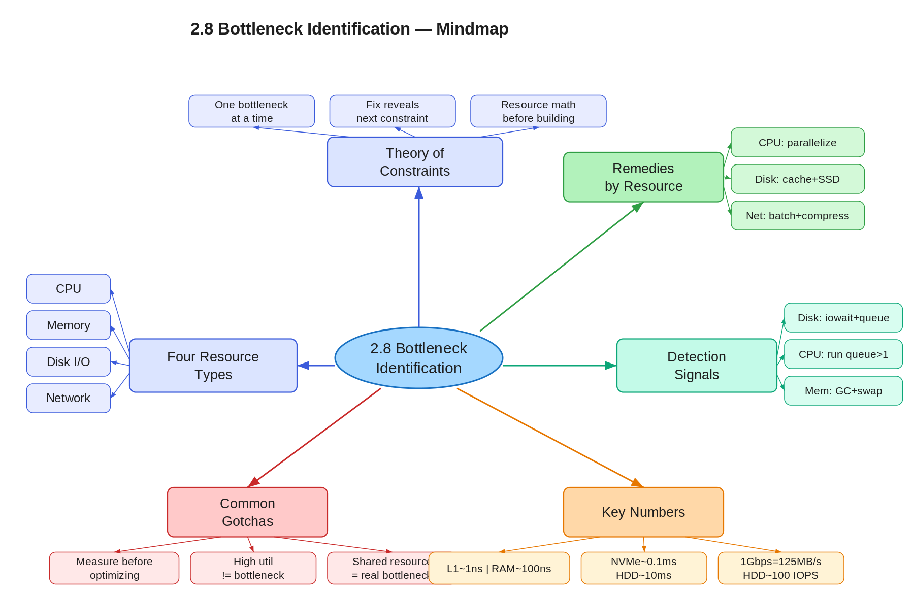
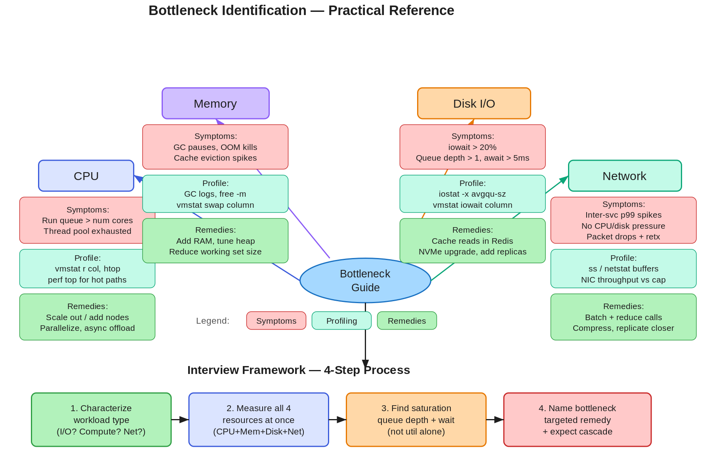

# 2.8 Bottleneck Identification and Resource Constraints

> **Topic:** Topic 2 — System Design Core Principles & Scalability Fundamentals
> **Phase:** A — Core First Principles
> **Date studied:** 2026-05-04

---

## 1. 🎯 Goal of This Subtopic

> *Why are you studying this? What should you be able to do after this session?*

- Be able to look at an architecture diagram or a set of system metrics and correctly identify which resource (CPU, memory, disk I/O, or network) is the binding bottleneck.
- Understand why a system has exactly one bottleneck at a time and how relieving it exposes the next one — so you can reason about scaling investments in sequence.
- Articulate the diagnostic signals for each resource type and propose targeted remedies rather than speculative optimizations.
- Identify bottlenecks proactively during design — before they become production incidents — by reasoning about access patterns and resource math.

---

## 2. ✅ What Mastery Looks Like

> *Concrete, testable proof that you own this concept — not just familiarity.*

- [ ] Can look at a system description and name the most likely bottleneck resource, with justification, in under 60 seconds.
- [ ] Can explain the four resource constraint types, their symptoms, and their primary remedies without notes.
- [ ] Can apply Theory of Constraints reasoning — explain why fixing a non-bottleneck resource improves nothing.
- [ ] Can perform a rough resource capacity calculation (e.g., "this workload requires X MB/s of disk throughput; our node supports Y — we have a disk bottleneck") on the fly.
- [ ] Can identify when a stated bottleneck is masking a deeper one and explain the cascading effect.

> 💡 **Rule of thumb:** If you can teach it to someone else and field their follow-up questions, you've mastered it.

---

## 3. 🗓️ Study Phases to Achieve Mastery

> *A progressive plan from first exposure to interview-ready. Work through each phase in order. Don't move to the next until you can honestly tick every item.*

### Phase 1 — Acquire 📖 💪💪
*Goal: Read deeply enough that you could explain the concept without the doc.*

- [x] Read **DDIA Ch. 1 — Reliable, Scalable, and Maintainable Applications** (O'Reilly) — particularly the section on describing load and performance
- [ ] Read **"Every Computer Performance Problem is the Same"** by Martin Thompson (Mechanical Sympathy blog)
- [ ] Watch **"Understanding Latency" by Gil Tene** (InfoQ, ~45 min) — covers measurement pitfalls and resource saturation
- [x] Read through **Sections 5–9** (Core Definition → How It Works) carefully — don't skim
- [ ] Re-read the **Cheatsheet** (Section 4) and try to recite it from memory after

### Phase 2 — Consolidate ✍️ 💪💪💪
*Goal: Verify you can reproduce the knowledge in your own words without looking.*

- [ ] Close the doc — write out the **Core Definition** from memory, then compare
- [ ] Explain **First Principles** out loud without notes — what problem does this solve and why?
- [ ] Reconstruct the **How It Works** mechanics step by step from memory
- [ ] Restate each **Trade-off** row in your own words — if you can't explain the cost, you don't own it yet

### Phase 3 — Apply 🔧 💪💪💪💪
*Goal: Connect to real systems and simulate interview scenarios.*

- [ ] Go through **Real-World System Examples** (Section 10) — verify each claim independently and add anything missed to **My Notes**
- [ ] Practice the **Interview Application** (Section 12) out loud — say the trigger phrases and your response as if in a live interview
- [ ] Work through **Common Misconceptions** (Section 13) — for each, make sure you can explain *why* the misconception is wrong, not just that it is
- [ ] Trace the **Relationships to Other Concepts** (Section 14) — can you explain each connection without looking?

### Phase 4 — Validate 🧪 💪💪💪💪💪
*Goal: Confirm you actually own it, not just recognize it.*

- [ ] Answer every **Self-Check Quiz** question (Section 15) out loud without looking at your notes
- [ ] Recite the **Cheatsheet** (Section 4) from memory — if you can't, re-do Phase 2
- [ ] Tick off items in **What Mastery Looks Like** (Section 2) — only check a box if you can demonstrate it on demand, not just if it sounds familiar
- [ ] Teach this concept out loud to an imaginary interviewer for 2 minutes without hesitation or notes

---

## 4. 📋 Cheatsheet

> *Everything you need to recall this concept in 30 seconds — for quick review before an interview.*





```
ONE-LINER
  A system's throughput is governed by its slowest resource — identify and
  relieve the binding constraint to unlock the next level of scale.

KEY PROPERTIES / RULES
  1. Exactly one resource is the binding bottleneck at any moment.
     Fixing anything else improves nothing.
  2. The four resources are CPU, memory, disk I/O, and network — each
     has distinct symptoms and remedies.
  3. High utilization ≠ bottleneck. Queue depth and wait time confirm it.
  4. Relieving one bottleneck always reveals the next — plan for cascades.
  5. Bottlenecks compound upstream: a slow DB makes the app tier look slow.

DECISION RULE
  Use CPU profiling when: latency is high, I/O wait is low, threads are spinning.
  Suspect memory when: GC pauses, swap activity, OOM kills, cache evictions spike.
  Suspect disk I/O when: iowait is high, write queues grow, disk latency > 5ms on SSD.
  Suspect network when: inter-service latency spikes with no CPU/disk pressure.

NUMBERS TO REMEMBER
  CPU: L1 cache hit ~1ns | L3 cache hit ~10ns | RAM ~100ns | Disk HDD ~10ms | NVMe ~0.1ms
  Disk IOPS: HDD ~100-200 | SATA SSD ~50K | NVMe SSD ~500K
  Network: intra-DC RTT ~0.1-0.5ms | cross-region RTT ~50-150ms
  Bandwidth: 1 Gbps NIC = ~125 MB/s; 10 Gbps NIC = ~1.25 GB/s

GOTCHA TO NEVER FORGET
  Always measure before optimizing — fixing the wrong bottleneck wastes
  effort and can make other metrics worse.
```

---

## 5. 🧠 Core Definition

> *What is it, in one sentence?*

Bottleneck identification is the practice of locating the single resource — CPU, memory, disk I/O, or network — whose saturation is the binding constraint on a system's throughput or latency, so that engineering effort targets the one change that will actually move the needle.

---

## 6. 📦 Core Concepts

> *The essential building blocks of this subtopic — the terms and ideas you must have solid before going deeper.*

### Theory of Constraints (ToC)
In any system with a pipeline of resources, one stage is the bottleneck that caps total throughput. Improving any non-bottleneck stage yields zero net gain — the bottleneck absorbs the slack. Goldratt's ToC applies directly to distributed systems: find the constraint, exploit it (use it fully), then elevate it (add capacity). Only then move to the next constraint.

### The Four Resource Types
Every compute workload consumes some combination of four resources: **CPU** (compute cycles), **memory** (working set and cache), **disk I/O** (read/write throughput and IOPS), and **network** (bandwidth and round-trip latency). Each has fundamentally different performance characteristics, failure modes, and scaling levers. Misidentifying the resource leads to wasted remediation.

### Saturation vs. Utilization
High CPU utilization (e.g., 80%) is not automatically a bottleneck — a well-tuned system runs hot intentionally. The bottleneck signal is **saturation**: the resource has a queue of pending work that cannot be served immediately. Disk IOPS queuing, network buffer drops, thread pool exhaustion, and GC pauses are saturation indicators that utilization alone misses.

### Cascading Bottlenecks
When a downstream resource (e.g., the database disk) is saturated, work backs up into queues that consume memory upstream, which then creates backpressure to the application tier, which then causes timeouts, making the application tier appear to be the bottleneck. Always instrument end-to-end, not just at one layer, or you will chase the symptom rather than the cause.

### Resource Math
Before building anything, calculate whether the resource budget closes: "This workload requires X MB/s of disk throughput; our node supports Y MB/s — will this work?" Doing this math proactively during design is cheaper than discovering it at 3am during a production incident.

---

## 7. 🔍 First Principles — Why Does This Exist?

> *What fundamental problem does this concept solve? Why was it invented?*

Before systematic bottleneck analysis, engineers scaled everything when performance degraded — adding CPU, RAM, and faster disks simultaneously. The result was expensive and often ineffective because the actual constraint remained untouched. The insight that forced this discipline is physical: computer resources are not equally fast, equally cheap, or equally elastic. CPU cycles are cheap; NVMe I/O is fast but finite; network bandwidth is shared; memory is expensive per GB. A workload that reads 1 TB of data from spinning disk will never be CPU-bound, no matter how many cores you throw at it. The discipline of bottleneck identification exists because computing resources have radically different cost-performance profiles, and a system's actual constraint is almost never what engineers guess intuitively — it must be measured. Without this rigor, distributed systems waste enormous engineering and infrastructure investment chasing ghosts.

---

## 8. 🗺️ Mental Models

> *Intuition frames that help you reason about this concept fast — especially under interview pressure.*

### Model 1: The Garden Hose Chain
Think of a system as a chain of garden hoses of varying diameters. Water (throughput) flows at the rate of the narrowest hose — doubling the diameter of any other hose has no effect. The bottleneck is the narrowest section. This model works perfectly for pipeline-style systems. It breaks down when resources can be parallelized independently (e.g., adding more disk spindles doesn't widen one hose — it adds parallel hoses), so remember it's most accurate for serial processing stages.

### Model 2: The Slow Lane on the Highway
High utilization on a non-bottleneck resource is like a fast lane on a highway — cars move freely even at 80% capacity. But the bottleneck is the merge point where two lanes narrow to one: traffic queues up there regardless of how fast the other lanes move. The queue itself is the signal, not the speed of the uncongested lanes. This model is useful for understanding why measuring queue depth matters more than measuring utilization alone.

### Model 3: The Latency Hierarchy
Resources have a fixed latency hierarchy: registers < L1 < L2 < L3 < RAM < NVMe < SATA SSD < HDD < network < WAN. When a system is slower than expected, the actual access pattern's position in this hierarchy reveals the bottleneck. If your workload is touching RAM-sized data but hitting disk latency, you have a memory bottleneck causing spill to disk. This model breaks down when the hierarchy is disrupted (e.g., network-attached NVMe can be faster than local SSD in some cloud environments), so treat the hierarchy as guidance, not gospel.

---

## 9. ⚙️ How It Works — Mechanics

> *Step-by-step or layered explanation of the internal mechanism.*

**Step 1 — Characterize the workload.** Before diagnosing, understand the workload type: is it compute-intensive (many transformations per byte of data), I/O-intensive (reads/writes far exceed compute), memory-intensive (large working sets, many cache misses), or network-intensive (many remote calls, small payloads)? This narrows the candidate resources immediately.

**Step 2 — Measure, don't guess.** Instrument with metrics covering all four resource types simultaneously: CPU utilization and run-queue length; memory usage, GC frequency, swap activity; disk IOPS, throughput, queue depth, await time; network throughput, retransmission rate, inter-service p99 latency. Look for the resource where the queue is building, not just where utilization is high.

**Step 3 — Confirm saturation.** The bottleneck resource will show a queue that grows under load. On Linux: `vmstat` for CPU run queue and I/O wait; `iostat -x` for disk queue depth (`avgqu-sz`) and await time; `ss` or `netstat` for socket buffer fills. A resource where work is waiting, not just executing, is the constraint.

**Step 4 — Identify the root cause within the resource.** Each resource has sub-types of bottlenecks. CPU: lock contention, serialized critical sections, hot code paths, or garbage collection. Memory: heap fragmentation, large objects not fitting in cache, insufficient buffer pool. Disk: random IOPS exhaustion (too many small reads) vs. throughput exhaustion (too much sequential data). Network: bandwidth saturation vs. latency-bound (many small requests with high RTT).

**Step 5 — Apply the remedy and re-measure.** After the fix, re-run the same load test and re-examine all four resources. The previously hidden second bottleneck will now become visible. Repeat the cycle.

**CPU bottleneck remedies:** Reduce work per request (algorithmic improvement), parallelize across cores (thread pools), scale horizontally (add nodes), offload compute-heavy work to background workers.

**Memory bottleneck remedies:** Reduce working set size (eviction, pagination), add RAM, switch to more memory-efficient data structures, reduce object allocation rate to lower GC pressure.

**Disk I/O bottleneck remedies:** Move hot data to faster storage (SSD → NVMe), add read replicas to distribute I/O, batch writes (WAL + group commit), cache reads in memory (buffer pool), compress data to reduce bytes on disk.

**Network bottleneck remedies:** Reduce chattiness (batch requests, fan-in aggregation), move computation closer to data (push processing to storage tier), compress payloads, upgrade NIC or move to co-located deployment, use binary protocols (gRPC/Protobuf) instead of verbose text (REST/JSON).

**Key thresholds to remember:** An HDD delivers ~100-200 random IOPS and ~100-200 MB/s sequential. An NVMe SSD delivers ~500K IOPS and ~3 GB/s sequential. A 10 Gbps NIC saturates at ~1.25 GB/s. A single CPU core can sustain ~1 billion simple operations per second but only ~10 million cache-miss-heavy operations. These numbers let you quickly sanity-check whether a proposed architecture will close the resource budget.

---

## 10. 🏭 Real-World System Examples

> *Where does this appear in production systems you know?*

| System | How This Concept Applies | Notes |
|--------|--------------------------|-------|
| MySQL / PostgreSQL (OLTP) | Disk random IOPS is the typical bottleneck under heavy write workloads; buffer pool size governs whether reads hit memory or disk | Increasing buffer pool to hold the working set eliminates most random read I/O; write I/O is harder to hide |
| Redis | Memory is the binding constraint — Redis is entirely in-memory; when the dataset exceeds RAM, eviction begins and latency spikes | Network can also bottleneck if many small commands are issued without pipelining |
| Kafka | Network throughput and disk sequential write throughput are the bottlenecks; Kafka is deliberately designed to avoid CPU and random I/O by using sequential writes and zero-copy reads | Adding brokers relieves both by distributing partition I/O and network load |
| Elasticsearch | Heap memory (JVM) and disk I/O (merge operations during indexing) are the primary bottlenecks; GC pauses from oversized heaps cause noticeable latency spikes | Recommendation: keep JVM heap ≤ 50% of RAM so the OS can use the rest for filesystem cache |
| Video transcoding pipelines (e.g., YouTube) | CPU is the binding constraint; transcoding is compute-intensive with minimal disk wait relative to CPU time | GPU-accelerated transcoding (NVENC) replaces the CPU bottleneck with GPU throughput — shifts the constraint to GPU VRAM bandwidth |
| Distributed tracing (e.g., Jaeger) | Network I/O and storage write throughput bottleneck the collector pipeline under high trace volume; sampling is used to relieve both | Without sampling, a 100K RPS system can generate millions of spans/sec, saturating any reasonable storage tier |

---

## 11. ⚖️ Trade-offs

> *Every design decision has a cost. What are you giving up?*

| ✅ Benefit | ❌ Cost / Limitation |
|-----------|---------------------|
| Targeting the actual bottleneck makes every engineering dollar count — you get maximum throughput gain per unit of work | Requires instrumentation investment upfront; systems without good observability make bottleneck identification guesswork |
| Horizontal scaling of a stateless tier can instantly relieve CPU and network constraints | If the database is the real bottleneck, adding app servers just adds more connections hammering the same constrained resource |
| Caching relieves disk and database I/O dramatically for read-heavy workloads | Caching adds memory pressure, introduces staleness risk, and shifts the bottleneck to the cache tier itself under cache-miss storms |
| NVMe SSDs dramatically eliminate disk I/O as a bottleneck for most OLTP workloads | NVMe is expensive; for cold/archival data, the cost-per-GB tradeoff favors HDD, and paying for NVMe where disk is not the bottleneck is pure waste |
| Binary serialization (Protobuf) relieves CPU and network bottlenecks simultaneously | Adds schema management overhead and reduces human-readability of traffic, increasing operational complexity |

---

## 12. 🎯 Interview Application

> *How do you use this concept in a design interview? What triggers it?*

**When an interviewer asks / says:**
- "How would you scale this system?"
- "The system is slow — where's the problem?"
- "Walk me through what happens at 10x load."
- "What are the resource constraints here?"

**What you say / do:**
When asked to scale or optimize, explicitly name the four resource types, identify which one your design will saturate first based on the access pattern, and propose the specific remedy — do not just say "add more servers." Demonstrate that you know which tier is the constraint before proposing a fix. In a deep-dive, calculating approximate resource utilization (e.g., "at 100K RPS with 1KB payloads, we need ~100 MB/s of network throughput per service — well within a 1 Gbps NIC") shows quantitative rigor.

**The trade-off statement (memorize this pattern):**
> "If we add more application servers, we get more CPU capacity, but for this workload the database disk I/O is the actual bottleneck — adding app servers will just add more contention at the DB without improving throughput. The right move is to either cache hot reads in Redis or move to read replicas to distribute the I/O load."

---

## 13. ⚠️ Common Misconceptions & Gotchas

> *What do candidates get wrong? What nuance is the interviewer probing for?*

- ❌ **Misconception:** High CPU utilization means the system is CPU-bound.
  ✅ **Reality:** CPU can be at 90% utilization while the bottleneck is actually lock contention or I/O wait causing threads to spin — the useful work per CPU cycle matters, not utilization alone. Check run-queue length and I/O wait alongside utilization.

- ❌ **Misconception:** Adding more servers always helps.
  ✅ **Reality:** If the bottleneck is a shared resource (single-leader database, a global lock, a shared message queue), adding more consumers just increases contention on that shared resource without improving throughput — it can actively make things worse.

- ❌ **Misconception:** The bottleneck is wherever latency is highest.
  ✅ **Reality:** Latency is often high at a non-bottleneck tier because it is waiting for the downstream bottleneck. The application tier may show slow response times because the database (the real bottleneck) is slow — fixing application code does nothing.

- ❌ **Misconception:** Once you fix the bottleneck, the system is fixed.
  ✅ **Reality:** Removing the bottleneck always reveals the next constraint in the chain. Performance engineering is iterative — plan for multiple rounds of measurement and optimization before a system is truly right-sized.

- ❌ **Misconception:** Memory pressure only matters when you run out of RAM.
  ✅ **Reality:** The critical threshold is when the working set no longer fits in the CPU cache (L1/L2/L3), causing a dramatic latency jump. A Redis keyspace that fits in L3 cache is orders of magnitude faster than one that requires main-memory access for every lookup.

---

## 14. 🔗 Relationships to Other Concepts

> *How does this connect to adjacent subtopics in this topic or across the roadmap?*

- **Builds on:** 2.3 Latency vs. throughput and 2.4 Little's Law — you need to understand throughput, latency, and queue depth before you can reason about which resource is the binding constraint.
- **Enables:** 2.9 Backpressure fundamentals — backpressure is the mechanism by which a saturated downstream resource signals overload upstream. Understanding bottlenecks is a prerequisite for understanding why and where backpressure must be applied.
- **Tension with:** 2.6 Horizontal vs. vertical scaling — horizontal scaling is the go-to remedy for CPU and stateless-tier bottlenecks but is ineffective (or actively harmful) when the bottleneck is a shared stateful resource like a single-leader database. The correct scaling strategy depends entirely on which resource is constrained.

---

## 15. 🧪 Self-Check Quiz

> *Can you answer these without looking? If not, you haven't internalized it yet.*

1. Name the four resource types that can be bottlenecks in a distributed system. For each, give one diagnostic signal that indicates saturation.

   > 💡 *Think through your answer before expanding — if you hesitate, revisit Section 6.*

CPU
  Run queue length > number of cores (vmstat 'r' column).
  Work is queuing for CPU time, not just executing.

Memory
  GC pause frequency increasing, swap activity, OOM kill events.
  Working set no longer fits in RAM — data spills to disk.

Disk I/O
  Queue depth (avgqu-sz) sustained > 1, await time > 5ms on SSD,
  iowait > 20%. The disk has a backlog of pending operations.

Network
  Packet drops, TCP retransmissions, NIC throughput approaching
  bandwidth limit (e.g. 900+ Mbps on 1 Gbps NIC), or inter-service
  p99 latency spiking with no CPU/disk pressure.

2. A web service is experiencing high p99 latency. CPU utilization is 30%, I/O wait is 60%, and disk queue depth (`avgqu-sz`) is consistently above 10. What is the bottleneck, and what are two concrete remedies?

   > 💡 *Think through your answer before expanding — if you hesitate, revisit Section 9.*

Bottleneck: Disk I/O.

Evidence: CPU at 30% rules out compute. iowait at 60% means
the CPU is idle, blocked waiting on disk. Queue depth > 10
confirms the disk has a sustained backlog — work is queuing
faster than the disk can serve it.

Remedy 1: Cache hot reads in memory (Redis/buffer pool).
  Eliminate the disk read entirely for frequently accessed data.
  Most impactful for read-heavy workloads.

Remedy 2: Move to faster storage (SATA SSD → NVMe).
  NVMe delivers ~500K IOPS vs ~50K for SATA SSD —
  a 10x improvement that directly relieves queue depth.

Also valid: add read replicas to distribute I/O load,
batch writes + group commit to reduce write IOPS.

3. An engineer proposes adding 4 more application servers to reduce latency. You suspect the database is the actual bottleneck. How do you make the case that this won't help — and what would you propose instead?

   > 💡 *Think through your answer before expanding — if you hesitate, revisit Sections 7 and 13.*

The case against adding app servers:
  The database disk is saturated — iowait is high, queue depth
  is growing, await time > 5ms. Adding app servers increases
  the number of clients hammering the same constrained database.
  It adds load to the bottleneck, not capacity around it.
  Throughput will not improve; it may get worse.

How to confirm the database is the bottleneck:
  Check disk queue depth (avgqu-sz > 1 sustained),
  iowait > 20%, disk await > 5ms on SSD.
  If app tier CPU is low (30-40%) while DB metrics are saturated,
  the evidence is clear.

What to propose instead:
  1. Cache hot reads in Redis — eliminate DB reads for
     frequently accessed data entirely.
  2. Add read replicas — distribute read I/O across
     multiple DB nodes.
  3. Move to NVMe if write I/O is the constraint —
     10x IOPS improvement over SATA SSD.
  4. Batch writes + group commit — reduce write IOPS
     by combining operations.

4. Redis is running on a node with 64 GB RAM. The dataset is 50 GB. Latency spikes are occurring on high-throughput keys. What is the most likely bottleneck and why is it not memory?

   > 💡 *Think through your answer before expanding — if you hesitate, revisit Sections 6 and 10.*

Why it's not memory:
  The dataset is 50 GB and RAM is 64 GB — it fits comfortably.
  No eviction, no swapping, no spilling to disk.
  Memory pressure requires the working set to exceed available RAM.
  That's not happening here.

Most likely bottleneck: Network or CPU (hot key pattern).

Network:
  A single high-throughput key hit at 100K RPS returning 1 KB
  per response = 100 MB/s from one key alone.
  At that rate, you can saturate a 1 Gbps NIC (125 MB/s cap)
  with just a handful of hot keys.
  Symptom: latency spikes specifically on high-read keys,
  not across the dataset uniformly.

CPU (secondary):
  Redis processes commands on a single thread.
  A hot key generating enormous request volume creates a queue
  at the command processor — even if individual commands are fast,
  they back up behind each other.

Remedies for hot key problem:
  1. Local in-process caching — absorb repeated reads before
     they reach Redis at all.
  2. Key sharding — replicate the hot key across multiple
     Redis nodes and route reads round-robin.
  3. Read replicas — distribute hot key reads across replicas.

5. A video transcoding pipeline processes 4K video at 20x real-time speed on CPU. What happens to the bottleneck if you switch from CPU-based encoding (x265) to GPU-accelerated encoding (NVENC)? What new constraint might emerge?

   > 💡 *Think through your answer before expanding — if you hesitate, revisit Section 10.*

What happens when you switch to NVENC:
  CPU was the binding constraint — x265 is compute-intensive,
  pinning all cores at 100% to encode at 20x real-time.
  NVENC offloads encoding to GPU hardware, which has thousands
  of parallel shader cores purpose-built for this.
  Encoding speed jumps dramatically — 100x+ real-time is typical.
  CPU bottleneck is relieved.

What new constraint emerges:

  1. Disk I/O (most likely):
     GPU now encodes so fast it can consume raw 4K frames faster
     than disk can supply them. A single 4K frame at 60fps is
     ~50 MB uncompressed. At 100x real-time, you need gigabytes
     per second of read throughput just to keep the GPU fed.
     NVMe helps here — HDD or SATA SSD cannot keep up.

  2. PCIe / VRAM bandwidth (secondary):
     Raw frames must transfer from system RAM to GPU VRAM over
     the PCIe bus. At high frame rates, this transfer can
     become the bottleneck even before disk is an issue.

  3. Network (if source is remote):
     If raw footage lives on NAS or cloud storage, network
     bandwidth caps how fast frames can reach the GPU.

The pattern: removing the CPU bottleneck reveals the next
constraint in the pipeline — which is almost always the
data supply rate to the GPU, not the GPU itself.

---

## 16. 📚 Further Reading

> *Optional: links, chapters, or resources for deeper understanding.*

- [ ] **DDIA, Chapter 1** — "Reliable, Scalable, and Maintainable Applications" — Kleppmann; covers load description, performance metrics, and the difference between latency and throughput (O'Reilly)
- [ ] **"Every Computer Performance Problem is the Same"** — Martin Thompson (Mechanical Sympathy blog, martinfowler.com/articles/lmax.html area); covers resource saturation from first principles
- [ ] **"Understanding Latency"** — Gil Tene (InfoQ video, ~45 min); deep dive on measuring latency correctly, coordinated omission, and resource queuing
- [ ] **Systems Performance, 2nd Ed., Chapter 2** — "Methodologies" by Brendan Gregg; the USE method (Utilization, Saturation, Errors) for systematic bottleneck identification
- [ ] **ByteByteGo Newsletter: "A Framework for System Design Interviews"** — Alex Xu (blog.bytebytego.com); includes capacity estimation and bottleneck reasoning as part of the design framework

---

## 17. ✍️ My Notes

> *Personal observations, things that confused me, analogies that helped.*

A system is defined by the slowest resource. In order for a more performant system, we need to identify the relive the constraint to unlock next level of scaling.

The 4 resources performance bottlenecks are:
- CPU compute
- Memory
- Disk I/O
- Network

CPU bottleneck is when compute resources are inadequate. Use CPU profiling when
- latency is high
- disk I/O wait is low
- threads are exhausted

CPU → scale horizontally | optimize algorithm complexity | 
       async/non-blocking I/O | cache computed results

Memory bottleneck is when server runs out of fast memory to use. Check memory when:
- GC pauses
- OOMs
- cache eviction spikes

Memory → add RAM | tune GC (heap sizing, GC algorithm) | 
          reduce object size | offload hot data to Redis

Disk I/O bottlenecks when input/output cannot handle increase traffic and puts requests on hold. Check disk I/O when:
- iowait is high
- latency is spike
- queues grow

Disk I/O → upgrade HDD → SSD → NVMe | add read cache layer |
            async writes | read replicas for DB reads |
            partition data to spread I/O

Network bottlnecks when latency spikes but we don't see compute pressure. Check network when:
- inter service latency spikes
- no compute pressure

Network → co-locate services (same DC/AZ) | CDN for static assets |
           compress payloads | connection pooling |
           reduce chattiness (batch calls, GraphQL)

NUMBERS TO REMEMBER
  CPU: L1 cache hit ~1ns | L3 cache hit ~10ns | RAM ~100ns | Disk HDD ~10ms | NVMe ~0.1ms
  Disk IOPS: HDD ~100-200 | SATA SSD ~50K | NVMe SSD ~500K
  Network: intra-DC RTT ~0.1-0.5ms | cross-region RTT ~50-150ms
  Bandwidth: 1 Gbps NIC = ~125 MB/s; 10 Gbps NIC = ~1.25 GB/s