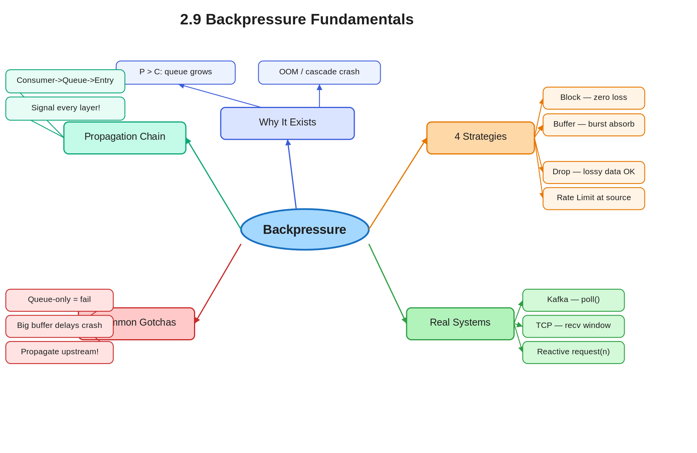

# 2.9 Backpressure Fundamentals

> **Topic:** Topic 2 — System Design Core Principles & Scalability Fundamentals
> **Phase:** A — Core First Principles
> **Date studied:** 2026-05-04

---

## 1. 🎯 Goal of This Subtopic

> *Why are you studying this? What should you be able to do after this session?*

Be able to identify when a system requires backpressure, explain the failure mode when it is absent, and select the appropriate backpressure strategy (blocking, buffering, dropping, or rate limiting) given a specific system's tolerance for data loss and latency. Be able to apply backpressure reasoning to any async pipeline design in an interview — from queues and stream processors to HTTP services and database connection pools.

---

## 2. ✅ What Mastery Looks Like

> *Concrete, testable proof that you own this concept — not just familiarity.*

- [x] Can explain what backpressure is and why unbounded buffers are not a solution, in under 60 seconds without notes
- [x] Can choose between blocking, buffering, dropping, and rate-limiting backpressure for a given scenario and justify the choice against data loss and latency requirements
- [x] Can identify when backpressure is applied at the wrong layer (e.g., only at the queue but not propagated upstream) and explain why the system still fails
- [x] Can name two real production systems that implement backpressure and describe the specific mechanism each uses
- [ ] Can apply Little's Law to calculate when a queue will saturate given producer rate and consumer latency

> 💡 **Rule of thumb:** If you can teach it to someone else and field their follow-up questions, you've mastered it.

---

## 3. 🗓️ Study Phases to Achieve Mastery

> *A progressive plan from first exposure to interview-ready. Work through each phase in order. Don't move to the next until you can honestly tick every item.*

### Phase 1 — Acquire 📖 💪💪
*Goal: Read deeply enough that you could explain the concept without the doc.*

- [ ] Read the **Further Reading** resources (Section 16):
  - Designing Data-Intensive Applications — Chapter 11: Stream Processing (backpressure section)
  - Reactive Streams Specification — https://www.reactive-streams.org/
  - ByteByteGo — "What is Backpressure?" (YouTube, Alex Xu)
  - Netflix Tech Blog: "Reactive Programming in the Netflix API with RxJava"
  - Martin Fowler — "Flow Control in Reactive Systems" (martinfowler.com)
- [ ] Read through **Sections 5–9** (Core Definition → How It Works) carefully — don't skim
- [ ] Re-read the **Cheatsheet** (Section 4) and try to recite it from memory after

### Phase 2 — Consolidate ✍️ 💪💪💪
*Goal: Verify you can reproduce the knowledge in your own words without looking.*

- [ ] Close the doc — write out the **Core Definition** from memory, then compare
- [ ] Explain **First Principles** out loud without notes — what problem does this solve and why?
- [ ] Reconstruct the **How It Works** mechanics step by step from memory
- [ ] Restate each **Trade-off** row in your own words — if you can't explain the cost, you don't own it yet

### Phase 3 — Apply 🔧 💪💪💪💪
*Goal: Connect to real systems and simulate interview scenarios.*

- [ ] Go through **Real-World System Examples** (Section 10) — verify each claim independently and add anything missed to **My Notes**
- [ ] Practice the **Interview Application** (Section 12) out loud — say the trigger phrases and your response as if in a live interview
- [ ] Work through **Common Misconceptions** (Section 13) — for each, make sure you can explain *why* the misconception is wrong, not just that it is
- [ ] Trace the **Relationships to Other Concepts** (Section 14) — can you explain each connection without looking?

### Phase 4 — Validate 🧪 💪💪💪💪💪
*Goal: Confirm you actually own it, not just recognize it.*

- [ ] Answer every **Self-Check Quiz** question (Section 15) out loud without looking at your notes
- [ ] Recite the **Cheatsheet** (Section 4) from memory — if you can't, re-do Phase 2
- [ ] Tick off items in **What Mastery Looks Like** (Section 2) — only check a box if you can demonstrate it on demand, not just if it sounds familiar
- [ ] Teach this concept out loud to an imaginary interviewer for 2 minutes without hesitation or notes

---

## 4. 📋 Cheatsheet

> *Everything you need to recall this concept in 30 seconds — for quick review before an interview.*



```
ONE-LINER
  Backpressure is the mechanism by which an overwhelmed downstream consumer
  signals its upstream producer to slow down or stop sending data.

KEY PROPERTIES / RULES
  1. Consumer-driven: the slow receiver controls the throttle, not the sender
  2. Unbounded buffers delay the crash — they do not prevent it
  3. Backpressure must propagate all the way upstream to be effective
  4. Four strategies: block, buffer, drop, or rate-limit the producer
  5. Pull-based systems (Kafka consumers) are inherently backpressure-aware

DECISION RULE
  Use blocking when: data loss is unacceptable (financial transactions, orders)
  Use dropping when: data is lossy by nature (metrics, telemetry, UI events)
  Use buffering when: traffic is bursty but average rate ≤ consumer throughput
  Use rate limiting when: you control the producer and can throttle at source

NUMBERS / FORMULAS
  Queue depth = arrival_rate × avg_processing_latency  (Little's Law)
  Saturation: queue fills when P (producer rate) > C (consumer throughput)
  Rule of thumb: set buffer alarm at 70–80% capacity, not 100%

GOTCHA TO NEVER FORGET
  Applying backpressure only at the queue lets the HTTP server keep accepting
  requests — you must propagate the signal all the way back to the entry point.
```

---

## 5. 🧠 Core Definition

> *What is it, in one sentence?*

Backpressure is the mechanism by which a downstream component in a data pipeline signals its upstream producer to slow its emission rate when the downstream component cannot process incoming data fast enough to keep pace — preventing unbounded buffer growth, memory exhaustion, and cascading failure.

---

## 6. 📦 Core Concepts

> *The essential building blocks of this subtopic — the terms and ideas you must have solid before going deeper.*

### Producer-Consumer Speed Mismatch
In any asynchronous pipeline, the producer and consumer run at independent rates. When producer rate P exceeds consumer throughput C, in-flight data accumulates. Without a control mechanism, this accumulation is unbounded — the root cause of all backpressure problems. The mismatch can be constant (design flaw) or transient (traffic spike), and the correct response differs for each.

### Bounded vs. Unbounded Buffers
A buffer sits between producer and consumer to absorb temporary rate mismatches. An unbounded buffer will eventually exhaust memory when P > C persistently. A bounded buffer makes the mismatch visible: once full, it forces a decision — block, drop, or apply another strategy. Bounded buffers are the enforcement point where backpressure strategy is applied.

### Backpressure Strategies
The four canonical strategies differ in what they sacrifice:
- **Blocking**: producer waits until the consumer has capacity. Zero data loss, but latency propagates upstream. Correct for financial data.
- **Buffering**: store excess in memory up to a limit, then apply another strategy. Smooths bursts; doesn't solve persistent throughput deficits.
- **Dropping**: discard new (or oldest) messages when the buffer is full. Causes data loss; only correct when data is inherently lossy (telemetry, UI events, metrics sampling).
- **Rate limiting / throttling**: slow the producer at source via explicit feedback (token bucket, leaky bucket, or reactive demand signaling). Clean and proportional, but requires a feedback channel.

### Signal Propagation
Backpressure is only effective when the "I'm full" signal travels all the way upstream to the original producer — whether that is an HTTP client, an event source, or a data generator. Stopping the signal at the queue stops the queue from filling further, but the HTTP server ahead of it may still be accepting 10,000 RPS. Each layer in the chain must participate.

### Reactive Streams and Demand-Driven Pull
The Reactive Streams specification formalizes backpressure in code: a consumer calls `request(n)` to tell the publisher it can handle exactly `n` items. The publisher never emits more than demanded. This inverts the default "push" model into a "pull" model — the slowest consumer sets the pace. Frameworks implementing this include RxJava, Project Reactor (Spring WebFlux), and Akka Streams.

---

## 7. 🔍 First Principles — Why Does This Exist?

> *What fundamental problem does this concept solve? Why was it invented?*

In synchronous systems, the producer and consumer are coupled: the producer waits for the consumer to finish before emitting the next item. There is no speed mismatch problem because the producer physically cannot outrun the consumer.

The moment you introduce asynchrony — a queue, a network socket, a thread pool, an event bus — you decouple their rates. The producer emits whenever it is ready; the consumer processes whenever it is ready. These rates have no guarantee of alignment. A fast upstream source (e.g., a high-throughput Kafka topic) can emit at 500,000 messages/sec while a downstream consumer can only process 50,000/sec.

Without a control mechanism, the gap materializes as buffer growth. Memory fills. The JVM (or process) OOMs. Or worse: the buffer silently drops data once it wraps around. Cascading failures follow as the next upstream component also fills up.

The network layer solved this in 1981 with TCP flow control: the receiver advertises a window size, and the sender is prohibited from sending beyond it. Backpressure is the application of the same principle — the receiver controls the pace of the sender — applied at every layer of modern distributed systems.

---

## 8. 🗺️ Mental Models

> *Intuition frames that help you reason about this concept fast — especially under interview pressure.*

### Model 1: The Garden Hose and Bucket
Imagine filling a small bucket from a fire hose. The water flows far faster than the bucket can drain through a small hole at the bottom. Without a nozzle to throttle the hose, the bucket overflows immediately. Backpressure is the nozzle — the bucket signals "I'm nearly full" and the hose operator reduces flow. The key insight: the bucket cannot drain faster than its design allows, so the only lever is the source. Where this breaks down: if the drain hole (consumer) is fundamentally too small for the job, throttling the hose only delays the overflow. You must also scale the consumer.

### Model 2: The Assembly Line Stop Signal
On a car assembly line, each station does one job before passing the car forward. When station 5 is overwhelmed, it raises a flag that halts the conveyor — and the halt propagates upstream, pausing every station simultaneously. This is blocking backpressure. The whole line slows to the pace of the slowest station. Where this breaks down: if your system cannot afford to pause (you have SLA latency guarantees to the producer), blocking backpressure is too blunt. You need a strategy that protects the pipeline without stalling the entry point.

### Model 3: TCP's Receive Window
TCP's receive window is the canonical implementation of backpressure at the network layer. The receiver announces how much buffer space it has (`rwnd`). The sender is allowed to have at most `rwnd` bytes in-flight (unacknowledged). When the receiver's buffer fills, `rwnd` shrinks to zero — the sender stops. When the receiver drains its buffer, it advertises a larger window and sending resumes. This is demand-driven pull with a numeric signal. The limit: TCP operates end-to-end on a single connection; it does not propagate across application-layer queues and services. Application-level backpressure must be built explicitly.

---

## 9. ⚙️ How It Works — Mechanics

> *Step-by-step or layered explanation of the internal mechanism.*

**Normal path (no backpressure needed):**
Producer emits at rate P. Consumer processes at rate C. As long as P ≤ C, the buffer stays shallow (near zero depth), latency is low, and no signal is needed.

**Backpressure trigger — buffer-depth threshold:**
When P > C, the buffer depth grows at rate (P − C). At a configured threshold (commonly 70–80% of buffer capacity), the backpressure mechanism activates. The choice of threshold matters: 100% means you activate only when already full, leaving no room to absorb the in-flight messages that arrive before the producer receives and acts on the signal.

**Strategy 1 — Blocking:**
The consumer (or the queue on behalf of the consumer) blocks the producer's write call. The producer's thread is suspended. Upstream, the HTTP server's connection threads also begin to block, causing incoming request timeouts for new clients. Latency propagates upstream through the call stack. Zero data loss. Used in: JDBC connection pools (block when all connections are checked out), thread pool queues (block when full).

**Strategy 2 — Bounded Buffering:**
The queue accepts messages until it hits its capacity limit, then applies another strategy (usually dropping or blocking). Buffers absorb burst traffic: if P > C for 10 seconds but the burst is temporary, a buffer sized for the excess prevents any signal from ever reaching the producer. Sized correctly using Little's Law: buffer_size = burst_duration × (P − C). If the burst outlasts the buffer, you fall through to the next strategy.

**Strategy 3 — Dropping:**
When the buffer is full, incoming messages are discarded. Two variants: drop-newest (reject the arriving message — easy to implement, producer gets an error) and drop-oldest (evict the oldest buffered message to make room — keeps the most recent data, harder to implement). Used in: UDP-based video streaming (dropping a late frame is better than rebuffering), metrics aggregation pipelines, circuit telemetry.

**Strategy 4 — Rate Limiting at the Producer:**
A token bucket or leaky bucket governs how fast the producer emits. When the consumer signals overload (via a feedback channel — an HTTP 429, a Reactive Streams `request(n)` call, or a Kafka consumer-side poll throttle), the producer reduces its emission rate. This is the cleanest strategy: no buffer growth, no data loss, proportional throttle. Used in: gRPC streaming (HTTP/2 flow control windows as the feedback signal), Reactive Streams (`Publisher.subscribe()` → `Subscription.request(n)` demand protocol).

**Propagation:**
Each layer in the pipeline must participate. In a three-layer pipeline (HTTP server → internal queue → downstream DB):
1. DB signals "slow" → queue applies backpressure on its consumer thread
2. Queue signals "full" → HTTP server's thread pool blocks on enqueue
3. HTTP server signals "busy" → clients receive 503 or timeout

If step 2 is missing, the HTTP server never slows down and the queue gets destroyed from both ends.

---

## 10. 🏭 Real-World System Examples

> *Where does this appear in production systems you know?*

| System | How This Concept Applies | Notes |
|--------|--------------------------|-------|
| Apache Kafka (consumer) | Kafka consumers use a pull model: `consumer.poll()` fetches a batch the consumer controls. The consumer never receives more than it asks for. If the consumer stops calling `poll()`, the broker stops delivering — inherent backpressure. | Producer-side backpressure against the broker is handled via `max.block.ms` config — if the broker's partition is full, the producer blocks for that duration before throwing. |
| TCP Flow Control | The TCP receive window (`rwnd`) is advertised by the receiver in every ACK. If the application layer isn't reading from the socket buffer, `rwnd` shrinks to zero, halting the sender at the OS level. | This is the foundational network-level implementation. Application queues built on top of TCP must implement their own backpressure separately. |
| RxJava / Project Reactor | Implement the Reactive Streams spec: the subscriber calls `request(n)` to signal exactly how many items it can handle. The publisher never emits more than `n` until the next `request()` call. | This is programmatic, demand-driven pull. `Flowable` in RxJava is backpressure-aware; `Observable` is not — a common source of OOM bugs when migrating between the two. |
| gRPC Streaming | HTTP/2 flow control windows govern both the connection level and per-stream level. If the server-side application is slow to consume, the HTTP/2 window fills and the sender stalls at the transport layer — transparent to application code. | Effective for service-to-service streaming RPCs where server processing speed is uneven. |
| Nginx upstream buffering | Nginx buffers responses from slow upstream app servers. If `proxy_buffer_size` fills before the upstream finishes, Nginx passes the partial response to the client and begins synchronous proxying. If the client is slow to read, Nginx buffers for the client too. | A two-sided buffering strategy. The hard limit is `proxy_max_temp_file_size` — beyond this, Nginx returns 502. |

---

## 11. ⚖️ Trade-offs

> *Every design decision has a cost. What are you giving up?*

| ✅ Benefit | ❌ Cost / Limitation |
|-----------|---------------------|
| Prevents OOM crashes and cascading failures under load | Blocking backpressure adds upstream latency — producers experience higher response times during consumer slowdowns |
| Dropping strategies protect system stability under unrecoverable spike load | Data is permanently lost; only correct when the data is inherently lossy (metrics, telemetry) — unacceptable for financial or user-generated content |
| Bounded buffers smooth bursty traffic without blocking | Buffer memory is pre-allocated; large buffers hide persistent throughput deficits and delay the moment you realize consumer scaling is needed |
| Rate limiting gives a clean, proportional throttle with no data loss | Requires a feedback channel between consumer and producer; adds architectural complexity and a round-trip signal delay |
| Pull-based systems (Kafka consumer poll) are naturally backpressure-safe | Pull model can underutilize consumer capacity if `poll()` batch sizing is too conservative — tuning is required |

---

## 12. 🎯 Interview Application

> *How do you use this concept in a design interview? What triggers it?*

**When an interviewer asks / says:**
- "What happens if the downstream service can't keep up with the write volume?"
- "How do you prevent a slow consumer from crashing the pipeline?"
- "We're seeing OOM errors in our queue workers during traffic spikes — how would you fix this?"
- "How would you handle a sudden 10× spike in incoming events?"

**What you say / do:**
Introduce backpressure in the deep-dive or trade-off discussion phase: "This is a producer/consumer speed mismatch — the classic backpressure problem. I'd put a bounded queue between them and choose a strategy based on whether we can tolerate data loss. For payment events, we block and propagate the signal upstream. For click telemetry, we drop with sampling." Always mention propagation — it shows you understand the system boundary, not just the local fix.

**The trade-off statement (memorize this pattern):**
> "If we choose blocking backpressure, we get zero data loss and simplicity, but we pay with upstream latency — the producer's response time rises in direct proportion to the consumer's lag. For this system — financial transactions — blocking is the right call because losing a payment event is unacceptable. If this were a metrics pipeline, I'd drop instead and accept the sampling loss."

---

## 13. ⚠️ Common Misconceptions & Gotchas

> *What do candidates get wrong? What nuance is the interviewer probing for?*

- ❌ **Misconception:** A large buffer solves the backpressure problem.
  ✅ **Reality:** A large buffer only delays the crash. If P > C persistently, any finite buffer eventually fills. Buffers buy time for transient bursts; they do not substitute for matching producer and consumer throughput at steady state.

- ❌ **Misconception:** Backpressure only applies to message queues.
  ✅ **Reality:** Backpressure exists at every layer of a stack: TCP flow control (network), HTTP/2 flow control (transport), thread pool queue limits (runtime), DB connection pool exhaustion (data layer), and reactive stream demand (application). Ignoring any one layer creates a gap where the "fast producer" problem re-emerges.

- ❌ **Misconception:** Dropping messages is always a failure and should be avoided.
  ✅ **Reality:** Controlled dropping is the correct and deliberate strategy for lossy data sources — sensor readings, UI interaction events, application metrics, and log sampling. Trying to never drop in these contexts wastes resources and introduces unnecessary complexity. The key qualifier is "do the consumers of this data require every individual event, or is an aggregate or sample sufficient?"

- ❌ **Misconception:** Applying backpressure at the queue is sufficient.
  ✅ **Reality:** If the HTTP server (or API gateway, or event source) ahead of the queue keeps accepting requests while the queue is throttling its consumer, the queue will be overwhelmed from the producer side. Backpressure must propagate upstream through every layer: consumer → queue → service → entry point. Failing to do this is the most common implementation mistake.

---

## 14. 🔗 Relationships to Other Concepts

> *How does this connect to adjacent subtopics in this topic or across the roadmap?*

- **Builds on:** Little's Law (2.4) — the equation L = λW directly predicts queue depth from arrival rate and processing latency. Understanding Little's Law is the mathematical foundation for sizing bounded buffers and identifying at what load backpressure must activate.
- **Enables:** Message Queues & Event Systems (Topic 12), specifically 12.4 (Backpressure — how consumers signal and producers respond). Also directly informs Fault Tolerance & Resilience (Topic 19) — graceful degradation relies on backpressure to shed non-critical load without crashing the critical path.
- **Tension with:** Throughput maximization (2.3 Latency vs. Throughput) — backpressure caps the system's effective throughput to the slowest link in the pipeline. High-throughput design must carefully size buffers, choose non-blocking strategies where possible, and scale consumers to minimize the throughput penalty imposed by the control mechanism.

---

## 15. 🧪 Self-Check Quiz

> *Can you answer these without looking? If not, you haven't internalized it yet.*

1. What is backpressure, and what specific failure mode does it prevent when a producer outpaces a consumer?

   > 💡 *Think through your answer before expanding — if you hesitate, revisit Section 5.*

Backpressure is the mechanism by which a downstream component signals its
upstream producer to slow its emission rate when it cannot keep pace.

Without it, the failure sequence is:

1. Producer emits at rate P, consumer processes at rate C, where P > C.
2. The excess (P − C) messages per second accumulate in a buffer.
3. Since the buffer is unbounded (or very large), it grows continuously.
4. Heap/memory is exhausted → OOM crash on the queue or consumer process.
5. The upstream service — still running at full speed — now has no consumer.
   Its own in-flight requests pile up → it OOMs too → cascading failure
   propagates backward through the system.

The key insight: this is deterministic, not probabilistic. If P > C
persistently, the crash is guaranteed — only the timing is uncertain.

2. A payment processing service receives requests at 10,000 RPS but its downstream database can only handle 7,000 RPS. Which backpressure strategy would you apply, and why is dropping not acceptable here?

   > 💡 *Think through your answer before expanding — if you hesitate, revisit Section 6 (Strategies) and Section 12.*

Strategy: Blocking backpressure.

When the database cannot accept more than 7,000 RPS, the queue between
the API service and the DB should block the producer's write call once
it reaches capacity.

Why not dropping:
Payment transactions represent real money moving between accounts.
Dropping a transaction means a charge is lost — either the customer
is charged without the payment being recorded, or a legitimate payment
disappears entirely. Either outcome is a financial and legal liability.
Individual events must all be processed. No event can be skipped.

Why blocking is correct:
Every transaction must eventually be written. Blocking ensures the
producer waits rather than discards. The cost we accept is upstream
latency — callers will experience slower response times during DB
saturation. That is acceptable; data loss is not.

Propagation note: the blocking signal must travel all the way back
to the API entry point, so the HTTP server returns 503 or slows its
acceptance rate — otherwise the API service itself will OOM even
though the queue is protected.

3. What is the cost of blocking backpressure, and in what scenario does that cost become a system-level problem?

   > 💡 *Think through your answer before expanding — if you hesitate, revisit Section 11.*

Cost of blocking backpressure:
Latency propagates upstream through the call stack. When the queue
blocks the producer's write call, the producer's thread is suspended.
That thread is now unavailable for other work. If many requests pile
up simultaneously, the HTTP server's thread pool fills up entirely.

When the thread pool is exhausted:
- New incoming requests cannot be accepted
- The server stops responding — effectively an availability failure
- Clients receive connection timeouts, not just slow responses

When this becomes a system-level problem:
Blocking backpressure is dangerous in systems with strict latency SLAs
or high concurrency requirements. Example: a public-facing API with a
200ms P99 SLA. If the downstream DB slows for 10 seconds, every request
in that window blocks. Thread pool exhausts. The API goes dark — not
because the DB is down, but because blocking propagated too aggressively.

The fix in latency-sensitive systems: combine blocking with a short
timeout and a 503 response, so threads are released rather than held
indefinitely. This trades some data loss risk for availability preservation.

4. Name a production system that implements backpressure and explain the specific mechanism it uses — not just "it uses backpressure."

   > 💡 *Think through your answer before expanding — if you hesitate, revisit Section 10.*

System: HikariCP (JDBC connection pool)

Mechanism:
HikariCP maintains a bounded pool of database connections — say, 20.
When all 20 connections are checked out, the next thread that calls
getConnection() does not get rejected immediately. Instead it blocks,
waiting up to connectionTimeout milliseconds (default: 30s) for a
connection to be returned to the pool.

This is blocking backpressure:
- The pool is the bounded buffer (fixed size = max pool size)
- The blocking wait is the backpressure signal to the caller's thread
- connectionTimeout is the escape valve — once exceeded, the caller
  gets a SQLException rather than waiting forever

The signal propagation:
If all threads in the API service are blocked waiting for a DB
connection, the HTTP server's thread pool exhausts and new requests
get connection timeouts — the signal has traveled from the DB pool
all the way back to the client. Full propagation chain intact.

Why this matters in interviews:
Any time you say "we'll use a connection pool," you're implicitly
relying on this backpressure mechanism. Knowing it

5. You applied backpressure at the internal queue between your API service and your worker pool, but during a traffic spike the API service itself crashed with OOM. What went wrong, and what is the fix?

   > 💡 *Think through your answer before expanding — if you hesitate, revisit Section 9 (Propagation) and Section 13.*

What went wrong:
Backpressure was applied only at the queue-to-worker boundary.
The queue correctly stopped workers from being overwhelmed, but it
sent no signal upstream. The API service continued accepting requests
at full speed — each accepted request held memory for its payload,
its in-flight state, and its queued position. With the queue full and
new requests still arriving, the API's heap filled and OOM'd.

The queue being full was invisible to the entry point.

The fix — two parts:

1. Mechanical link: make the API's enqueue call blocking (or checked).
   When the queue is full, the enqueue call either blocks the handler
   thread or returns an error. The API handler catches this and responds
   immediately rather than holding the request in memory.

2. Entry point signal: when the handler detects queue saturation,
   return HTTP 429 Too Many Requests with a Retry-After header.
   This tells the client to back off — the signal has now traveled
   all the way from the worker pool → queue → API → client.

The rule: backpressure is only effective when the signal reaches
the original producer. Every layer in the chain must participate.
---

## 16. 📚 Further Reading

> *Optional: links, chapters, or resources for deeper understanding.*

- [ ] Designing Data-Intensive Applications (DDIA) — Chapter 11: Stream Processing (section on backpressure and flow control)
- [ ] Reactive Streams Specification — https://www.reactive-streams.org/ (the formal consumer-controlled demand model — read the motivation section)
- [ ] ByteByteGo — "What is Backpressure?" (YouTube, Alex Xu)
- [ ] Netflix Tech Blog — "Reactive Programming in the Netflix API with RxJava" (blog.netflix.com)
- [ ] Martin Fowler — "Flow Control in Reactive Systems" (martinfowler.com)

---

## 17. ✍️ My Notes

> *Personal observations, things that confused me, analogies that helped.*
