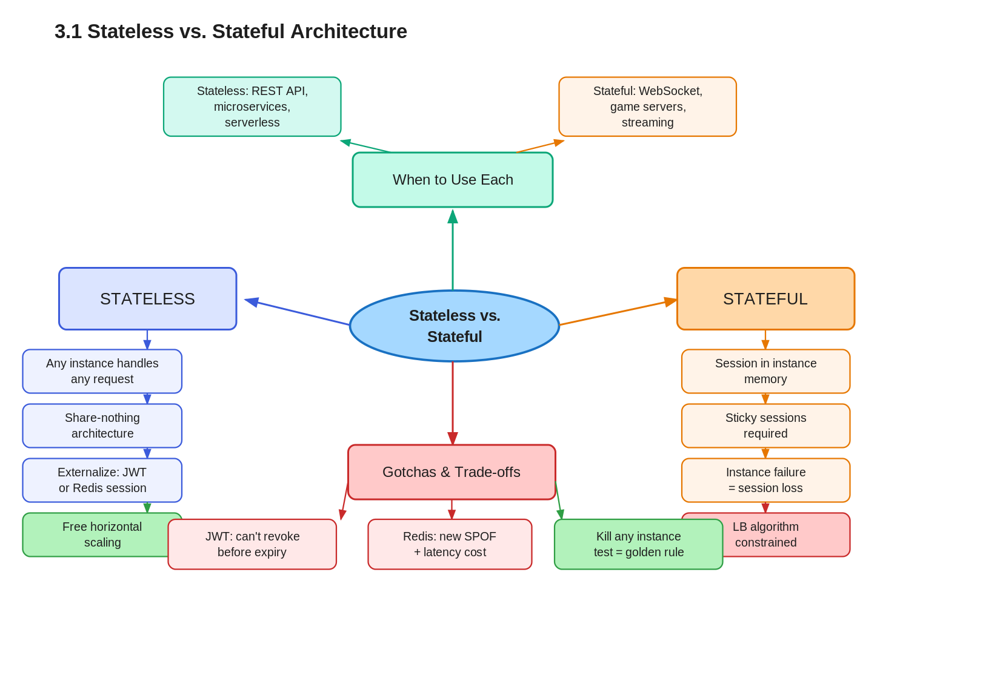

# 3.1 Stateless vs. Stateful Architecture — Definitions and Scaling Implications

> **Topic:** Topic 3 — Stateless Services
> **Phase:** B — Scalability Branch
> **Date studied:** 2026-05-07

---

## 1. 🎯 Goal of This Subtopic

> *Why are you studying this? What should you be able to do after this session?*

- Be able to distinguish stateless from stateful systems by their scaling implications, not just their definitions — and explain *why* the difference matters at load-balancing time.
- Understand why stateless design is the prerequisite for effective horizontal scaling: any instance must be able to handle any request.
- Identify the two primary patterns for externalizing state (Redis session store vs. JWT) and articulate the trade-offs of each in an interview.
- Recognize when a system is "accidentally stateful" — holding session data in instance memory — and know how to refactor it.
- Be able to explain the share-nothing architecture principle and its direct connection to horizontal scalability.

---

## 2. ✅ What Mastery Looks Like

> *Concrete, testable proof that you own this concept — not just familiarity.*

- [ ] Can take a stateful service design (session stored in-memory) and refactor it into a stateless one by externalizing session to Redis or JWT, explaining every step
- [ ] Can explain why a stateless service can be freely load-balanced while a stateful one requires sticky sessions or session replication — with a concrete example
- [ ] Can articulate the share-nothing architecture principle and connect it directly to why horizontal scaling becomes trivial
- [ ] Can compare server-side sessions vs. JWT on the dimensions of revocability, latency, consistency, and scalability — without notes
- [ ] Can identify in a novel system design whether state is being held in the wrong place and propose the correct externalization fix

> 💡 **Rule of thumb:** If you can teach it to someone else and field their follow-up questions, you've mastered it.

---

## 3. 🗓️ Study Phases to Achieve Mastery

> *A progressive plan from first exposure to interview-ready. Work through each phase in order. Don't move to the next until you can honestly tick every item.*

### Phase 1 — Acquire 📖 💪💪
*Goal: Read deeply enough that you could explain the concept without the doc.*

- [ ] Read **DDIA Chapter 6** (Kleppmann) — the "shared-nothing" section is the clearest first-principles explanation of this architecture pattern
- [ ] Read **Martin Fowler: "Stateless"** — https://martinfowler.com/bliki/Stateless.html — short, precise, and interview-quotable
- [x] Watch **ByteByteGo: "Session vs Token Authentication"** — covers JWT trade-offs vs server-side sessions with scaling implications
- [x] Read through **Sections 5–9** (Core Definition → How It Works) carefully — don't skim
- [x] Re-read the **Cheatsheet** (Section 4) and try to recite it from memory after

### Phase 2 — Consolidate ✍️ 💪💪💪
*Goal: Verify you can reproduce the knowledge in your own words without looking.*

- [x] Close the doc — write out the **Core Definition** from memory, then compare
- [x] Explain **First Principles** out loud without notes — what problem does this solve and why?
- [x] Reconstruct the **How It Works** mechanics step by step from memory
- [x] Restate each **Trade-off** row in your own words — if you can't explain the cost, you don't own it yet

### Phase 3 — Apply 🔧 💪💪💪💪
*Goal: Connect to real systems and simulate interview scenarios.*

- [ ] Go through **Real-World System Examples** (Section 10) — verify each claim independently and add anything missed to **My Notes**
- [ ] Practice the **Interview Application** (Section 12) out loud — say the trigger phrases and your response as if in a live interview
- [ ] Work through **Common Misconceptions** (Section 13) — for each, make sure you can explain *why* the misconception is wrong, not just that it is
- [ ] Trace the **Relationships to Other Concepts** (Section 14) — can you explain each connection without looking?

### Phase 4 — Validate 🧪 💪💪💪💪💪
*Goal: Confirm you actually own it, not just recognize it.*

- [ ] Answer every **Self-Check Quiz** question (Section 15) out loud without looking at your notes
- [ ] Recite the **Cheatsheet** (Section 4) from memory — if you can't, re-do Phase 2
- [ ] Tick off items in **What Mastery Looks Like** (Section 2) — only check a box if you can demonstrate it on demand, not just if it sounds familiar
- [ ] Teach this concept out loud to an imaginary interviewer for 2 minutes without hesitation or notes

---

## 4. 📋 Cheatsheet

> *Everything you need to recall this concept in 30 seconds — for quick review before an interview.*



```
ONE-LINER
  A stateless service holds no per-client context between requests —
  every request is self-contained, so any instance can handle it.

KEY PROPERTIES / RULES
  Stateless: no session in instance memory; all context in request or external store
  Stateful: server holds client context across requests; subsequent requests need same instance
  Stateless → any load-balancing algorithm works; no affinity required
  Stateful → requires sticky sessions or session replication to scale
  Share-nothing: each node is fully independent (no shared disk, memory, connections)

DECISION RULE
  Make services stateless when: scaling horizontally, deploying behind a load balancer,
  running in containerised / serverless environments.
  Accept statefulness when: protocol requires it (WebSocket, game server) — but
  externalize as much state as possible even then.

NUMBERS / FORMULAS
  "Can I kill any one instance and have another handle the next request seamlessly?"
  If NO → you have a stateful dependency to fix.
  Redis GET latency: ~0.1–1ms (vs. 0ms for in-memory) — the price of externalization.

GOTCHA TO NEVER FORGET
  Storing session in an in-memory dict is stateful even if it "feels light" —
  the next request on a different instance will miss the session entirely.
```

---

## 5. 🧠 Core Definition

> *What is it, in one sentence?*

A **stateless service** holds no per-client state between requests — every request carries all necessary context, so any instance is interchangeable. A **stateful service** retains client context across requests, meaning subsequent requests must reach the same instance or that state must be replicated across all instances.

---

## 6. 📦 Core Concepts

> *The essential building blocks of this subtopic.*

### Session State — The Defining Difference
Session state is any data the server holds about a specific client between requests: who is logged in, what is in their cart, where they are in a multi-step flow. A stateless service has none of this in instance memory — it either derives all context from the request itself (JWT, cookies carrying data) or fetches it from a shared external store. The moment a server holds any per-client data in local memory, it becomes stateful and load-balancing becomes constrained.

### Share-Nothing Architecture
In a share-nothing architecture, every processing node is fully independent — no shared in-memory state, no shared disk, no shared connections to other nodes. Each node can fail or be replaced without affecting any other. This is the architectural principle that makes horizontal scaling trivial: adding a new node requires no coordination with existing nodes. The alternative — shared memory or shared disk between nodes — creates coupling that limits how many nodes you can add and how fast you can fail over.

### Externalized State Store
Externalizing state means moving session or other per-client data out of the instance and into a dedicated shared store (typically Redis or Memcached). The instance becomes a stateless processor: it receives a request, fetches needed context from the external store, does its work, writes any updates back, and returns a response — holding nothing locally afterwards. The external store becomes the system of record for all mutable client state.

### JWT as Stateless Session Token
A JSON Web Token (JWT) encodes the session context (user ID, roles, expiry) directly in the token, signed by the server. The client stores the JWT and presents it with every request. The server validates the signature without any external lookup — making authentication fully stateless. The trade-off: the server cannot invalidate a JWT before it expires without maintaining a token blocklist, which reintroduces state.

### Sticky Sessions as a Workaround
Sticky sessions (session affinity) configure the load balancer to always route requests from the same client to the same backend instance. This makes a stateful service work behind a load balancer — but it does not solve the problem; it papers over it. Load distribution becomes uneven (popular users dominate one instance), and instance failure destroys sessions. Sticky sessions are a sign that a service needs to be refactored to be stateless, not a long-term solution.

---

## 7. 🔍 First Principles — Why Does This Exist?

> *What fundamental problem does this concept solve? Why was it invented?*

Before stateless design was a recognized pattern, the default was to store session data in the web server's local memory — cheap, fast, and simple for a single server. The problem became acute the moment you added a second server to handle load. Server A held User X's session. The load balancer sent User X's next request to Server B. Server B had no session for User X — the user was suddenly logged out, or their shopping cart was empty.

The "fix" was sticky sessions: configure the load balancer to always route User X back to Server A. But now Server A carries more load than Server B (not all users are equally active), Server A becomes a single point of failure for User X, and you cannot replace Server A without destroying every session it holds. Horizontal scaling — the whole point of adding servers — is now fundamentally hobbled.

The root cause was mixing two concerns in the same place: mutable per-client state and stateless request processing logic. Stateless architecture separates them: processing logic lives in commodity, replaceable instances; mutable state lives in a dedicated, replicated, independently scalable store. Now you can scale the processing tier freely — add instances, remove instances, replace instances — without touching the state.

---

## 8. 🗺️ Mental Models

> *Intuition frames that help you reason about this concept fast.*

### Model 1: The ATM vs. Bank Teller
An ATM is stateless: you insert your card (carry your own context), it fetches your account from the bank's central database (external store), processes your transaction, and forgets you the moment you leave. Any ATM handles any customer — there is no "your ATM." A bank teller is stateful: they remember your name, keep notes on their desk about your account, and you need to come back to the same teller for continuity. Scaling means adding tellers, but now you need routing logic to send each customer to their teller — and if that teller calls in sick, your context is gone. **Where it breaks down:** even the ATM depends on a central database — stateless doesn't mean "no state anywhere," it means "no state in the processing node."

### Model 2: The "Kill Any Instance" Test
If you can terminate any running instance right now and the system continues working correctly for all active users — the service is stateless. If killing one instance means any user loses their session or in-progress work, you have a stateful dependency hiding somewhere. Run this thought experiment on every service in your design. It is the fastest way to find accidental statefulness.

### Model 3: The Backpack vs. The Locker
A stateless system gives every client a backpack: they carry everything they need with them on every request (JWT, cookie, request parameters). The server needs no memory of them. A stateful system gives each client a locker at the server: their stuff stays there between visits, but they must always go back to the same locker room. Stateless = client carries state. Stateful = server stores state. **Where it breaks down:** some state is too large or too sensitive to put in a backpack (e.g., a full user profile, payment details) — those belong in an external store, not in the token.

---

## 9. ⚙️ How It Works — Mechanics

> *Step-by-step explanation of the internal mechanism.*

**Stateless Happy Path (JWT-based):**
1. Client logs in — server validates credentials, creates a signed JWT containing `{userId, roles, exp}`, returns it.
2. Client stores JWT (in cookie or localStorage) and sends it as `Authorization: Bearer <token>` on every subsequent request.
3. Load balancer receives request — routes to any available instance using any algorithm (round robin, least connections).
4. Instance receives request, validates JWT signature locally (no DB call), extracts userId/roles from payload.
5. Instance fetches any dynamic data needed (e.g., user's posts) from the database, processes, returns response.
6. Instance holds zero per-client state after the response is sent. It is now identical to every other instance.

**Stateless Happy Path (Redis Session):**
1. Client logs in — server creates a session object `{userId, roles}`, stores it in Redis under a UUID key (`session:abc123`), sets a TTL.
2. Server returns a cookie containing only `session_id=abc123`.
3. On subsequent requests, any instance reads the cookie, does `Redis GET session:abc123`, gets the session object in ~0.5ms.
4. Instance processes request using the fetched session, writes any updates back to Redis.
5. Instance holds zero per-client state after the response.

**Failure Handling:**
- *Stateless (JWT):* Instance death is invisible to the client — the next request goes to another instance, which validates the same JWT identically. Zero data loss.
- *Stateless (Redis):* Instance death is invisible. However, Redis downtime means sessions are unavailable. Redis must be highly available (Redis Sentinel or Redis Cluster) — it is now a critical dependency.
- *Stateful (no externalization):* Instance death = session loss for all clients on that instance. Recovery requires either session replication (expensive) or forcing re-login.

**The JWT Revocation Problem:**
JWT validation requires no external state — but revocation does. If a user logs out or their account is suspended, the JWT is still valid until its `exp` timestamp. Standard mitigations: (1) short expiry (15–60 min) with refresh tokens, (2) a Redis blocklist of revoked `jti` (JWT ID) values checked on each request — which reintroduces a small amount of state but is far more scalable than full server-side sessions.

---

## 10. 🏭 Real-World System Examples

> *Where does this appear in production systems you know?*

| System | How This Concept Applies | Notes |
|--------|--------------------------|-------|
| AWS Lambda | Stateless by design — each invocation is independent; no persistent in-memory state between calls; all state must live in DynamoDB, S3, or ElastiCache | The canonical stateless compute model; cold starts are the cost of zero instance affinity |
| Kubernetes pods (app tier) | App pods are designed to be stateless and ephemeral; the scheduler can reschedule them to any node; stateful workloads (DBs) use StatefulSets with stable network IDs and persistent volumes | Stateless app pods enable seamless rolling deployments with zero session loss |
| Netflix API gateway (Zuul) | Stateless service tier; JWT-based auth so any node validates any request without a session store lookup; per-user state in EVCache (distributed Redis-like cache) | Handles millions of RPS across thousands of stateless instances |
| Traditional Rails apps (pre-2008) | Default session stored in server memory — became infamous for breaking under load balancing; migration to cookie-store or Redis session was a necessary step for every Rails app that scaled | A historical lesson in accidental statefulness |
| Stripe API | Fully stateless API tier — each API key request is independently authenticated via HMAC; no server-side session; idempotency keys stored in DB (not in-memory) | Demonstrates that even payment-critical systems can be fully stateless with good external store design |

---

## 11. ⚖️ Trade-offs

> *Every design decision has a cost. What are you giving up?*

| ✅ Benefit | ❌ Cost / Limitation |
|-----------|---------------------|
| Any instance handles any request — free horizontal scaling with any LB algorithm | Every request must carry or fetch its context, adding either payload size (JWT) or external store latency (~0.5–1ms Redis) |
| Instance failure is non-catastrophic — no session loss, just retry on another instance | External state store (Redis) becomes a new critical dependency and single point of failure if not made HA |
| Zero-downtime rolling deploys — drain and replace any instance with no affinity to break | JWT-based stateless auth cannot revoke tokens before expiry without a blocklist, creating a revocation window |
| Simplified operations — no session replication, no affinity configuration in the LB | Externalizing state adds operational complexity: you now run, monitor, and back up Redis or Memcached |

---

## 12. 🎯 Interview Application

> *How do you use this concept in a design interview?*

**When an interviewer asks / says:**
- "How would you handle session management at scale?"
- "The system needs to scale horizontally — how do you make that work?"
- "What happens to users if one of your app servers goes down?"
- "How do you design the authentication layer?"

**What you say / do:**
In requirements or high-level design, when drawing the application tier, explicitly state: "I'll design the app servers to be stateless — sessions externalized to Redis, authentication via short-lived JWTs — so the load balancer can route any request to any instance with no affinity requirement. This means I can scale the app tier horizontally by just adding instances." This signals architectural maturity early and sets up clean load balancing discussion in the next breath.

**The trade-off statement (memorize this pattern):**
> "If we choose stateless + JWT auth, we get free horizontal scaling and simple load balancing, but we pay the cost of JWT non-revocability during the token's validity window. For this system, I'd mitigate that with a 15-minute expiry and a Redis blocklist for explicit logouts — keeping the stateless benefits while plugging the revocation gap."

---

## 13. ⚠️ Common Misconceptions & Gotchas

> *What do candidates get wrong?*

- ❌ **Misconception:** "Stateless means no database — the service holds no data at all."
  ✅ **Reality:** Stateless means the *processing node* holds no per-client state between requests. It absolutely reads from and writes to databases and caches. The distinction is about what lives *in instance memory*, not whether the system has persistent storage.

- ❌ **Misconception:** "We use JWT so we're fully stateless."
  ✅ **Reality:** JWT validation is stateless, but revocation is not. Logging out, banning users, or rotating compromised tokens all require a blocklist — a stateful store. A system that claims "fully stateless via JWT" likely cannot revoke sessions reliably.

- ❌ **Misconception:** "Sticky sessions solve the stateful scaling problem."
  ✅ **Reality:** Sticky sessions paper over the problem without solving it. They re-couple client identity to a specific server instance, making load distribution uneven (active users concentrate on one instance) and instance failure catastrophic for that instance's sessions. They are a workaround, not a fix.

- ❌ **Misconception:** "Stateless is always the right answer — you should never have stateful services."
  ✅ **Reality:** Some services are inherently stateful at the protocol level: WebSocket servers maintain persistent connections, game servers hold active game state, video encoding workers hold in-flight job state. The goal is to externalize as much state as possible, not to achieve theoretical purity — and to be explicit about what is and isn't stateless in your design.

---

## 14. 🔗 Relationships to Other Concepts

> *How does this connect to adjacent subtopics?*

- **Builds on:** Topic 2 (CAP Theorem and consistency models — externalizing state to Redis introduces its own consistency trade-offs; e.g., Redis replication lag means sessions read from a replica may be stale after a write)
- **Enables:** Topic 4 (Load Balancing — stateless services make every routing algorithm viable; without statelessness, you're forced into IP hash or cookie affinity, which breaks even distribution); Topic 3.3 (Externalizing state to Redis — the concrete mechanism for achieving statelessness); Topic 3.4 (JWT — the alternative externalization pattern)
- **Tension with:** Topic 4.6 Sticky Sessions (sticky sessions exist precisely because services became stateful; understanding why sticky sessions are a problem is only fully clear once you've internalized what stateless means and why it's worth achieving)

---

## 15. 🧪 Self-Check Quiz

> *Can you answer these without looking?*

1. In one sentence: what is the defining characteristic that makes a service stateless rather than stateful?

   > 💡 *Think through the definition in terms of what the instance holds, not what the system does overall — revisit Section 5 if you hesitate.*

A stateless service holds no per-client state in its instance memory
between requests — every request carries all the context the server
needs to process it, so any instance is interchangeable.

Key: the defining characteristic is what the instance holds (nothing
per-client), not the downstream effect (any node can serve any request).
The effect follows from the characteristic — don't conflate the two.

2. Your team runs 3 app servers behind a round-robin load balancer. Users randomly report being logged out mid-session. What is the most likely root cause, and how do you fix it without switching to sticky sessions?

   > 💡 *Trace which server each request lands on and where the session data lives — revisit Section 9 if the mechanics aren't clear.*

Root cause: sessions stored in instance memory — the classic stateful
anti-pattern. Server A authenticates the user and stores the session
locally. Round-robin routes the next request to Server B, which has
no session → user appears logged out.

Fix (two valid options):

Option A — Redis Session Store:
  On login, store session in Redis under a UUID key (session:abc123).
  Return only the key as a cookie. Any instance reads the cookie,
  does Redis GET session:abc123 (~0.5ms), gets the full session.
  Instance holds nothing locally. Benefit: full revocability.

Option B — JWT + jti Blocklist:
  On login, issue a signed JWT containing {userId, roles, exp}.
  Client sends it on every request. Any instance validates the
  signature locally (no Redis call). For revocation, maintain a
  Redis set of revoked jti values — check on each request.
  Benefit: near-zero validation latency. Cost: Redis dependency
  for revocation; tokens valid until exp if blocklist is bypassed.

Both eliminate instance affinity. Choose based on whether revocability
or validation latency is the higher priority.

3. A colleague says "we use JWT so our service is completely stateless." Name one common scenario where this claim breaks down and explain the standard mitigation.

   > 💡 *Think about what happens when you need to invalidate a token before it expires — revisit Section 9 and Section 13.*

Scenario where the claim breaks down:
  A user's account is compromised — security team wants to immediately
  invalidate all active sessions. With JWT and no blocklist, the
  attacker's token is cryptographically valid until exp. The server
  has no record of issued tokens and no mechanism to reject a specific
  one. The service cannot revoke the session → the system is not
  "fully stateless" in any useful sense; it just can't handle a core
  auth requirement.

  Other valid scenarios: user logs out (token still works until exp),
  user role is downgraded (old token still carries elevated claims),
  credentials are rotated (old tokens remain valid).

Standard mitigation:
  Redis jti blocklist — on revocation events (logout, ban, compromise),
  add the token's jti (unique JWT ID) to a Redis set with a TTL equal
  to the token's remaining validity. On each request, validate the
  JWT signature locally (stateless), then do one Redis SISMEMBER check
  against the blocklist. Fast (~0.5ms), lightweight, and gives
  immediate revocation. Cost: Redis becomes a dependency and every
  request pays the blocklist lookup.

The honest framing: "our validation is stateless; our revocation is
not — and that's the right trade-off."

4. Name a real production system designed as a stateless tier and describe concretely what mechanism it uses to avoid holding per-client state.

   > 💡 *Pick one from Section 10 and explain the mechanism, not just the name.*

System: AWS Lambda

Mechanism:
  Each Lambda invocation runs in an isolated execution environment
  (a micro-VM). Lambda may reuse a warm execution environment for
  performance (the "warm start" optimization), but the programming
  model guarantees no per-client state persists between invocations —
  any in-memory data from invocation N is not accessible in
  invocation N+1, and invocations may land on completely different
  execution environments.

  All state that needs to persist must be externalized explicitly:
    - Session / auth state → ElastiCache (Redis)
    - Structured data → DynamoDB or RDS
    - Files / objects → S3
    - Ephemeral coordination → SQS / SNS

Cost of this design:
  Cold starts — when no warm environment is available, Lambda must
  boot a new one (~100ms–1s latency penalty). This is the direct
  price of zero instance affinity. You cannot pre-warm a specific
  instance for a specific user because there is no such concept.

Why this makes it the canonical stateless model:
  Lambda makes it architecturally impossible to rely on local state —
  the platform enforces the pattern, not just the developer's
  discipline. That's why it's the clearest real-world proof of
  share-nothing at the compute layer.

5. You are designing a chat application. The WebSocket connection server is inherently stateful — it holds the active connection. Does this mean the whole system must be stateful? How do you isolate the statefulness?

   > 💡 *This is the "not everything can be stateless" edge case — think about which components are stateful vs. which can be stateless, and what the statefulness boundary looks like.*

The system does not need to be fully stateful — statefulness should
be isolated to the smallest possible surface.

Stateful tier (unavoidable):
  WebSocket connection servers hold active TCP connections — one
  connection per connected client. This is inherently stateful at
  the protocol level. A client is pinned to the connection server
  it connected to for the lifetime of that socket.

How to isolate it:
  Everything below the connection layer is stateless.

  Architecture:
    Client ──[WebSocket]──▶ Connection Server (stateful: holds socket)
                                    │
                              Redis Pub/Sub
                            (or Kafka topic)
                                    │
                         ┌──────────┴──────────┐
                    Worker A              Worker B
                  (stateless)           (stateless)
                         └──────────┬──────────┘
                                    │
                              Redis Pub/Sub
                                    │
                           Connection Server
                                    │
                              Client receives

  When User A sends a message to User B:
    1. User A's connection server receives it, publishes to
       Redis Pub/Sub channel (e.g., "user:B:messages").
    2. Any stateless worker picks it up and processes it
       (persist to DB, fan out to other recipients, etc.).
    3. User B's connection server subscribes to that channel
       and pushes the message down User B's open socket.

Result:
  Statefulness is isolated to exactly one tier — the connection
  servers. Workers, auth, business logic, storage — all stateless.
  You can scale workers freely. Connection servers scale by
  consistent-hashing clients across them (user:B always connects
  to connection server 3, deterministically).

The principle: you can't always eliminate statefulness — but you
can always contain it.

---

## 16. 📚 Further Reading

> *Resources for deeper understanding.*

- [ ] **DDIA Chapter 6** (Kleppmann, *Designing Data-Intensive Applications*) — the shared-nothing architecture section is the clearest first-principles explanation of why this pattern exists
- [ ] **Martin Fowler: "Stateless"** — https://martinfowler.com/bliki/Stateless.html — short, precise, and directly quotable in an interview
- [ ] **ByteByteGo: "Session vs Token Authentication"** — YouTube / bytebytego.com — explains JWT vs server-side session trade-offs with scaling diagrams
- [ ] **AWS: "Building serverless applications with AWS Lambda"** — docs.aws.amazon.com — Lambda as the canonical stateless compute model; forces you to confront what state you were relying on
- [ ] **Redis documentation: "Redis as a session store"** — redis.io/docs — the practical implementation of the externalized session pattern

---

## 17. ✍️ My Notes

> *Personal observations, things that confused me, analogies that helped.*

