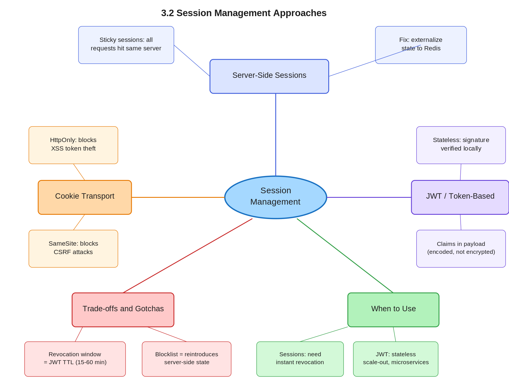

# 3.2 Session Management Approaches

> **Topic:** Topic 3 — Stateless Services
> **Phase:** B — Scalability Branch
> **Date studied:** 2026-05-11

---

## 1. 🎯 Goal of This Subtopic

> *Why are you studying this? What should you be able to do after this session?*

- Be able to compare server-side, cookie-based, and token-based session management and select the right approach given a system's scalability and revocation requirements.
- Understand why the choice of session strategy is a load balancing and scaling decision, not just an auth decision.
- Identify the specific failure modes and trade-offs of each approach — particularly why JWTs can't be revoked without reintroducing server-side state.

---

## 2. ✅ What Mastery Looks Like

> *Concrete, testable proof that you own this concept — not just familiarity.*

- [ ] Can explain what sticky sessions are, why they exist, and why they hurt horizontal scaling — in under 60 seconds.
- [ ] Can describe the scalability problem with in-memory server-side sessions and propose the correct fix (shared session store) without prompting.
- [ ] Can walk through the JWT validation flow — including what "stateless" means mechanically — and explain why JWTs can't be revoked without a blocklist.
- [ ] Can compare all three approaches (server-side, cookie-based, token-based) on the dimensions of: scalability, revocation capability, complexity, and trust boundary.
- [ ] Can take a stateful session design and refactor it into a stateless JWT-based design, explaining each step.

> 💡 **Rule of thumb:** If you can teach it to someone else and field their follow-up questions, you've mastered it.

---

## 3. 🗓️ Study Phases to Achieve Mastery

> *A progressive plan from first exposure to interview-ready. Work through each phase in order. Don't move to the next until you can honestly tick every item.*

### Phase 1 — Acquire 📖 💪💪
*Goal: Read deeply enough that you could explain the concept without the doc.*

- [ ] Read *DDIA* Ch. 9 (consistency/session guarantees) and the auth sections of *System Design Interview Vol. 1* Ch. 3
- [ ] Read the Auth0 blog post "Cookies vs. Tokens: The Definitive Guide" (auth0.com)
- [ ] Read JWT.io introduction and RFC 7519 summary
- [x] Read through **Sections 5–9** (Core Definition → How It Works) carefully — don't skim
- [ ] Re-read the **Cheatsheet** (Section 4) and try to recite it from memory after

### Phase 2 — Consolidate ✍️ 💪💪💪
*Goal: Verify you can reproduce the knowledge in your own words without looking.*

- [x] Close the doc — write out the **Core Definition** from memory, then compare
- [x] Explain **First Principles** out loud without notes — what problem does this solve and why?
- [x] Reconstruct the **How It Works** mechanics step by step from memory
- [x] Restate each **Trade-off** row in your own words — if you can't explain the cost, you don't own it yet

### Phase 3 — Apply 🔧 💪💪💪💪
*Goal: Connect to real systems and simulate interview scenarios.*

- [ ] Go through **Real-World System Examples** (Section 10) — verify each claim independently and add anything missed to **My Notes**
- [ ] Practice the **Interview Application** (Section 12) out loud — say the trigger phrases and your response as if in a live interview
- [ ] Work through **Common Misconceptions** (Section 13) — for each, make sure you can explain *why* the misconception is wrong, not just that it is
- [ ] Trace the **Relationships to Other Concepts** (Section 14) — can you explain each connection without looking?

### Phase 4 — Validate 🧪 💪💪💪💪💪
*Goal: Confirm you actually own it, not just recognize it.*

- [ ] Answer every **Self-Check Quiz** question (Section 15) out loud without looking at your notes
- [ ] Recite the **Cheatsheet** (Section 4) from memory — if you can't, re-do Phase 2
- [ ] Tick off items in **What Mastery Looks Like** (Section 2) — only check a box if you can demonstrate it on demand, not just if it sounds familiar
- [ ] Teach this concept out loud to an imaginary interviewer for 2 minutes without hesitation or notes

---

## 4. 📋 Cheatsheet

> *Everything you need to recall this concept in 30 seconds — for quick review before an interview.*



```
ONE-LINER
  Session management is where you store "who is this user, what can they do" —
  on your servers (server-side), in a browser cookie, or in a signed token the
  client carries (JWT). The choice determines whether your service can scale freely.

KEY PROPERTIES / RULES
  1. Server-side sessions: auth state lives on the server. Horizontal scaling requires
     a shared session store (Redis); otherwise sticky sessions are needed.
  2. Cookie-based: the browser sends a session ID on every request. The server
     looks it up in its store. Still server-side — "cookie" is just the transport.
  3. Token-based (JWT): server issues a signed token; client stores and sends it.
     Server validates the signature — no shared store needed. Stateless.
  4. JWTs cannot be revoked before expiry without a blocklist, which reintroduces
     server-side state and partially defeats the purpose.

DECISION RULE
  Use JWT/token-based when: you need stateless horizontal scaling across multiple
  services, microservices, or multiple load-balanced nodes with no session store.
  Avoid JWT when: you need instant revocation (logout, account suspension, privilege
  change) and cannot tolerate a window of up to token TTL where the token remains valid.
  Use server-side sessions when: you need strong revocation guarantees and can afford
  the operational overhead of a shared session store (Redis Cluster).

NUMBERS / FORMULAS
  JWT access token TTL: 15 minutes–1 hour (short to limit revocation window)
  Refresh token TTL: 7–30 days (rotated on use)
  Session cookie TTL: 30 minutes–24 hours (server controls)
  JWT payload max practical size: ~4–8 KB (headers inflate; keep claims minimal)

GOTCHA TO NEVER FORGET
  Saying "we'll use JWTs so we don't need a session store" then adding a token
  blocklist is self-defeating — you now have a distributed session store, just worse.
```

---

## 5. 🧠 Core Definition

> *What is it, in one sentence?*

Session management is the mechanism by which a server tracks authenticated user state across multiple stateless HTTP requests — and the three primary approaches (server-side store, cookie transport, and token-based self-contained tokens) represent a fundamental trade-off between revocation control and horizontal scalability.

---

## 6. 📦 Core Concepts

> *The essential building blocks of this subtopic — the terms and ideas you must have solid before going deeper.*

### Server-Side Sessions
The server creates a session record in memory (or a database) keyed by a session ID, and returns only the ID to the client (typically via a Set-Cookie header). On each subsequent request the client sends the session ID and the server looks up the record to reconstruct user context. The critical scaling constraint: if session records live in the memory of a single application server, any request must be routed to that same server — this is the root cause of sticky sessions.

### Sticky Sessions (Session Affinity)
A load balancer configuration that routes all requests from a given client to the same backend server, preserving the in-memory session. This solves the session lookup problem without a shared store, but at a severe scaling cost: nodes cannot be freely added or removed, a server failure takes all its sessions with it, and load distribution becomes uneven. Sticky sessions are a smell — a signal that session state hasn't been properly externalized.

### Shared Session Store (Externalizing State)
The correct fix for horizontal scalability with server-side sessions: move session records into a shared, fast, distributed store — typically Redis. All application servers read and write session data to the same Redis cluster. Now any server can handle any request (load-balanced freely), and sessions survive individual server restarts. The cost is the operational overhead of the Redis cluster and the network hop on every request.

### Cookie-Based Transport
"Cookie-based" is often misused to mean a specific session strategy, but it is really just a transport mechanism. The browser automatically attaches cookies to every same-origin request. The session ID (in server-side sessions) or the JWT (in token-based auth) can both be delivered via cookies. Cookies have security attributes: `HttpOnly` (no JS access), `Secure` (HTTPS only), `SameSite` (CSRF protection). The important point: setting `HttpOnly` + `Secure` on a JWT cookie gives you the security benefits of cookies without exposing the token to JavaScript.

### Token-Based Auth (JWT)
The server issues a JSON Web Token containing the user's identity and claims (roles, permissions, expiry) signed with the server's private key (RS256/ES256) or a shared secret (HS256). The client stores it (localStorage, sessionStorage, or an HttpOnly cookie) and sends it on each request. The server validates the signature cryptographically — no database or cache lookup required. This makes the service fully stateless. The structural cost: once issued, a JWT is valid until expiry. There is no mechanism to invalidate it mid-flight without introducing a blocklist.

### Token Revocation & the Blocklist Problem
If a user logs out, or their account is suspended, or their roles change, you want the session to be immediately invalid. With server-side sessions, you simply delete the session record. With JWTs, the token remains cryptographically valid until its `exp` claim lapses. Common mitigations: (1) short TTLs (15–60 min) + refresh token rotation, so the attack window is bounded; (2) a token blocklist (Redis set of revoked JTI values) checked on each request — but this reintroduces a shared store. There is no free lunch.

---

## 7. 🔍 First Principles — Why Does This Exist?

> *What fundamental problem does this concept solve? Why was it invented?*

HTTP is inherently stateless — each request carries no memory of prior requests. But almost every useful web application needs to know *who is making this request* without asking them to authenticate on every click. The first solution was simple: the server keeps a ledger (session store) and gives the client a claim-check (session ID cookie). This worked fine on a single server in 2000.

The problem emerged at scale. When you run 10 or 100 servers behind a load balancer, the session record on Server 1 is invisible to Server 2. The industry's first response — sticky sessions — just kicked the problem down the road. The correct fix was to externalize the ledger to a shared store (Redis), making server nodes symmetric and freely replaceable.

The next wave of scale — microservices, mobile clients, cross-domain APIs — made even the shared session store a bottleneck. Each microservice needed to validate the session, which meant either calling a central auth service or sharing the session store. Token-based auth (JWT) eliminated the lookup entirely: the token *is* the session record, signed so it can't be forged, and any service that trusts the signing key can validate it locally. The trade-off — loss of instant revocation — is the price of that decoupling.

---

## 8. 🗺️ Mental Models

> *Intuition frames that help you reason about this concept fast — especially under interview pressure.*

### Model 1: The Coat Check vs. the Membership Card
Server-side sessions are like a coat check: you hand in your coat (identity proof), get a numbered ticket (session ID), and every time you want your coat you show the ticket. The limitation: only the original coat check desk can redeem it. Move to a different coat check desk (different server) and your ticket is worthless — unless there's a central coat check registry (shared session store).

JWT is like a signed membership card you carry in your wallet: any bouncer at any door can verify it by checking the club's watermark (signature). No central desk needed. But if the club revokes your membership, you still hold a valid-looking card until it expires. The model breaks down exactly where JWT breaks down: instant revocation requires a centralized authority.

### Model 2: The "State Budget" Frame
Every system design decision involves a state budget. Server-side sessions spend that budget at the server layer (session store) but keep clients thin. JWTs push state to the client (the token) to keep servers thin. The total state doesn't disappear — it relocates. When you add a JWT blocklist, you're spending state back at the server layer, partly negating the trade. This frame helps you explain to an interviewer *why* there's no purely stateless revocation — state has to live somewhere.

### Model 3: The TTL Dial
Think of the access token TTL as a dial between security and scalability. Short TTL (1–5 min): fast revocation, but frequent refresh token round-trips, increased auth service load. Long TTL (12–24hr): low load, but a compromised token is valid for hours. Most production systems land at 15–60 minutes for access tokens, with 7–30 day refresh tokens. Turning the dial left buys revocation at the cost of auth service load; turning it right buys scalability at the cost of security window.

---

## 9. ⚙️ How It Works — Mechanics

> *Step-by-step or layered explanation of the internal mechanism.*

### Server-Side Sessions — Happy Path
1. User submits credentials (POST /login).
2. Server verifies credentials against the user store (DB lookup).
3. Server creates a session record: `{ session_id: "abc123", user_id: 42, roles: ["admin"], expires_at: T+30min }` and writes it to the session store (Redis, DB, or in-memory).
4. Server returns `Set-Cookie: session_id=abc123; HttpOnly; Secure; SameSite=Lax`.
5. Browser attaches `Cookie: session_id=abc123` on every subsequent request.
6. Server receives request, extracts session ID, looks up session record, reconstructs user context, processes request.
7. On logout: server deletes the session record. Immediately invalid.

### Server-Side Sessions — Failure Modes
- **In-memory only, no shared store**: Server 2 receives request with `session_id=abc123` but has no record. User sees "logged out." Fix: sticky sessions (band-aid) or shared store (correct).
- **Shared store goes down**: All sessions inaccessible simultaneously. Fix: Redis Sentinel or Cluster for HA.
- **Session fixation attack**: Attacker plants a known session ID before login. Fix: always regenerate session ID on login.

### Token-Based (JWT) — Happy Path
1. User submits credentials.
2. Server verifies credentials, builds a payload: `{ sub: "42", roles: ["admin"], iat: now, exp: now+3600 }`.
3. Server signs the payload using RS256 private key → produces `header.payload.signature` string.
4. Server returns the JWT (in response body or Set-Cookie with HttpOnly).
5. Client stores JWT and sends it as `Authorization: Bearer <token>` or in the cookie on each request.
6. Any backend service receives the request, extracts the JWT, verifies the signature using the public key (no network call needed), checks `exp`, reads claims from payload.
7. On logout (client-side only): client discards the token. No server record to delete. Token is still cryptographically valid until `exp`.

### Refresh Token Flow
To limit the revocation window while keeping access token lifetimes short: access token lives 15–60 min, refresh token lives 7–30 days and is stored server-side (in a DB or Redis). When the access token expires, the client sends the refresh token to the auth service, which validates it, rotates it (issues a new refresh token, invalidates the old one), and issues a new access token. This gives you bounded revocation: worst case, the compromised access token expires in ≤60 minutes. Immediate revocation requires adding the access token's JTI (JWT ID) to a blocklist.

### JWT Structure
- **Header**: `{ alg: "RS256", typ: "JWT" }` — base64url encoded
- **Payload**: Claims — `sub`, `iat`, `exp`, `roles`, custom claims — base64url encoded (not encrypted, just encoded — anyone can read it)
- **Signature**: `Sign(base64(header) + "." + base64(payload), privateKey)` — prevents tampering

The signature is the security anchor. Changing any bit of the payload invalidates the signature. The server trusts the payload only because the signature validates.

---

## 10. 🏭 Real-World System Examples

> *Where does this appear in production systems you know?*

| System | How This Concept Applies | Notes |
|--------|--------------------------|-------|
| **GitHub** | Uses server-side sessions for browser auth; JWTs (via GitHub Apps) for API auth | Two-tier: session cookies for humans, tokens for machines |
| **Google / GCP** | OAuth2 short-lived access tokens (1hr) + refresh token flow | Google can revoke refresh tokens server-side immediately via OAuth2 token revocation endpoint |
| **Stripe** | API key authentication (long-lived, server-stored) + session cookies for dashboard | API keys stored as hashed server-side — immediate revocation, no expiry ambiguity |
| **Amazon AWS** | STS (Security Token Service) issues short-lived JWT-like tokens (up to 12hr) | Temporary credentials for IAM roles — no long-lived secrets; revocation via IAM policy changes take effect at token expiry |
| **Kubernetes** | ServiceAccount JWTs signed by the cluster CA for pod-to-API-server auth | Tokens are short-lived and automatically rotated by kubelet; kubelet validates using the cluster's OIDC discovery endpoint |

---

## 11. ⚖️ Trade-offs

> *Every design decision has a cost. What are you giving up?*

| ✅ Benefit | ❌ Cost / Limitation |
|-----------|---------------------|
| **Server-side sessions**: instant revocation — delete the record, user is immediately logged out | Every request requires a session store lookup (network hop); in-memory sessions require sticky sessions or a shared store |
| **Server-side sessions**: session data can be updated (role changes take effect immediately) | Session store is a stateful component that must be highly available; its failure takes down all auth |
| **JWT (token-based)**: stateless — any server can validate without a network call | Tokens cannot be revoked before expiry without a blocklist; compromised tokens are valid until `exp` |
| **JWT**: works naturally across microservices and domains (no shared session store dependency) | Token payload is encoded but not encrypted — sensitive claims are readable by anyone who intercepts it (use HTTPS; avoid sensitive data in payload) |
| **Short JWT TTL**: limits the revocation window on compromise | More frequent refresh token round-trips → higher auth service load; must implement refresh token rotation correctly or introduce replay vulnerabilities |
| **Cookie transport**: automatic browser handling; `HttpOnly` blocks XSS token theft | Subject to CSRF attacks unless `SameSite=Strict/Lax` or CSRF tokens are used; 4KB cookie size limit |

---

## 12. 🎯 Interview Application

> *How do you use this concept in a design interview? What triggers it?*

**When an interviewer asks / says:**
- "How does your system handle user authentication and sessions?"
- "The system needs to scale to millions of concurrent users — how do you handle auth state?"
- "What happens if we add more servers — how do sessions work?"
- "How do you handle logout in a stateless microservices architecture?"

**What you say / do:**
In the requirements or high-level design phase, when you introduce an API gateway or auth service, briefly state your session strategy and justify it. Say: "For auth, I'll use short-lived JWTs (15–60 min) validated at the gateway, with a refresh token flow. This keeps our services stateless and freely horizontally scalable. The trade-off is we can't instantly revoke access tokens — I'd mitigate that with short TTLs and, for high-risk operations like account suspension, a lightweight blocklist in Redis."

**The trade-off statement (memorize this pattern):**
> "If we choose JWTs, we get stateless horizontal scalability — any server can validate without a shared store — but we pay with the inability to instantly revoke a token; the worst-case window equals the access token TTL. For this system, JWTs are the right call because the short TTL bounds our exposure and we don't need sub-minute revocation guarantees."

---

## 13. ⚠️ Common Misconceptions & Gotchas

> *What do candidates get wrong? What nuance is the interviewer probing for?*

- ❌ **Misconception:** "Cookie-based auth is stateful and JWT is stateless."
  ✅ **Reality:** Cookies are a transport mechanism, not a session strategy. A JWT stored in an HttpOnly cookie is still stateless. A session ID stored in a cookie is stateful because the session record lives server-side. The statefulness is in the *storage location of session data*, not the transport.

- ❌ **Misconception:** "We'll use JWTs so we don't need any server-side infrastructure for auth."
  ✅ **Reality:** You still need server-side infrastructure for: issuing tokens (auth service), storing refresh tokens (DB or Redis), rotating refresh tokens on use, and optionally maintaining a blocklist for immediate revocation. JWTs eliminate the *per-request session lookup*, not all server-side auth state.

- ❌ **Misconception:** "JWTs are secure because they're signed — the payload is protected."
  ✅ **Reality:** The signature guarantees *integrity* (payload wasn't tampered with), not *confidentiality*. The payload is base64url-encoded, not encrypted. Anyone who intercepts the token can read all claims. Never put sensitive information (PII, passwords, secrets) in a JWT payload unless you use JWE (JSON Web Encryption) — a much rarer, more complex standard.

- ❌ **Misconception:** "We can solve the JWT revocation problem by checking a blocklist on every request — problem solved."
  ✅ **Reality:** A blocklist stored in Redis that must be checked on every request is functionally equivalent to a shared session store — you've added a network hop to every auth decision, you need the Redis cluster to be highly available, and you've reintroduced the distributed state you tried to avoid. This doesn't mean it's wrong — sometimes it's the right call — but it should be a deliberate trade-off, not an afterthought.

---

## 14. 🔗 Relationships to Other Concepts

> *How does this connect to adjacent subtopics in this topic or across the roadmap?*

- **Builds on:** 3.1 — Stateless vs. Stateful Architecture. Session management is the primary mechanism for making auth stateless; you cannot reason about session strategy without the stateless/stateful distinction.
- **Enables:** 3.3 — Externalizing State to Redis (the shared session store pattern is the concrete implementation of externalized session state). Also enables 3.4 — JWT as Stateless Session Token (the deep dive on JWT mechanics and security).
- **Tension with:** 2.5 — Consistency vs. Availability. Server-side sessions with a shared store trade availability (if Redis is down, auth fails) for consistency (immediate revocation). JWTs trade consistency (stale claims for up to TTL) for availability (no shared store dependency).

---

## 15. 🧪 Self-Check Quiz

> *Can you answer these without looking? If not, you haven't internalized it yet.*

1. What is the root cause of the sticky sessions requirement in a server-side session architecture, and what is the correct architectural fix?

   > 💡 *Think through your answer before expanding — if you hesitate, revisit Section 6 (Core Concepts: Server-Side Sessions / Sticky Sessions).*

The root cause is that session records live in the in-memory store of a single application server. When a load balancer routes a subsequent request to a different server, that server has no record of the session and treats the user as unauthenticated. Sticky sessions patch this by forcing the load balancer to always route a given user to the same server — but this breaks horizontal scalability (uneven load distribution), creates a single point of failure (that server dies, all its sessions are gone simultaneously), and makes nodes non-interchangeable.
The correct fix is to externalize session state to a shared store — typically Redis Cluster — so every application server reads and writes the same session data. Any server can now handle any request. Nodes become symmetric and freely replaceable. The session store itself must be highly available (Redis Sentinel or Cluster), because its failure takes down all authentication.

2. A user's account is suspended by an admin. Your system uses JWTs with a 1-hour access token TTL and no blocklist. What is the worst-case behavior, and how would you mitigate it without reintroducing a full session store?

   > 💡 *Think through your answer before expanding — if you hesitate, revisit Section 9 (Mechanics: Refresh Token Flow) and Section 11 (Trade-offs).*

Worst case: the suspended user retains full access for up to 1 hour — the full remaining TTL of their current access token. There is no server-side mechanism to invalidate it mid-flight without a blocklist.
Mitigation without a full session store: introduce refresh token rotation. Access tokens stay short-lived (15–60 min). Refresh tokens are long-lived (days/weeks) and stored server-side in a small Redis store or database. On suspension, the admin action deletes the user's refresh token record. The user's current access token remains valid until it expires — worst case whatever the TTL is — but when they attempt to get a new access token using their refresh token, the server finds no record and denies the request. No new access token is ever issued.
This is not a "full session store" — it's a small refresh token ledger. The per-request lookup is eliminated; only the token exchange path hits the store.

3. An interviewer asks: "Your microservices architecture has 8 services. How does each service know who the user is?" Walk through the JWT validation flow a downstream service would perform.

   > 💡 *Think through your answer before expanding — if you hesitate, revisit Section 9 (JWT Happy Path).*

When a request arrives at a downstream service, it extracts the JWT from the Authorization: Bearer header. It then:

Splits the token into header.payload.signature
Re-computes the expected signature over base64(header) + "." + base64(payload) using the auth service's public key — which all services hold locally
Compares the computed signature against the token's signature — if they match, the payload hasn't been tampered with
Checks the exp claim is in the future
Reads sub, roles, and any other claims directly from the payload

No network call. No Redis lookup. Any of the 8 services can do this independently in microseconds.
If the token is expired, the service returns 401. The client — not the service — is responsible for calling the auth service to exchange its refresh token for a new access token and retrying.

4. Name a real production system that uses short-lived tokens with a refresh flow, and explain specifically what the token TTLs are and how revocation works.

   > 💡 *Think through your answer before expanding — if you hesitate, revisit Section 10 (Real-World Examples).*

Google / GCP OAuth2 is the clearest example. Access tokens have a TTL of 1 hour. Refresh tokens are long-lived — valid for days to weeks — and stored server-side by Google.
Revocation works at two levels: a refresh token can be immediately invalidated via Google's token revocation endpoint (POST /revoke). The current access token remains valid until its 1-hour TTL lapses — that's the accepted revocation window. Once the access token expires, the client attempts to use its refresh token to get a new one; Google rejects the request because the refresh token is gone, and the user is locked out.
GitHub is also valid: GitHub Apps issue installation access tokens that expire in 1 hour. The app authenticates using a JWT signed with its private key to request installation tokens — no persistent refresh token; the JWT itself is regenerated each time, signed fresh with an expiry of 10 minutes.
AWS STS is another strong example: temporary credentials last up to 12 hours, issued per-role assumption. Revocation is via IAM policy — effective at the next credential expiry.

5. A candidate says "we'll use HttpOnly cookies to store the JWT — this makes it stateless and CSRF-safe." Is this correct? What have they right and what have they wrong?

   > 💡 *Think through your answer before expanding — if you hesitate, revisit Section 6 (Cookie-Based Transport) and Section 13 (Misconceptions).*

What's right: Storing the JWT in an HttpOnly cookie does prevent XSS-based token theft — JavaScript running on the page cannot read HttpOnly cookies, so a malicious script can't steal the token. That part is correct. The auth is also still stateless — the session state lives in the JWT payload, not on any server. The cookie is just the transport.
What's wrong: HttpOnly provides zero CSRF protection. Browsers automatically attach cookies — including HttpOnly ones — to cross-origin requests. A malicious page on evil.com can trigger a POST to yourbank.com and the browser will happily include the session cookie. CSRF protection requires the SameSite=Lax or SameSite=Strict cookie attribute — not HttpOnly, and not anything inside the JWT itself. The candidate conflated two independent security properties of cookies.

---

## 16. 📚 Further Reading

> *Links, chapters, or resources for deeper understanding.*

- [ ] *Designing Data-Intensive Applications* (DDIA) — Ch. 9, section on consistency models as they apply to session guarantees (Kleppmann)
- [ ] Auth0 Engineering Blog — "Cookies vs. Tokens: The Definitive Guide" (auth0.com/blog)
- [ ] RFC 7519 — JSON Web Token specification (the authoritative source for JWT structure and claims)
- [ ] *System Design Interview Vol. 1* by Alex Xu — Ch. 13 (Design a Hotel Reservation System) touches on session and auth design in the context of a scalable web system
- [ ] OWASP Session Management Cheat Sheet (cheatsheetseries.owasp.org) — security requirements and attack vectors

---

## 17. ✍️ My Notes

> *Personal observations, things that confused me, analogies that helped.*

