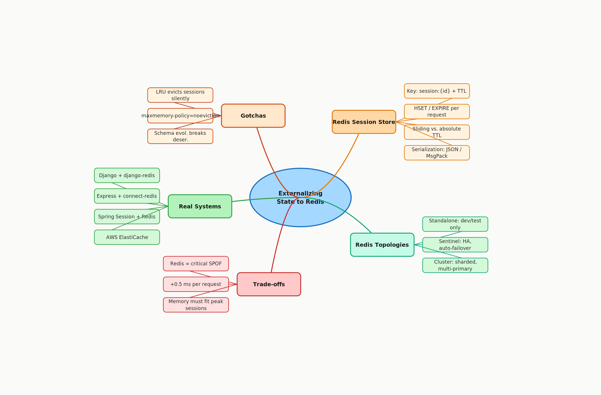

# 3.3 Externalizing State to Redis / Distributed Stores

> **Topic:** Topic 3 — Stateless Services
> **Phase:** B — Scalability Branch
> **Date studied:** 2026-05-12

---

## 1. 🎯 Goal of This Subtopic

> *Why are you studying this? What should you be able to do after this session?*

- Be able to take a stateful service design (in-memory session data on app servers) and refactor it into a stateless one by externalizing session state to Redis, explaining every architectural decision step by step.
- Understand why Redis is the canonical tool for this job — its data model, TTL semantics, and sub-millisecond latency — and when an alternative store might be appropriate instead.
- Identify the specific failure modes introduced by externalizing state (Redis SPOF, network hop, eviction policy collisions) and propose concrete mitigations for each.
- Recognize trigger phrases in an interview that signal this pattern is needed, and articulate the trade-off statement fluently.

---

## 2. ✅ What Mastery Looks Like

> *Concrete, testable proof that you own this concept — not just familiarity.*

- [ ] Can describe what "externalizing state" means mechanically — what data moves, where it goes, and what changes on the app server — without referring to notes.
- [ ] Can explain the full Redis session store read/write flow step by step, including key design, serialization, TTL, and what happens on a cache miss.
- [ ] Can compare standalone Redis, Redis Sentinel, and Redis Cluster and choose the right topology for a given availability and scale requirement.
- [ ] Can identify at least three failure modes of a Redis-backed session store and propose a mitigation for each.
- [ ] Can walk an interviewer through a stateful-to-stateless refactor of a concrete service, justifying each step against the "share-nothing" principle.

> 💡 **Rule of thumb:** If you can teach it to someone else and field their follow-up questions, you've mastered it.

---

## 3. 🗓️ Study Phases to Achieve Mastery

> *A progressive plan from first exposure to interview-ready. Work through each phase in order. Don't move to the next until you can honestly tick every item.*

### Phase 1 — Acquire 📖 💪💪
*Goal: Read deeply enough that you could explain the concept without the doc.*

- [ ] Read *Designing Data-Intensive Applications* (DDIA) Ch. 1 — "Reliability, Scalability, Maintainability" (covers share-nothing and state externalization motivation)
- [ ] Read the Redis official documentation: "An Introduction to Redis Data Types" and "Redis Persistence" (redis.io/docs)
- [ ] Read the AWS ElastiCache for Redis documentation: "Managing User Sessions" (aws.amazon.com/elasticache)
- [ ] Read through **Sections 5–9** (Core Definition → How It Works) carefully — don't skim
- [ ] Re-read the **Cheatsheet** (Section 4) and try to recite it from memory after

### Phase 2 — Consolidate ✍️ 💪💪💪
*Goal: Verify you can reproduce the knowledge in your own words without looking.*

- [ ] Close the doc — write out the **Core Definition** from memory, then compare
- [ ] Explain **First Principles** out loud without notes — what problem does this solve and why?
- [ ] Reconstruct the **How It Works** mechanics step by step from memory
- [ ] Restate each **Trade-off** row in your own words — if you can't explain the cost, you don't own it yet

### Phase 3 — Apply 🔧 💪💪💪💪
*Goal: Connect to real systems and simulate interview scenarios.*

- [ ] Go through **Real-World System Examples** (Section 10) — verify each claim independently and add anything missed to **My Notes**
- [ ] Practice the **Interview Application** (Section 12) out loud — say the trigger phrases and your response as if in a live interview
- [ ] Work through **Common Misconceptions** (Section 13) — for each, make sure you can explain *why* the misconception is wrong, not just that it is
- [ ] Trace the **Relationships to Other Concepts** (Section 14) — can you explain each connection without looking?

### Phase 4 — Validate 🧪 💪💪💪💪💪
*Goal: Confirm you actually own it, not just recognize it.*

- [ ] Answer every **Self-Check Quiz** question (Section 15) out loud without looking at your notes
- [ ] Recite the **Cheatsheet** (Section 4) from memory — if you can't, re-do Phase 2
- [ ] Tick off items in **What Mastery Looks Like** (Section 2) — only check a box if you can demonstrate it on demand, not just if it sounds familiar
- [ ] Teach this concept out loud to an imaginary interviewer for 2 minutes without hesitation or notes

---

## 4. 📋 Cheatsheet

> *Everything you need to recall this concept in 30 seconds — for quick review before an interview.*



```
ONE-LINER
  Move all mutable session/application state from app server memory into a fast,
  shared, external store (Redis) so every app server becomes identical and
  interchangeable — enabling free horizontal scaling.

KEY PROPERTIES / RULES
  1. App servers must be stateless: they hold NO user-specific state between requests.
     All session data lives in Redis, keyed by session/token ID.
  2. Redis is the canonical choice: sub-millisecond latency, native TTL per key,
     rich data types (Hash for structured session objects), and pub/sub support.
  3. Key design matters: session:{user_id}:{session_id} — predictable, evictable,
     and avoids key collisions across services.
  4. TTL must be set on every session key. Never store session data without an expiry
     or you will leak memory indefinitely as sessions are abandoned.
  5. Redis Sentinel (HA, single primary) vs. Redis Cluster (sharded, multi-primary):
     choose Cluster when session volume exceeds a single node's memory budget.

DECISION RULE
  Externalize to Redis when: you need >1 app server instance, sticky sessions are
  unacceptable, or sessions must survive app server restarts.
  Keep in-memory when: truly single-server, session loss on restart is tolerable
  (e.g., a developer tool or short-lived batch job coordinator).

NUMBERS TO REMEMBER
  Redis read/write latency  → <1 ms (local network)
  Max Redis single-node RAM → ~100–200 GB practical limit
  Session TTL (web app)     → 15 min idle timeout, 24 hr absolute max
  Redis Sentinel quorum     → 3 Sentinel nodes minimum for reliable failover

GOTCHA TO NEVER FORGET
  Redis eviction policy LRU/LFU will silently evict sessions under memory pressure —
  users get logged out with no error. Always size Redis to 2× peak session volume,
  and use maxmemory-policy=noeviction for session stores, relying on TTL cleanup only.
```

---

## 5. 🧠 Core Definition

> *What is it, in one sentence?*

Externalizing state to Redis means moving all mutable per-request or per-user state (sessions, caches, counters, rate limit windows) out of app server memory and into a shared, persistent, in-memory distributed store — transforming app servers from stateful nodes that must be routed to carefully into stateless, freely interchangeable replicas that any load balancer can target without restriction.

---

## 6. 📦 Core Concepts

> *The essential building blocks of this subtopic — the terms and ideas you must have solid before going deeper.*

### The State Externalization Problem
When an app server holds session data in its own process memory, every subsequent request from the same user *must* land on the same server — otherwise the session is invisible. This creates sticky sessions (load balancer affinity), which breaks horizontal scaling: you can't freely add or remove nodes, node failure evicts all its sessions, and load distribution becomes uneven. The fix is to move ("externalize") session data to a store that is shared across all app servers — making the servers symmetric and replaceable.

### Redis as a Distributed Session Store
Redis is an in-memory data structure store optimized for sub-millisecond reads and writes. For session storage, it provides three critical features: (1) **native TTL per key** — sessions expire automatically without cron jobs or GC; (2) **Hash data type** — structured session objects stored efficiently as field-value pairs under a single key; (3) **high availability topologies** (Sentinel, Cluster) — sessions don't evaporate when a single Redis node fails. Its memory-resident design means a session lookup adds ~0.3–1 ms latency, not 5–50 ms like a database disk read.

### Session Key Design
A well-designed key is `session:{session_id}` or `user_session:{user_id}:{session_id}`. The key must be: **unique** (no collisions across users or services), **opaque to the client** (don't expose user IDs in session tokens), **paired with a TTL** (set on SETEX/HSET + EXPIRE), and **predictable in structure** for debugging and monitoring. Namespacing with a prefix (e.g., `session:`) allows Redis SCAN with pattern matching for operational tasks like counting active sessions.

### Redis Topology Options
Three deployment modes with different availability/scale trade-offs: **Standalone** (single node, simplest, no HA — dev/test only); **Redis Sentinel** (one primary + N replicas + M Sentinel processes; automatic failover when primary dies; suitable for most web apps up to ~50 GB session data); **Redis Cluster** (data sharded across 16,384 hash slots spread across multiple primaries; each primary has replicas; handles datasets too large for a single node). For session stores, Sentinel is the most common production choice — Cluster adds complexity that only pays off at very high session volume.

### Serialization and Deserialization
Session objects must be serialized before writing to Redis and deserialized on read. Common choices: **JSON** (human-readable, debuggable, slightly larger); **MessagePack** (binary, smaller, faster); **Protobuf** (typed, compact, requires schema management). Serialization adds CPU overhead on every session read/write, and schema evolution (adding fields to session objects) must be handled carefully to avoid deserialization errors on old records that haven't expired yet.

---

## 7. 🔍 First Principles — Why Does This Exist?

> *What fundamental problem does this concept solve? Why was it invented?*

The root problem is that HTTP is stateless, but applications are stateful. Early web apps stored session state in app server memory because it was fast and simple — and when you ran one server, it worked perfectly. As traffic grew, teams added more servers. Immediately, they hit the "missing session" problem: a user logged in on Server A, then their next request hit Server B, which had no record of their session, and they were asked to log in again.

The first stopgap was sticky sessions — the load balancer learned which server each user was attached to and always routed to that server. This worked, but at severe cost: you couldn't rebalance load freely, any server failure took its users' sessions with it (forcing re-login), and you couldn't run a rolling deployment without evicting sessions. The system had become tightly coupled — users to servers — and that coupling was the enemy of horizontal scaling.

The correct fix is the "share-nothing" principle applied to session state: no app server should own any piece of state that another can't access. By moving session data to a dedicated, shared, fast external store, all servers become identical. The external store — Redis — becomes the single source of truth for session state. App servers are reduced to stateless request processors: they receive a session ID, look it up in Redis, do their work, and optionally update the record. Any server can handle any request. This is why externalizing state to Redis is not just a performance trick — it is the architectural prerequisite for horizontal scaling.

---

## 8. 🗺️ Mental Models

> *Intuition frames that help you reason about this concept fast — especially under interview pressure.*

### Model 1: The Hotel Key Card System
Imagine a hotel where, instead of each room having its own unique key mechanism, every room uses a universal card reader that calls a central keycard server. Any front desk clerk can issue or revoke a card, any door reader can validate it. No room is "bonded" to a particular clerk. This is Redis-backed sessions: the central keycard server is Redis, the rooms are app servers, the card is the session ID. **Where the model breaks:** the central keycard server itself becomes the single point of failure — which is why Redis Sentinel or Cluster is necessary for production, just as hotels have backup power for their central systems.

### Model 2: The "Dumb Servers, Smart Store" Frame
Think of your app server fleet as interchangeable compute workers — they should be as dumb as a calculator: take input, produce output, remember nothing. All the intelligence about *who the user is* lives in Redis. When you design a system, ask: "Does this server know anything about a specific user that it couldn't reconstruct from Redis + the database?" If the answer is yes, you have unexternalized state. This frame makes it easy to audit designs for hidden statefulness.

### Model 3: The State Evacuation
Refactoring a stateful service to externalize its state is literally an evacuation: you identify every piece of data that lives in app server memory (session objects, user preferences, rate limit counters, CSRF tokens, temporary upload state), and you evacuate each one to Redis with a corresponding TTL and key design. The exercise of systematically listing what to evacuate is itself valuable — it surfaces hidden stateful assumptions. **Where the model breaks:** not everything should go to Redis. Large binary blobs (file upload buffers) belong in object storage; durable, queryable data belongs in a database. Redis is for fast, ephemeral, small session-type data.

---

## 9. ⚙️ How It Works — Mechanics

> *Step-by-step or layered explanation of the internal mechanism.*

### Write Path — Session Creation

1. User authenticates (POST /login). App server validates credentials against the user DB.
2. App server generates a cryptographically random, globally unique session ID (e.g., 128-bit UUID or `secrets.token_urlsafe(32)` in Python). **Never use sequential IDs — they are guessable.**
3. App server builds the session object: `{ user_id, roles, email, created_at, last_active }`.
4. App server serializes the object to JSON (or MessagePack).
5. App server writes to Redis: `HSET session:{session_id} user_id 42 roles "admin" ...` then `EXPIRE session:{session_id} 1800` (30 min idle TTL). Or atomically: `SET session:{session_id} <json> EX 1800`.
6. App server returns `Set-Cookie: session_id=<session_id>; HttpOnly; Secure; SameSite=Lax` to client.

### Read Path — Request Handling

1. Browser attaches `Cookie: session_id=<session_id>` on every request.
2. App server (any server in the fleet) extracts the session ID from the cookie.
3. App server calls `GET session:{session_id}` (or `HGETALL session:{session_id}`) against Redis.
4. **Cache hit:** Redis returns the serialized session. App server deserializes it, reconstructs user context, processes the request. App server slides the TTL: `EXPIRE session:{session_id} 1800` (sliding window expiry).
5. **Cache miss (session expired or forged):** App server returns `401 Unauthorized` and clears the cookie.

### Failure Scenarios

- **Redis primary fails (Sentinel mode):** Sentinel detects failure (default: 5 s timeout with 3 missed pings), promotes a replica to primary, updates client topology. Session reads fail during the ~5–15 s failover window — users may see errors or be logged out if they hit the gap.
- **Memory pressure / eviction:** If Redis reaches `maxmemory` and eviction policy is LRU, it silently evicts least-recently-used keys — which may be someone's session. User is logged out without explanation. Mitigation: `maxmemory-policy noeviction` + alert on memory usage > 80%.
- **Network partition:** App servers cannot reach Redis. All session lookups fail. Mitigation: circuit breaker to fail open gracefully (allow anonymous access to public endpoints, reject authenticated endpoints with `503`) rather than crashing.

### Key TTL Design
Two TTL strategies are common: **absolute TTL** — the session expires N hours after creation regardless of activity (simpler, but frustrating for active users); **sliding TTL** — the TTL is reset on every authenticated request (better UX, but requires a write on every request, slightly increasing Redis load). Most production web apps use sliding TTL with an absolute cap (e.g., 30-min idle + 24-hr max lifetime enforced by a `created_at` check in the session payload).

---

## 10. 🏭 Real-World System Examples

> *Where does this appear in production systems you know?*

| System | How This Concept Applies | Notes |
|--------|--------------------------|-------|
| **Django (Python)** | `SESSION_ENGINE = 'django.contrib.sessions.backends.cache'` with `django-redis` — all session data stored in Redis, keyed by session cookie value | Default Django stores sessions in the DB; switching to Redis drops session read latency from ~5 ms to <1 ms |
| **Express.js (Node)** | `express-session` + `connect-redis` store — session middleware reads/writes to Redis on every authenticated request | Redis key is `sess:{session_id}`; TTL set by `ttl` option in the store config |
| **Spring Session (Java)** | `@EnableRedisHttpSession` annotation — Spring auto-serializes the `HttpSession` object to Redis using Java serialization or JSON | Schema evolution (adding fields to session object) can break deserialization of existing Redis records |
| **AWS ElastiCache for Redis** | Used as the managed session store for horizontally-scaled EC2 / ECS apps; pairs with ALB session stickiness disabled | Sentinel-equivalent HA via ElastiCache's "cluster mode disabled" with Multi-AZ replication |
| **Shopify** | Rails app externalizes session data and job state to Redis clusters; Redis is core infrastructure not an optional add-on | At Shopify scale (~1M merchants), Redis is sharded by merchant ID range to avoid single large-keyspace bottlenecks |

---

## 11. ⚖️ Trade-offs

> *Every design decision has a cost. What are you giving up?*

| ✅ Benefit | ❌ Cost / Limitation |
|-----------|---------------------|
| App servers become stateless — any server handles any request; free horizontal scaling with no sticky sessions | Redis cluster is now a stateful, high-availability dependency; its failure takes down all authenticated sessions simultaneously |
| Sessions survive individual app server restarts, crashes, and rolling deployments — users stay logged in during deploys | Every authenticated request incurs a Redis round-trip (~0.3–1 ms local network) that didn't exist with in-memory sessions |
| Session data is immediately consistent across all app servers — role/permission changes take effect on the next request | Redis memory must be provisioned for peak concurrent session volume; underprovisioning + LRU eviction causes silent session loss |
| TTL-based auto-expiry requires zero app-level cleanup code or cron jobs | Serialization/deserialization of session objects adds CPU overhead; large or deeply nested session objects amplify this |
| Session state can be shared across multiple services (e.g., auth service + API service read the same Redis key) | Key design mistakes (missing TTL, key collisions, too-large values) are silent in development but catastrophic in production |

---

## 12. 🎯 Interview Application

> *How do you use this concept in a design interview? What triggers it?*

**When an interviewer asks / says:**
- "The system needs to scale to multiple app servers — how do you handle session state?"
- "What happens to user sessions when an app server goes down?"
- "How does your authentication layer work when you have 10 servers behind a load balancer?"
- "Walk me through how you'd make this service horizontally scalable."

**What you say / do:**
In the high-level design phase, when you introduce your app server tier, proactively state that servers will be stateless by externalizing sessions to Redis. Draw the Redis cluster as a separate box. Then walk through the read/write flow once to show you understand the mechanics, and call out that Redis is now a critical HA dependency — so you'd deploy it with Sentinel or Cluster depending on scale. This signals to the interviewer that you think about the second-order failure modes, not just the happy path.

**The trade-off statement (memorize this pattern):**
> "If we externalize sessions to Redis, we get stateless app servers that can be freely scaled and load-balanced without sticky sessions — but we pay by making Redis a critical, high-availability dependency whose failure takes down all authenticated traffic. For this system, that trade-off is correct because the scaling benefits outweigh the operational complexity, and we can mitigate the availability risk with Redis Sentinel and a circuit breaker."

---

## 13. ⚠️ Common Misconceptions & Gotchas

> *What do candidates get wrong? What nuance is the interviewer probing for?*

- ❌ **Misconception:** "We'll just use a database (MySQL/Postgres) as the session store — it's already there."
  ✅ **Reality:** A relational database can store sessions, but it will become a bottleneck under load. Session lookups are high-frequency, latency-sensitive, and don't benefit from the durability or query capabilities of a relational DB. A database session store at scale trades ~0.5 ms Redis reads for ~5–50 ms DB reads plus connection pool pressure. Redis exists specifically for this workload.

- ❌ **Misconception:** "Redis is just a cache — if it goes down, we gracefully degrade and reconstruct sessions from the DB."
  ✅ **Reality:** When Redis is the session store, it is not a cache in the degradable sense — it is the authoritative session state. There is nothing in the DB to fall back to. Redis is a primary, critical data store for the session layer. Design for its availability (Sentinel/Cluster, alerting) accordingly, not for graceful degradation.

- ❌ **Misconception:** "Setting a TTL on session creation is enough — the session will expire when it should."
  ✅ **Reality:** A fixed TTL from creation time means active users get logged out after N hours even mid-session. Production systems implement sliding TTL: the TTL is refreshed on every authenticated request. This requires a Redis EXPIRE call (or `SET ... KEEPTTL` + separate EXPIRE) on every request — a small but real additional write.

- ❌ **Misconception:** "We externalized sessions to Redis, so the system is now stateless."
  ✅ **Reality:** The app servers are stateless, but the system is not — it has simply moved state to Redis. Redis itself is stateful and must be treated with the same operational rigor as a database: replication, failover, backup, monitoring. "Stateless" architecture means stateless at the compute tier; state still has to live somewhere.

---

## 14. 🔗 Relationships to Other Concepts

> *How does this connect to adjacent subtopics in this topic or across the roadmap?*

- **Builds on:** **3.1 — Stateless vs. Stateful Architecture** (the motivation for externalizing state) and **3.2 — Session Management Approaches** (identifies the specific data that needs to be externalized — session records — and why in-memory alternatives fail at scale).
- **Enables:** **3.4 — JWT as Stateless Session Token** (the alternative approach: instead of externalizing session data to Redis, encode it in a signed token the client carries — reducing Redis dependency at the cost of revocability) and **3.6 — Share-Nothing Architecture** (Redis-backed session stores are the canonical implementation of share-nothing at the session layer).
- **Tension with:** **5.1–5.8 — Caching Systems** (Redis can be session store *and* cache, but mixing these roles leads to dangerous coupling: LRU eviction that clears cache entries might also evict sessions. The gotcha: always use separate Redis instances or at minimum separate key namespaces with `maxmemory-policy=noeviction` on the session namespace).

---

## 15. 🧪 Self-Check Quiz

> *Can you answer these without looking? If not, you haven't internalized it yet.*

1. What is the root cause of the sticky sessions problem, and what does externalizing state to Redis specifically fix?

   > 💡 *Think through your answer before expanding — if you hesitate, revisit Section 7 (First Principles).*

2. Walk through the full read path for an authenticated request in a Redis-backed session system: from the browser sending the cookie to the app server reconstructing user context.

   > 💡 *Think through your answer before expanding — if you hesitate, revisit Section 9 (How It Works).*

3. Your Redis instance is under memory pressure and evicting keys. A user complains they were suddenly logged out mid-session. What happened, and what are two ways to prevent it?

   > 💡 *Think through your answer before expanding — if you hesitate, revisit Section 9 (Failure Scenarios) and the Cheatsheet.*

4. Name a real production framework or system that externalizes sessions to Redis. Describe concretely how it integrates — what Redis key format, what TTL, and what the session object contains.

   > 💡 *Think through your answer before expanding — if you hesitate, revisit Section 10 (Real-World Examples).*

5. A candidate says "we externalized state to Redis, so now our system is stateless." What is right and wrong about that statement?

   > 💡 *Think through your answer before expanding — if you hesitate, revisit Section 13 (Misconceptions).*

---

## 16. 📚 Further Reading

> *Optional: links, chapters, or resources for deeper understanding.*

- [ ] *Designing Data-Intensive Applications* (DDIA) — Ch. 1 "Reliability, Scalability, Maintainability" — Kleppmann covers share-nothing and state externalization motivation
- [ ] Redis official documentation — "An Introduction to Redis Data Types and Abstractions" and "Redis Sentinel" (redis.io/docs)
- [ ] AWS documentation — "Managing User Sessions with Amazon ElastiCache for Redis" (aws.amazon.com/elasticache)
- [ ] Martin Fowler — "Stateless Services" article (martinfowler.com) — concise first-principles treatment
- [ ] ByteByteGo Newsletter — "A Crash Course in Redis" — visual walkthrough of Redis topology options

---

## 17. ✍️ My Notes

> *Personal observations, things that confused me, analogies that helped.*

[Free-form space for your own annotations. Add examples that clicked, diagrams you sketched, or interview stories you connected to this concept.]
