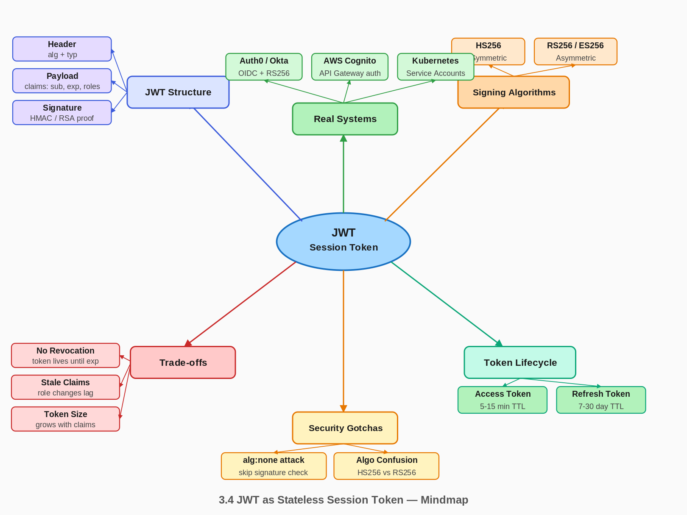

# 3.4 JWT as Stateless Session Token

> **Topic:** Topic 3 — Stateless Services
> **Phase:** B — Scalability Branch
> **Date studied:** 2026-05-12

---

## 1. 🎯 Goal of This Subtopic

> *Why are you studying this? What should you be able to do after this session?*

- Be able to explain exactly what a JWT is, how its three-part structure works, and why it eliminates the need for a server-side session store — in under 60 seconds without notes.
- Understand the fundamental trade-off between JWT's statelessness (no lookup required, freely horizontally scalable) and its critical weakness (tokens cannot be revoked before expiry without reintroducing state).
- Identify when JWT is the right tool (stateless microservices, cross-domain auth, short-lived API tokens) versus when server-side sessions (Redis-backed) are safer (applications requiring instant revocation).
- Describe the secure token lifecycle: short-lived access tokens + long-lived refresh tokens, the refresh flow, and how to handle token rotation safely.

---

## 2. ✅ What Mastery Looks Like

> *Concrete, testable proof that you own this concept — not just familiarity.*

- [ ] Can decode a JWT by hand (base64url-decode each part) and explain what each field in the header, payload, and signature means, without looking at documentation.
- [ ] Can explain the exact steps a server performs to validate a JWT: decode → verify algorithm → verify signature → check `exp` → check `iss`/`aud` — and state what happens if any step fails.
- [ ] Can describe the `alg: none` attack, the algorithm confusion (HS256 vs RS256) attack, and explain why both require hardcoding the expected algorithm on the server to prevent.
- [ ] Can design a complete token lifecycle: issuance, short-lived access token, long-lived refresh token, rotation on refresh, revocation via denylist, and what to store where.
- [ ] Can articulate in a FAANG interview why JWT is preferred over Redis sessions for microservice-to-service auth, and why Redis sessions are preferred for web app user auth requiring instant logout.

> 💡 **Rule of thumb:** If you can teach it to someone else and field their follow-up questions, you've mastered it.

---

## 3. 🗓️ Study Phases to Achieve Mastery

> *A progressive plan from first exposure to interview-ready. Work through each phase in order. Don't move to the next until you can honestly tick every item.*

### Phase 1 — Acquire 📖 💪💪
*Goal: Read deeply enough that you could explain the concept without the doc.*

- [ ] Read **RFC 7519** — the JWT specification (jwt.io/introduction is a readable summary)
- [ ] Read **Auth0's "Introduction to JSON Web Tokens"** at jwt.io — interactive decoder, structure breakdown
- [ ] Read **OWASP JWT Security Cheat Sheet** — algorithm attacks, validation checklist
- [ ] Read through **Sections 5–9** (Core Definition → How It Works) carefully — don't skim
- [ ] Re-read the **Cheatsheet** (Section 4) and try to recite it from memory after

### Phase 2 — Consolidate ✍️ 💪💪💪
*Goal: Verify you can reproduce the knowledge in your own words without looking.*

- [ ] Close the doc — write out the **Core Definition** from memory, then compare
- [ ] Explain **First Principles** out loud without notes — what problem does this solve and why?
- [ ] Reconstruct the **How It Works** mechanics step by step from memory
- [ ] Restate each **Trade-off** row in your own words — if you can't explain the cost, you don't own it yet

### Phase 3 — Apply 🔧 💪💪💪💪
*Goal: Connect to real systems and simulate interview scenarios.*

- [ ] Go through **Real-World System Examples** (Section 10) — verify each claim independently and add anything missed to **My Notes**
- [ ] Practice the **Interview Application** (Section 12) out loud — say the trigger phrases and your response as if in a live interview
- [ ] Work through **Common Misconceptions** (Section 13) — for each, make sure you can explain *why* the misconception is wrong, not just that it is
- [ ] Trace the **Relationships to Other Concepts** (Section 14) — can you explain each connection without looking?

### Phase 4 — Validate 🧪 💪💪💪💪💪
*Goal: Confirm you actually own it, not just recognize it.*

- [ ] Answer every **Self-Check Quiz** question (Section 15) out loud without looking at your notes
- [ ] Recite the **Cheatsheet** (Section 4) from memory — if you can't, re-do Phase 2
- [ ] Tick off items in **What Mastery Looks Like** (Section 2) — only check a box if you can demonstrate it on demand, not just if it sounds familiar
- [ ] Teach this concept out loud to an imaginary interviewer for 2 minutes without hesitation or notes

---

## 4. 📋 Cheatsheet

> *Everything you need to recall this concept in 30 seconds — for quick review before an interview.*



```
ONE-LINER
  A JWT is a cryptographically signed, self-contained token that encodes user
  claims directly inside it — the server verifies the signature and trusts the
  claims without any database lookup, making it inherently stateless.

KEY PROPERTIES / RULES
  1. Structure: Header.Payload.Signature — all base64url-encoded, dot-separated.
     Payload is NOT encrypted — anyone can decode it. Never store secrets in it.
  2. Signature = HMAC-SHA256(base64url(header) + "." + base64url(payload), secret)
     for HS256, or RSA/ECDSA signature for RS256/ES256.
  3. Statelessness has a price: tokens CANNOT be revoked before expiry without
     a denylist — which reintroduces state. This is the core JWT trade-off.
  4. Access tokens: short-lived (5–15 min). Refresh tokens: long-lived (7–30 days),
     stored server-side for revocability.
  5. ALWAYS hardcode the expected algorithm on the server. Never trust the "alg"
     field in the token header — it's attacker-controlled input.

DECISION RULE
  Use JWT when: stateless microservice-to-service auth, cross-domain/cross-service
  tokens, short-lived API tokens, OAuth2 flows.
  Use Redis sessions when: web app user auth requiring instant logout/revocation,
  session data must be mutable server-side, or token size is a concern.

NUMBERS TO REMEMBER
  Typical access token TTL: 5–15 minutes
  Typical refresh token TTL: 7–30 days
  Typical JWT size: 200–400 bytes (grows with claims)
  HS256 secret key minimum: 256 bits (32 bytes)

GOTCHA TO NEVER FORGET
  The JWT header's "alg" field is attacker-controlled input. If your server
  accepts whatever algorithm the token claims, an attacker can set alg=none
  and forge any payload with no signature. Hardcode the expected algorithm.
```

---

## 5. 🧠 Core Definition

> *What is it, in one sentence?*

A JSON Web Token (JWT) is a compact, URL-safe string consisting of a base64url-encoded header, payload (claims), and cryptographic signature — allowing any party with the signing key (or the matching public key) to verify the token's authenticity and trust its contents without querying a central session store.

---

## 6. 📦 Core Concepts

> *The essential building blocks of this subtopic — the terms and ideas you must have solid before going deeper.*

### JWT Structure: Header.Payload.Signature

A JWT is three base64url-encoded JSON objects joined by dots: `xxxxx.yyyyy.zzzzz`. The **header** contains the token type (`"typ": "JWT"`) and signing algorithm (`"alg": "HS256"`). The **payload** contains claims — statements about the user and token metadata. The **signature** is the cryptographic proof that the header and payload haven't been tampered with. Critically, the payload is only encoded, not encrypted — decode it with any base64url decoder and the contents are plaintext. Never put secrets, passwords, or sensitive PII in a JWT payload.

### Claims: Standard and Custom

Claims are key-value pairs in the payload. Standard registered claims: `iss` (issuer — who created the token), `sub` (subject — who the token is about, typically a user ID), `exp` (expiration — Unix timestamp after which the token is invalid), `iat` (issued at), `aud` (audience — which service this token is intended for). Custom claims: `roles`, `email`, `tenant_id`, `permissions` — any business-specific data the consumer needs. Every claim adds bytes to the token, which rides every request. Keep payload lean: include only what is consumed on the critical path.

### Signing Algorithms: HS256 vs RS256/ES256

**HS256 (HMAC-SHA256):** Symmetric — the same secret key signs and verifies. Simple, fast, but requires the secret to be shared between the issuer and every verifier. If a microservice can verify, it can also forge. Appropriate when the auth server and all resource servers are fully trusted (e.g., internal services under your control).

**RS256 (RSA-SHA256) / ES256 (ECDSA):** Asymmetric — the auth server signs with a private key; resource servers verify with the public key. A resource server that can verify tokens cannot forge them. This is the correct choice for federated identity systems (OAuth2, OpenID Connect) where multiple independent services verify tokens. ES256 (ECDSA P-256) produces shorter signatures than RS256 for the same security level.

### Access Token + Refresh Token Pattern

A single long-lived JWT is a ticking time bomb: if stolen, it's valid until it expires. The production pattern uses two tokens. An **access token** is short-lived (5–15 min), included in every API request via `Authorization: Bearer <token>`, and fully stateless — it expires quickly enough that revocation is rarely needed. A **refresh token** is long-lived (7–30 days), stored securely (HTTP-only cookie or server-side), and traded to the auth server for a new access token when the current one expires. The refresh token CAN be revoked server-side, providing the revocability that access tokens lack.

### Token Revocation and the Stateless Paradox

The fundamental tension of JWTs: statelessness eliminates server lookups but also eliminates the ability to instantly invalidate a token. If a user's account is compromised or they log out, their JWT remains valid until `exp`. Solutions: (1) Short `exp` (5–15 min) — minimal window of compromise. (2) **Token denylist** in Redis — on logout/revoke, store the token's `jti` (JWT ID claim) in Redis with TTL matching the token's remaining lifetime. Every request checks the denylist. This reintroduces state but provides instant revocation. (3) **Token rotation** — on each refresh, issue a new refresh token and invalidate the old one; detect reuse of old refresh tokens as a compromise signal.

---

## 7. 🔍 First Principles — Why Does This Exist?

> *What fundamental problem does this concept solve? Why was it invented?*

HTTP is stateless — each request arrives with no memory of prior interactions. Web applications need to know who is making a request. The classic solution was server-side sessions: the server stores session data in memory (or Redis), issues a random session ID to the client, and looks up that ID on every subsequent request. This works well for a monolith or a small cluster sharing a session store, but it creates a significant problem at scale: every service needs access to the same session store. In a microservices architecture with dozens of independent services, every inter-service call would require a round-trip to a central session store — a latency tax, a single point of failure, and a tight coupling between every service and the auth infrastructure.

JWTs were designed to solve this by making the session data self-contained. Instead of issuing a random ID that must be looked up, the server issues a token that *contains* the session data (claims) and a cryptographic proof of authenticity (signature). Any service that knows the signing key (or has the public key) can verify the token and extract the claims locally — no network call, no shared infrastructure. The receiver simply checks the math: is the signature valid? Is the token expired? If yes to both, trust the claims.

This is why JWTs became the backbone of OAuth2 and OpenID Connect: a user authenticates once with an identity provider, receives a JWT, and that JWT can be used to authorize requests to dozens of independent resource servers without any of them needing to call back to the identity provider on every request. The cryptographic signature replaces the need for shared state.

---

## 8. 🗺️ Mental Models

> *Intuition frames that help you reason about this concept fast — especially under interview pressure.*

### Model 1: The Government-Issued ID Card

A JWT is like a government-issued identity card (passport, driver's license). The government (auth server) puts your name, photo, and permissions on it, then stamps it with an unforgeable seal (signature). Any border agent (resource server) can verify the card is genuine by checking the seal — without calling the government office. The card expires on a printed date; before then, it's valid even if the government would prefer to revoke it (e.g., if you're wanted). **Where the model breaks:** a physical ID can be reported stolen and border agents can be manually notified; a JWT cannot be "reported stolen" to resource servers without a centralized denylist (reintroducing the server-side state you were trying to avoid).

### Model 2: The Sealed Envelope with a Return Address

Imagine a sealed envelope. The sender writes claims inside, seals it with wax (signature), and hands it to the carrier. Any recipient can verify the wax seal is unbroken and belongs to the sender. They open the envelope and trust the contents. The envelope is self-contained — no phone call needed. But once sealed and delivered, you can't "unseal" all copies in transit. **Where the model breaks:** this model makes it clear why revocation is hard — you can't chase down an envelope already delivered. It also reveals why the payload is not secret: anyone can open the envelope and read it. The seal only proves authenticity, not confidentiality.

### Model 3: The Signed Cheque vs. Cash

A server-side session ID is like cash — it has value only because the bank (session store) says so. Without the bank, the cash is worthless paper. A JWT is like a signed cheque — it carries the payer's information and signature, and any bank with the right verification tools can honor it independently. Cash is instantly revocable (bank can freeze an account); a cheque can bounce (token expired) but can't be recalled once in circulation. **Where the model breaks:** cheques are singular; JWTs are copyable. Stealing a JWT is like photographing a cheque — the thief now has all the information needed to present it anywhere.

---

## 9. ⚙️ How It Works — Mechanics

> *Step-by-step or layered explanation of the internal mechanism.*

### Token Issuance (Login Flow)

1. User sends credentials (username + password) to the auth server via POST /login over HTTPS.
2. Auth server validates credentials against the user store (password hash comparison, MFA check, account status).
3. Auth server constructs the JWT payload: `{ "sub": "user-uuid-123", "iss": "https://auth.example.com", "aud": "https://api.example.com", "roles": ["user"], "iat": 1715510400, "exp": 1715511300, "jti": "unique-token-id-abc" }`.
4. Auth server creates the JWT: `base64url(header) + "." + base64url(payload)` → sign with secret/private key → append `.` + `base64url(signature)`.
5. Auth server returns: `{ "access_token": "<jwt>", "refresh_token": "<opaque-token>", "expires_in": 900 }`.
6. Client stores access token in memory (NOT localStorage — XSS vulnerable); refresh token in HTTP-only, Secure, SameSite=Strict cookie.

### Token Validation (Request Flow)

Every subsequent API request includes: `Authorization: Bearer <access_token>`.

The resource server validates in this exact order (fail fast at each step):
1. **Parse** — split on `.`, check exactly three parts.
2. **Algorithm check** — decode the header, verify `alg` matches the hardcoded expected algorithm (e.g., `RS256`). Reject if mismatch or `none`.
3. **Signature verification** — recompute the signature from `header.payload` + key; compare to the token's signature. Reject if not equal.
4. **Expiry check** — verify `exp > now`. Reject if expired. Apply a small clock skew tolerance (~30 seconds) for distributed clock drift.
5. **Claims validation** — verify `iss` matches expected issuer; verify `aud` includes this service's identifier; check any custom claims required by the endpoint.
6. **Denylist check** (optional) — look up `jti` in Redis denylist. Reject if present.
7. **Trust and process** — extract `sub`, `roles`, and any other needed claims; proceed with request authorization.

### Token Refresh Flow

1. Client detects access token is expired (either from `exp` claim or a 401 response).
2. Client sends refresh token (via HTTP-only cookie) to `POST /auth/refresh`.
3. Auth server validates the refresh token: looks it up in its store, checks it's not revoked, checks user account is still active.
4. Auth server issues a new access token (and optionally a new refresh token — rotation).
5. Old refresh token is invalidated (rotation prevents replay attacks on stolen refresh tokens).
6. If the auth server sees a revoked refresh token being presented, it treats this as a compromise signal and revokes the entire token family.

### Key Rotation and JWKs

In RS256/ES256 flows, resource servers need the public key to verify tokens. The auth server publishes its public keys at a **JWKs endpoint** (`/.well-known/jwks.json`). Resource servers cache the JWKs with a TTL and refresh when they encounter a token signed with an unknown `kid` (key ID). This enables the auth server to rotate signing keys without downtime — old tokens remain valid until expiry (verified with the old public key), new tokens use the new key.

---

## 10. 🏭 Real-World System Examples

> *Where does this appear in production systems you know?*

| System | How This Concept Applies | Notes |
|--------|--------------------------|-------|
| **Auth0 / Okta** | Issues RS256-signed JWTs (ID tokens + access tokens) following OpenID Connect; publishes JWKs at `/.well-known/jwks.json` for resource servers to verify without calling Auth0 on each request | Access tokens are short-lived (default 24h in Auth0, should be tuned to 5–15 min for sensitive apps) |
| **AWS Cognito** | Issues JWTs for authenticated users; API Gateway and Lambda authorizers verify the JWT locally using Cognito's JWKs endpoint — no Cognito round-trip per request | Cognito uses RS256; `aud` claim must match your App Client ID |
| **GitHub API** | GitHub Apps use short-lived JWTs (10-min max, signed with RS256 private key) to authenticate to GitHub's API and obtain installation access tokens | JWTs here are app-to-API auth, not user session tokens |
| **Stripe** | Internal service-to-service auth uses JWTs to carry service identity and permissions across Stripe's microservices without a central session lookup | Not publicly documented, but standard practice for microservice auth at this scale |
| **Kubernetes** | Service account tokens in K8s are JWTs signed by the cluster's API server; pods present these tokens to authenticate to the API server and other services | TokenRequest API issues short-lived, audience-bound tokens (default 1h) instead of permanent tokens |

---

## 11. ⚖️ Trade-offs

> *Every design decision has a cost. What are you giving up?*

| ✅ Benefit | ❌ Cost / Limitation |
|-----------|---------------------|
| **No server-side lookup** — any service with the key validates locally; horizontally scalable auth with zero shared state | **Cannot revoke before expiry** — a stolen access token is valid until `exp`. The only mitigation (denylist) reintroduces server state |
| **Self-contained claims** — user roles, permissions, tenant ID travel with the token; resource servers don't need to call a user service on every request | **Claims become stale** — role changes, account suspension, or permission downgrades don't take effect until the token expires. A just-demoted admin retains admin access for up to `exp` |
| **Cross-domain and cross-service** — a JWT issued by one service is verifiable by any other service that has the public key; works across organizations in federated identity | **Token size grows with claims** — JWTs travel in every HTTP header. A token with many custom claims can reach 1–2 KB, adding measurable overhead on high-QPS paths |
| **Standard ecosystem** — OAuth2, OpenID Connect, SAML replacements all use JWTs; broad library support in every language | **Secret key compromise = all tokens forged** — with HS256, compromising the signing secret lets an attacker mint arbitrary tokens for any user. Key rotation requires careful orchestration |
| **Stateless by design** — auth servers can be scaled independently; no sticky sessions, no shared store between auth and resource servers | **Security footguns** — `alg: none`, algorithm confusion attacks, missing expiry validation, storing tokens in localStorage — many ways to misconfigure JWTs insecurely |

---

## 12. 🎯 Interview Application

> *How do you use this concept in a design interview? What triggers it?*

**When an interviewer asks / says:**
- "How does your API Gateway authenticate requests without hitting the database every time?"
- "How do microservices know who is making a request?"
- "Walk me through how authentication works when a user hits your service."
- "How do you handle auth in a distributed system at scale?"

**What you say / do:**
In the high-level design, when you draw the request path from client through API Gateway to microservices, explicitly call out the auth mechanism. Say: "The auth service issues a short-lived JWT on login. The API Gateway validates the JWT locally using the shared signing key — no round-trip to the auth service on every request. The JWT's payload carries the user ID and roles, so downstream services can make authorization decisions from the token alone." Then immediately volunteer the trade-off: "The cost is that we can't instantly revoke tokens, so we use a 15-minute access token TTL and a Redis-backed refresh token for controllable logout." This shows you know the full picture, not just the happy path.

**The trade-off statement (memorize this pattern):**
> "If we use JWTs, we get stateless, horizontally scalable auth with no session store lookups — but we pay with the inability to revoke tokens before expiry. For this system, JWTs are the right call because our 15-minute TTL limits the blast radius of a stolen token, and we pair them with server-side refresh tokens for proper revocation on logout or compromise."

---

## 13. ⚠️ Common Misconceptions & Gotchas

> *What do candidates get wrong? What nuance is the interviewer probing for?*

- ❌ **Misconception:** "JWTs are encrypted, so the payload is safe to store sensitive data."
  ✅ **Reality:** JWTs are base64url-*encoded*, not encrypted. The payload is trivially decodable by anyone — decode the middle segment and you get plaintext JSON. Never store passwords, SSNs, credit card numbers, or other sensitive data in a JWT payload. If confidentiality is required, use JWE (JSON Web Encryption) instead, but this is rarely needed in practice. Store only what is necessary for authorization decisions.

- ❌ **Misconception:** "Since JWTs are stateless, we never need to touch a database after login."
  ✅ **Reality:** Statelessness is an attribute of the *validation* step, not the entire auth system. You still need a database for: refresh token storage (to enable revocation), token denylist (for immediate revocation of access tokens), JWK endpoint backing (public key storage), and user account status checks if you need to block suspended users before token expiry. The "no database" claim applies only to individual access token verification.

- ❌ **Misconception:** "Setting `alg: HS256` in the header and signing with a secret key is secure."
  ✅ **Reality:** If your server reads the `alg` field from the incoming token and uses it to select the verification algorithm, an attacker can set `alg: none` and submit an unsigned token — your server will skip signature verification entirely. Worse, if you use an RS256 public key as an HS256 secret (the algorithm confusion attack), an attacker who knows your public key (which is public!) can forge tokens. The fix: hardcode the expected algorithm in your server-side verification code. Never trust the `alg` field from the token itself.

- ❌ **Misconception:** "JWTs are the best choice for all session management scenarios."
  ✅ **Reality:** For web apps where instant session revocation matters (financial apps, healthcare, any app with "log out all devices"), server-side sessions backed by Redis are safer. JWT's inability to revoke is a real operational limitation, not just a theoretical concern — if a user's device is stolen, you want their session gone *now*, not in 15 minutes. JWTs shine for service-to-service auth and OAuth2 flows where revocation is less critical and statelessness is paramount.

---

## 14. 🔗 Relationships to Other Concepts

> *How does this connect to adjacent subtopics in this topic or across the roadmap?*

- **Builds on:** **3.2 Session Management Approaches** (JWT is the token-based session alternative to server-side and cookie-based sessions — you need to understand why the alternatives fall short to appreciate what JWT solves) and **3.3 Externalizing State to Redis** (Redis is the alternative stateful session approach; JWT exists precisely to avoid needing Redis for auth on every request).
- **Enables:** **3.6 Share-Nothing Architecture** (JWT is the canonical mechanism for share-nothing auth — no shared session store between services) and **23.2 OAuth2 Authorization Code Flow** (OAuth2's `access_token` is almost universally a JWT in modern implementations; understanding JWT is prerequisite to understanding OAuth2 deeply).
- **Tension with:** **23.3 JWT Security Pitfalls** (Topic 23 — Security). JWT's flexibility is also its danger: algorithm confusion, payload exposure, and revocation gaps are all live attack surfaces. The convenience of stateless auth comes with significant security responsibility that Redis sessions largely avoid by being server-side.

---

## 15. 🧪 Self-Check Quiz

> *Can you answer these without looking? If not, you haven't internalized it yet.*

1. Decode this by hand: what is in each part of `eyJhbGciOiJIUzI1NiIsInR5cCI6IkpXVCJ9.eyJzdWIiOiJ1c2VyLTEyMyIsInJvbGVzIjpbImFkbWluIl0sImV4cCI6MTcxNTUxMTMwMH0.<signature>`? What does `exp: 1715511300` mean and how does the server use it?

   > 💡 *Think through your answer before expanding — if you hesitate, revisit Section 6 (JWT Structure) and Section 9 (Validation flow).*

2. A user logs out of your application. Their JWT has 12 minutes remaining until expiry. How do you ensure they cannot use that token to access protected resources after logout?

   > 💡 *Think through your answer before expanding — if you hesitate, revisit Section 6 (Token Revocation) and Section 9 (Denylist).*

3. An attacker intercepts a JWT and modifies the payload to change their `roles` from `["user"]` to `["admin"]`. Does this work? Why or why not? What specifically prevents it?

   > 💡 *Think through your answer before expanding — if you hesitate, revisit Section 9 (Validation step 3 — signature verification).*

4. Your company uses JWTs for microservice auth. Should you use HS256 or RS256? What is the concrete risk of using HS256 when a new third-party partner needs to verify your tokens?

   > 💡 *Think through your answer before expanding — if you hesitate, revisit Section 6 (HS256 vs RS256) and Section 10 (Real-World Examples).*

5. A JWT is issued with a `roles: ["admin"]` claim. Two minutes later, you demote the user from admin to regular user in your database. The JWT has 13 minutes of remaining lifetime. What access does the demoted user have during those 13 minutes, and what are your options to prevent it?

   > 💡 *Think through your answer before expanding — if you hesitate, revisit Section 11 (Trade-offs — claims become stale) and Section 13 (Misconceptions).*

---

## 16. 📚 Further Reading

> *Optional: links, chapters, or resources for deeper understanding.*

- [ ] **RFC 7519** — the official JWT specification; read the claims registry and security considerations section at minimum (tools.ietf.org/html/rfc7519)
- [ ] **jwt.io** — Auth0's interactive JWT introduction and decoder; use the decoder to inspect real tokens from live systems you work with
- [ ] **OWASP JWT Security Cheat Sheet** — canonical reference for all known attack vectors and validation requirements (cheatsheetseries.owasp.org/cheatsheets/JSON_Web_Token_for_Java_Cheat_Sheet.html)
- [ ] **"Critical vulnerabilities in JSON Web Token libraries"** — Tim McLean's 2015 blog post revealing the `alg: none` and algorithm confusion attacks; foundational for understanding why algorithm hardcoding is mandatory (auth0.com/blog/critical-vulnerabilities-in-json-web-token-libraries)
- [ ] **ByteByteGo — "Session vs Token Authentication"** — visual walkthrough contrasting server-side sessions and JWTs, with diagrams of the refresh token flow

---

## 17. ✍️ My Notes

> *Personal observations, things that confused me, analogies that helped.*
