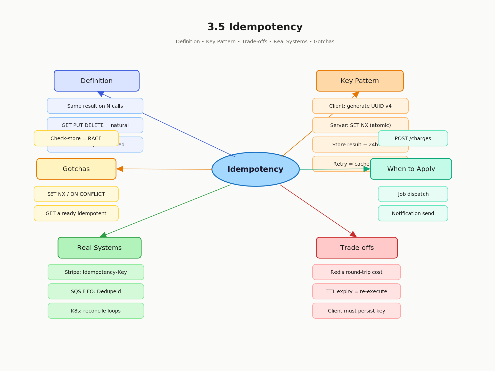

# 3.5 Idempotency — Definition, Importance, and Design Patterns

> **Topic:** Topic 3 — Stateless Services
> **Phase:** B — Scalability Branch
> **Date studied:** 2026-05-13

---

## 1. 🎯 Goal of This Subtopic

> *Why are you studying this? What should you be able to do after this session?*

- Be able to define idempotency precisely and classify any operation as idempotent or non-idempotent on demand.
- Be able to design an idempotency key pattern that makes a non-idempotent API safe to retry, and explain the exact server-side storage and lookup logic required.
- Understand why idempotency is the foundational contract that makes distributed retries, at-least-once delivery, and stateless services safe — and identify which interview scenarios require it.

---

## 2. ✅ What Mastery Looks Like

> *Concrete, testable proof that you own this concept — not just familiarity.*

- [x] Can define idempotency in one sentence and give two idempotent and two non-idempotent HTTP API examples without hesitation.
- [x] Can design an idempotency key scheme end-to-end: key generation, storage (Redis or DB), lookup logic, TTL, and failure scenarios.
- [x] Can explain why at-least-once delivery requires idempotent consumers and describe what breaks if the consumer is not idempotent.
- [x] Can identify in a system design interview when idempotency is required (payment, job dispatch, notification send) and articulate the exact design pattern to apply.
- [x] Can explain the difference between idempotency and immutability, and why idempotency does not mean "no side effects ever" but "same effect regardless of repeat."

> 💡 **Rule of thumb:** If you can teach it to someone else and field their follow-up questions, you've mastered it.

---

## 3. 🗓️ Study Phases to Achieve Mastery

> *A progressive plan from first exposure to interview-ready. Work through each phase in order. Don't move to the next until you can honestly tick every item.*

### Phase 1 — Acquire 📖 💪💪
*Goal: Read deeply enough that you could explain the concept without the doc.*

- [ ] Read **Designing Data-Intensive Applications** (Kleppmann) — Chapter 11, "The Trouble with Distributed Systems," section on idempotent operations
- [ ] Read **AWS Builder's Library: Making Retries Safe with Idempotent APIs** — https://aws.amazon.com/builders-library/making-retries-safe-with-idempotent-apis/
- [ ] Read **Stripe Engineering Blog: Idempotent Requests** — https://stripe.com/docs/api/idempotent_requests
- [ ] Read through **Sections 5–9** (Core Definition → How It Works) carefully — don't skim
- [ ] Re-read the **Cheatsheet** (Section 4) and try to recite it from memory after

### Phase 2 — Consolidate ✍️ 💪💪💪
*Goal: Verify you can reproduce the knowledge in your own words without looking.*

- [ ] Close the doc — write out the **Core Definition** from memory, then compare
- [ ] Explain **First Principles** out loud without notes — what problem does this solve and why?
- [ ] Reconstruct the **How It Works** mechanics step by step from memory
- [ ] Restate each **Trade-off** row in your own words — if you can't explain the cost, you don't own it yet

### Phase 3 — Apply 🔧 💪💪💪💪
*Goal: Connect to real systems and simulate interview scenarios.*

- [ ] Go through **Real-World System Examples** (Section 10) — verify each claim independently and add anything missed to **My Notes**
- [ ] Practice the **Interview Application** (Section 12) out loud — say the trigger phrases and your response as if in a live interview
- [ ] Work through **Common Misconceptions** (Section 13) — for each, make sure you can explain *why* the misconception is wrong, not just that it is
- [ ] Trace the **Relationships to Other Concepts** (Section 14) — can you explain each connection without looking?

### Phase 4 — Validate 🧪 💪💪💪💪💪
*Goal: Confirm you actually own it, not just recognize it.*

- [ ] Answer every **Self-Check Quiz** question (Section 15) out loud without looking at your notes
- [ ] Recite the **Cheatsheet** (Section 4) from memory — if you can't, re-do Phase 2
- [ ] Tick off items in **What Mastery Looks Like** (Section 2) — only check a box if you can demonstrate it on demand, not just if it sounds familiar
- [ ] Teach this concept out loud to an imaginary interviewer for 2 minutes without hesitation or notes

---

## 4. 📋 Cheatsheet

> *Everything you need to recall this concept in 30 seconds — for quick review before an interview.*



```
ONE-LINER
  An operation is idempotent if executing it N times produces the same result
  as executing it once — no additional side effects on repeat.

KEY PROPERTIES / RULES
  1. HTTP idempotent by spec: GET, PUT, DELETE, HEAD, OPTIONS.
     HTTP NOT idempotent by spec: POST, PATCH.
  2. Idempotency key = client-generated unique ID sent with every request;
     server stores result on first execution and returns it on retries.
  3. Key storage must be atomic with the operation — use transactions or
     conditional writes (SET NX) to avoid race conditions on concurrent retries.
  4. TTL on the key controls how long deduplication is honoured (e.g. 24h).
  5. Idempotency does NOT mean no side effects — it means same effect on repeats.

DECISION RULE
  Add idempotency key when: operation has side effects AND can be retried
    (payment charge, job dispatch, notification send, inventory deduction).
  Skip idempotency key when: operation is naturally idempotent (GET, PUT
    with full replacement) or side effects on retry are acceptable.

NUMBERS / FORMULAS
  Idempotency key storage: ~100 bytes per key × retention window.
  Typical TTL: 24 hours (Stripe) to 7 days depending on retry window.
  Key format: UUID v4 or ULID (time-sortable) generated client-side.

GOTCHA TO NEVER FORGET
  Storing the key AFTER the operation is a race — always check-then-execute
  atomically, or you get double execution between the check and the store.
```

---

## 5. 🧠 Core Definition

> *What is it, in one sentence?*

Idempotency is the property of an operation whereby executing it multiple times with the same input produces exactly the same outcome as executing it once — subsequent calls are no-ops with respect to state change.

An idempotency key is the mechanism that imposes this property on operations that are not naturally idempotent: the server deduplicates requests by key and replays the stored response for retries rather than re-executing the operation.

---

## 6. 📦 Core Concepts

> *The essential building blocks of this subtopic — the terms and ideas you must have solid before going deeper.*

### Natural vs. Enforced Idempotency

Some operations are idempotent by their mathematical nature: `PUT /users/42 { name: "Alice" }` can be called 100 times and the user's name is still "Alice" after all 100 calls — the 99 repeats are no-ops. Others are not: `POST /charges { amount: 100 }` will create 100 charges if called 100 times. Enforced idempotency is the design pattern of attaching an idempotency key to make the latter behave like the former.

### Idempotency Key

A client-generated unique token (UUID v4 or ULID) that the client includes in every request for the same logical operation. The server uses this key to look up whether it has already processed this request. If yes, it returns the cached response. If no, it executes and stores the result atomically. The key is the client's identity claim for "this is the same request I sent before, not a new one."

### At-Least-Once Delivery and Idempotent Consumers

Message queues (SQS, Kafka) and retry logic in distributed systems guarantee at-least-once delivery — meaning a message may be delivered more than once due to network timeouts or worker crashes. Any consumer of such a queue must be idempotent: processing the same message twice must not produce double the effect. This is the reason idempotency is not optional in distributed architectures — it is the contract that makes retries safe.

### Conditional Writes and Check-Then-Act Atomicity

The idempotency check-and-store must be atomic. If you check whether a key exists, then execute the operation, then store the result — another concurrent request with the same key can slip in between the check and the store, causing double execution. Redis `SET NX` (set-if-not-exists) or database `INSERT ... ON CONFLICT DO NOTHING` provide the atomic primitive needed to prevent this.

### Idempotency vs. Immutability vs. Purity

These three terms are often confused. Immutability means data never changes. Purity means no side effects at all (pure function). Idempotency means side effects happen exactly once regardless of retries. A payment charge is not immutable (it creates state) and not pure (it has side effects), but it can be idempotent if protected by a key.

---

## 7. 🔍 First Principles — Why Does This Exist?

> *What fundamental problem does this concept solve? Why was it invented?*

Networks are unreliable. A client sends a `POST /charges` request to a payment service. The server processes the charge, debits the user's card, and sends back a `200 OK` — but the response packet is lost. The client times out waiting and, following the only safe rule it knows ("if you don't get a response, retry"), sends the same request again. Now the user is charged twice.

This is the fundamental problem: **the client cannot distinguish between a request that never arrived and a response that was lost in transit**. Both look identical from the client's perspective — silence. So retrying is always the right strategy for the client, but retrying non-idempotent operations is catastrophic.

Before idempotency keys existed, the only options were: never retry (accept data loss), or accept double-processing (accept correctness bugs). Neither is acceptable for financial systems. Idempotency keys solved this by making the server responsible for deduplication — the client retries freely, and the server ensures the operation executes exactly once, regardless of how many times the client asks.

---

## 8. 🗺️ Mental Models

> *Intuition frames that help you reason about this concept fast — especially under interview pressure.*

### Model 1: The Light Switch vs. The Doorbell

A light switch is idempotent: flipping it to "ON" when it is already ON does nothing — same state results. A doorbell is not idempotent: pressing it three times rings three times. Most side-effecting APIs are doorbells by default. An idempotency key converts your doorbell into a light switch — the server checks "was this bell already rung?" before ringing. This model breaks down when you consider that the check itself requires storage and atomicity — the "already rung" memory has to be persisted somewhere.

### Model 2: The Post Office Certified Mail Receipt

When you send certified mail, the post office gives you a tracking number. If your package appears to get lost, you call and ask "what happened to tracking number 12345?" — you don't send a second package with a new tracking number. The tracking number is the idempotency key. The post office uses it to look up what happened and tell you the result, never delivering a second package for the same tracking number. This model highlights the key insight: the key is the client's unique identifier for a specific logical transaction, not for the HTTP request.

### Model 3: Retry = Replay, Not New Request

The mental shift required is: a retry is not a new request, it is a replay of the same request. Once you internalize this, the design follows naturally: you need to store the result of the first execution so you can replay it. The key is just the lookup index. The storage TTL defines how long you're willing to store results for replay. The client must generate the key before the first attempt — if it generates a new key on retry, it defeats the entire mechanism.

---

## 9. ⚙️ How It Works — Mechanics

> *Step-by-step or layered explanation of the internal mechanism.*

**Happy path — first request:**

1. Client generates a UUID v4 idempotency key (e.g. `idem-key: a3f9b2c1-...`) before making the request.
2. Client sends `POST /charges` with the idempotency key in the request header.
3. Server receives the request and performs an atomic check: `SET NX idem:a3f9b2c1 "processing" EX 86400` in Redis.
4. If the key does not exist (first time seen), the SET succeeds. Server proceeds to execute the charge.
5. Server executes the business logic (debits the card via payment gateway).
6. Server stores the result: `SET idem:a3f9b2c1 <serialized_response> EX 86400` (overwrites the "processing" sentinel).
7. Server returns `201 Created` with charge details to the client.

**Retry path — response was lost:**

1. Client times out and retries the same request with the **same idempotency key** (`idem-key: a3f9b2c1-...`).
2. Server attempts `SET NX idem:a3f9b2c1 "processing" EX 86400` — this fails because the key already exists.
3. Server reads the stored result for key `a3f9b2c1`.
4. If result is the serialized response (not "processing"), server returns it immediately — no charge is executed again.
5. Client receives the same `201 Created` response as if it had succeeded the first time.

**Concurrent retry path — two retries arrive simultaneously:**

1. Two requests with the same key arrive at the same instant on different servers.
2. Both attempt `SET NX idem:a3f9b2c1 "processing"`. Redis processes these atomically — only one wins.
3. The winner proceeds to execute. The loser sees the key exists, polls until the value changes from "processing" to a result, then returns the result.
4. One charge is executed. Both clients receive the same response.

**Key failure edge case — server crashes between execute and store:**

If the server executes the charge but crashes before storing the result, the key is either absent or stuck at "processing" with a TTL. On retry, the next server will attempt to execute again. For truly critical operations (payments), this is addressed by making the charge itself idempotent at the payment gateway level (Stripe's own idempotency keys), so that even a re-execution is deduplicated downstream.

**Key parameters to size:**
- TTL: 24 hours is Stripe's standard; match to your retry window plus a buffer.
- Key storage: Redis is standard for high-throughput; a UNIQUE constraint in a relational DB works for lower volume with transactional guarantees.
- Key format: UUID v4 (client-generated) or ULID (time-ordered, useful for debugging).

---

## 10. 🏭 Real-World System Examples

> *Where does this appear in production systems you know?*

| System | How This Concept Applies | Notes |
|--------|--------------------------|-------|
| Stripe Payments API | Every write endpoint accepts `Idempotency-Key` header; Stripe stores results for 24 hours and replays them on retry | Industry gold standard; key must be unique per logical request, not per HTTP call |
| AWS SQS | At-least-once delivery guarantee means consumers must be idempotent; SQS FIFO queues add exactly-once processing for short windows | Exactly-once in FIFO is best-effort over 5-minute deduplication window using `MessageDeduplicationId` |
| Kubernetes Controllers | All controllers are written as reconciliation loops that are fully idempotent — "apply desired state" can be called repeatedly without harm | This is why `kubectl apply` is safe to run multiple times; the controller checks current state before acting |
| Twilio SMS / Notification APIs | Accept idempotency keys to prevent double-sends when network timeouts cause client retries | Critical because double-sending an SMS or push notification is a visible user-facing bug |
| Apache Kafka Consumers | Consumer offset commit pattern: read message, process idempotently, commit offset. If crash before commit, message is redelivered; idempotent consumer handles this safely | Kafka's transactional producer provides exactly-once semantics on the producer side |

---

## 11. ⚖️ Trade-offs

> *Every design decision has a cost. What are you giving up?*

| ✅ Benefit | ❌ Cost / Limitation |
|-----------|---------------------|
| Safe retries in the face of network timeouts and partial failures | Extra storage required for key-result pairs; must size TTL correctly |
| Prevents duplicate charges, double-sends, and double job dispatch | Key storage must be atomic with execution — adds latency and a Redis/DB dependency on the write path |
| Enables at-least-once delivery patterns without correctness bugs | Client must generate and persist the key before the first attempt; stateless clients need to store it somewhere |
| Decouples client retry logic from server business logic | TTL expiry means retries after the window are treated as new requests — client must not retry indefinitely |
| Composable with exponential backoff — retry as aggressively as needed | Idempotency only covers exact replays of the same key — it does NOT handle concurrent different requests for the same resource (use optimistic locking for that) |

---

## 12. 🎯 Interview Application

> *How do you use this concept in a design interview? What triggers it?*

**When an interviewer asks / says:**
- "How would you make sure a payment isn't charged twice if the client retries?"
- "Our service uses a message queue — how do you handle duplicate messages?"
- "The client might not know if the request succeeded — what do you do?"
- "How do you make your API safe to retry without side effects?"

**What you say / do:**
Raise idempotency during the API design or reliability deep-dive phase. Say: "Any endpoint with side effects that clients might retry needs an idempotency key. Here's how I'd design it..." Then walk through key generation, server-side storage, atomic check-and-store, and TTL. Follow immediately by naming the storage backend (Redis SET NX for high throughput, or a UNIQUE DB column for lower volume with transactional needs).

**The trade-off statement (memorize this pattern):**
> "If we add idempotency keys, we get safe retries with no double execution, but we pay the cost of a Redis lookup on every write request and a storage dependency. For a payment API, this is non-negotiable — the alternative is double charges, which is worse than any latency penalty."

---

## 13. ⚠️ Common Misconceptions & Gotchas

> *What do candidates get wrong? What nuance is the interviewer probing for?*

- ❌ **Misconception:** GET requests need idempotency keys because reads matter too.
  ✅ **Reality:** GET is already idempotent by HTTP spec — calling it 100 times returns the same data (assuming no state change in between). Idempotency keys are only needed for side-effecting writes that are not naturally idempotent (POST, PATCH).

- ❌ **Misconception:** Idempotency means the operation has no side effects.
  ✅ **Reality:** Idempotency means the side effect happens exactly once regardless of retries. A payment charge absolutely has a side effect (money moves) — it's just that the second call to the same key is a no-op, not that the first call was a no-op.

- ❌ **Misconception:** You can store the idempotency key after executing the operation to keep things simple.
  ✅ **Reality:** This creates a race condition. If two concurrent requests with the same key both read "key not found," both will execute. The check-and-store must be atomic — use Redis SET NX or a database UNIQUE constraint with `INSERT ... ON CONFLICT DO NOTHING`.

- ❌ **Misconception:** PUT is idempotent so it doesn't need any special handling.
  ✅ **Reality:** PUT is idempotent only if it is a full replacement. A partial update via PUT (or PATCH) may not be idempotent depending on the semantics. Also, `PUT /resource/new-id` that creates a new resource can have first-execution side effects — you may still want an idempotency key to handle the case where the creation succeeds but the response is lost.

---

## 14. 🔗 Relationships to Other Concepts

> *How does this connect to adjacent subtopics in this topic or across the roadmap?*

- **Builds on:** 3.1 Stateless vs. Stateful Architecture — idempotency is the mechanism that makes stateless retry safe; without it, retrying stateless services causes correctness bugs. Also builds on 3.3 Externalizing State to Redis — the idempotency key store is itself an externalized state pattern.
- **Enables:** 12.3 Delivery Guarantees (at-least-once + idempotent consumer = safe exactly-once semantics); 29.4 Idempotent Jobs (background job retries safe to dispatch); 38.7 Idempotency in Saga Steps (each Saga step must be idempotent so the orchestrator can safely retry on failure).
- **Tension with:** Performance — every idempotent write requires an extra round-trip to check the key store. This is in tension with low-latency write paths where you want to minimize hops. The mitigation is to use Redis pipelining or co-locate the key store lookup with the primary DB transaction.

---

## 15. 🧪 Self-Check Quiz

> *Can you answer these without looking? If not, you haven't internalized it yet.*

1. Define idempotency in one sentence. Then classify each of the following as idempotent or not: `GET /users/42`, `DELETE /users/42`, `POST /charges`, `PUT /users/42 { name: "Alice" }`, `PATCH /account { balance: balance - 10 }`.

Idempotency: the property of an operation whereby executing it multiple times
with the same input produces exactly the same result as executing it once —
subsequent calls are no-ops with respect to state change.

POST /charges          → NOT idempotent. Each call creates a new charge.
                         Server treats every POST as a new write operation.

DELETE /users/42       → Idempotent. First call deletes the user.
                         Subsequent calls find nothing — no state change.

PATCH /account         → NOT idempotent. Relative update (balance - 10)
{ balance: balance-10 }  subtracts 10 on every call. Result changes each time.

PUT /orders/99         → Idempotent. Full replacement to a known absolute value.
{ status: "shipped" }    Repeating it leaves status = "shipped" every time.

2. A client POSTs a payment request. The server processes the charge successfully but the response is dropped by the network. The client retries with the same idempotency key. Walk through exactly what the server does — step by step.

1. Retry arrives with same Idempotency-Key: a3f9b2c1-...
2. Server attempts SET NX idem:a3f9b2c1 "processing" — SET FAILS.
   Key already exists from the first execution.
3. Server reads the stored value for idem:a3f9b2c1.
4. Value is the serialized response (not "processing") —
   charge already completed.
5. Server returns the cached response immediately.
   No charge is executed again. Client receives identical
   201 Created as if the first response had arrived.

3. Why is it dangerous to check for the idempotency key, execute the operation, then store the key — in that order? What specific failure scenario does this create, and what primitive fixes it?

Problem: check-then-execute-then-store is three separate steps with gaps between them.
Two concurrent retries both check → both see "key not found" → both execute → double charge.

The race window is between the check and the store.
The check is not atomic with the store — another request slips in between.

Fix: Redis SET NX (set-if-not-exists).
     SET idem:key "processing" NX EX 86400

Redis processes SET NX atomically — only one caller wins.
The loser gets nil, reads "processing", polls until result appears, returns it.
No gap. No race. One execution guaranteed.

Alternative: database UNIQUE constraint with INSERT ... ON CONFLICT DO NOTHING —
same atomic guarantee for lower-throughput transactional needs.

4. Your Kafka consumer processes an order_placed event and sends a welcome email. The consumer crashes after sending but before committing the Kafka offset. The event is redelivered. What is the bug and how do you redesign the consumer to be idempotent?

Bug: consumer sends email, crashes before committing Kafka offset.
     Event is redelivered. Consumer has no memory of prior execution.
     Second email sent. User receives duplicate notification.

Fix:
1. Event payload must carry a stable business ID — e.g. order_id: "ord_abc123"
2. Before sending email, consumer checks dedup store:
     SET NX dedup:ord_abc123 "processed" EX 86400  (Redis)
     or INSERT ... ON CONFLICT DO NOTHING           (DB)
3. If SET wins  → send email → commit Kafka offset.
4. If SET fails → already processed → skip send → commit offset.

On redelivery: SET NX fails, email is skipped, offset committed. One email sent.

Key rule: deduplication lives at the consumer, before the side effect,
          keyed on a stable business ID from the event payload — not a
          Kafka-generated ID which may differ across redeliveries.

5. Two retries with the same idempotency key arrive simultaneously on two different servers. Walk through exactly what happens at the Redis layer and what each server does. What does the client receive?

1. Two retries with key a3f9b2c1 arrive simultaneously on Server A and Server B.
2. Both attempt: SET idem:a3f9b2c1 "processing" NX EX 86400
3. Redis processes both atomically — only one SET wins. The other gets nil.
4. WINNER (say Server A):
     - Proceeds to execute the charge.
     - Overwrites key: SET idem:a3f9b2c1 <response_json> EX 86400
     - Returns 201 Created to its client.
5. LOSER (Server B):
     - Got nil from Redis — key exists.
     - Reads idem:a3f9b2c1 → sees "processing".
     - Polls (short sleep + re-read) until value changes.
     - Once Server A writes the result, Server B reads it.
     - Returns same 201 Created to its client.
6. One charge executed. Both clients receive identical responses.

Critical detail: "processing" sentinel is what tells the loser
"someone is working on this — wait" vs "it's done — here's the result."
Without the sentinel, the loser might read a missing key mid-execution
and incorrectly conclude no one is handling it.

---

## 16. 📚 Further Reading

> *Optional: links, chapters, or resources for deeper understanding.*

- [ ] **Designing Data-Intensive Applications** (Kleppmann) — Chapter 11, "The Trouble with Distributed Systems," section on idempotent operations and retry safety
- [ ] **AWS Builder's Library: Making Retries Safe with Idempotent APIs** — https://aws.amazon.com/builders-library/making-retries-safe-with-idempotent-apis/
- [ ] **Stripe API Docs: Idempotent Requests** — https://stripe.com/docs/api/idempotent_requests (production-grade example with key lifecycle details)
- [ ] **Martin Fowler: Idempotent Receiver** (Enterprise Integration Patterns) — https://martinfowler.com/articles/patterns-of-distributed-systems/idempotent-receiver.html
- [ ] **ByteByteGo: Design Idempotent API** — https://blog.bytebytego.com/p/design-idempotent-api

---

## 17. ✍️ My Notes

> *Personal observations, things that confused me, analogies that helped.*

Idempotency means applying the same operation multiple times produces the same result as applying it once. Side effects from the first call are fine — repeated calls must not compound them.

Idempotent:   GET, PUT, DELETE, HEAD, OPTIONS
Non-idempotent: POST, PATCH*

PUT vs POST:
  PUT   → sets resource to exact state ("PUT /users/123 {name: Gary}")
          → calling twice = same final state = idempotent
  POST  → creates new resource each call ("POST /users")
          → calling twice = two users created = not idempotent

*PATCH is idempotent only if it sets absolute values
  ("set name to Gary" = idempotent)
  not if it applies relative changes
  ("increment counter by 1" = not idempotent)

Client side is responsible for generating the idempotent key and sends this key to server as part of the request.
Server will read the idempotent key and checks for any such key in a Redis storage. If key exists, do not perform any operation, return the cached prior response. If key missing, perform the operation as if first time receiving such request

When is idempotency needed?
- When a request is not idempotent, we need an idempotency key to ensure server does not execute the same operation twice due to network issues or packet losses. This is needed for critical operations like creating payment transactions or sending notifications

Two simultaneous identical requests both check Redis, both find the key missing, both execute — classic TOCTOU problem. This is the standard follow-up:
Problem: check-then-act is not atomic
  Request A: checks Redis → key missing
  Request B: checks Redis → key missing  (before A writes)
  Both execute → duplicate payment

Fix: Redis SET NX (set if not exists) — atomic check-and-set
  SET idempotency:{key} {response} NX EX {ttl}
  Only one request wins the SET NX → other gets back existing value

Typical TTL: 24h–7 days depending on operation criticality
After expiry: same key treated as new request