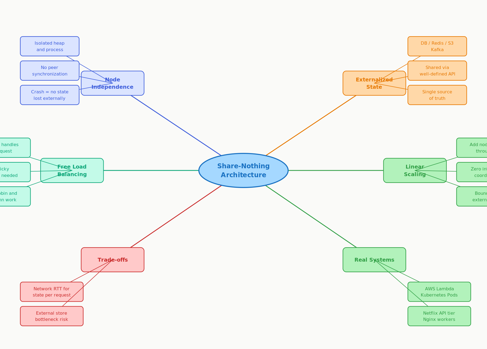

# 3.6 Share-Nothing Architecture

> **Topic:** Topic 3 — Stateless Services
> **Phase:** B — Scalability Branch
> **Date studied:** 2026-05-14

---

## 1. 🎯 Goal of This Subtopic

> *Why are you studying this? What should you be able to do after this session?*

Be able to explain why share-nothing architecture is the foundational principle that makes linear horizontal scaling possible — and identify exactly what "sharing" is forbidden. Understand how this principle connects stateless service design to load balancing, fault tolerance, and the deployment simplicity that enables modern cloud-native systems.

- Be able to define share-nothing precisely and identify what resources nodes are forbidden from sharing
- Be able to audit a given architecture and spot share-nothing violations (shared memory, shared disk, sticky sessions)
- Be able to refactor a shared-state design into a share-nothing one by externalizing state to Redis or a database
- Understand how share-nothing enables free load balancing, zero-downtime deployments, and fault isolation — and be able to explain this in an interview

---

## 2. ✅ What Mastery Looks Like

> *Concrete, testable proof that you own this concept — not just familiarity.*

- [ ] Can explain share-nothing in one sentence and correctly state what a node is forbidden from sharing with its peers
- [ ] Can identify share-nothing violations in a given architecture diagram and propose the correct externalization fix for each
- [ ] Can explain why share-nothing enables free load balancing while shared-state requires sticky sessions or replication
- [ ] Can name three real-world systems built on share-nothing and describe concretely how each applies it
- [ ] Can articulate the primary cost of share-nothing (external store latency and load) and the standard mitigation strategies

> 💡 **Rule of thumb:** If you can teach it to someone else and field their follow-up questions, you've mastered it.

---

## 3. 🗓️ Study Phases to Achieve Mastery

> *A progressive plan from first exposure to interview-ready. Work through each phase in order. Don't move to the next until you can honestly tick every item.*

### Phase 1 — Acquire 📖 💪💪
*Goal: Read deeply enough that you could explain the concept without the doc.*

- [ ] Read **Michael Stonebraker, "The Case for Shared Nothing" (1986)** — IEEE Database Engineering Bulletin (the original paper)
- [ ] Read **DDIA Ch. 1 — Reliable, Scalable, and Maintainable Applications** (Kleppmann) — covers scalability first principles
- [ ] Read **AWS Architecture Whitepaper — "Building Scalable, Reliable Applications"** (share-nothing patterns section)
- [ ] Read through **Sections 5–9** (Core Definition → How It Works) carefully — don't skim
- [ ] Re-read the **Cheatsheet** (Section 4) and try to recite it from memory after

### Phase 2 — Consolidate ✍️ 💪💪💪
*Goal: Verify you can reproduce the knowledge in your own words without looking.*

- [ ] Close the doc — write out the **Core Definition** from memory, then compare
- [ ] Explain **First Principles** out loud without notes — what problem does share-nothing solve and why did sticky sessions fail?
- [ ] Reconstruct the **How It Works** mechanics step by step from memory (happy path, failure, scale-out)
- [ ] Restate each **Trade-off** row in your own words — if you can't explain the cost, you don't own it yet

### Phase 3 — Apply 🔧 💪💪💪💪
*Goal: Connect to real systems and simulate interview scenarios.*

- [ ] Go through **Real-World System Examples** (Section 10) — verify each claim independently and add anything missed to **My Notes**
- [ ] Practice the **Interview Application** (Section 12) out loud — say the trigger phrases and your response as if in a live interview
- [ ] Work through **Common Misconceptions** (Section 13) — for each, make sure you can explain *why* the misconception is wrong, not just that it is
- [ ] Trace the **Relationships to Other Concepts** (Section 14) — can you explain each connection without looking?

### Phase 4 — Validate 🧪 💪💪💪💪💪
*Goal: Confirm you actually own it, not just recognize it.*

- [ ] Answer every **Self-Check Quiz** question (Section 15) out loud without looking at your notes
- [ ] Recite the **Cheatsheet** (Section 4) from memory — if you can't, re-do Phase 2
- [ ] Tick off items in **What Mastery Looks Like** (Section 2) — only check a box if you can demonstrate it on demand, not just if it sounds familiar
- [ ] Teach this concept out loud to an imaginary interviewer for 2 minutes without hesitation or notes

---

## 4. 📋 Cheatsheet

> *Everything you need to recall this concept in 30 seconds — for quick review before an interview.*



```
ONE-LINER
  In share-nothing, every node is fully independent — no shared memory, no shared disk,
  no in-process state. All coordination flows through an external store (DB, Redis, queue).

KEY PROPERTIES / RULES
  1. Each node owns only CPU + ephemeral local memory — nothing persists locally between requests.
  2. Any node can handle any request → load balancer routes freely, no sticky sessions needed.
  3. All persistent state lives in an external store: relational DB, Redis, S3, Kafka.
  4. Horizontal scale = add nodes. ~Linear throughput gain with zero inter-node coordination.
  5. "Nothing" = no in-process shared resources. The database IS the shared store — by design.

DECISION RULE
  Use when: you need elastic horizontal scaling and fault-tolerant stateless request handling.
  Avoid when: sub-millisecond shared-memory access is required (HPC, in-memory grids), or
  the state volume makes every request too expensive to deserialize from the external store.

NUMBERS TO REMEMBER
  Share-nothing: N nodes → ~N× throughput (bounded by external store capacity).
  Shared-state: adding node N requires state migration/replication — O(nodes) overhead.
  External store RTT: ~0.5–2 ms Redis, ~2–10 ms DB vs. ~50–100 ns in-process heap access.

GOTCHA TO NEVER FORGET
  "Share-nothing" does NOT mean "no shared database." Nodes share the DB — that's the point.
  The forbidden sharing is in-process: shared heap, shared disk mount, shared sockets.
```

---

## 5. 🧠 Core Definition

> *What is it, in one sentence?*

Share-nothing architecture is a distributed computing principle where each processing node is completely self-sufficient — it shares no memory, disk, or in-process state with any peer node — so that all coordination between nodes flows exclusively through an external store (database, cache, or message queue) that any node can access independently.

---

## 6. 📦 Core Concepts

> *The essential building blocks of this subtopic — the terms and ideas you must have solid before going deeper.*

### Node Independence
Each node runs in complete isolation with its own heap, stack, and ephemeral memory. It starts, processes a request using only locally computed results and data fetched from the external store, and returns a response — without any synchronization or communication with peer nodes. If the node crashes, no computation state is lost because nothing of value was stored in-process.

### Externalized State
Any data that must survive beyond a single request (user sessions, work-in-progress, shared counters, job state) must live in an external store — relational DB, Redis, S3, Kafka, or similar. The external store is the *only* shared resource in the system, and it is shared explicitly and intentionally through a well-defined interface that both sides can scale and optimize independently.

### Free Load Balancing
Because no node holds privileged or sticky state, the load balancer can route any request to any available node using any routing algorithm — round robin, least connections, IP hash, weighted, or random. There is no concept of "the user's server." This is the most operationally important benefit: failover, scaling, and rolling deployments are all simplified when any node is as good as any other.

### Linear Horizontal Scalability
Since nodes do not coordinate with each other, adding a new node does not require migrating state, re-partitioning data at the application tier, or notifying existing nodes of the new peer. The new node starts, connects to the external store, and begins serving requests immediately. Throughput scales linearly with the number of nodes — until the external store becomes the bottleneck.

### External Store as the Single Source of Truth
The external store IS the intentionally shared component. By concentrating all sharing into one well-defined component — the database or cache — you decouple the scaling of the compute tier from the scaling of the state tier. The DB can be independently replicated, sharded, or cached. This separation of concerns is the architectural payoff of share-nothing.

---

## 7. 🔍 First Principles — Why Does This Exist?

> *What fundamental problem does this concept solve? Why was it invented?*

Before share-nothing, the natural instinct was to store session and computation state in server memory — it is fast, it is close, and it is easy to program. The problem emerged at scale: when you have 3 servers, a user who logged in on server A holds their session in server A's heap. If the load balancer routes their next request to server B, server B has no idea who they are — authentication fails.

The "fixes" introduced new problems. **Sticky sessions** (pin each user to one server) meant the load balancer lost the freedom to redistribute load around failures — if server A dies, that user's session is gone. **Session replication** (copy session state to all peers) added O(N²) synchronization traffic as cluster size grew, and kept all nodes in consensus about every session — effectively turning the cluster into a distributed shared-memory system with all the associated coordination complexity.

Both approaches made horizontal scaling operationally painful and architecturally fragile. Michael Stonebraker articulated the share-nothing alternative in 1986: instead of replicating state across nodes, externalize it entirely. Move all state to a database that every node can access independently. The nodes then become identical and interchangeable — like CPUs in a processor — and adding a node is as simple as spinning up a new one and pointing it at the database. The database handles state; the nodes handle computation.

---

## 8. 🗺️ Mental Models

> *Intuition frames that help you reason about this concept fast — especially under interview pressure.*

### Model 1: The Restaurant Whiteboard
Imagine a busy restaurant where waiters take orders but instead of memorizing each table's order in their head, they always write it on a central whiteboard. Any waiter can serve any table at any time because the information is never locked inside one person's memory — it is on the board. Share-nothing works the same way: the "whiteboard" is the external database. Nodes are interchangeable waiters. *Breaks down when:* the whiteboard becomes the bottleneck — under high write load the DB slows down, and more waiters don't help if the board is always congested.

### Model 2: Identical Lego Bricks
In a share-nothing system, every application server is identical and interchangeable — like standard Lego bricks of the same type. You can add as many as you need to the pile and they snap together seamlessly. Compare to a hand-crafted piece where one node holds a unique shard of session data: that piece is irreplaceable and cannot be freely swapped. Share-nothing makes your servers *fungible* — operationally, this is the superpower. *Breaks down when:* the base plate (the external store) has a fixed size — you still need to scale the DB separately.

### Model 3: The Stateless Vending Machine
A vending machine does not care who was there before you. Drop in your money, make your selection, get your snack. No login required, no memory of prior customers, no affinity to a specific machine. Every node in a share-nothing system operates identically: receive request → fetch required state from external store → compute → write result back → return response → forget everything. The next request goes to whichever node is available. *Breaks down when:* fetching state from the external store on every request adds measurable latency — unlike a vending machine, the "snack inventory" is not in the machine, it is in a warehouse across the network.

---

## 9. ⚙️ How It Works — Mechanics

> *Step-by-step or layered explanation of the internal mechanism.*

**Happy Path — Normal Request**
1. Client sends an HTTP request to a load balancer.
2. Load balancer selects any available node (round robin, least connections, etc.).
3. Node receives the request and holds no prior context for this user.
4. Node reads required state from external store: `SELECT` from DB, `GET` from Redis, `GetObject` from S3.
5. Node executes business logic entirely in its own local memory using the fetched state.
6. Node writes any state changes to the external store: `UPDATE`/`INSERT` into DB, `SET` in Redis, `PutObject` to S3.
7. Node returns the HTTP response.
8. Node's local memory is garbage collected — no residue remains on the node.

**Failure Path — Node Crashes Mid-Request**
If a node crashes between step 4 and step 6 (after reading but before writing), the external store is unchanged (or the transaction is rolled back if using DB transactions). The client times out and retries. The load balancer routes the retry to any other available node. That node fetches state independently and processes the request. If the operation is idempotent, the retry is safe with no double-effect.

**Scale-Out Event — Adding a Node**
1. A new node is provisioned (container, VM, Lambda cold start).
2. The node starts its process — no data migration, no notification to peers.
3. The load balancer detects the new node passes health checks and adds it to the rotation.
4. The new node begins receiving requests immediately, reading state from the same external store as all other nodes.
5. The existing nodes are unaware of the addition — they continue operating identically.

**The Latency Cost**  
The critical trade-off: every state read and write now involves a network round-trip to the external store (~0.5–2 ms for Redis, ~2–10 ms for a DB, vs. ~50–100 ns for in-process heap access). For read-heavy workloads, this is mitigated with an in-process read cache (e.g., a local Redis replica or application-level LRU cache) backed by the authoritative external store. This introduces a cache invalidation problem — managing staleness requires TTL or pub/sub invalidation, which is the share-nothing trade-off manifesting in its full complexity.

---

## 10. 🏭 Real-World System Examples

> *Where does this appear in production systems you know?*

| System | How This Concept Applies | Notes |
|--------|--------------------------|-------|
| **AWS Lambda** | Each invocation is fully isolated — no shared memory between invocations or concurrent executions; persistent state must live in DynamoDB, S3, SQS, or other external stores | Pure share-nothing by construction — the execution environment is destroyed after each invocation |
| **Kubernetes Pods** | Pods are ephemeral and designed to be stateless; any pod replica can serve any request; persistent state is offloaded to PersistentVolumeClaims or external databases | Kubernetes pod scheduling assumes pods are interchangeable — share-nothing is the prerequisite for this assumption |
| **Netflix API Tier** | Stateless microservices behind load balancers; all session and user state in Cassandra, EVCache (Netflix's Memcached), and S3 | Netflix's "active-active" multi-region architecture is only possible because nodes share nothing locally; global state lives in geo-replicated stores |
| **Nginx / Apache Workers** | Each worker process handles requests independently with no inter-worker shared memory; sessions externalized to Redis or Memcached | The canonical web tier pattern — share-nothing at the web server level has been standard since the early 2000s |
| **Google App Engine (Standard)** | Stateless request handlers; all storage in Datastore, Cloud SQL, or GCS; no local file system writes allowed | App Engine enforces share-nothing at the platform level — writing to local disk is blocked, forcing externalization |

---

## 11. ⚖️ Trade-offs

> *Every design decision has a cost. What are you giving up?*

| ✅ Benefit | ❌ Cost / Limitation |
|-----------|---------------------|
| Linear horizontal scalability — add nodes, get proportional throughput increase | Every state read/write requires a network round-trip to the external store (0.5–10 ms vs. nanoseconds in-process) |
| Any node handles any request — load balancer routes freely without sticky sessions | External store becomes the new bottleneck under high write load — you've moved the scaling problem, not eliminated it |
| Fault isolation — crashing one node affects only its in-flight requests, no state is lost | Local computation context must be reconstructed from external state on every request — increases per-request work |
| Zero-downtime deployments — drain old nodes, add new ones; no session migration required | In-process caching to mitigate latency re-introduces cache invalidation complexity and potential stale reads |
| Identical, interchangeable nodes — operationally simple to monitor, replace, and debug | External store must itself be highly available and scalable — you now have a critical single dependency |

---

## 12. 🎯 Interview Application

> *How do you use this concept in a design interview? What triggers it?*

**When an interviewer asks / says:**
- "How would you scale this service to handle 10× the traffic?"
- "What happens to user sessions if a server crashes?"
- "How do you deploy a new version without downtime?"
- "Why doesn't adding more servers require migrating any data?"

**What you say / do:**
Introduce share-nothing during the high-level design or scalability deep-dive phase. State explicitly that each API server is stateless — it holds no in-process session data — and that all persistent state lives in Redis and the database. Then connect this to the load balancing freedom it enables: any server can handle any request, so scaling is purely additive. Name the external store you are using and why (Redis for sessions/hot data, DB for durable state, S3 for blobs).

**The trade-off statement (memorize this pattern):**
> "If we adopt share-nothing, we get linear horizontal scalability and simple failover — the load balancer can route any request to any node freely. We pay for this with a per-request round-trip to Redis or the database to fetch state. For a system like this where read latency is dominated by business logic rather than state fetch, that cost is well worth the operational simplicity."

---

## 13. ⚠️ Common Misconceptions & Gotchas

> *What do candidates get wrong? What nuance is the interviewer probing for?*

- ❌ **Misconception:** "Share-nothing means nodes don't share a database."
  ✅ **Reality:** The external database IS the shared resource — that is the entire design intent. "Share-nothing" forbids *in-process* sharing: shared heap, shared disk mount, shared sockets. The DB is shared explicitly through a well-defined interface, which is why each side can be scaled independently. Candidates who confuse this will propose over-partitioned designs that eliminate the shared DB entirely, creating coordination nightmares.

- ❌ **Misconception:** "Share-nothing eliminates all coordination overhead."
  ✅ **Reality:** Coordination moves from in-process (cheap in CPU cycles, expensive in scalability) to the external store (slower in network latency, but independently scalable). Under heavy write load, the external store becomes the bottleneck — share-nothing shifts the scaling constraint, it does not eliminate it. You still need to shard or scale the DB.

- ❌ **Misconception:** "Local in-process caching violates share-nothing."
  ✅ **Reality:** Local read caches are fully compatible with share-nothing as long as the cache is treated as a performance optimization, not as the authoritative source of truth. The external store remains authoritative; the local cache is a stale-tolerant read-through layer. Cache invalidation (TTL or pub/sub notification) is required, and the system must tolerate brief stale reads. What violates share-nothing is persisting authoritative state in the local process between requests.

- ❌ **Misconception:** "Share-nothing and stateless architecture are the same thing."
  ✅ **Reality:** Closely related but distinct. *Stateless* means a service holds no user session state between requests (typically enforced by JWT or externalized sessions). *Share-nothing* is the broader architectural principle that no in-process resources are shared between any nodes — this covers not just session state but also shared file descriptors, shared memory segments, and shared ephemeral disk. A service can be stateless (no sessions) but still share a mounted NFS volume with sibling processes, violating share-nothing.

---

## 14. 🔗 Relationships to Other Concepts

> *How does this connect to adjacent subtopics in this topic or across the roadmap?*

- **Builds on:** 3.1 Stateless vs. Stateful Architecture (share-nothing is the architectural operationalization of statelessness), 3.3 Externalizing State to Redis (the primary mechanism for achieving share-nothing compliance at the session and hot-data layer)
- **Enables:** 3.7 Horizontal Scaling of Stateless Tiers (share-nothing is the *prerequisite* for horizontal scaling — you cannot freely scale a tier that shares in-process state), Topic 4 Load Balancing (share-nothing is what makes any load balancing algorithm work correctly — without it, you need sticky sessions or session replication)
- **Tension with:** Topic 5.8 Multi-Level Caching — local in-process caches improve read performance significantly but introduce stale-read risk and invalidation complexity; maximizing share-nothing compliance (fetch from external store on every request) and maximizing cache performance are in direct tension

---

## 15. 🧪 Self-Check Quiz

> *Can you answer these without looking? If not, you haven't internalized it yet.*

1. Define "share-nothing architecture" in one sentence. What exactly is forbidden from being shared between nodes?

   > 💡 *Think through your answer before expanding — if you hesitate, revisit Section 5.*

Share-nothing architecture is an architecture is one where service nodes do not share memory or disk or any in-process data with each other. They are, however, allowed to coordinate with an external data store to write and retrieve session states required to perform a request.

2. A user's session token is stored in server memory on node A. When the load balancer routes their next request to node B, they are logged out. Is this a share-nothing violation? What specifically do you externalize, and where?

   > 💡 *Think through your answer before expanding — if you hesitate, revisit Sections 5 and 6.*

The share-nothing principle is violated. Node A stored session state in-process — in its own heap — rather than in the external store. Node B has no access to node A's memory, so it cannot reconstruct the session. Fix: externalize the session to Redis. Every node reads and writes session state exclusively through the external store. Any node can now serve any user's request because the state is never tied to a specific node.

3. What is the primary performance cost of share-nothing architecture, and what is the standard mitigation? What new problem does that mitigation introduce?

   > 💡 *Think through your answer before expanding — if you hesitate, revisit Sections 9 and 11.*

The primary cost is the network round-trip to the external store on every request — ~0.5–2ms for Redis, ~2–10ms for a DB, versus ~100ns for in-process memory access. The standard mitigation is a local in-process read cache on each node — frequently accessed data is served from local memory, skipping the round-trip. The problem this introduces is stale reads: the local cache may serve data that has since been updated in the external store by another node. Mitigation: TTL-based expiry or pub/sub invalidation to refresh the cache when the source of truth changes.

4. Name two real-world systems that exemplify share-nothing and describe concretely how each system enforces or relies on the principle.

   > 💡 *Think through your answer before expanding — if you hesitate, revisit Section 10.*

AWS Lambda: Each invocation runs in a fully isolated container with no shared memory between concurrent executions or across invocations. The execution environment is destroyed after each invocation. Any state that must persist — user data, job results, session info — must live in DynamoDB, S3, or SQS. Share-nothing is enforced by the platform, not by developer discipline.
Google App Engine: Request handlers are stateless by requirement. All storage routes through Datastore, Cloud SQL, or GCS. Local file system writes are blocked at the platform level — you cannot store anything in-process even if you try. Share-nothing is a structural constraint, not a guideline.

5. You have a share-nothing API tier with 5 nodes, all reading from a single PostgreSQL primary. You scale from 5 to 50 nodes. What breaks first, and how do you address it without violating share-nothing?

   > 💡 *Think through your answer before expanding — if you hesitate, revisit Sections 9 and 11.*

What breaks first is connection pool exhaustion and I/O saturation on the PostgreSQL primary — not a hardware failure. 50 nodes each maintaining multiple connections overwhelms Postgres's connection limit. Queries begin queuing, latency spikes, and eventually requests time out cascade-style across all nodes. The fix has two parts: read replicas to route all read traffic away from the primary (most workloads are 80–90% reads, so this immediately relieves the bottleneck), and PgBouncer in front of the primary to multiplex thousands of application connections into a smaller managed pool. Neither violates share-nothing — the external store is still the shared source of truth, it's now just a cluster rather than a single node.

---

## 16. 📚 Further Reading

> *Optional: links, chapters, or resources for deeper understanding.*

- [ ] **Michael Stonebraker, "The Case for Shared Nothing" (1986)** — IEEE Database Engineering Bulletin, Vol. 9, No. 1; the original paper that defined the concept
- [ ] **Designing Data-Intensive Applications (DDIA) — Chapter 1** (Kleppmann) — Reliability, Scalability, and Maintainability; covers scaling first principles including shared-nothing architecture
- [ ] **AWS Architecture Whitepaper — "Building Scalable, Reliable Applications"** — aws.amazon.com/architecture/; includes share-nothing patterns section
- [ ] **Martin Fowler: "Stateless"** — martinfowler.com; explains statelessness as the application-level expression of share-nothing
- [ ] **ByteByteGo: "How to Scale a Web Application"** — blog.bytebytego.com; practical walkthrough of scaling a web tier using share-nothing principles

---

## 17. ✍️ My Notes

> *Personal observations, things that confused me, analogies that helped.*

Share-nothing is an architecture in which app servers do not share any memory, disk or in-process states with their peers. As such, they are able to scale up/down based on traffic demand. All coordination flows through an external store.

Because any node can handle any request, load balancers can route requests freely to any node.

Use when: elastic horizaontal scaling and fault-tolerant stateless request handling are needed

Avoid when: sub-ms shared memory access is required(in memory grids)

Cost of share-nothing:
  - External store (Redis, DB) becomes the new bottleneck + SPOF
  - Every stateful operation = network hop to external store
  - External store must itself be HA (Sentinel/Cluster) — 
    you've moved the statefulness problem, not eliminated it
  - Coordination latency adds to p99 on every request

This is why Redis HA (3.3) and idempotency keys (3.5) 
exist — they're the operational cost of share-nothing.

Examples:
  - Stateless API servers (any web framework behind a LB)
  - AWS Lambda / serverless functions (share nothing by design)
  - Containerized microservices (each pod is ephemeral, stateless)
  - Kafka consumers in a consumer group (partitions, not shared state)