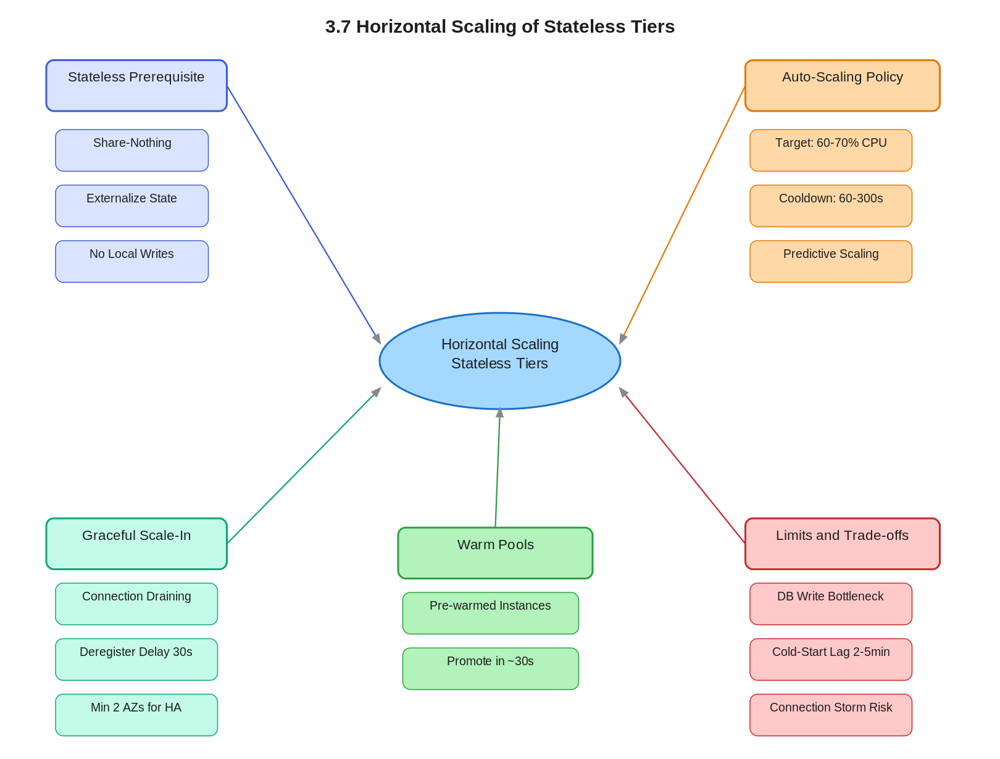

# 3.7 Horizontal Scaling of Stateless Tiers

> **Topic:** Topic 3 — Stateless Services
> **Phase:** B — Scalability Branch
> **Date studied:** 2026-05-14

---

## 1. 🎯 Goal of This Subtopic

> *Why are you studying this? What should you be able to do after this session?*

Be able to design a stateless tier that scales horizontally on demand — configuring auto-scaling triggers, load balancer integration, connection draining, and warm pool strategies. Understand *why* statelessness is the prerequisite for seamless horizontal scaling and be able to explain the operational mechanics to an interviewer at the infrastructure level. Identify where horizontal scaling breaks down (stateful dependencies, cold-start latency, thundering-herd on scale-out) and propose concrete mitigations.

---

## 2. ✅ What Mastery Looks Like

> *Concrete, testable proof that you own this concept — not just familiarity.*

- [ ] Can explain why a stateless service can be added or removed from a pool without coordination, while a stateful one cannot, in under 60 seconds with no notes
- [ ] Can specify the full auto-scaling policy for a stateless web tier: metric choice, scale-out threshold, scale-in threshold, cooldown period, and why each value matters
- [ ] Can describe connection draining (deregistration delay) and explain what breaks in its absence
- [ ] Can identify when horizontal scaling hits a wall (e.g., stateful downstream, shared write bottleneck) and propose the architectural fix
- [ ] Can compare manual scaling, scheduled scaling, and reactive/predictive auto-scaling and choose the right strategy for a given traffic pattern

> 💡 **Rule of thumb:** If you can teach it to someone else and field their follow-up questions, you've mastered it.

---

## 3. 🗓️ Study Phases to Achieve Mastery

> *A progressive plan from first exposure to interview-ready. Work through each phase in order. Don't move to the next until you can honestly tick every item.*

### Phase 1 — Acquire 📖 💪💪
*Goal: Read deeply enough that you could explain the concept without the doc.*

- [ ] Read **DDIA Chapter 1** (Reliable, Scalable, Maintainable) — Scalability section
- [ ] Read **AWS Auto Scaling documentation** — target tracking policies and warm pools
- [ ] Read **Google SRE Book Chapter 17** — "Testing for Reliability" has a section on load testing stateless tiers
- [ ] Read through **Sections 5–9** (Core Definition → How It Works) carefully — don't skim
- [ ] Re-read the **Cheatsheet** (Section 4) and try to recite it from memory after

### Phase 2 — Consolidate ✍️ 💪💪💪
*Goal: Verify you can reproduce the knowledge in your own words without looking.*

- [ ] Close the doc — write out the **Core Definition** from memory, then compare
- [ ] Explain **First Principles** out loud without notes — what problem does this solve and why?
- [ ] Reconstruct the **How It Works** mechanics step by step from memory
- [ ] Restate each **Trade-off** row in your own words — if you can't explain the cost, you don't own it yet

### Phase 3 — Apply 🔧 💪💪💪💪
*Goal: Connect to real systems and simulate interview scenarios.*

- [ ] Go through **Real-World System Examples** (Section 10) — verify each claim independently and add anything missed to **My Notes**
- [ ] Practice the **Interview Application** (Section 12) out loud — say the trigger phrases and your response as if in a live interview
- [ ] Work through **Common Misconceptions** (Section 13) — for each, make sure you can explain *why* the misconception is wrong, not just that it is
- [ ] Trace the **Relationships to Other Concepts** (Section 14) — can you explain each connection without looking?

### Phase 4 — Validate 🧪 💪💪💪💪💪
*Goal: Confirm you actually own it, not just recognize it.*

- [ ] Answer every **Self-Check Quiz** question (Section 15) out loud without looking at your notes
- [ ] Recite the **Cheatsheet** (Section 4) from memory — if you can't, re-do Phase 2
- [ ] Tick off items in **What Mastery Looks Like** (Section 2) — only check a box if you can demonstrate it on demand, not just if it sounds familiar
- [ ] Teach this concept out loud to an imaginary interviewer for 2 minutes without hesitation or notes

---

## 4. 📋 Cheatsheet

> *Everything you need to recall this concept in 30 seconds — for quick review before an interview.*



```
ONE-LINER
  Stateless tiers scale horizontally by adding/removing identical instances
  behind a load balancer, since no instance owns any state.

KEY PROPERTIES
  1. Statelessness first — all state in Redis/RDS/S3, never in-process
  2. Auto-scaling metric-driven (CPU target tracking preferred)
  3. Connection draining mandatory — lets in-flight requests finish (30-60s, match P99)
  4. Leave headroom — trigger at 60-70% CPU, not 80%+
  5. Share-nothing — any instance handles any request

DECISION RULE
  Use when: traffic variable/bursty, need HA, zero-downtime deploys
  Avoid when: bottleneck is stateful dependency, strong session affinity
              required, workload tightly coupled

NUMBERS
  CPU trigger: 60-70%
  Deregistration delay: 30-60s (match P99 response time)
  Min instances: 2 across AZs
  Cooldown: 60-300s
  Warm pool: ~30s vs 2-5min cold start

SCALE ASYMMETRY
  Scale-out: short evaluation window (fast reaction)
  Scale-in: long evaluation window (avoids flapping)

HEALTH CHECK GATE
  2 consecutive passing checks → instance receives traffic
  (NOT 1 — prevents premature routing to booting instances)

GOTCHA 1
  Scaling stateless tier doesn't increase throughput if DB is the bottleneck —
  more connections, same limit. Fix: PgBouncer (multiplexing) + read replicas.

GOTCHA 2
  Oversized fleet = connection storm. 100 instances × 10 connections each
  = 1000 connections → PostgreSQL's default limit is 100.

```

---

## 5. 🧠 Core Definition

> *What is it, in one sentence?*

Horizontal scaling of a stateless tier is the practice of adding or removing identical, share-nothing application instances behind a load balancer to match traffic demand — made possible because no instance holds any state that would be lost on termination or require coordination on addition.

---

## 6. 📦 Core Concepts

> *The essential building blocks of this subtopic — the terms and ideas you must have solid before going deeper.*

### Share-Nothing Architecture
Each application instance reads from and writes to only external, shared stores (databases, caches, object stores). No instance holds in-memory session data, local file state, or anything that would make one instance different from another. This property is what makes instances interchangeable — you can kill any one of them without losing data, and you can add a new one that is immediately capable of handling any request.

### Auto-Scaling Groups (ASG)
An ASG is a managed pool of instances that automatically launches or terminates members based on CloudWatch (or equivalent) metrics. It enforces a minimum, desired, and maximum instance count and replaces unhealthy instances automatically. The ASG is the operational mechanism that turns "horizontal scaling is possible" (because services are stateless) into "horizontal scaling happens automatically."

### Scaling Policies — Reactive vs. Predictive
Reactive (target tracking) scaling adjusts instance count when a live metric (CPU, RPS, queue depth) crosses a threshold. It is simple but has a lag of 2–5 minutes while new instances boot and warm up. Predictive scaling uses historical patterns to pre-launch instances before the traffic spike arrives — critical for workloads with known daily or weekly peaks (e.g., e-commerce at 9am). Scheduled scaling is the simplest form of predictive: "add 10 instances every weekday at 8:45am."

### Connection Draining (Deregistration Delay)
When an instance is marked for termination or health-check failure, the load balancer stops sending new requests to it but continues routing existing in-flight requests until they complete or the deregistration timeout expires (typically 30–300s). Without draining, in-flight requests are dropped mid-response, causing client-visible errors. This is mandatory for any API that has non-trivial request duration.

### Warm Pools
A warm pool is a set of pre-launched, pre-warmed instances that sit idle (or process background work) outside the active load-balancer pool. When the ASG scales out, it promotes instances from the warm pool into service in seconds — avoiding the 2–5 minute cold-start delay of launching from scratch. This is the primary mitigation for the cold-start latency problem in reactive auto-scaling.

### Capacity Headroom and Cooldown
Scaling triggers should be set well below saturation (CPU target ~60–70%, not 90%) to ensure headroom exists to absorb the spike before new instances come online. Cooldown periods (60–300s) prevent scale-flapping — without them, the system oscillates between scaling out and back in as the metric fluctuates around the threshold.

---

## 7. 🔍 First Principles — Why Does This Exist?

> *What fundamental problem does this concept solve? Why was it invented?*

Before stateless horizontal scaling, the dominant approach was vertical scaling: when traffic grew, you upgraded to a bigger server. This worked until it didn't — every machine has a ceiling (biggest EC2 instance, biggest RDS class), and at that ceiling you were stuck. Worse, vertical scaling required downtime to resize, so it couldn't respond to intra-day traffic spikes.

The root pain was that application servers were stateful by default: they stored HTTP sessions in memory, wrote temp files to local disk, and maintained sticky connections. If you added a second server, you had to either replicate that state (complex, error-prone) or force users to always hit the same server (sticky sessions — which broke failover). Neither scaled cleanly.

Horizontal scaling of stateless tiers exists because engineers realized: if you move all mutable state out of the application process and into dedicated stores (Redis for sessions, RDS for persistence, S3 for files), the application tier becomes a pure function — request in, response out. A pure function can run on any number of identical machines simultaneously with no coordination. This is the architectural unlock that made elastic, cloud-native scaling possible.

---

## 8. 🗺️ Mental Models

> *Intuition frames that help you reason about this concept fast — especially under interview pressure.*

### Model 1: The Vending Machine Fleet
Think of each stateless application instance as a vending machine. Every vending machine dispenses the same products (all state lives in the warehouse / external store). If demand at a location spikes, you drop in more vending machines — they don't need to "know about" each other, and removing one doesn't affect the others. The load balancer is the signage that routes customers to an available machine. This model breaks down when the "warehouse" (downstream DB) has a finite throughput limit — more vending machines can't help if the warehouse is the bottleneck.

### Model 2: The Scaling Runway
Imagine a horizontal scaling policy as an airport runway. The runway (capacity headroom) needs to exist *before* the plane (traffic spike) arrives. If you set your scale-out trigger at 90% CPU, you have almost no runway — by the time new instances come online, you've already crashed. Setting the trigger at 60–70% gives you 2–5 minutes of runway for new instances to boot and join the pool. Warm pools extend the runway further — instances are already at the runway (pre-warmed) and can immediately take traffic.

### Model 3: The Stateful Dependency Ceiling
Horizontal scaling of the stateless tier is bounded by the most-constrained stateful dependency downstream. Visualize it as a pipe: you can widen the front pipe (app tier) as much as you want, but if there's a narrower pipe further down (single-writer DB, single Redis leader), total throughput is still capped at the narrow pipe. This model reminds you to always ask "what does my app tier touch that is stateful, and what is its write throughput ceiling?" Scaling the app tier beyond that point adds cost and complexity with zero throughput gain.

---

## 9. ⚙️ How It Works — Mechanics

> *Step-by-step or layered explanation of the internal mechanism.*

**Normal path — scale-out:**

1. **Metric crosses threshold**: A CloudWatch alarm fires because average CPU across the ASG exceeds 65% for 2 consecutive minutes (2-minute evaluation period prevents false positives from momentary spikes).
2. **ASG calculates desired count**: The target tracking policy computes the new desired capacity: `new_desired = ceil(current_desired × (current_metric / target_metric))`. E.g., if CPU is 78% and target is 60%, `desired = ceil(3 × 78/60) = ceil(3.9) = 4`.
3. **Instance launch**: If a warm pool exists, an instance is promoted from warm state to active in ~30 seconds. Without a warm pool, a new EC2 instance boots from AMI — this takes 2–5 minutes including OS boot, application startup, and health check.
4. **Health check registration**: The load balancer health-checks the new instance (typically HTTP GET /health → 200). Only after passing N consecutive checks (e.g., 2 checks, 30s apart) does the LB send live traffic to it.
5. **Cooldown period**: The ASG waits 120–300s before evaluating the metric again to let the new instance absorb load and let the metric stabilize.

**Normal path — scale-in:**

1. **Metric drops below threshold**: Average CPU falls to 40% (below the target) for 5 consecutive minutes (scale-in has a longer evaluation to avoid removing capacity prematurely).
2. **ASG selects instance to terminate**: Termination policy picks an instance (default: oldest launch template first, then the instance closest to the next billing hour).
3. **Connection draining**: The load balancer deregisters the instance — no new requests are sent to it, but in-flight requests continue until completion or the deregistration timeout (30–60s for fast APIs, up to 300s for slow jobs).
4. **Termination**: After draining completes (or timeout), the instance is terminated. If warm pools are configured, the instance transitions to warm state instead of being terminated.

**Failure handling:**

- If an instance fails a health check, the LB removes it from rotation immediately (no draining — health failure means it likely can't finish requests anyway) and the ASG replaces it.
- If the ASG is at minimum capacity during scale-in, it will not reduce further — the floor is enforced.
- If a scale-out event is triggered while a cooldown is still active, the new alarm is typically suppressed (simple scaling) or processed at the end of the cooldown (target tracking).

**Key parameters to size correctly:**

| Parameter | Typical value | Reasoning |
|-----------|--------------|-----------|
| Scale-out CPU target | 60–70% | Leave 30–40% headroom for startup lag |
| Scale-in stabilization | 5–15 min | Prevent premature scale-in during natural traffic dips |
| Deregistration delay | 30–60s | Match to P99 request duration + buffer |
| Min instances | 2 (across 2 AZs) | HA — survive one AZ failure |
| Health check interval | 30s, 2 checks to pass | Fast enough to detect failures, slow enough to avoid false positives on startup |

---

## 10. 🏭 Real-World System Examples

> *Where does this appear in production systems you know?*

| System | How This Concept Applies | Notes |
|--------|--------------------------|-------|
| Amazon EC2 Auto Scaling + ALB | The canonical implementation: ALB health-checks instances, ASG target tracking policies scale based on ALB RequestCountPerTarget or CPU | Warm pools introduced in 2021 to reduce cold-start lag for large instances |
| Netflix Titus / Hystrix-protected services | Netflix's stateless API tier scales horizontally; Hystrix circuit breakers prevent a downstream failure from cascading through the scaled-out tier | Each streaming API instance is completely replaceable — no local session storage |
| Uber's stateless trip services | Stateless microservices (dispatch, pricing, supply) scale out independently; state lives in Schemaless (Cassandra-backed) and in-memory caches backed by Redis | Driver location is a special case — high-frequency writes require careful sharding |
| Kubernetes HPA (Horizontal Pod Autoscaler) | Scales pods based on CPU, memory, or custom metrics (Prometheus); pods are share-nothing by design in K8s | KEDA extends HPA to scale on queue depth, making it ideal for worker pools |
| AWS Lambda (serverless extreme) | Ultimate stateless horizontal scaling: each invocation is an isolated function execution; scaling is per-invocation, not per-instance | Cold starts remain the primary operational challenge — warm pools are the equivalent of provisioned concurrency |

---

## 11. ⚖️ Trade-offs

> *Every design decision has a cost. What are you giving up?*

| ✅ Benefit | ❌ Cost / Limitation |
|-----------|---------------------|
| Near-linear throughput scaling: 2x instances → ~2x throughput (if no stateful bottleneck) | Downstream stateful dependencies (DB write leader, Redis primary) become the actual bottleneck — scaling app tier past that point is wasted spend |
| No single point of failure — losing any instance doesn't lose state | Requires full externalization of state upfront (sessions to Redis, files to S3, queues to SQS) — retrofitting a stateful app is non-trivial |
| Zero-downtime deploys: rolling or blue/green with no coordination across instances | Cold-start latency (2–5 min without warm pools) means reactive scaling lags traffic spikes — leads to degraded P99 during spike onset |
| Cost efficiency: scale down at night, scale up at peak — pay only for what you use | More instances mean more load balancer connections, more distributed logs to aggregate, more endpoints to health-check — operational complexity increases |
| Independent failure domains: instances in multiple AZs survive an AZ outage | Auto-scaling flapping (oscillating between scale-out and scale-in) wastes resources and causes noise — requires tuning cooldowns and stabilization windows |

---

## 12. 🎯 Interview Application

> *How do you use this concept in a design interview? What triggers it?*

**When an interviewer asks / says:**
- "How would you handle a 10x traffic spike on your API tier?"
- "What happens to your design during peak hours — say, Black Friday?"
- "The service needs to be highly available and handle variable load."
- "Walk me through how your application tier scales."

**What you say / do:**
State that the API tier is stateless by design (all session state in Redis, no local disk writes) which means instances are interchangeable. Then describe the auto-scaling group setup: ALB in front, ASG with target tracking at ~65% CPU, minimum 2 instances across 2 AZs, warm pool for fast scale-out, and 30s deregistration delay for graceful scale-in. Always add the caveat about the downstream bottleneck — "scaling the app tier is only useful if the DB can handle the additional connections; beyond a certain point we'd need read replicas or connection pooling via PgBouncer."

**The trade-off statement (memorize this pattern):**
> "If we scale horizontally, we get elastic throughput that matches demand and eliminates single-instance SPOF, but we pay with cold-start latency during spike onset and the risk of hitting stateful downstream limits. For this system, horizontal scaling is the right call because the traffic pattern is bursty and the stateless app tier is the bottleneck — not the DB, which we're already read-replicated."

Move 1 — State the design principle first:
"The API tier is stateless by design — all session state lives in Redis, no local disk writes. That means every instance is interchangeable and the load balancer can route freely."
Move 2 — Then describe the operational mechanism:
"We put an ASG behind the ALB with target tracking at around 65% CPU, minimum two instances across two AZs for HA, warm pools to cut scale-out lag to about 30 seconds, and a 60-second deregistration delay for graceful scale-in."
Then — always — add the downstream caveat:
"That said, scaling the compute tier is only half the story. If our DB write throughput is the bottleneck, more app instances just pile more connections onto the same constraint. We'd need to pair this with read replicas and connection pooling via PgBouncer."

---

## 13. ⚠️ Common Misconceptions & Gotchas

> *What do candidates get wrong? What nuance is the interviewer probing for?*

- ❌ **Misconception:** "Adding more app servers will always increase throughput."
  ✅ **Reality:** Throughput is bounded by the most-constrained downstream resource. If your single-writer PostgreSQL instance maxes out at 5,000 writes/sec, adding app servers beyond the point that saturates that limit adds zero throughput and just burns money on connection overhead.

- ❌ **Misconception:** "Auto-scaling is instant — the system can respond to a traffic spike in seconds."
  ✅ **Reality:** Reactive auto-scaling has a 2–5 minute lag (metric evaluation period + instance boot + health check) without warm pools. During that window, existing instances absorb the spike — which is why your scale-out threshold must be set low enough to have headroom.

- ❌ **Misconception:** "Stateless services don't need sticky sessions at all."
  ✅ **Reality:** The *application* tier doesn't, but if you have WebSocket connections or long-lived streaming requests, your load balancer needs connection-level affinity (not session affinity) to route to the same instance for the duration of that connection. Statelessness applies to business state — not to TCP/WebSocket connection state.

- ❌ **Misconception:** "You should scale out as aggressively as possible — more instances = more reliable."
  ✅ **Reality:** Too many instances can overwhelm the database with connections (connection storm) and increase your blast radius during a bad deploy. Always pair horizontal scaling with connection pooling and set a sane maximum instance count in your ASG.

---

## 14. 🔗 Relationships to Other Concepts

> *How does this connect to adjacent subtopics in this topic or across the roadmap?*

- **Builds on:** 3.6 Share-nothing architecture — the design property that makes horizontal scaling safe; and 3.3 Externalizing state to Redis / distributed stores — the mechanism that enforces share-nothing at runtime.
- **Enables:** Topic 4 Load Balancing (3.7 is a prerequisite — without a scalable stateless tier, the LB has nothing valuable to distribute across); Topic 5 Caching Systems (horizontal scaling amplifies cache hit rate benefits because a larger fleet serves more traffic from the same cache layer).
- **Tension with:** 3.2 Session management (server-side sessions are fundamentally incompatible with stateless horizontal scaling — you must choose one model); Topic 15 Distributed Storage (scaling the compute tier shifts the bottleneck to the storage tier — you can't solve the whole problem by scaling only one layer).

---

## 15. 🧪 Self-Check Quiz

> *Can you answer these without looking? If not, you haven't internalized it yet.*

1. In one sentence, what property of a stateless service makes horizontal scaling safe — and what breaks if that property is violated?

   > 💡 *Think through your answer before expanding — if you hesitate, revisit Section 5.*

The property is share-nothing: each instance holds no persistent state
between requests — all state lives in external stores — so any instance
can handle any request and any instance can be terminated without data
loss or user impact.

What breaks if violated: instances become non-interchangeable. The load
balancer must use sticky sessions to route a user to the specific instance
holding their session data. If that instance fails, the session is lost.
If you add new instances, they can't serve existing users' sessions. You
no longer have horizontal scalability — you have N independent stateful
servers wearing a load balancer as a hat.

2. You have an API tier with average CPU at 82% and your auto-scaling trigger is set to 75%. New instances take 4 minutes to boot and pass health checks. What happens during those 4 minutes, and how would you have designed the system to prevent the problem?

   > 💡 *Think through your answer before expanding — if you hesitate, revisit Sections 6 and 9.*

During those 4 minutes: existing instances absorb all traffic at 82%+
CPU with no relief. Requests begin queuing. P99 latency climbs. If CPU
saturates fully, the OS starts dropping connections — progressive
degradation, potentially full outage.

Two design fixes that should both be in place:

Fix 1 — Lower the trigger to 60-70%. At 75%, you have almost no headroom
between trigger and saturation. At 65%, you have a ~2-4 minute runway
before things degrade, which is exactly the cold-start window you need
to survive.

Fix 2 — Warm pools. Pre-provisioned, health-checked instances sitting
outside the LB. When scale-out fires, promote from warm pool into service
in ~30s instead of 4 minutes cold. Together with the lower threshold,
new capacity arrives before existing instances saturate.

3. What does "connection draining" prevent, and what is the consequence of skipping it?

   > 💡 *Think through your answer before expanding — if you hesitate, revisit Section 6.*

Connection draining (deregistration delay) prevents in-flight requests
from being dropped mid-response when an instance is removed.

Mechanism: when an instance is marked for removal, the load balancer
takes two actions simultaneously:
  1. Stops routing any new requests to that instance.
  2. Allows existing in-flight requests to complete normally,
     up to the deregistration timeout (typically 30-60s).

Consequence of skipping it: the instance is terminated immediately.
Any request currently being processed is cut off — the client
receives a 502 or a connection reset, depending on where in the
request lifecycle the termination hits. For users, this appears as
a random mid-request failure. For APIs with non-trivial processing
time (e.g., P99 of 10s+), skipping draining guarantees dropped
requests on every scale-in event.

The timeout must be set longer than your P99 request duration.
For fast APIs (P99 < 100ms), 30s is sufficient. For slow batch
endpoints (P99 of 45s), use 60-75s.

4. Name a real system that uses horizontal scaling of a stateless tier. How specifically does it externalize state, and what is its downstream stateful bottleneck at scale?

   > 💡 *Think through your answer before expanding — if you hesitate, revisit Section 10.*

System: Netflix stateless API tier (or EC2 ASG + ALB as the canonical form).

How it externalizes state:
  - User sessions → Redis (TTL-based, any instance can look up any session)
  - Persistent user data → RDS/Aurora or DynamoDB
  - Media assets → S3 + CloudFront CDN
  - The application process itself holds nothing between requests —
    pure stateless request/response.

Downstream stateful bottleneck at scale:
  The primary DB write node. Read traffic is scalable — add read
  replicas and distribute reads across them. Write traffic is not:
  all writes funnel to a single primary. At some point, write
  throughput (inserts, updates, deletes) hits the primary's I/O
  ceiling. No amount of additional app servers or read replicas
  changes this — the write path is the true scaling limit.

  Secondary bottleneck: Redis primary. All session reads/writes go
  through one Redis primary (unless sharded). At very high scale,
  Redis becomes a hot spot too.

5. Your API tier scales from 5 to 50 instances during a flash sale, but P99 latency spikes anyway and the database CPU hits 100%. What is wrong with the scaling strategy, and what should you change?

   > 💡 *Think through your answer before expanding — if you hesitate, revisit Sections 8 and 11.*

Root cause: scaling from 5 to 50 instances multiplied DB connections
by 10x with no change to the DB tier. Two things are killing DB CPU:

  1. Query load: 50 instances sending concurrent reads/writes —
     the DB is doing 10x the computation it was at 5 instances.
  2. Connection overhead: each instance holds its own connection
     pool. Without a pooler, PostgreSQL manages 500+ connections,
     which itself consumes significant CPU and memory.

What to change:

Fix 1 — Read replicas: route all read traffic to replicas, reserving
the primary for writes only. For a flash sale (read-heavy), this
removes 70-90% of the query load from the primary immediately.

Fix 2 — Connection pooling via PgBouncer: place PgBouncer between
the app tier and the DB. Each app instance connects to PgBouncer;
PgBouncer maintains a small fixed pool (e.g., 20-50 connections)
to the actual DB. 50 app instances → 500 app-side connections →
20 DB-side connections. DB CPU for connection management drops
dramatically.

Fix 3 (longer term): if write throughput is the ceiling, the DB
primary needs vertical scaling (larger instance) or the write path
needs sharding — PgBouncer and read replicas don't help the write
bottleneck.

The fundamental error was treating the stateless tier as the only
scaling lever. The correct model: scale all tiers together.

---

## 16. 📚 Further Reading

> *Optional: links, chapters, or resources for deeper understanding.*

- [ ] **DDIA Chapter 1** (Kleppmann) — "Scalability" section: defines load parameters and approaches to scaling, including the stateless-vs-stateful distinction
- [ ] **AWS Auto Scaling documentation** — Target Tracking Scaling Policies and Warm Pools for EC2 Auto Scaling: https://docs.aws.amazon.com/autoscaling/ec2/userguide/as-scaling-target-tracking.html
- [ ] **Google SRE Book Chapter 19** — "Load Balancing at the Frontend" — covers how Google routes to stateless serving tiers at massive scale
- [ ] **ByteByteGo — "Scale from Zero to Millions of Users"** (Alex Xu, System Design Interview Vol.1, Chapter 1) — practical walk-through of horizontally scaling a web tier with load balancer and session externalization
- [ ] **Netflix Tech Blog — "Scryer: Netflix's Predictive Auto Scaling Engine"** — real-world predictive scaling implementation: https://netflixtechblog.com/scryer-netflixs-predictive-auto-scaling-engine-a3f8fc922270

---

## 17. ✍️ My Notes

> *Personal observations, things that confused me, analogies that helped.*

