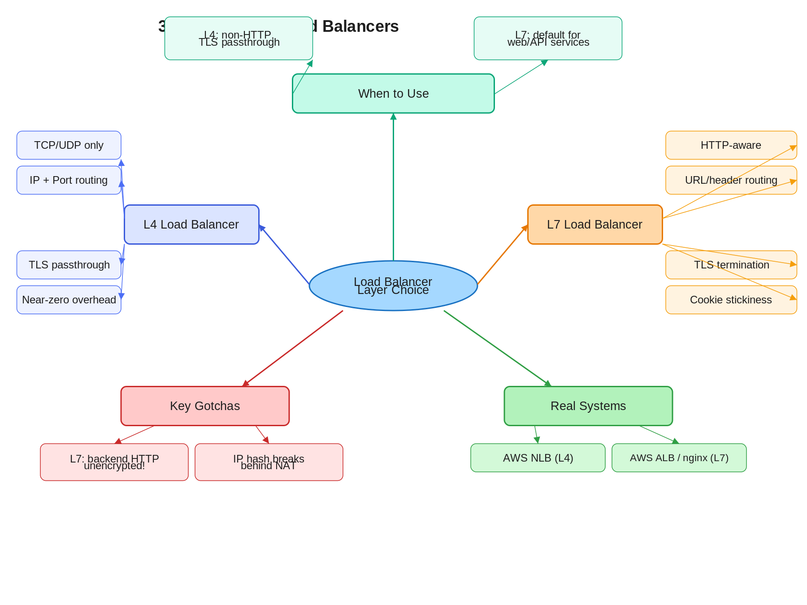

# 4.1 L4 vs. L7 Load Balancers

> **Topic:** Topic 4 — Load Balancing
> **Phase:** B — Scalability Branch
> **Date studied:** 2026-05-06

---

## 1. 🎯 Goal of This Subtopic

> *Why are you studying this? What should you be able to do after this session?*

Be able to distinguish L4 from L7 load balancers by the OSI layer they operate on, what information each can see, and the architectural implications of that difference. Understand when to choose one over the other in an interview design, and be able to articulate the trade-offs confidently without hedging.

---

## 2. ✅ What Mastery Looks Like

> *Concrete, testable proof that you own this concept — not just familiarity.*

- [ ] Can explain the difference between L4 and L7 load balancing in under 60 seconds using a concrete example, without notes
- [ ] Can select the right LB type (L4 or L7) given a specific system requirement and justify it in terms of what information is available at each layer
- [ ] Can describe exactly how TLS termination changes the security model and what the correct mitigations are
- [ ] Can identify when L4 is the *only* viable option (non-HTTP protocols, TLS passthrough) and explain why
- [ ] Can name at least two production systems that use each type and describe how they use it

> 💡 **Rule of thumb:** If you can teach it to someone else and field their follow-up questions, you've mastered it.

---

## 3. 🗓️ Study Phases to Achieve Mastery

> *A progressive plan from first exposure to interview-ready. Work through each phase in order. Don't move to the next until you can honestly tick every item.*

### Phase 1 — Acquire 📖 💪💪
*Goal: Read deeply enough that you could explain the concept without the doc.*

- [ ] Read the **Further Reading** resources (Section 16): AWS ALB vs. NLB docs, nginx load balancing guide
- [x] ByteByteGo L4/L7 explainer - https://www.youtube.com/watch?v=LQuuoHTyYz8
- [ ] Read through **Sections 5–9** (Core Definition → How It Works) carefully — don't skim
- [ ] Re-read the **Cheatsheet** (Section 4) and try to recite it from memory after

### Phase 2 — Consolidate ✍️ 💪💪💪
*Goal: Verify you can reproduce the knowledge in your own words without looking.*

- [ ] Close the doc — write out the **Core Definition** from memory, then compare
- [ ] Explain **First Principles** out loud without notes — what problem does this solve and why?
- [ ] Reconstruct the **How It Works** mechanics step by step from memory
- [ ] Restate each **Trade-off** row in your own words — if you can't explain the cost, you don't own it yet

### Phase 3 — Apply 🔧 💪💪💪💪
*Goal: Connect to real systems and simulate interview scenarios.*

- [ ] Go through **Real-World System Examples** (Section 10) — verify each claim independently and add anything missed to **My Notes**
- [ ] Practice the **Interview Application** (Section 12) out loud — say the trigger phrases and your response as if in a live interview
- [ ] Work through **Common Misconceptions** (Section 13) — for each, make sure you can explain *why* the misconception is wrong, not just that it is
- [ ] Trace the **Relationships to Other Concepts** (Section 14) — can you explain each connection without looking?

### Phase 4 — Validate 🧪 💪💪💪💪💪
*Goal: Confirm you actually own it, not just recognize it.*

- [ ] Answer every **Self-Check Quiz** question (Section 15) out loud without looking at your notes
- [ ] Recite the **Cheatsheet** (Section 4) from memory — if you can't, re-do Phase 2
- [ ] Tick off items in **What Mastery Looks Like** (Section 2) — only check a box if you can demonstrate it on demand, not just if it sounds familiar
- [ ] Teach this concept out loud to an imaginary interviewer for 2 minutes without hesitation or notes

---

## 4. 📋 Cheatsheet

> *Everything you need to recall this concept in 30 seconds — for quick review before an interview.*



```
ONE-LINER
  L4 routes by IP/port (fast, blind); L7 routes by HTTP content (smart, flexible).

KEY PROPERTIES / RULES
  L4: operates on TCP/UDP; cannot inspect payloads; near-zero overhead; protocol-agnostic
  L7: operates on HTTP/HTTPS; reads headers, URL, cookies; enables content-based routing
  L7 terminates TLS — backend sees plain HTTP; L4 can pass TLS through to the backend
  L7 enables cookie-based sticky sessions; L4 only via IP hash (breaks behind NAT)
  L4 is required for non-HTTP protocols: raw TCP databases, UDP, custom binary protocols

DECISION RULE
  Use L7 when: microservice path routing, A/B testing, sticky sessions, auth, SSL termination
  Use L4 when: non-HTTP protocols, TLS passthrough, maximum throughput, gaming/UDP traffic

NUMBERS / FORMULAS
  L4 overhead: ~microseconds per connection (stateful NAT table lookup)
  L7 overhead: TLS termination + HTTP parse, typically adds ~1-2ms per request
  Rule of thumb: default to L7 for web services; drop to L4 only for protocol or throughput limits

GOTCHA TO NEVER FORGET
  L7 terminates TLS — the backend sees plain HTTP; you must trust the internal network
  or re-encrypt to the backend, or your data travels unencrypted inside your own infra.
```

---

## 5. 🧠 Core Definition

> *What is it, in one sentence?*

An L4 load balancer distributes traffic based solely on TCP/UDP source/destination IP and port, without inspecting packet contents; an L7 load balancer terminates the connection, parses the HTTP request, and routes based on application-level information such as URL path, headers, and cookies.

---

## 6. 📦 Core Concepts

> *The essential building blocks of this subtopic — the terms and ideas you must have solid before going deeper.*

### OSI Layer as Information Horizon
The OSI layer a load balancer operates at determines what information it can see. L4 operates at the transport layer — it can only see source IP, destination IP, source port, destination port, and TCP flags. It cannot see anything inside the TCP payload. L7 operates at the application layer — it terminates the TCP (and TLS) connection, reads the HTTP headers and body, and then makes routing decisions on that content. The layer is not just a label; it determines the decision surface.

### TLS Termination
L7 load balancers terminate TLS: they decrypt the inbound request, read the plaintext HTTP, route it, then optionally re-encrypt for the backend. This centralizes certificate management and offloads crypto from backend servers, but it means traffic between the LB and backends is unencrypted unless you implement TLS re-origination. L4 load balancers can be configured for TLS passthrough — they forward the encrypted bytes directly to the backend, which handles TLS itself. This is the only option when you need end-to-end encryption or when the backend uses mutual TLS (mTLS).

### Connection vs. Request Granularity
L4 LBs load-balance at connection granularity: once a TCP connection is established to a backend, all requests on that connection go to the same server. L7 LBs load-balance at request granularity: each HTTP/1.1 request or HTTP/2 stream can be independently routed to a different backend, enabling far more even distribution under keep-alive connections and HTTP/2 multiplexing.

### Virtual IP (VIP)
Both L4 and L7 load balancers expose a single Virtual IP (VIP) to clients. All traffic goes to the VIP; the LB then forwards to one of N healthy backend instances. The client never knows which backend handled the request. This is the fundamental abstraction that makes backends independently replaceable.

### Health Checks
L4 LBs health-check backends by establishing a TCP connection — if the handshake completes, the backend is considered healthy. L7 LBs send an actual HTTP request (typically `GET /health`) and check for a 200 response. L7 health checks catch application-layer failures (crashed app server that still accepts TCP connections) that L4 checks miss.

---

## 7. 🔍 First Principles — Why Does This Exist?

> *What fundamental problem does this concept solve? Why was it invented?*

Before load balancers, scaling a service meant scaling the single machine it ran on. When a single machine hit its CPU or memory ceiling, the only option was vertical scaling — bigger hardware. Horizontal scaling (adding more machines) was impossible without a way to distribute traffic across them while presenting a single address to clients.

The first load balancers were simple: they operated at L4, hashing connection tuples to backend IPs. This worked well until applications needed smarter routing — routing `/api/users` to one microservice and `/api/orders` to another, or routing 5% of traffic to a canary deployment, or maintaining session affinity based on a user's login cookie. None of this is possible at L4 because the LB cannot see the application-layer content.

L7 load balancing emerged to solve the intelligence gap: give the LB enough context (the full HTTP request) to make routing decisions that align with application semantics. The cost is that the LB must now terminate connections, parse HTTP, and re-establish connections to backends — which is why L4 still exists for cases where that overhead or that protocol boundary is unacceptable.

---

## 8. 🗺️ Mental Models

> *Intuition frames that help you reason about this concept fast — especially under interview pressure.*

### Model 1: The Doorman vs. The Concierge
An L4 load balancer is a doorman: they check what floor you're going to (IP/port) and send you to the right elevator — fast, no questions asked, no knowledge of what you need when you get there. An L7 load balancer is a concierge: they read your request, understand what you need ("I want the sushi restaurant on the 3rd floor, not the steakhouse"), and route you accordingly. The concierge is smarter but slower and must be trusted with your information. The doorman is faster but blind to your actual intent. **Where it breaks down:** the concierge analogy implies the concierge sees everything — but an L7 LB only sees what's in the HTTP headers and body, not encrypted payloads if TLS passthrough is used.

### Model 2: The Envelope vs. The Letter
L4 routes based on the outside of the envelope (to/from address, return address). L7 opens the envelope, reads the letter, and routes based on the content. You can sort mail incredibly fast at L4 because you never open anything. But if you need to route "all letters about billing to the billing department," you must open and read — that's L7. **Where it breaks down:** this implies L7 always has to do more work. In practice, modern L7 LBs are highly optimized and the overhead for typical web traffic is negligible at any scale below millions of RPS per node.

### Model 3: The OSI Stack as an Information Tax
Every layer you go up the OSI stack costs you more compute (you must parse more of the packet) but gives you more information to make routing decisions. L4 pays almost no tax — just a hash table lookup. L7 pays TLS termination + HTTP parsing but can see everything the application sends. Think of it as buying routing intelligence with compute. **When the tax is too high:** ultra-low-latency financial systems or very high-throughput UDP streams (gaming, video) cannot afford the L7 tax.

---

## 9. ⚙️ How It Works — Mechanics

> *Step-by-step or layered explanation of the internal mechanism.*

**L4 — Happy Path:**
1. Client sends a TCP SYN to the VIP (e.g., `10.0.0.1:443`).
2. The L4 LB receives the SYN. It computes a backend selection based on a hash of `(src_ip, src_port, dst_ip, dst_port)` or a round-robin counter.
3. The LB records the mapping in its connection table: `{client_ip:port → backend_ip:port}`.
4. It rewrites the destination IP/port on the packet (DNAT) and forwards the SYN to the selected backend.
5. The backend sends SYN-ACK back through the LB (or directly to the client in DSR mode), completing the TCP handshake.
6. All subsequent packets on this TCP connection are forwarded to the same backend using the connection table — no re-evaluation per packet.
7. On TCP FIN/RST, the LB removes the entry from the connection table.

**L4 — Failure Handling:**
If the backend fails mid-connection, the client's TCP stream breaks. There is no graceful drain — existing connections die. The LB stops forwarding to the failed backend for new connections once the health check (TCP handshake) fails.

**L7 — Happy Path:**
1. Client establishes a TLS connection to the VIP. The L7 LB handles the TLS handshake, presenting its own certificate.
2. The LB now reads the plaintext HTTP request: method, URL, headers (including `Host`, `Cookie`, custom headers).
3. It evaluates routing rules: path prefix, header match, cookie value.
4. It selects a backend from the matching pool, using the configured algorithm (round robin, least connections, etc.).
5. It either reuses an existing pooled TCP connection to the backend or establishes a new one.
6. It forwards the HTTP request, adding headers like `X-Forwarded-For` (original client IP) and `X-Forwarded-Proto`.
7. The backend processes the request and returns a response.
8. The LB returns the response to the client over the original TLS connection.

**L7 — Failure Handling:**
The LB can retry failed requests against a different backend (the client's TLS connection is still alive). This is impossible at L4. The LB also drains connections gracefully — it stops sending new requests to a backend that is being removed from rotation, allowing in-flight requests to complete.

**Key Threshold:** L7 LBs maintain connection pools to backends. Each pool connection is a TCP connection (optionally TLS). Pool size is a critical tuning parameter: too small → connection establishment overhead; too large → backend resource exhaustion.

---

## 10. 🏭 Real-World System Examples

> *Where does this appear in production systems you know?*

| System | How This Concept Applies | Notes |
|--------|--------------------------|-------|
| AWS Application Load Balancer (ALB) | L7 LB: routes by path, host header, query string; sticky sessions via cookies; terminates TLS | Default choice for web/API workloads on AWS; integrates with WAF |
| AWS Network Load Balancer (NLB) | L4 LB: ultra-high throughput (millions of RPS); TLS passthrough option; preserves source IP | Used when ALB latency overhead is unacceptable or for non-HTTP protocols like databases over TCP |
| nginx | Can act as both L4 (via `stream` module) and L7 (via `http` module) | Widely used as L7 reverse proxy for microservices; supports upstream health checks, SSL termination, and header manipulation |
| HAProxy | Mature L4 and L7 LB; used at very high scale (GitHub, Stack Overflow) | Known for deterministic performance; L7 mode supports ACL-based routing on any HTTP header |
| Envoy Proxy | L7 load balancer and proxy used as the data plane in service meshes (Istio) | Supports sophisticated L7 routing, circuit breaking, retries, and distributed tracing natively |
| Cloudflare | Global anycast L7 LB; terminates TLS at 200+ PoPs; uses L7 to apply WAF, bot mitigation, and caching | Operates as a combined CDN + L7 LB + DDoS mitigation layer |

---

## 11. ⚖️ Trade-offs

> *Every design decision has a cost. What are you giving up?*

| ✅ Benefit | ❌ Cost / Limitation |
|-----------|---------------------|
| L7 enables content-based routing (path, header, cookie) | L7 must parse HTTP for every request — higher CPU than L4's table lookup |
| L7 TLS termination centralizes certificate management | Backend traffic is unencrypted; requires trusted internal network or TLS re-origination complexity |
| L7 retry on failure is transparent to the client | L7 retry can cause duplicate side effects if the backend operation is not idempotent |
| L4 is protocol-agnostic — works for any TCP/UDP service | L4 cannot distinguish between multiple services on the same IP; requires separate ports per service |
| L4 preserves the original client IP natively | L7 requires the `X-Forwarded-For` header to pass the original client IP; backends must trust it |
| L7 performs HTTP health checks, catching app-layer failures | L7 health checks add request overhead; misconfigured health endpoints create false negatives |

---

## 12. 🎯 Interview Application

> *How do you use this concept in a design interview? What triggers it?*

**When an interviewer asks / says:**
- "Walk me through how you'd design the load balancing layer for this system."
- "How would you route traffic to different microservices?"
- "The system needs to support A/B testing / canary deploys."
- "We need to support WebSocket connections at scale."

**What you say / do:**
In the high-level design phase, when drawing the entry point to your backend cluster, call out whether you'd use L4 or L7 and why. For most web/API systems, default to L7: "I'll put an L7 load balancer here — it lets us terminate TLS, route by path to different microservice pools, and add sticky sessions if needed. If we need to scale to very high throughput or support non-HTTP protocols, we can put an L4 LB in front of it." Always mention TLS termination and its security implication.

**The trade-off statement (memorize this pattern):**
> "If we choose L7, we get intelligent routing and TLS termination, but we pay for it with slightly higher latency and we need to secure the backend channel. For this system, L7 is the right call because we need to route API traffic to separate microservice pools by path."

---

## 13. ⚠️ Common Misconceptions & Gotchas

> *What do candidates get wrong? What nuance is the interviewer probing for?*

- ❌ **Misconception:** L4 is always faster than L7 for web traffic, so you should always prefer L4.
  ✅ **Reality:** For HTTP/HTTPS workloads at typical scales (up to hundreds of thousands of RPS), the L7 overhead is negligible and the routing flexibility is worth it. L4 is only preferable at extreme throughput, for non-HTTP protocols, or when TLS passthrough is required.

- ❌ **Misconception:** An L7 LB can inspect encrypted HTTPS payloads.
  ✅ **Reality:** An L7 LB can only inspect content *after* it terminates TLS. If you configure L4 TLS passthrough, the LB sees only encrypted bytes and cannot make application-layer routing decisions. "L7" means the LB terminates TLS and reads plaintext HTTP.

- ❌ **Misconception:** Sticky sessions at L4 via IP hash are equivalent to L7 cookie-based sticky sessions.
  ✅ **Reality:** IP hash breaks in two common real-world scenarios: (1) when many users share a single public IP (corporate NAT), routing all their traffic to one backend and overloading it; (2) when the user's IP changes (mobile roaming). L7 cookie-based affinity uses a session-specific cookie and is far more reliable.

- ❌ **Misconception:** L7 load balancers cannot handle WebSocket connections.
  ✅ **Reality:** L7 LBs support WebSocket upgrades (HTTP 101 Switching Protocols). They handle the upgrade handshake and then proxy the persistent TCP connection. The LB must be configured with an appropriate idle timeout (default HTTP timeouts are too short for long-lived WebSocket connections).

---

## 14. 🔗 Relationships to Other Concepts

> *How does this connect to adjacent subtopics in this topic or across the roadmap?*

- **Builds on:** Topic 3 (Stateless Services — understanding why stateless backends make L7 load balancing trivial; stateful backends require sticky sessions which L7 enables via cookies)
- **Enables:** Topic 4.2 Routing Algorithms (the routing algorithm choice — round robin, least connections, IP hash — only matters in the context of which LB type you're using and what information it has); Topic 4.6 Sticky Sessions (sticky sessions only work cleanly at L7 with cookie-based affinity)
- **Tension with:** Topic 3 Stateless Services (L7 LBs make it easy to add cookie-based sticky sessions, which reintroduces statefulness into your service layer and undermines horizontal scalability — the ideal is stateless backends that don't need sticky sessions at all)

---

## 15. 🧪 Self-Check Quiz

> *Can you answer these without looking? If not, you haven't internalized it yet.*

1. In one sentence: what is the fundamental difference between an L4 and an L7 load balancer, in terms of what each sees and decides on?

   > 💡 *Think through your answer before expanding — if you hesitate, revisit Section 5.*

An L4 load balancer routes based solely on the TCP/UDP 4-tuple
(source IP, source port, destination IP, destination port) without
inspecting the payload; an L7 load balancer terminates TLS, parses
the HTTP request, and routes based on application-layer content
such as URL path, headers, and cookies.

2. A team is building a service that routes HTTP traffic to three different microservices based on URL path (`/auth`, `/orders`, `/products`). Should they use L4 or L7? Why can't they use the other?

   > 💡 *Think through what information each LB type has available before answering — revisit Section 6 if needed.*

Use L7. Path-based routing (/auth, /orders, /products) requires
reading the HTTP URL — information that only exists at Layer 7.
An L4 LB sees only the 4-tuple (src IP, src port, dst IP, dst port);
all three services arrive on the same port (443), so L4 has no way
to distinguish which backend should handle the request. It would
route blindly, sending /auth requests to the orders service or
products service with no way to correct this.

3. What is the key security risk introduced by L7 TLS termination, and what are the two standard mitigations?

   > 💡 *If you only know the risk but not both mitigations, revisit Section 9.*

Risk: L7 TLS termination means the LB decrypts the request and
forwards plaintext HTTP to backends. Any compromise of the internal
network exposes all traffic in plaintext.

Mitigation 1 — TLS re-origination: the LB re-encrypts the request
before forwarding to each backend, acting as a TLS client. Backends
must trust the LB's certificate. Provides end-to-end encryption at
the cost of additional latency and certificate management complexity.

Mitigation 2 — Trusted internal network: accept plaintext between
LB and backends, but enforce strict network controls (private VPC,
security groups, no external access to backend subnets). Simpler
operationally but relies on perimeter security holding.

4. Name a real production system that uses L4 load balancing and explain specifically why L7 would not have been the right choice for that use case.

   > 💡 *Check Section 10 if you're drawing a blank — but try to recall it first.*

AWS Network Load Balancer (NLB).

NLB is used when:
1. Ultra-high throughput is required (millions of RPS) — L7 TLS
   termination + HTTP parsing adds latency that NLB's TCP-level
   forwarding avoids entirely.

2. TLS passthrough is required — when the system mandates
   end-to-end encryption all the way to the backend (e.g., mutual
   TLS / mTLS between services), the LB must not terminate TLS.
   An L7 LB cannot do this — it must decrypt to read HTTP content.

3. Non-HTTP protocols — NLB handles raw TCP (e.g., database
   connections, custom binary protocols) that L7 cannot parse.

L7 would fail here because: terminating TLS breaks the e2e
encryption mandate, and parsing HTTP adds overhead that violates
latency SLAs.

5. A user's L4 IP-hash sticky session breaks after they switch from WiFi to LTE on their mobile phone. Why does this happen, and how would an L7 LB solve it?

   > 💡 *This is a real-world edge case — think through IP hash's mechanism first, then revisit Section 13 if needed.*

Why it breaks: L4 IP-hash computes backend selection from the
source IP. When the user switches WiFi → LTE, their source IP
changes. The new IP hashes to a different backend, breaking the
session mapping entirely.

How L7 solves it: L7 implements cookie-based sticky sessions.
On the first request, the LB inserts a session affinity cookie
into the HTTP response. On every subsequent request, the client
sends the cookie back — the LB reads it and routes to the same
backend regardless of the client's current IP address.

This survives IP changes, NAT, and mobile network switching
because it tracks the user via the cookie, not the IP.

The broader point: IP hash breaks in two real scenarios —
1. IP change (mobile roaming, as above)
2. NAT — many users sharing one public IP all hash to the
   same backend, creating load imbalance.
Cookie-based affinity solves both.
---

## 16. 📚 Further Reading

> *Optional: links, chapters, or resources for deeper understanding.*

- [ ] AWS Documentation: [ALB vs NLB comparison](https://docs.aws.amazon.com/elasticloadbalancing/latest/userguide/how-elastic-load-balancing-works.html) — authoritative reference on when AWS recommends each type
- [ ] nginx: [HTTP Load Balancing Guide](https://docs.nginx.com/nginx/admin-guide/load-balancer/http-load-balancer/) — practical L7 LB configuration with upstream pools and health checks
- [ ] ByteByteGo: "System Design Interview" — Chapter on scalability covers L4/L7 in the context of real interview problems
- [ ] HAProxy Documentation: [The Four Essential Sections of an HAProxy Configuration](https://www.haproxy.com/documentation/) — understanding L4 vs L7 mode selection in a production LB
- [ ] Cloudflare Blog: [How we scaled our load balancer](https://blog.cloudflare.com) — real-world account of L4/L7 at global scale

---

## 17. ✍️ My Notes

> *Personal observations, things that confused me, analogies that helped.*

L4 vs L7 Definition
L4 load balancer operates at the transport level and it has visibility to the IP address and the port of each request packet. 
An L7 load balancer operates at the application level and it terminates the TLS encryption, decrypts the request packet, and reads the contents of the HTTP payload. It can read things such as the HTTP header, the URL paths, and the cookie. Based on this information, the L7 load balancer can route intelligently to intended recipients in the pool of backend servers.

Core Concepts

An L4 load balancer operates on the TCP and UDP layer, and it has no visibility into the required packet other than the source IP and port, and the destination IP and port. 

L7 load balancer operates on the HTTP layer. It terminates the TLS encryption, reads the contents of the HTTP packet, and therefore has visibility of packet details such as the HTTP headers, the cookies, or the URL paths. Based on these contents, we can route to a specific backend that serves such requests. 

In terms of connection granularity, an L4 load balancer will only be able to route based on IP address and ports, whereas an L7 load balancer can route based on the contents of the HTTP packet and route the request intelligently. 

In terms of health checks, the L4 load balancer will just establish a TCP connection with the backend, and once the TCP connection is successful, it will be deemed healthy. The L7 load balancer will make an actual GET request for health check to the specific back-ends, and only when the back-end responds with HTTP/200 success, it will be deemed healthy. 

VIP. For both load balancers, it will be assigned an IP address, and this will also be called the virtual IP address. This virtual IP address will be the public address given to our clients. Clients, when they send a request, it will always run through this same IP address. 

When to use each

Use an L4 load balancer when our service demands ultra-low latency and it allows for TLS passthrough, which means the system mandates end-to-end encryption. 

We use an L7 load balancer if our system has a backend microservice architecture where there are many services, each serving different types of requests. The L7 load balancer is able to terminate the TLS encryption, read the contents of the packets, and route to the specific backend that handles the specific service request. 

L4 Routing mechanism
When a client sends a request to an L4 load balancer, the L4 load balancer will be able to see the IP address and the port. It will do a hashing of this IP address and port, and the results of the hash will be routed to a specific backend. It creates a mapping(4 tuple, source IP/port and destination IP/post) between the IP and backend. It then forwards this request to the backend for processing. Once done, any subsequent requests on the same TCP connection get routed to the same backend. Eventually, when the client has finished sending requests, it terminates the request. The TCP connection stops, and then the load balancer will remove the mapping between the IP address and port with the specific backend. 

L7 Routing mechanism
When a client sends a request to an L7 load balancer, the L7 load balancer will use it's own TLS certificate and terminate the TLS encryption. It will decrypt the payload and read the contents of the HTTP request. You can read things like the HTTP header, the URL path, the cookies, and request body in this HTTP request. Once it has parsed the contents of the request, it can now route the request to specific backends that serve such types of requests. In this case, depending on the demands, it will also do a re-origination of the TLS certificates and send it encrypted to the backend. 