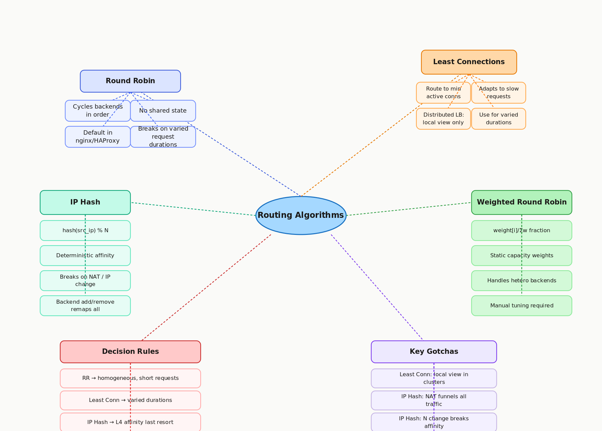

# 4.2 Routing Algorithms

> **Topic:** Topic 4 — Load Balancing
> **Phase:** B — Scalability Branch
> **Date studied:** 2026-05-19

---

## 1. 🎯 Goal of This Subtopic

> *Why are you studying this? What should you be able to do after this session?*

Be able to identify the four major routing algorithms — round robin, least connections, IP hash, and weighted round robin — explain the failure mode of each, and select the right one for a given scenario in an interview. Understand why algorithm choice matters for load distribution, session affinity, and backend heterogeneity. Be able to explain why the "obvious best choice" (least connections) has a critical distributed blind spot.

---

## 2. ✅ What Mastery Looks Like

> *Concrete, testable proof that you own this concept — not just familiarity.*

- [ ] Can explain all four algorithms from memory and describe the failure mode or edge case of each without notes
- [ ] Can select the appropriate algorithm for a given scenario (homogeneous vs. heterogeneous backends, long vs. short requests, sticky session requirement) and justify the choice
- [ ] Can explain why least connections breaks down in a distributed multi-LB deployment
- [ ] Can explain why IP hash is a fragile affinity mechanism and what the two failure conditions are
- [ ] Can describe the trade-off between routing simplicity (round robin) and routing intelligence (least connections) in terms of coordination cost

> 💡 **Rule of thumb:** If you can teach it to someone else and field their follow-up questions, you've mastered it.

---

## 3. 🗓️ Study Phases to Achieve Mastery

> *A progressive plan from first exposure to interview-ready. Work through each phase in order. Don't move to the next until you can honestly tick every item.*

### Phase 1 — Acquire 📖 💪💪
*Goal: Read deeply enough that you could explain the concept without the doc.*

- [ ] Read **nginx Upstream Module Documentation** — nginx.org/en/docs/http/ngx_http_upstream_module.html (covers round_robin, least_conn, ip_hash, hash directives)
- [ ] Read **HAProxy Load Balancing Algorithms** — docs.haproxy.org/2.6/configuration.html#4.2-balance (roundrobin, leastconn, source, random)
- [ ] Read **AWS ALB: Routing Algorithm Selection** — docs.aws.amazon.com/elasticloadbalancing/latest/application/load-balancer-target-groups.html#modify-routing-algorithm
- [ ] Read **ByteByteGo — System Design Interview Vol. 1**, load balancing chapter (routing algorithm discussion)
- [ ] Read **Envoy Proxy Load Balancing Policies** — envoyproxy.io/docs/envoy/latest/intro/arch_overview/upstream/load_balancing/load_balancers
- [ ] Read through **Sections 5–9** (Core Definition → How It Works) carefully — don't skim
- [ ] Re-read the **Cheatsheet** (Section 4) and try to recite it from memory after

### Phase 2 — Consolidate ✍️ 💪💪💪
*Goal: Verify you can reproduce the knowledge in your own words without looking.*

- [ ] Close the doc — write out the Core Definition from memory, then compare
- [ ] Explain **First Principles** out loud without notes — what was the routing problem before these algorithms were formalized?
- [ ] Reconstruct the decision logic for each algorithm step by step from memory
- [ ] Restate each **Trade-off** row in your own words — if you can't explain the cost, you don't own it yet

### Phase 3 — Apply 🔧 💪💪💪💪
*Goal: Connect to real systems and simulate interview scenarios.*

- [ ] Go through **Real-World System Examples** (Section 10) — verify each claim independently and add anything missed to **My Notes**
- [ ] Practice the **Interview Application** (Section 12) out loud — say the trigger phrases and your response as if in a live interview
- [ ] Work through **Common Misconceptions** (Section 13) — for each, make sure you can explain *why* the misconception is wrong, not just that it is
- [ ] Trace the **Relationships to Other Concepts** (Section 14) — can you explain each connection without looking?

### Phase 4 — Validate 🧪 💪💪💪💪💪
*Goal: Confirm you actually own it, not just recognize it.*

- [ ] Answer every **Self-Check Quiz** question (Section 15) out loud without looking at your notes
- [ ] Recite the **Cheatsheet** (Section 4) from memory — if you can't, re-do Phase 2
- [ ] Tick off items in **What Mastery Looks Like** (Section 2) — only check a box if you can demonstrate it on demand, not just if it sounds familiar
- [ ] Teach this concept out loud to an imaginary interviewer for 2 minutes without hesitation or notes

---

## 4. 📋 Cheatsheet

> *Everything you need to recall this concept in 30 seconds — for quick review before an interview.*



```
ONE-LINER
  Routing algorithms decide which backend gets each request — choose based on
  request duration variance, backend heterogeneity, and affinity requirements.

KEY PROPERTIES / RULES
  Round Robin:      cycles in order; equal weight; works when backends are identical
  Least Connections: routes to backend with fewest active connections; adaptive to duration variance
  IP Hash:          hash(src_ip) % N → deterministic; enables affinity; fragile on NAT/IP change
  Weighted RR:      proportional slots by capacity weight; handles heterogeneous backends
  Least Conn in distributed LBs: each LB node only sees *its own* connections — not global count

DECISION RULE
  Use Round Robin when: stateless backends, homogeneous capacity, short similar-duration requests
  Use Least Connections when: request durations vary widely (mix of fast + slow requests)
  Use IP Hash when: L4 LB forced, sticky session needed as last resort — know its failure modes
  Use Weighted RR when: backends have different CPU/memory capacity (old vs. new hardware)

NUMBERS / FORMULAS
  IP Hash: backend = hash(client_ip) % num_backends  (modular hash, not consistent hash)
  Weighted RR: backend i gets weight[i] / sum(weights) fraction of requests

GOTCHA TO NEVER FORGET
  Least connections only works correctly on a single LB node — in a multi-LB cluster, each
  node sees only its own connections, so "least connections" is always a partial view.
```

---

## 5. 🧠 Core Definition

> *What is it, in one sentence?*

A load balancer **routing algorithm** is the decision function that selects which backend receives each incoming connection or request — the choice determines distribution fairness, whether session affinity is preserved, and how well the system adapts to unequal request costs or backend capacities.

---

## 6. 📦 Core Concepts

> *The essential building blocks of this subtopic — the terms and ideas you must have solid before going deeper.*

### Round Robin
In round robin, the load balancer cycles through the backend pool in order, assigning each new request to the next backend in the list. It assumes all backends are equally capable and all requests equally expensive. Round robin is stateless, requires no coordination between LB instances, and is the default algorithm in nginx, HAProxy, and AWS ALB. It breaks down when request duration varies significantly — a backend handling one long-running request looks the same to the algorithm as one handling fast requests.

### Least Connections
Least connections routes each new request to the backend that currently has the fewest active connections. It is adaptive: if some requests take longer, those backends accumulate more in-flight connections and the algorithm steers traffic away from them. This produces more even CPU utilization when request durations vary. The critical caveat is that in a distributed load balancer deployment (multiple LB nodes), each node only knows its own connection count — it has no global view, so the algorithm degrades to approximate guidance rather than true minimum.

### IP Hash (Source IP Hash)
IP hash computes `hash(client_ip) % N` and routes the request to the resulting backend index. The same client IP always lands on the same backend, providing deterministic affinity without any per-session state on the LB. It breaks in two predictable scenarios: (1) many users share a single public IP behind corporate NAT, funneling all their traffic to one backend and creating a hot spot; (2) a user's IP changes (mobile network handoff), breaking the affinity silently. Additionally, adding or removing a backend changes N and remaps most IPs, disrupting all existing affinities.

### Weighted Round Robin
Weighted round robin extends round robin by assigning each backend a numeric weight proportional to its capacity. A backend with weight 3 receives three requests for every one request sent to a backend with weight 1. This handles heterogeneous infrastructure — old and new servers, or instances of different sizes — without any dynamic measurement. Weights are typically set at deployment time and updated manually or by the orchestrator when backend capacity changes.

### Random Selection
Random selection picks a backend uniformly at random for each request. It is simpler than round robin (no counter state) and mathematically equivalent in the long run. Some modern systems use "power of two choices" — pick two random backends, compare their connection counts, route to the less loaded one — which approaches least-connections accuracy with far lower coordination cost than tracking global minimums.

---

## 7. 🔍 First Principles — Why Does This Exist?

> *What fundamental problem does this concept solve? Why was it invented?*

Once you have a pool of N backends behind a load balancer, you need a decision function. Without one, every request would go to the same backend (no load distribution) or be distributed arbitrarily. The naive solution — always send to backend 0 — defeats the entire point of having multiple backends.

The earliest routing algorithms were round robin: simple, stateless, and fair under the assumption that all requests are equal. That assumption broke quickly in practice. Some requests are fast (a cache hit returning 200 bytes), and some are slow (a database query scanning a million rows). Under round robin, a backend can accumulate many slow requests while still receiving new ones at the same rate as backends handling only fast ones. The backend's queue grows while the algorithm remains oblivious.

Least connections emerged as the answer: measure the current load on each backend (active connections as a proxy for work) and steer new arrivals away from loaded backends. This works well on a single LB but creates a new problem at scale — you now need shared state to know global connection counts across all LB nodes. The routing algorithms that followed (weighted variants, power of two choices) are all attempts to get better distribution with lower coordination cost.

IP hash exists for a different reason: some applications need the same client to always reach the same backend, and that requirement predates L7 cookie-based affinity. It trades distribution quality for deterministic placement.

---

## 8. 🗺️ Mental Models

> *Intuition frames that help you reason about this concept fast — especially under interview pressure.*

### Model 1: Cashier Lanes at a Supermarket
Round robin is like assigning customers to cashier lanes in strict rotation regardless of lane length. Least connections is like directing each customer to the lane with the shortest queue. IP hash is like telling each customer "your last name starts with A–M, always go to lane 1." Weighted round robin is like having two express lanes (weight 1) and one full-service lane (weight 3) and routing proportionally. **Where it breaks down:** in a supermarket you can see all lanes at once — least connections in a distributed LB cluster means each cashier only sees their own queue, not the others.

### Model 2: The Coordination Tax
Think of routing algorithms on a spectrum from zero coordination to maximum coordination. Round robin: no shared state, no coordination, just a counter. Weighted RR: same, just a pre-set ratio. IP hash: a deterministic hash, zero runtime coordination. Least connections: requires knowing live connection counts, which in a cluster means either shared state (Redis counter → latency) or per-node approximation (fast but inaccurate). The more accurate your load signal, the higher the coordination tax. **Choose based on how much distribution error you can tolerate vs. coordination overhead you can afford.**

### Model 3: Static vs. Adaptive
Round robin and IP hash are **static** — they don't respond to observed backend state. Weighted RR is semi-static — it encodes a prior belief about capacity but doesn't adapt to live load. Least connections is **adaptive** — it reacts to actual backend state every request. Adaptive is not always better: it requires observable state and introduces sensitivity to measurement noise. A burst of connections to one backend can temporarily over-steer traffic away from it, causing oscillation. Static algorithms are predictable; adaptive algorithms can perform better on average but with higher variance. **Where it breaks down:** real systems often layer both — static weights as a baseline with health-check-driven removal as the coarse adaptive layer.

---

## 9. ⚙️ How It Works — Mechanics

> *Step-by-step or layered explanation of the internal mechanism.*

### Round Robin — Mechanics
The LB maintains a shared atomic counter initialized to 0. On each request:
1. `index = (counter++) % N` where N is the number of healthy backends
2. Forward the request to `backends[index]`
3. No per-request state is stored

When a backend is marked unhealthy, it is removed from the pool and N decreases. The counter keeps incrementing — the modulo naturally skips removed entries. In a distributed LB cluster (multiple LB nodes), each node maintains its own counter independently. There is no cross-node coordination, so distribution is equal per-node but requests across all nodes are not globally interleaved. This is fine — each LB node sends equal load to each backend from its perspective, and the aggregate is still even.

### Least Connections — Mechanics
The LB maintains an in-memory counter per backend tracking active connections:
1. On a new connection: `select backend = argmin(connection_count[i])`
2. Increment `connection_count[selected_backend]`
3. On connection close: decrement `connection_count[backend]`

In a single-node LB, this is accurate. In a distributed cluster (multiple LB nodes), each node has its own counters and no knowledge of what the other nodes see. Backend A may have 100 connections on LB-1 and 0 on LB-2; LB-2 sees A as "least connected" and routes all its traffic there. The algorithm's accuracy degrades proportionally to the number of LB nodes and the degree of traffic skew between them.

**Variant — Least Outstanding Requests (AWS ALB):** Instead of counting TCP connections, count in-flight HTTP requests. More accurate for HTTP/2 where many requests share one connection.

### IP Hash — Mechanics
1. Extract the client's source IP address
2. Compute `hash(src_ip)` — typically CRC32 or MurmurHash
3. Map to a backend: `index = hash(src_ip) % N`
4. Forward all requests from that IP to `backends[index]`

This is a modular hash, not a consistent hash. Adding or removing a backend changes N and remaps approximately `K/N` IPs, where K is the number of unique client IPs. All sessions using remapped IPs lose affinity. If you need IP-based affinity that survives scaling events, use consistent hashing (a separate topic, 7.4).

### Weighted Round Robin — Mechanics
Assign each backend a weight `w[i]`. Backends are repeated in the rotation proportional to their weight. For weights [3, 1, 1], the backend sequence is: `[A, A, A, B, C, A, A, A, B, C, ...]`. The LB cycles through this weighted sequence, skipping unhealthy backends. A common implementation uses Nginx's "smooth weighted round robin" — a stateful algorithm that distributes traffic more evenly over time than simple repetition, avoiding bursts to the same backend.

### Power of Two Random Choices (bonus — used by Envoy, Linkerd)
1. Pick two backends at random from the pool
2. Compare their current connection/request counts
3. Route to the one with fewer
4. No global lock required — only two point-in-time reads

This achieves near-optimal distribution with O(1) coordination — each routing decision requires reading two counters, not scanning all N backends.

---

## 10. 🏭 Real-World System Examples

> *Where does this appear in production systems you know?*

| System | How This Concept Applies | Notes |
|--------|--------------------------|-------|
| **nginx** | Default: round robin; opt-in: `least_conn`, `ip_hash`, `hash $variable consistent` | `least_conn` is the most common production upgrade; `hash ... consistent` uses consistent hashing for cache affinity |
| **HAProxy** | `balance roundrobin` (default), `balance leastconn`, `balance source` (IP hash), `balance random` | `leastconn` recommended for long-lived connections (WebSockets, DB proxies); `source` for L4 affinity |
| **AWS ALB** | Round robin (default) or Least Outstanding Requests — configurable per target group | AWS calls it "Least Outstanding Requests" not "Least Connections" — counts in-flight HTTP requests, not TCP connections |
| **Envoy Proxy** | Round robin, least request, random, ring hash (consistent), Maglev hash | `least_request` uses power of two choices, not true global least; ring hash used for cache-affinity routing |
| **GCP Cloud Load Balancing** | Round robin with session affinity (client IP, generated cookie, header-based) | Session affinity overlaid on round robin; not a separate algorithm selection |
| **Kubernetes kube-proxy** | iptables mode: random via connection tracking; IPVS mode: round robin, least conn, destination hash, source hash | IPVS gives more algorithm choices than iptables; production clusters using IPVS gain least_conn for free |

---

## 11. ⚖️ Trade-offs

> *Every design decision has a cost. What are you giving up?*

| ✅ Benefit | ❌ Cost / Limitation |
|-----------|---------------------|
| Round robin requires no shared state — works identically on a single-node or multi-node LB cluster | Blind to request duration variance — a backend handling slow requests receives new requests at the same rate as fast ones, causing queue buildup |
| Least connections adapts to unequal request durations, naturally reducing load on busy backends | In a distributed LB cluster, each node only sees its own connections — "least connections" is a local minimum, not a global one |
| IP hash provides deterministic affinity with zero per-request state | Breaks on NAT (many users → one IP → one backend) and on IP changes (mobile); adding/removing a backend remaps all clients |
| Weighted round robin handles heterogeneous backend capacity with no runtime measurement | Weights are static — requires manual tuning when capacity changes; stale weights after scaling events lead to uneven distribution |
| Random selection is trivially simple and stateless; power-of-two choices approaches least-conn accuracy | Pure random can occasionally produce unlucky streaks; power-of-two requires reading two counters per request |

---

## 12. 🎯 Interview Application

> *How do you use this concept in a design interview? What triggers it?*

**When an interviewer asks / says:**
- "How does your load balancer decide which backend to route to?"
- "Some requests take much longer than others — how do you handle that?"
- "We need users to always reach the same backend — how do you implement that?"
- "Our backends have different hardware capacities — how do you account for that?"

**What you say / do:**
In the high-level design or deep-dive, when your design has a load balancer, call out the algorithm choice explicitly. Default to round robin for stateless, homogeneous fleets and explain when you'd change it: "If request durations vary significantly — like a mix of fast API calls and slow report generation — I'd switch to least connections or least outstanding requests to avoid overloading backends that are stuck on slow work." If sticky sessions come up, acknowledge IP hash, immediately note its limitations, and push toward L7 cookie-based affinity instead.

**The trade-off statement (memorize this pattern):**
> "If we use least connections, we get better distribution when request durations vary, but in a multi-LB cluster each node only sees its own connections — not a global view. For this system, round robin is sufficient because our requests are short and homogeneous, and it eliminates coordination entirely."

---

## 13. ⚠️ Common Misconceptions & Gotchas

> *What do candidates get wrong? What nuance is the interviewer probing for?*

- ❌ **Misconception:** Least connections always produces the most even CPU load across backends.
  ✅ **Reality:** Connection count is a proxy for load, not load itself. A backend handling 5 active connections doing heavy DB work may be more loaded than one handling 50 active short-lived connections. Least connections also breaks in distributed LB clusters where each node only has a local view.

- ❌ **Misconception:** IP hash is equivalent to sticky sessions and is a reliable way to route a user to their data.
  ✅ **Reality:** IP hash breaks in two scenarios: (1) corporate NAT — thousands of users share one IP, routing all their traffic to one backend; (2) mobile IP changes — a user switches from WiFi to LTE, their IP changes, and they silently land on a different backend. For reliable affinity, use L7 cookie-based sticky sessions.

- ❌ **Misconception:** Round robin is only suitable for trivial or low-scale systems.
  ✅ **Reality:** Round robin is the default algorithm in nginx, HAProxy, and AWS ALB and works correctly in production at massive scale for stateless, homogeneous fleets. Its simplicity is a feature — it requires no coordination, no state, and is perfectly predictable. It only becomes insufficient when request durations vary significantly.

- ❌ **Misconception:** Weighted round robin requires dynamic monitoring to set accurate weights.
  ✅ **Reality:** Weights are typically static, set at deployment based on known instance sizes. A c5.large backend might get weight 1, a c5.4xlarge backend gets weight 4. Static weights work fine for stable infrastructure. Dynamic weight adjustment based on live CPU metrics is possible but adds complexity and is rarely necessary.

---

## 14. 🔗 Relationships to Other Concepts

> *How does this connect to adjacent subtopics in this topic or across the roadmap?*

- **Builds on:** 4.1 L4 vs. L7 Load Balancers — the routing algorithm operates within the context of whichever LB type is in use. IP hash is only available at L4 or as a hash directive at L7; least connections requires the LB to count live connections which is easier at L7 (per-request granularity) than L4 (per-connection).
- **Enables:** 4.3 Health Checks and Failure Detection — health checks interact with routing algorithms by marking backends as unhealthy and removing them from the pool. When N changes, round robin and IP hash behave differently (round robin adapts naturally; IP hash remaps all clients).
- **Enables:** 4.6 Sticky Sessions — IP hash is the L4 form of sticky sessions. Understanding its failure modes motivates the need for L7 cookie-based affinity covered in 4.6.
- **Tension with:** 3.1 Stateless vs. Stateful Architecture — the reason IP hash and sticky sessions exist is stateful backends. If every backend can serve every user equally (stateless design), any routing algorithm works and affinity becomes irrelevant. Stateless design is the proper long-term solution; IP hash is a mitigation for legacy stateful systems.

---

## 15. 🧪 Self-Check Quiz

> *Can you answer these without looking? If not, you haven't internalized it yet.*

1. In one sentence: what does a routing algorithm do, and what are the four main algorithms?

   > 💡 *Think through your answer before expanding — if you hesitate, revisit Section 5.*

1. Round Robin
Robin algorithm basically Out's request to every backend in an incremental fashion. It aims to create an even distribution of load amongst the backends. Problem with round robin algorithm is that it That's not keeping track of backend states, and it does not track how long each request takes. Requests with varying durations will actually create an event distribution amongst backends, even though to the round-robin mechanism it is giving requests evenly. 

2. Weighted Round Robin
A weighted round robin is similar to a round robin algorithm where it assigns loads evenly to each node incrementally. The difference is that in a weighted round robin fashion, it assigns a weight to each backend. Let's say if we have a backend with three versus a backend with one, and the backend with three is three times more requests than the backend with one request. Also, the problem with this is that this weight is assigned statically at launch, and every time you change the backend heterogeneity, you will need to re-create the new weight. 

3. Least Connections
These connections: we have the load balancer maintaining an active connection count for each backend it is serving. When the load balancer receives a new request, it routes the request to the backend with the least number of connections. Problem of these connections is that in a multiple load balancer cluster, each load balancer will only see its own version of the backend traffic. Its local version of the load distribution will not correctly reflect the actual load distribution of the backends. 

4. Power of two choices
Power of two choices algorithm: the load balancer randomly picks two servers and checks their connection counts and then routes the request to the one with fewer connections. This has proved inherently superior because now that we don't need to have global coordination of the connection count for all of the load balancers with their backend servers. In addition, the randomness of choosing the two nodes gives us uniform distribution of the backend traffic. 

5. IP Hash
IP hash does a hashing of the source IP address and routes to the n number of backends based on this hash. This creates affinity between the client request and backends. This kind of routing operation creates two problems:
1. When we have, let's say, a corporate net having a public IP address, they sell, so it is giving a lot of requests to the backend as opposed to a single client behind one IP address.
2. When users change from a Wi-Fi network to an ethernet port network, he changes IP address, and the load balancer will assign a different backend to the client. This breaks the affinity to backend requirement that some systems require.

6. Least Outstanding requests
This outstanding request, we have similar logic to these connections, but just in this case we actually measured a number of active in-flight HTTP requests by each backend. 

2. A system receives a mix of fast API calls (< 50ms) and slow report generation requests (10–30s). Should you use round robin or least connections, and why?

   > 💡 *Think through what round robin ignores and what least connections measures. Revisit Section 6 if you hesitate.*

We should be using a least connection routing algorithm because the least connection algorithm keeps track of the number of active connections by the backend and routes to the backend with the least number of connections. The problem with the round robin algorithm is that it tries to evenly distribute load to each backend without consideration for how fast or slow a request is. This will create the scenario where some backend consistently gets more requests and therefore it's more saturated in terms of workload than other backends. 

3. You have a 3-node LB cluster using least connections. Why might this not achieve the "least loaded backend" goal you intended?

   > 💡 *Think about what each LB node can and cannot observe. Revisit Section 9.*

We have a 3-node LB cluster using these connection algorithms. Each of the load balancers has only a partial view of the load that the backend receives. It tries to assign the load to the least connections in its own view, but not a global view. With the lack of a global view of the actual load of the connections, we might inadvertently have all of the load balancers routing requests to the least connections and therefore making the least connections backend now become a saturated backend that serves a normal request that is intended to be 

4. A user behind a corporate NAT (1,000 users sharing one public IP) is routed via IP hash. What happens to load distribution across your 5 backends?

   > 💡 *Trace through the hash function. What input does it receive, and what does that imply? Revisit Section 6.*

  Using IP hash algorithm to route a public IP where behind it has 1000 users making requests. All of these requests get routed to a single backend, and the load for that single backend will be saturated, where other backends will have relatively light load. And this also creates a session affinity where if the backend fails, then we are basically losing all of the in-process memory that prior serves this request. 

5. You add a new backend to a pool using IP hash routing. What happens to all existing client sessions, and how is this different from consistent hashing?

   > 💡 *Think through the modulo math when N increases by 1. Revisit Sections 6 and 9.*

When we add a new backend to a pool with IP hash routing algorithm, we will need to remap all of the prior hash IP addresses to the m + 1 number of nodes. This makes it so that more than n - 1 hash IP addresses will have a new value and therefore be routed to a new backend. Creates a lot of coordination overhead. We should be using a consistent hashing algorithm. System hashing algorithm basically allows only one over N number of re-mappings whenever we add new nodes. And this reduces the number of coordination overheads. 

---

## 16. 📚 Further Reading

> *Optional: links, chapters, or resources for deeper understanding.*

- [ ] **nginx Upstream Module Documentation** — nginx.org/en/docs/http/ngx_http_upstream_module.html — covers all nginx routing directives including `least_conn`, `ip_hash`, and `hash ... consistent`
- [ ] **HAProxy Load Balancing Algorithms Reference** — docs.haproxy.org (Configuration Manual, section 4.2, `balance` keyword) — the most comprehensive comparison of algorithm behaviors in one place
- [ ] **AWS Documentation: ALB Routing Algorithm** — docs.aws.amazon.com/elasticloadbalancing/latest/application/load-balancer-target-groups.html — explains least outstanding requests vs. round robin with AWS-specific nuance
- [ ] **Envoy Proxy Load Balancing Docs** — envoyproxy.io/docs/envoy/latest/intro/arch_overview/upstream/load_balancing/load_balancers — covers power of two choices and ring hash (consistent hashing for LB)
- [ ] **"The Power of Two Random Choices" (Mitzenmacher, 2001)** — academic paper behind the power-of-two-choices heuristic used by Envoy and Linkerd; accessible overview available on Michael Mitzenmacher's website

---

## 17. ✍️ My Notes

> *Personal observations, things that confused me, analogies that helped.*

One Liner

Routing algorithm is basically a mechanism to route incoming requests to backends with the objective to make load distribution even among all the backends. When it comes to selecting a backend algorithm, we select based on the backend heterogeneity of capacities, the required duration variances, and any affinity requirements to our backend. The main tension of a routing algorithm is basically between the even load distribution among backends and the coordination cost overhead to route traffic. 

Routing Algorithms

1. Round Robin
Robin algorithm basically Out's request to every backend in an incremental fashion. It aims to create an even distribution of load amongst the backends. Problem with round robin algorithm is that it That's not keeping track of backend states, and it does not track how long each request takes. Requests with varying durations will actually create an event distribution amongst backends, even though to the round-robin mechanism it is giving requests evenly. 

2. Weighted Round Robin
A weighted round robin is similar to a round robin algorithm where it assigns loads evenly to each node incrementally. The difference is that in a weighted round robin fashion, it assigns a weight to each backend. Let's say if we have a backend with three versus a backend with one, and the backend with three is three times more requests than the backend with one request. Also, the problem with this is that this weight is assigned statically at launch, and every time you change the backend heterogeneity, you will need to re-create the new weight. 

3. Least Connections
These connections: we have the load balancer maintaining an active connection count for each backend it is serving. When the load balancer receives a new request, it routes the request to the backend with the least number of connections. Problem of these connections is that in a multiple load balancer cluster, each load balancer will only see its own version of the backend traffic. Its local version of the load distribution will not correctly reflect the actual load distribution of the backends. 

4. Power of two choices
Power of two choices algorithm: the load balancer randomly picks two servers and checks their connection counts and then routes the request to the one with fewer connections. This has proved inherently superior because now that we don't need to have global coordination of the connection count for all of the load balancers with their backend servers. In addition, the randomness of choosing the two nodes gives us uniform distribution of the backend traffic. 

5. IP Hash
IP hash does a hashing of the source IP address and routes to the n number of backends based on this hash. This creates affinity between the client request and backends. This kind of routing operation creates two problems:
1. When we have, let's say, a corporate net having a public IP address, they sell, so it is giving a lot of requests to the backend as opposed to a single client behind one IP address.
2. When users change from a Wi-Fi network to an ethernet port network, he changes IP address, and the load balancer will assign a different backend to the client. This breaks the affinity to backend requirement that some systems require.

6. Least Outstanding requests
This outstanding request, we have similar logic to these connections, but just in this case we actually measured a number of active in-flight HTTP requests by each backend. 

Decision Rule

Round robin → homogeneous backends, uniform short requests
We use a round-robin routing algorithm when our backend is homogeneous and all of the requests have the approximate same duration. 

Least connections → varied request durations (single LB node)
We use these connections when we have varied request durations, but as we are dealing with a single load balancer. 

Weighted RR → heterogeneous backend capacities
We use a weighted round robin if our backend capacity is heterogeneous and we need to cater to the different capabilities of the backend. 

IP hash → L4 forced, affinity required, last resort only
If the system requires session affinity, meaning each client has to reach the same backend, then we will use the IP hash algorithm. 

IP hash N-change problem
The IP hash change problem is when we create and add new nodes to our backends, and now we have to remap the hashing of our prior requests to include a new node. This makes it that (n - 1) number of reroutes is needed, so that's the majority of the reroutes. To resolve the problem, we need to use a consistent hashing algorithm to make sure there is only one out of n remaps needed. 

