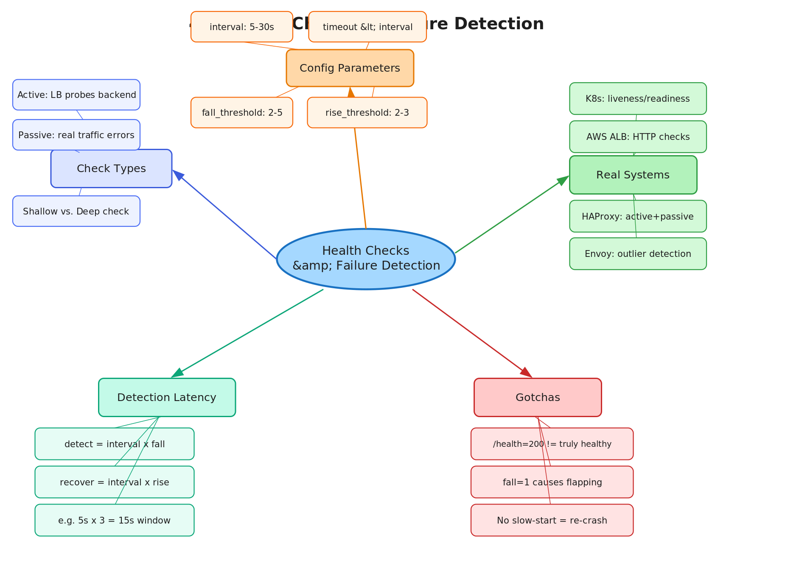

# 4.3 Health Checks and Failure Detection

> **Topic:** Topic 4 — Load Balancing
> **Phase:** B — Scalability Branch
> **Date studied:** 2026-05-19

---

## 1. 🎯 Goal of This Subtopic

> *Why are you studying this? What should you be able to do after this session?*

Be able to design a health check strategy for a load-balanced system — choosing the right check type, interval, threshold, and failure response — so that unhealthy backends are removed before users are impacted. Understand the failure detection latency vs. false-positive trade-off, and explain why naive health checks alone are insufficient for production systems at scale.

---

## 2. ✅ What Mastery Looks Like

> *Concrete, testable proof that you own this concept — not just familiarity.*

- [ ] Can distinguish passive vs. active health checks and explain when each is appropriate without prompting
- [ ] Can explain why a single failed check should not immediately remove a backend (threshold-based eviction) and the cost of not doing so
- [ ] Can design a complete health check setup — check type, interval, timeout, rise/fall thresholds — for a given production scenario
- [ ] Can identify failure detection latency for a given config and explain the user-impact window
- [ ] Can explain the difference between a shallow ping check and a deep synthetic check, and why each is used

> 💡 **Rule of thumb:** If you can teach it to someone else and field their follow-up questions, you've mastered it.

---

## 3. 🗓️ Study Phases to Achieve Mastery

> *A progressive plan from first exposure to interview-ready. Work through each phase in order. Don't move to the next until you can honestly tick every item.*

### Phase 1 — Acquire 📖 💪💪
*Goal: Read deeply enough that you could explain the concept without the doc.*

- [ ] Read **DDIA Chapter 8** (Trouble with Distributed Systems) — particularly the section on detecting failures in asynchronous networks
- [ ] Read **AWS ELB Health Check documentation** — how intervals, thresholds, and check types are configured in production
- [ ] Read **HAProxy health check documentation** — covers passive checks, active checks, and agent checks
- [ ] Read through **Sections 5–9** (Core Definition → How It Works) carefully — don't skim
- [ ] Re-read the **Cheatsheet** (Section 4) and try to recite it from memory after

### Phase 2 — Consolidate ✍️ 💪💪💪
*Goal: Verify you can reproduce the knowledge in your own words without looking.*

- [ ] Close the doc — write out the **Core Definition** from memory, then compare
- [ ] Explain **First Principles** out loud without notes — what problem does this solve and why?
- [ ] Reconstruct the **How It Works** mechanics step by step from memory
- [ ] Restate each **Trade-off** row in your own words — if you can't explain the cost, you don't own it yet

### Phase 3 — Apply 🔧 💪💪💪💪
*Goal: Connect to real systems and simulate interview scenarios.*

- [ ] Go through **Real-World System Examples** (Section 10) — verify each claim independently and add anything missed to **My Notes**
- [ ] Practice the **Interview Application** (Section 12) out loud — say the trigger phrases and your response as if in a live interview
- [ ] Work through **Common Misconceptions** (Section 13) — for each, make sure you can explain *why* the misconception is wrong, not just that it is
- [ ] Trace the **Relationships to Other Concepts** (Section 14) — can you explain each connection without looking?

### Phase 4 — Validate 🧪 💪💪💪💪💪
*Goal: Confirm you actually own it, not just recognize it.*

- [ ] Answer every **Self-Check Quiz** question (Section 15) out loud without looking at your notes
- [ ] Recite the **Cheatsheet** (Section 4) from memory — if you can't, re-do Phase 2
- [ ] Tick off items in **What Mastery Looks Like** (Section 2) — only check a box if you can demonstrate it on demand, not just if it sounds familiar
- [ ] Teach this concept out loud to an imaginary interviewer for 2 minutes without hesitation or notes

---

## 4. 📋 Cheatsheet

> *Everything you need to recall this concept in 30 seconds — for quick review before an interview.*



```
ONE-LINER
  Health checks are how a load balancer knows which backends are safe to send
  traffic to — and how fast it detects when one isn't.

KEY PROPERTIES / RULES
  1. Active checks: LB proactively probes each backend on a fixed interval (TCP, HTTP, HTTPS).
  2. Passive checks: LB watches real traffic for errors/timeouts — no extra probes.
  3. Rise threshold: N consecutive successes before a backend is re-added to the pool.
  4. Fall threshold: M consecutive failures before a backend is evicted from the pool.
  5. Detection latency = interval × fall_threshold (e.g., 5s × 3 = 15s of user impact).

DECISION RULE
  Use active + passive combined: active catches total outages early,
  passive catches application-level errors active pings miss (e.g., 500s on real requests).
  Avoid relying on passive-only in low-traffic systems — a failing backend may
  never see enough requests to trigger eviction.

NUMBERS / FORMULAS
  Detection latency = interval × fall_threshold
  Recovery latency  = interval × rise_threshold
  Typical prod config: interval=5s, timeout=2s, fall=3, rise=2

GOTCHA TO NEVER FORGET
  A health check endpoint that always returns 200 OK (even when the DB is down)
  defeats the entire system — deep checks must actually validate dependencies.
```

---

## 5. 🧠 Core Definition

> *What is it, in one sentence?*

A health check is a mechanism by which a load balancer periodically tests each backend's ability to serve requests, automatically removing unresponsive or unhealthy backends from the active pool and re-adding them once they recover — ensuring traffic is only sent to backends that can handle it.

---

## 6. 📦 Core Concepts

> *The essential building blocks of this subtopic — the terms and ideas you must have solid before going deeper.*

### Active Health Checks
The load balancer itself sends synthetic probe requests to each backend on a fixed schedule, independent of real user traffic. These probes can be TCP (just establish a connection), HTTP (verify a specific path returns a 2xx), or HTTPS. Active checks catch complete outages quickly and deterministically — you know exactly when the check ran and what it got. The downside is they add overhead and can return false positives: a backend that passes the health check but fails on real requests (e.g., the `/health` endpoint is healthy but the `/checkout` handler is broken).

### Passive Health Checks (Observational)
The load balancer monitors real traffic as it flows through — if a backend returns too many 5xx responses or times out on real requests, it is evicted. Passive checks are zero-overhead and reflect actual production behavior, but they require sufficient traffic volume to fire, which makes them unreliable in low-QPS systems. In high-traffic systems, passive checks catch application-level failures that active probes miss.

### Rise and Fall Thresholds
A single failed probe does not immediately remove a backend, and a single successful probe does not immediately re-add it. The fall threshold (e.g., 3 consecutive failures) prevents flapping from transient network hiccups from removing healthy backends. The rise threshold (e.g., 2 consecutive successes) prevents a backend that just restarted from receiving full traffic before it has proven stable. These thresholds directly control the trade-off between detection latency and false-positive evictions.

### Shallow vs. Deep Health Checks
A shallow check (e.g., TCP connect or `GET /ping → 200`) only verifies the process is listening. A deep check (e.g., `GET /health` that internally queries the DB and cache) verifies the full dependency chain. Deep checks catch situations where the application is up but unusable — however, they also risk cascading failures if the health check itself puts load on a degraded downstream service.

### Failure Detection Latency
The time between a backend actually failing and the load balancer stopping traffic to it. This equals `interval × fall_threshold`. During this window, real users hit the failing backend and see errors. Reducing the interval shortens user impact but increases probe overhead across the fleet.

---

## 7. 🔍 First Principles — Why Does This Exist?

> *What fundamental problem does this concept solve? Why was it invented?*

In a distributed system, backends fail silently. A process can crash, a VM can run out of memory, a network partition can isolate a node, or a downstream database can become unavailable — all without the load balancer knowing. Without health checks, the LB continues routing traffic to the failed backend, and users see a stream of errors or timeouts. The fundamental problem is that **networks are asynchronous and nodes fail independently**, so no component can rely on being told when another component has failed — it must detect failure on its own. Health checks solve this by turning a passive assumption ("if I haven't heard otherwise, it's healthy") into an active, continuous verification ("I will keep checking, and I will act on what I observe"). This is the engineering response to the core challenge of distributed systems: you cannot distinguish a slow node from a dead one without a timeout, and timeouts are always a guess.

---

## 8. 🗺️ Mental Models

> *Intuition frames that help you reason about this concept fast — especially under interview pressure.*

### Model 1: The Canary in the Coal Mine
Active health checks are like sending a canary into a mine every 5 seconds. If the canary doesn't come back within 2 seconds (timeout), you count that as a failure. After 3 dead canaries in a row (fall threshold), you stop sending miners (real traffic) into that shaft. The limitation: the canary only takes one path through the mine — if the main tunnel is fine but a side shaft is blocked (a specific endpoint is broken), the canary misses it.

### Model 2: The Probation Officer
The rise threshold is a probation mechanism. A backend that just recovered isn't immediately trusted — it must demonstrate 2 consecutive clean check-ins before being restored to the full pool. This prevents a backend that is thrashing (crashing and restarting in a loop) from being flipped back into production on the first successful restart, only to crash again under load.

### Model 3: Detection Latency = Config × Time
Think of health check config as a dial between "fast detection" and "stability." Shorter intervals and lower thresholds mean you catch failures faster but risk false evictions on transient blips. Longer intervals and higher thresholds mean more stability but longer windows of user-visible errors. The right config depends on your error budget: how many bad requests can your SLO absorb before the impact is unacceptable? That directly implies how large your detection latency window can be.

---

## 9. ⚙️ How It Works — Mechanics

> *Step-by-step or layered explanation of the internal mechanism.*

**Normal (happy) path — active check cycle:**

1. The load balancer maintains a backend pool (e.g., 5 upstream servers). Each backend has a health state: healthy, unhealthy, or draining.
2. Every `interval` seconds (e.g., 5s), the LB sends a probe to each backend — this could be a TCP SYN to port 80, or an HTTP GET to `/health`.
3. If the probe receives a valid response within `timeout` (e.g., 2s), the backend's consecutive failure counter resets to 0.
4. If the probe fails (no response within timeout, connection refused, or wrong status code), the failure counter increments.
5. When the failure counter reaches `fall_threshold` (e.g., 3), the backend is marked unhealthy and removed from the active pool. New connections are no longer routed to it. In-flight requests may be drained or immediately cut, depending on config.
6. Probing continues on the unhealthy backend. When it passes `rise_threshold` (e.g., 2) consecutive checks, it is re-added to the pool with a gradual ramp-up (or immediately, depending on LB implementation).

**Passive check mechanics (parallel path):**

Simultaneously, the LB watches real request responses. When a backend returns 5xx responses or connections time out at a configurable error rate, it is evicted without waiting for the next active probe cycle. This dramatically reduces detection latency for application-level failures in high-traffic systems.

**Failure edge cases:**

- **LB itself is the bottleneck:** If the LB is overwhelmed and probe threads are starved, checks may not fire on schedule — backends appear unhealthy when they aren't. This is why LBs are typically dedicated appliances or run as separate processes.
- **Health check endpoint is not representative:** An app that has its database connection pool exhausted may still return 200 from `/health` if the endpoint doesn't actually query the DB. Deep checks must be explicitly designed.
- **Thundering herd on recovery:** When a backend recovers after an outage and all staggered checks pass simultaneously, the full traffic load hits it at once before it has warmed up its connection pool and caches. Gradual ramp-up (slow-start) mitigates this.

**Key parameters to specify in an interview:**
- `interval`: 5–30 seconds depending on tolerance for detection latency
- `timeout`: Must be less than `interval`; typically 1–5 seconds
- `fall_threshold`: 2–5; lower = faster detection but more false positives
- `rise_threshold`: 2–3; prevents flapping backends from being prematurely reinstated

---

## 10. 🏭 Real-World System Examples

> *Where does this appear in production systems you know?*

| System | How This Concept Applies | Notes |
|--------|--------------------------|-------|
| AWS ALB / NLB | Active HTTP/HTTPS/TCP checks with configurable interval (5–300s), timeout, healthy/unhealthy threshold. ALB checks the `/health` path by default; NLB uses TCP checks. | ALB health checks are per-target-group; different groups can have different check configs |
| HAProxy | Supports both active checks (HTTP/TCP) and passive checks (observing real traffic errors). Uses `rise` and `fall` params. Also supports "agent checks" — a separate lightweight TCP channel the backend uses to signal its own load/state. | Agent checks allow a backend to proactively remove itself before a hard failure |
| NGINX Plus | Active upstream health checks via `health_check` directive. NGINX open-source uses passive-only (on real traffic). | Active checks are a paid feature in NGINX Plus |
| Kubernetes (kubelet) | Liveness probes (restart pod if failed), readiness probes (remove from Service endpoints if failed), startup probes (give slow-starting apps extra time). Three check types: HTTP, TCP, exec. | Readiness probe is the direct health-check equivalent for load balancer integration |
| Envoy (service mesh) | Outlier detection — passive eviction when backends exceed error rate or consecutive 5xx thresholds. Also supports active health checks via the health_check filter. | Envoy's outlier detection has ejection percentage cap to avoid removing all backends simultaneously |

---

## 11. ⚖️ Trade-offs

> *Every design decision has a cost. What are you giving up?*

| ✅ Benefit | ❌ Cost / Limitation |
|-----------|---------------------|
| Fast failure detection removes unhealthy backends before users are widely impacted | Detection latency window (interval × fall_threshold) means some users will hit the failing backend during detection |
| Threshold-based eviction prevents flapping from transient blips | Higher thresholds increase detection latency — there is no free lunch |
| Passive checks catch real application errors (5xx on actual requests) | Passive checks require traffic volume to fire; useless in low-QPS systems or for backends with sparse traffic |
| Deep health checks validate full dependency chain (DB, cache, downstream APIs) | Deep checks add load to already-stressed dependencies and can trigger cascading failures during degraded states |
| Rise threshold prevents premature reinstatement of recovering backends | Rise threshold delays recovery — the backend is healthy but sitting idle while it accumulates check passes |

---

## 12. 🎯 Interview Application

> *How do you use this concept in a design interview? What triggers it?*

**When an interviewer asks / says:**
- "How does the load balancer know when a server goes down?"
- "What happens if one of your backend servers crashes?"
- "How do you ensure high availability in your design?"
- "Walk me through failover in your system."

**What you say / do:**
In the deep-dive or high-level design phase, after introducing your load balancer, proactively add: "The LB needs active health checks — I'd configure HTTP checks to `/health` every 5 seconds with a 2-second timeout, evicting after 3 consecutive failures and restoring after 2 consecutive passes. This gives us a 15-second worst-case detection window, which I'd pair with passive checks to catch application-level errors faster in high-traffic paths." This signals you understand operational realities, not just the happy path.

**The trade-off statement (memorize this pattern):**
> "If we use short intervals with low thresholds, we get faster detection but risk false evictions on transient network blips. For this system, I'd tune toward a 5-second interval with a fall threshold of 3 — that's a 15-second worst-case window — because our SLO gives us budget for that, and it avoids flapping in a noisy network environment."

---

## 13. ⚠️ Common Misconceptions & Gotchas

> *What do candidates get wrong? What nuance is the interviewer probing for?*

- ❌ **Misconception:** A health check endpoint that returns 200 OK means the backend is healthy.
  ✅ **Reality:** A shallow check only means the process is listening. If the health check endpoint doesn't verify database connectivity, cache availability, or critical service dependencies, a backend can appear healthy while being completely unable to serve real requests. Deep checks must explicitly query downstream dependencies — but must also be designed carefully to avoid adding load during degraded states.

- ❌ **Misconception:** Removing a backend immediately on the first failed health check is the right approach for fast detection.
  ✅ **Reality:** A single failure is almost always a transient network blip. Immediate eviction causes constant flapping in any real network, which amplifies load on remaining healthy backends. Threshold-based eviction (2–3 consecutive failures) is the industry standard for a reason.

- ❌ **Misconception:** Once a backend is marked healthy again, it should immediately receive its full share of traffic.
  ✅ **Reality:** A recovering backend likely has cold caches, cold connection pools, and hasn't warmed up its JVM or runtime. Flooding it immediately with full traffic often causes it to fail again. Gradual slow-start (e.g., linearly ramping from 0 to full weight over 30 seconds) is standard in production LBs like HAProxy and NGINX.

- ❌ **Misconception:** Passive checks are always better than active checks because they reflect real traffic.
  ✅ **Reality:** Passive checks require traffic to fire. A backend that is used only 10 times per minute could stay in the pool for minutes after failing before passive eviction triggers. Active checks provide a guaranteed detection latency ceiling regardless of traffic volume.

---

## 14. 🔗 Relationships to Other Concepts

> *How does this connect to adjacent subtopics in this topic or across the roadmap?*

- **Builds on:** 4.1 L4 vs. L7 load balancers — the check type (TCP vs. HTTP) is tied directly to which layer the LB operates at. L4 LBs can only do TCP checks; L7 LBs can inspect HTTP response codes and bodies.
- **Enables:** 4.4 Failover and redundancy — health checks are the detection mechanism that triggers failover. Without reliable failure detection, automatic failover is impossible.
- **Tension with:** 4.6 Sticky sessions — sticky sessions tie a user to a specific backend. When health checks evict that backend, the session must be broken or migrated, creating a direct conflict between session affinity and health-based pool management.

---

## 15. 🧪 Self-Check Quiz

> *Can you answer these without looking? If not, you haven't internalized it yet.*

1. What is the difference between an active health check and a passive health check, and when would you rely on each?

   > 💡 *Think through your answer before expanding — if you hesitate, revisit Section 6.*

Active health check: The load balancer proactively sends synthetic probe
requests to each backend on a fixed interval (e.g., every 5 seconds),
independent of real user traffic. It waits for a valid response within
a timeout window. No real traffic is required.

Passive health check: The load balancer observes real traffic flowing
through it. If a backend returns too many errors or times out on real
requests above a threshold, it is evicted. No synthetic probes are sent.

When to rely on each:
- Low traffic systems: active checks only — passive checks need traffic
  volume to fire and will be slow or blind without it.
- High traffic systems: both combined — active provides a guaranteed
  detection latency ceiling; passive catches application-level errors
  on real request paths that active pings may miss (e.g., /checkout
  failing while /ping returns 200).

The key combination: active for timing guarantees, passive for
real-traffic fidelity.

2. A system is configured with interval=10s, timeout=3s, fall_threshold=3, rise_threshold=2. A backend crashes at t=0. What is the worst-case time before users stop being routed to it? What is the worst-case time before a recovered backend is back in the pool?

   > 💡 *Think through your answer before expanding — if you hesitate, revisit Section 9.*

Detection (worst case): interval × fall_threshold = 10s × 3 = 30 seconds

Worst case because: the probe may have just fired at t=0 right as the
backend crashed. The LB then waits a full interval (10s) before the
next probe. After 3 consecutive failed probes, the backend is evicted.
Total: up to 30 seconds of users hitting the failed backend.

Recovery (worst case): interval × rise_threshold = 10s × 2 = 20 seconds

Worst case because: the backend may have just recovered right after a
probe fired. It waits another full interval (10s) before the first
passing check, then another 10s for the second. After 2 consecutive
passing probes, it re-enters the pool.
Total: up to 20 seconds of a healthy backend sitting idle.

Key insight: during the detection window, real users are hitting the
failed backend and seeing errors. This window is your direct SLO cost
per incident — tune interval and fall_threshold to keep it within
your error budget.

3. Why is it dangerous to set fall_threshold=1 in a production load balancer?

   > 💡 *Think through your answer before expanding — if you hesitate, revisit Sections 6 and 8.*

fall_threshold=1 means a single failed probe immediately evicts a backend.

The danger: a single failure is almost always a transient event —
a dropped packet, a momentary GC pause, a brief network hiccup.
These happen constantly in any real production network.

Consequence — flapping:
1. A healthy backend misses one probe → immediately evicted
2. Remaining backends absorb its traffic → they go under higher load
3. Under higher load, they may also start missing probes → more evictions
4. Each eviction amplifies load on the survivors → cascade risk
5. The evicted backend passes its next probe → re-enters the pool
6. Load redistributes → cycle repeats

The instability isn't just annoying — it actively degrades availability
by repeatedly removing healthy backends and amplifying load on the
survivors. In the worst case, the cascade takes out the entire pool.

Fix: fall_threshold=2 or 3. Accept slightly slower detection latency
in exchange for dramatically better pool stability. The trade-off is
always: speed of detection vs. resistance to false evictions.

4. Name a real system (not a load balancer itself) that uses health check / readiness concepts, and explain concretely how it works.

   > 💡 *Think through your answer before expanding — if you hesitate, revisit Section 10.*

Kubernetes implements health check concepts through three probe types,
each serving a distinct purpose:

Liveness probe: "Is this pod alive?"
- If it fails, kubelet restarts the pod
- Use case: detect deadlocks or hung processes that are running but
  not making progress
- Example: a Java app with a deadlocked thread pool — the process is
  alive but can't serve requests

Readiness probe: "Is this pod ready to receive traffic?"
- If it fails, the pod is removed from the Service's endpoint slice —
  the LB stops routing to it, but the pod is NOT restarted
- This is the direct health-check equivalent for load balancer integration
- Use case: during startup warmup, or when a pod is temporarily
  overloaded and wants to shed traffic

Startup probe: "Has this pod finished starting up?"
- Prevents liveness/readiness probes from firing too early and killing
  a slow-starting app
- Once it passes, liveness and readiness probes take over

Three check types available for all probes:
- HTTP: GET request to a path, expects 2xx response
- TCP: verifies a TCP connection can be established
- Exec: runs a command inside the container, success = exit code 0

Key interview insight: readiness probe failure ≠ pod restart.
This is the most common misconception — readiness removes from routing,
liveness triggers restart. They are independent dials.

5. An interviewer pushes back: "Your health check endpoint always returns 200 — isn't that good enough?" What do you say?

   > 💡 *Think through your answer before expanding — if you hesitate, revisit Sections 6 and 13.*

"Returning 200 is not good enough — that's a shallow check. It only
verifies the process is listening, not that it can actually serve
real requests.

What we need is a deep check: the /health endpoint should internally
query the database, verify cache connectivity, and check any critical
downstream dependencies. Only if all of those succeed should it
return 200.

The classic failure mode: DB connection pool is exhausted, every real
request fails, but /health returns 200 because it doesn't touch the DB.
The LB sees a healthy backend and keeps routing traffic to it — users
see 100% errors.

That said, deep checks have a real trade-off: they add load to already-
stressed dependencies. If the DB is degrading, 10 backends each hitting
it every 5 seconds for health checks accelerates the degradation.

The mitigation: keep the deep check lightweight (a cheap SELECT 1,
not a complex query), cap the check timeout conservatively, and consider
circuit-breaking the health check's DB query if DB latency exceeds
a threshold — returning a cached 'healthy' status briefly rather than
hammering a degraded dependency."
---

## 16. 📚 Further Reading

> *Optional: links, chapters, or resources for deeper understanding.*

- [ ] **DDIA Chapter 8** — "Trouble with Distributed Systems" (Kleppmann) — covers why detecting failures in async networks is fundamentally hard; the theoretical foundation for health check design
- [ ] **HAProxy Health Check Documentation** — https://www.haproxy.com/documentation/haproxy-configuration-tutorials/service-reliability/health-checks/ — covers active, passive, and agent checks with real config examples
- [ ] **AWS ELB Health Check Docs** — https://docs.aws.amazon.com/elasticloadbalancing/latest/application/target-group-health-checks.html — concrete production defaults and guidance
- [ ] **Kubernetes Probes Documentation** — https://kubernetes.io/docs/tasks/configure-pod-container/configure-liveness-readiness-startup-probes/ — liveness vs. readiness vs. startup probes explained with config examples
- [ ] **Envoy Outlier Detection** — https://www.envoyproxy.io/docs/envoy/latest/intro/arch_overview/upstream/outlier — how passive eviction works in a service mesh context

---

## 17. ✍️ My Notes

> *Personal observations, things that confused me, analogies that helped.*

One Liner
Health checks are how a load balancer knows which backends are safe to send traffic to — and how fast it detects when one isn't.
When a server is deemed To have failed, the load balancer will bring this server out of the backend pool. Later, when it's deemed successful again (meaning it passes a health check), it will bring the server back into the backend pool to serve traffic. 

detection latency = interval × fall_threshold

Health check consists of active health check and passive health check. Active health check means the load balancer will ping the backend servers at regular intervals and wait for a successful response before deeming the server healthy. A passive health check will watch for the real traffic that each backend is serving and watch for the success or failure rate of that traffic. If the failure rate of the traffic passes a certain threshold, then it will move the server out of load balancing. 
Typically, we configure four parameters for a load balancer for active checks:
1. Interval seconds, which determines how frequently the load balancer sends requests to each of the backends.
2. Timeout seconds. It determines how many seconds the load balancer waits for a response from a server before it deems the requests as unsuccessful.
3. Rise threshold, which means that once a server gives an n number of successful responses, the load balancer would deem the server as healthy and bring it back into the backend pool.
4. Fall threshold. Similarly, it has an n number, which determines the number of consecutive failures before we push the backend server out of the backend pool.

In terms of active checks, we also have shallow checks and deep checks.

For a shadow check, we are basically checking that the server is open and listening to requests and is open for requests. Whereas a deep check is when we check that the server, not only itself, but also its underlying dependencies, its caches, and its databases are all serving requests in a healthy fashion. deep health checks hammering a degraded DB, causing mass eviction and pool collapse.

The trade-off between health checks is that when we have a faster detection window, we are actually pinging the backend more, but we might also inadvertently increase artificial traffic given to the backends. 
In terms of passive health checks, they catch real application errors and bring the servers out of the backend pool. If we only have a passive health check alone, we cannot detect individual API failures because the passive check only checks for aggregate health of server responses. 

In high-level design, once we've decided we want to add a load balancer, we need to proactively state that the load balancer will need active and passive health checks. In terms of active health checks, the parameters we need to add are:
- interval
- timeout
- n consecutive failures
- n consecutive passes

We need to make sure that when configuring these few parameters, it fits within our SLO window. 

Never evict more than X% of the pool simultaneously. This is the fix for cascading eviction.

Rise threshold gates re-entry; slow-start ramps traffic weight gradually to prevent re-crash.

-- 

Cold Recall

Active Health Check
Active Health Check is when the load balancer actively probes our nodes with a health check. The aim of the health check is to quickly detect failing nodes and bring the failing node out of traffic. There are two kinds of Active Health Check:
1. A TCP-based connection check to check that the connection is successful
2. A health-based HTTP check, which checks that the service can actually listen and process a request

Passive Health Check
A passive health check does not probe the service nodes. It passively monitors the actual live requests given to the service node, and when we start to see consecutive failures and errors given by the service node, that's when the passive check will signal to the load balancer that a node is unhealthy. 

Typically, there are four parameters we should use to configure an active health check:
1. Interval Count - interval seconds between each probe
3. Timeouts - timeout window before declaring a probe as failed
4. Rising threshold - N consecutive successes before bringing a node into LB pool
5. Falling threshold - M consecutive failures before taking a node out of LB pool

A single fail check could be caused by a short network blip. If we were to take the node out of our node balancer because of a single failure, we risk having a false positive. Subsequently, when we bring it back, we are creating a flappy condition, and that flappy condition increases the load distributed to the rest of the active nodes. 
Threshold based eviction means we need n number of failures before we declare the node has failed and take it out of the LB pool. 

Typical active health check setup
- interval 5s
- timeout - 2s
- rising threshold - 2
- falling threshold - 2

When to use Active health check and when to use passive health check?
For a virtual distributed system, we should always use both the active health check and the passive health check together. The reason is that for a passive health check, it currently monitors live traffic for failures, but this requires a sufficient number of traffic always to detect the failure in time. When we use the active health check, it takes out the uncertainty of traffic load to detect failures and is always subject to a maximum failure window before we can take a node out of the LB pool. Therefore, having both checks in place creates a more efficient mechanism to remove nodes out of the LB pool. 

Here we have an interval probe of 5 seconds. timeout of 2seconds and a fall threshold of 3. That means that we will need three consecutive failures where each failure takes Seven seconds to register as a failure. In total, our system will lapse about 21 seconds before the node balancer can take a node out of the LB pool. During these 21 seconds, the traffic served to the node will always be failing. 

Shallow ping check is when we use a TCP check to check just that the connection is successful, or an HTTP health check to check that the node is actually listening to requests. A deep ping check happens at the HTTP level, where the health check not only checks that the HTTP port is listening and serving requests, but also that the underlying downstream services and our persistent data stores are actively working. 

The downside of deep check is that it may check that the downstream services and the data stores are all working, but it cannot check that the actual live traffic is working as intended. The idea here is that health checks in general are just a check mechanism that our services are running, but it does not actually completely mean that the application is able to serve real requests successfully. To ensure that the application is indeed serving requests successfully, we would need to do passive health checks to make sure that the real traffic itself is serving successful responses. 

Deep health check cascade:
  DB becomes slow (not down) → health check times out
  → node removed from pool
  → remaining nodes absorb more traffic
  → their DB connections also slow → their health checks timeout
  → more nodes removed → full cascade

Mitigation:
  - Set deep health check timeout > expected DB p99 latency
  - Use shallow check for pool membership, passive check for 
    real traffic quality — don't let a slow dependency 
    trigger mass node eviction