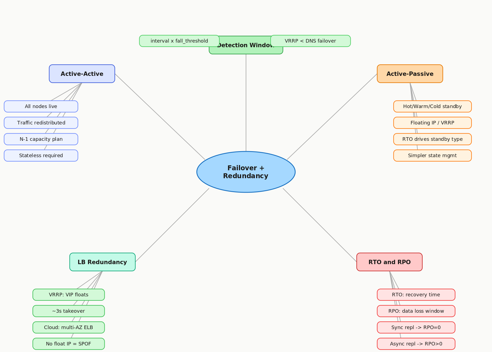

# 4.4 Failover and Redundancy

> **Topic:** Topic 4 — Load Balancing
> **Phase:** B — Scalability Branch
> **Date studied:** 2026-05-20

---

## 0. 🗺️ Topic Overview

### What This Topic Is About

Failover and redundancy are how you design a system so that **no single component failure takes down the whole service.** The core idea: failure is the baseline, not the exception — hardware dies, processes crash, networks partition. This topic is about designing *around* that reality rather than hoping it doesn't happen.

There are two complementary concepts:
- **Redundancy** — provisioning duplicate components so a replacement always exists
- **Failover** — the mechanism that routes traffic *away* from the failed component and toward the replacement

This topic covers the two failover modes (active-active vs. active-passive), how the load balancer *itself* is made redundant (floating IP / VRRP), and how RTO/RPO drive your architecture choices.

### 🎯 What to Focus On

**1. Active-active vs. active-passive** — you must be able to compare them on availability, cost, complexity, and state requirements. Interviewers will probe *why* you chose one over the other.

**2. The LB itself is a SPOF** — this is the #1 gotcha. A second LB does nothing if it doesn't share a floating IP (VRRP). Understand how VRRP / floating IPs work mechanically.

**3. The detection lag formula** — failover speed is bounded by `health_check_interval × fall_threshold`. Know this, know why it matters, know the difference between floating IP failover and DNS failover in terms of how fast they actually take effect.

**4. RTO vs. RPO** — these are your decision levers. Hot standby vs. warm vs. cold is just RTO expressed as an architectural choice. Financial system → RPO = 0 → synchronous replication. Analytics → RPO = minutes → async is fine.

---

## 1. 🎯 Goal of This Subtopic

> *Why are you studying this? What should you be able to do after this session?*

Be able to design a load balancing setup that has no single point of failure by applying the right failover strategy (active-active vs. active-passive) for a given availability requirement. Understand how redundancy is achieved at each tier — load balancer, application server, and database — and be able to walk an interviewer through the failure path and recovery path of any component in your design. Identify when failover is automatic vs. manual and why that distinction matters.

---

## 2. ✅ What Mastery Looks Like

> *Concrete, testable proof that you own this concept — not just familiarity.*

- [ ] Can define active-active and active-passive failover and state the availability, cost, and complexity trade-off of each without notes.
- [ ] Can design a load balancer setup with no SPOF — including how the load balancer itself is made redundant (floating IP / VRRP / anycast).
- [ ] Can walk through the failure path of any component in a tiered architecture: what fails, who detects it, what happens to in-flight requests, and how the system recovers.
- [ ] Can explain the difference between RTO and RPO and apply both to justify a failover strategy.
- [ ] Can identify when to use warm standby vs. hot standby vs. cold standby based on RTO requirements.

> 💡 **Rule of thumb:** If you can teach it to someone else and field their follow-up questions, you've mastered it.

---

## 3. 🗓️ Study Phases to Achieve Mastery

> *A progressive plan from first exposure to interview-ready. Work through each phase in order. Don't move to the next until you can honestly tick every item.*

### Phase 1 — Acquire 📖 💪💪
*Goal: Read deeply enough that you could explain the concept without the doc.*

- [ ] **DDIA Chapter 8** — "Trouble with Distributed Systems" (Kleppmann) — fundamental limits of failure detection in async networks
- [ ] **AWS Docs: High Availability and Failover** — docs.aws.amazon.com/whitepapers/latest/real-time-communication-on-aws/high-availability-and-scalability-on-aws.html
- [ ] **Keepalived / VRRP Overview** — keepalived.readthedocs.io — how virtual IPs float between load balancers on failure
- [ ] **ByteByteGo: "How to Avoid Single Points of Failure"** — blog.bytebytego.com — visual walkthrough of redundancy at each tier
- [ ] Read through **Sections 5–9** (Core Definition → How It Works) carefully — don't skim
- [ ] Re-read the **Cheatsheet** (Section 4) and try to recite it from memory after

### Phase 2 — Consolidate ✍️ 💪💪💪
*Goal: Verify you can reproduce the knowledge in your own words without looking.*

- [ ] Close the doc — write out the **Core Definition** from memory, then compare
- [ ] Explain **First Principles** out loud without notes — what was the pain before redundancy existed?
- [ ] Reconstruct the **active-active vs. active-passive** failure paths step by step from memory
- [ ] Restate each **Trade-off** row in your own words — if you can't explain the cost, you don't own it yet

### Phase 3 — Apply 🔧 💪💪💪💪
*Goal: Connect to real systems and simulate interview scenarios.*

- [ ] Go through **Real-World System Examples** (Section 10) — verify each claim independently and add anything missed to **My Notes**
- [ ] Practice the **Interview Application** (Section 12) out loud — say the trigger phrases and your response as if in a live interview
- [ ] Work through **Common Misconceptions** (Section 13) — for each, make sure you can explain *why* the misconception is wrong, not just that it is
- [ ] Trace the **Relationships to Other Concepts** (Section 14) — can you explain each connection without looking?

### Phase 4 — Validate 🧪 💪💪💪💪💪
*Goal: Confirm you actually own it, not just recognize it.*

- [ ] Answer every **Self-Check Quiz** question (Section 15) out loud without looking at your notes
- [ ] Recite the **Cheatsheet** (Section 4) from memory — if you can't, re-do Phase 2
- [ ] Tick off items in **What Mastery Looks Like** (Section 2) — only check a box if you can demonstrate it on demand, not just if it sounds familiar
- [ ] Teach this concept out loud to an imaginary interviewer for 2 minutes without hesitation or notes

---

## 4. 📋 Cheatsheet

> *Everything you need to recall this concept in 30 seconds — for quick review before an interview.*



```
ONE-LINER
  Failover is the mechanism that routes traffic away from a failed component;
  redundancy is the design that ensures a replacement always exists.

KEY PROPERTIES / RULES
  1. Active-Active:  All nodes handle traffic simultaneously; failover = traffic redistributed.
  2. Active-Passive: One hot standby — takes over via floating IP/DNS flip on primary failure.
  3. LB redundancy:  The LB itself must be redundant (VRRP/floating IP) or it IS the SPOF.
  4. Detection lag:  Failover can't happen faster than health check detects failure
                    (interval × fall_threshold).
  5. RTO vs. RPO:   RTO = how fast you recover; RPO = how much data you can lose.

DECISION RULE
  Use active-active when: cost allows it and stateless routing makes it feasible.
  Use active-passive when: cost is constrained or state makes dual-active unsafe.
  Always: make the LB itself redundant before worrying about backend redundancy.

NUMBERS / FORMULAS
  Failover detection window = health_check_interval × fall_threshold
  e.g., 5s interval × 3 failures = up to 15s of impact before failover
  Active-active: ~50% capacity loss per node failure (plan headroom accordingly)

GOTCHA TO NEVER FORGET
  Adding a second load balancer without a floating IP just moves the SPOF — it doesn't
  eliminate it.
```

---

## 5. 🧠 Core Definition

> *What is it, in one sentence?*

**Failover** is the automatic (or manual) process of redirecting traffic from a failed component to a healthy standby, while **redundancy** is the architectural practice of provisioning duplicate components so that no single failure takes down the system.

---

## 6. 📦 Core Concepts

> *The essential building blocks of this subtopic.*

### Active-Active Failover
In active-active, all nodes in the redundancy group simultaneously serve traffic. When one node fails, the load balancer simply stops routing to it and the remaining nodes absorb its share. This maximizes resource utilization but requires every node to be sized to handle the full load redistribution — a cluster of 3 nodes each at 33% must survive at 50% if one fails. Stateless services fit naturally; stateful services require session replication or externalized state.

### Active-Passive Failover
In active-passive, one primary node handles all traffic while one or more standby nodes sit idle (or handle minimal load). On failure, a floating IP or DNS update flips traffic to the standby. The standby can be hot (running, in sync, near-instant takeover), warm (running but partially synced, short recovery time), or cold (off, full boot required, long recovery). Hot standby is expensive but achieves RTO of seconds; cold standby is cheap but can mean minutes or longer of downtime.

### Floating IP / VRRP
The load balancer itself is a component that can fail. To avoid making it a SPOF, two LB nodes share a Virtual IP (VIP) using VRRP (Virtual Router Redundancy Protocol) or a cloud-native equivalent. The VIP is "owned" by the primary LB. If the primary dies, the secondary claims the VIP within seconds — from the client's perspective, the IP never changed. Without this, adding a second LB is theater: DNS or upstream routing still points at one specific machine.

### RTO and RPO
Recovery Time Objective (RTO) is how quickly the system must be restored after a failure — the acceptable downtime window. Recovery Point Objective (RPO) is how much data loss is acceptable — the acceptable staleness of the standby. A financial ledger might require RPO = 0 (zero data loss, synchronous replication required) and RTO = 30 seconds. An analytics dashboard might accept RPO = 1 hour and RTO = 10 minutes. Failover strategy selection is fundamentally driven by these two parameters.

### Failover Detection and Propagation
Failover cannot happen faster than the health check system detects the failure. Detection latency = `check_interval × fall_threshold`. After detection, the LB must drain in-flight connections (or abruptly drop them), update its routing table, and optionally signal DNS. DNS propagation adds further delay if failover relies on it (TTLs of 30–60 seconds are common). For sub-second failover, floating IPs at the network layer are far faster than DNS-based cutover.

---

## 7. 🔍 First Principles — Why Does This Exist?

> *What fundamental problem does this concept solve? Why was it invented?*

In any sufficiently large system, failure of individual components is not exceptional — it is the baseline expectation. Hardware fails, processes crash, networks partition, deployments introduce bugs. Before redundancy patterns were formalized, a single server failure meant full service outage. The root pain: no single piece of software can guarantee its own availability, because it cannot rescue itself after a crash. The solution is to externalize responsibility for failure detection and recovery to a separate component (the load balancer and standby nodes), which observes the failing component from outside and routes around it. Redundancy formalizes this into an architectural property — not a heroic operational response, but a designed-in capability.

---

## 8. 🗺️ Mental Models

> *Intuition frames that help you reason about this concept fast.*

### Model 1: The Understudy Actor
Think of active-passive like a Broadway understudy: the primary actor is always on stage; the understudy watches every rehearsal and knows every line, but never goes on unless the star is incapacitated. The audience (traffic) sees the same show. The cost: you pay two salaries but get one performance at a time. The limit: the understudy still needs lead time to take the stage — the faster the handoff, the more expensive the preparation.

### Model 2: The Two-Lane Highway
Active-active is a two-lane highway where both lanes carry traffic simultaneously. If one lane is blocked, all traffic shifts to the other — it slows down but keeps moving. This model breaks when you forget that a two-lane highway with a two-lane demand is already at 100% capacity: one lane closure → gridlock. Capacity headroom is non-negotiable in active-active designs.

### Model 3: The Floating Phone Number
A floating IP / VRRP is like a Google Voice number: the number never changes, but which phone it rings is reassigned on the fly. Clients call the same number (VIP) and the routing infrastructure silently updates which physical machine answers. This is why LB redundancy via floating IP is invisible to clients — unlike DNS failover, which forces every client to re-resolve.

---

## 9. ⚙️ How It Works — Mechanics

> *Step-by-step explanation of the internal mechanism.*

**Active-Passive Failover Flow (Happy Path):**
1. Primary LB serves all traffic. Primary LB sends VRRP advertisement packets to secondary every ~1s. Secondary listens — if no advertisement is received within `dead_interval` (3 × 1s = 3s), it claims the floating VIP.
2. Primary LB runs health checks against all backend nodes (e.g., HTTP GET /health every 5s, fall threshold = 3).
3. If a backend fails 3 consecutive checks → LB marks it down, stops routing new connections, drains existing connections (connection draining, typically 30s), then removes from pool.
4. If primary LB itself fails → VRRP heartbeat stops → secondary LB claims the floating VIP after `dead_interval` (typically 3s) → clients resume connecting, unaware of the switch.

**Active-Active Failover Flow:**
1. Two (or more) LBs both hold the VIP via anycast or DNS round-robin. Both simultaneously receive and route traffic.
2. Each LB independently monitors backend health. Both update their own routing tables.
3. On backend failure: whichever LB detects it removes it from its pool. Both should converge to the same view within one check cycle.
4. On LB failure: traffic naturally stops arriving at the failed LB (TCP connections time out); clients retry and hit the surviving LB.

**Key parameters to memorize:**
- Health check interval: 5–10s is typical production default
- Fall threshold: 2–3 consecutive failures (balances detection speed vs. flap sensitivity)
- Rise threshold: 2–3 consecutive successes before re-adding to pool (prevents oscillation)
- VRRP dead interval: 3 × advertisement interval (typically 3s)
- Connection draining: 15–60s depending on request duration

**Stateful failover consideration:** If the primary holds session state in memory and fails, the passive inherits the VIP but not the session state. This is why session state must be externalized (Redis, database) before active-passive failover is truly seamless.

---

## 10. 🏭 Real-World System Examples

> *Where does this appear in production systems you know?*

| System | How This Concept Applies | Notes |
|--------|--------------------------|-------|
| AWS ELB / ALB | Active-active across multiple AZs; each AZ runs independent LB nodes; cross-zone load balancing distributes traffic evenly | AWS abstracts VRRP — you configure multi-AZ and AWS handles LB redundancy |
| HAProxy + Keepalived | Classic on-prem pattern: two HAProxy nodes share a VIP via VRRP (Keepalived); primary serves, secondary takes VIP if primary's VRRP heartbeat stops | VRRP dead interval ~3s; failover is near-instant and DNS-independent |
| Nginx + Keepalived | Same pattern as HAProxy — common in self-managed Kubernetes ingress setups | Keepalived also supports health check scripts to demote the primary if Nginx process dies |
| Google Cloud DNS with health checks | DNS-based failover: health check failure → DNS record automatically updated to point to backup IP | DNS TTL of 30–60s means 30–60s of impact even after health check detects failure — slower than floating IP |
| MySQL with MHA / Orchestrator | Active-passive database failover: replica is promoted to primary on primary failure; VIP or DNS updated to point at new primary | RPO depends on whether sync or async replication was used; async replication can mean seconds of data loss |

---

## 11. ⚖️ Trade-offs

> *Every design decision has a cost. What are you giving up?*

| ✅ Benefit | ❌ Cost / Limitation |
|-----------|---------------------|
| Active-active: full resource utilization, seamless failover | Requires stateless or replicated state; capacity must be headroom-aware (N-1 capacity planning) |
| Active-passive: simpler state management, no split-brain risk | Idle standby wastes 50%+ of resource cost; failover takes longer (VRRP or DNS flip) |
| Floating IP (VRRP): near-instant, client-transparent LB failover | Only works on L2-adjacent nodes (same subnet/VLAN); not viable across datacenters or cloud regions |
| DNS-based failover: works globally across regions | DNS TTL means 30–300s of in-flight requests still hitting the failed node after failover triggers |
| Hot standby: RTO of seconds | Doubles hardware/cloud cost; synchronous replication required for RPO = 0, adding write latency |
| Cold standby: minimal cost | RTO of minutes to tens of minutes; unacceptable for low-tolerance services |

---

## 12. 🎯 Interview Application

> *How do you use this concept in a design interview?*

**When an interviewer asks / says:**
- "What happens when this load balancer goes down?"
- "How do you ensure high availability for the frontend tier?"
- "What's your recovery time if the primary database fails?"
- "Walk me through a failure scenario — how does your system recover?"

**What you say / do:**
When asked about availability, immediately address each tier top-to-bottom: load balancer → application servers → database. For the LB, name VRRP/floating IP for on-prem or multi-AZ ELB for cloud. For app servers, state active-active with health-check-based eviction. For database, name active-passive with a stated RTO/RPO. This structured sweep signals system-level thinking.

**The trade-off statement (memorize this pattern):**
> "If we choose active-active, we get zero-downtime failover and full resource utilization, but we pay in complexity — every node must be stateless or share state, and we must size each node for N-1 capacity. For this system's stateless API tier, active-active is the right call. For the database, we'll use active-passive with async replication — accepting a potential RPO of a few seconds — because synchronous replication would add write latency we can't afford."

---

## 13. ⚠️ Common Misconceptions & Gotchas

> *What do candidates get wrong?*

- ❌ **Misconception:** Adding a second load balancer eliminates the LB SPOF.
  ✅ **Reality:** Only if both share a floating IP (VRRP) or DNS round-robin routes to both. If upstream DNS or the router still points to a single IP, the second LB is unreachable on primary failure — it's not a hot standby, it's a cold one you can't reach.

- ❌ **Misconception:** Active-active is strictly better than active-passive because both nodes are utilized.
  ✅ **Reality:** Active-active requires stateless design or synchronized state. For stateful services (session-heavy, write-heavy databases), active-active creates split-brain risk. Active-passive is often the correct and safer choice for databases.

- ❌ **Misconception:** DNS failover is fast because health checks trigger it immediately.
  ✅ **Reality:** DNS failover triggers the DNS record update immediately, but clients cache the old record until TTL expires (30–300s). In-flight requests and new connections from clients with a cached record still hit the dead node. Floating IP failover has no such lag.

- ❌ **Misconception:** Failover automatically handles in-flight requests without any user impact.
  ✅ **Reality:** TCP connections to the failed node are dropped. Connection draining reduces the impact window but cannot eliminate it for already-established connections to a crashed (vs. gracefully removed) node. Brief user errors during failover are expected — the goal is to minimize, not eliminate, the window.

---

## 14. 🔗 Relationships to Other Concepts

> *How does this connect to adjacent subtopics in this topic or across the roadmap?*

- **Builds on:** 4.3 Health Checks and Failure Detection — failover can't trigger without health check detecting failure first; the detection latency formula (interval × fall_threshold) directly bounds the fastest possible failover time.
- **Enables:** 4.7 Global vs. Local Load Balancing — multi-region failover is the global-scale extension of the same active-passive / active-active patterns, with DNS-based routing replacing VRRP.
- **Tension with:** 2.7 Stateless vs. Stateful Systems — active-active failover is trivial for stateless services and dangerous for stateful ones; this is why stateless design (Topic 3) is the prerequisite for scalable, simple failover.

---

## 15. 🧪 Self-Check Quiz

> *Can you answer these without looking?*

1. What is the difference between active-active and active-passive failover? Give one scenario where each is clearly the right choice.

   > 💡 *Think through your answer before expanding — if you hesitate, revisit Section 6.*

Active-active: all nodes simultaneously serve traffic; on failure, the remaining 
N-1 nodes absorb the failed node's share. Requires stateless design or 
synchronized state, and N-1 capacity headroom on every node.

Active-passive: one primary serves all traffic; one or more standbys sit idle. 
On failure, standby claims the floating VIP via VRRP and becomes the new primary.

Active-active → right choice: stateless compute tier (e.g., API servers, 
web tier) where any node can handle any request and state is externalized.

Active-passive → right choice: databases or any stateful component where 
dual-active writes risk split-brain (two nodes accepting conflicting writes 
simultaneously).

2. A system uses two HAProxy load balancers with Keepalived. The VRRP advertisement interval is 1s and the dead interval is 3s. How long does it take for the secondary to claim the VIP after the primary crashes?

   > 💡 *Think through your answer before expanding — if you hesitate, revisit Section 9.*

Dead interval = 3 × advertisement interval = 3 × 1s = 3 seconds.

After the primary crashes, VRRP heartbeats stop. The secondary waits one full 
dead interval (3s) without receiving an advertisement before declaring the 
primary dead and claiming the VIP.

From the client's perspective, the IP never changes — the VIP simply starts 
answering from the secondary after that 3s window. No DNS update, no client 
reconnection required.

Note: the 3s is the detection-to-takeover window only. Any in-flight TCP 
connections to the crashed primary are dropped — connection draining cannot 
help a crashed (vs. gracefully removed) node.

3. What is the cost of DNS-based failover that floating IP (VRRP) avoids? When would you still use DNS-based failover despite this cost?

   > 💡 *Think through your answer before expanding — if you hesitate, revisit Sections 9 and 11.*

Cost of DNS-based failover:
DNS failover triggers the record update immediately, but clients cache the old 
record until TTL expires (typically 30–300s). During that window, new connections 
from clients with a cached record still hit the dead node. This lag is 
unavoidable — you cannot force clients to flush their DNS cache.

What floating IP (VRRP) avoids:
VRRP operates at the network layer — the VIP is reassigned between LB nodes in 
~3s with no DNS involved. Clients never re-resolve; the same IP simply starts 
answering from the secondary. Zero TTL lag.

When to use DNS-based failover despite the cost:
Cross-region failover — VRRP requires L2 adjacency (same subnet). It cannot 
span regions or data centers. When failing over from US-East to US-West, 
DNS-based cutover (e.g., Route 53 health checks) is the only viable mechanism. 
You accept the TTL lag as the cost of geographic redundancy.

4. Name a real system that uses active-passive database failover and explain what determines its RPO in that configuration.

   > 💡 *Think through your answer before expanding — if you hesitate, revisit Section 10.*

System: MySQL with MHA (Master High Availability) or Orchestrator.

Mechanism: One primary accepts all writes; one or more replicas stay in sync. 
On primary failure, MHA promotes the most up-to-date replica to primary and 
updates the VIP or DNS record to point at the new primary.

What determines RPO:
RPO is determined entirely by the replication mode:

  Async replication (default): writes are acknowledged on the primary before 
  being sent to the replica. If the primary crashes before replication completes, 
  those writes are lost. RPO = seconds of replication lag at time of failure.

  Semi-sync replication: primary waits for at least one replica to acknowledge 
  receipt before confirming the write to the client. RPO ≈ 0 under normal 
  conditions, but falls back to async if the replica acknowledgement times out.

  Sync replication (e.g., MySQL Group Replication with synchronous mode): 
  write is not confirmed until all nodes acknowledge. RPO = 0, but every write 
  pays the round-trip latency cost to the replica.

The replication mode is a direct RPO vs. write latency trade-off.

5. An interviewer says: "Your design has two load balancers — so there's no SPOF at the LB tier, right?" What's the missing detail you need to verify before agreeing?

   > 💡 *Think through your answer before expanding — this is a gotcha question — revisit Section 13.*

The missing detail: how traffic reaches the two load balancers.

Two LBs only eliminate the SPOF if one of these is true:

  Active-active: both LBs receive traffic via anycast or DNS round-robin. 
  If one fails, traffic naturally flows to the surviving LB. 

  Active-passive: both LBs share a floating VIP via VRRP. If the primary 
  fails, the secondary claims the VIP in ~3s. Clients see no IP change.

If neither is in place — e.g., DNS still resolves to a single LB's IP, 
and the second LB has no path to receive traffic — then the second LB is 
unreachable on primary failure. You haven't eliminated the SPOF, you've 
just added an unused standby with no mechanism to activate it.

Punchline for the interview: "Two load balancers without VRRP or anycast 
just moves the SPOF — it doesn't eliminate it."
---

## 16. 📚 Further Reading

> *High-quality resources for deeper understanding.*

- [ ] **DDIA Chapter 8** — "Trouble with Distributed Systems" — Kleppmann; covers why failure detection in async networks is fundamentally bounded, which explains why failover will always have a non-zero detection window
- [ ] **AWS Whitepaper: High Availability and Scalability on AWS** — docs.aws.amazon.com/whitepapers/latest/real-time-communication-on-aws/high-availability-and-scalability-on-aws.html — practical failover architecture patterns for cloud deployments
- [ ] **Keepalived Documentation** — keepalived.readthedocs.io — canonical reference for VRRP-based floating IP failover; excellent for understanding the VRRP state machine
- [ ] **ByteByteGo: "How to Avoid Single Points of Failure"** — blog.bytebytego.com — visual, interview-ready walkthrough of redundancy at each tier

---

## 17. ✍️ My Notes

> *Personal observations, things that confused me, analogies that helped.*

One Liner
Redundancy is an architectural practice where we provision additional nodes ready to take over the primary nodes in failure circumstances. 
Failover is a strategy where we will redirect traffic from a field node to a healthy node The service stays operational. 

Concepts
In terms of failover, there are two strategies:
1. Active-active
  - In an active-active failover strategy, you will need to have at least two nodes, both running simultaneously and serving traffic together, and they will need to synchronize states constantly. In times of failure, the nodes will be receiving traffic via anycast, so the failed node will have its traffic redirected to the remaining M-1 healthy nodes. This also creates a requirement that all of the nodes in an active-active failover strategy need to be provisioned to handle M-1 traffic load. 
2. Active-passive
  - In an active-passive failover strategy, you have one primary node that is serving traffic and n number of passive nodes that are on standby. All of these nodes are sharing a virtual IP via the VRRP protocol. In addition, the passive nodes will be pinging the active node every 1 s to check for health and serviceability. If there are three consecutive failures, then the passive node will take over the healthy node and become the new primary. 

In terms of active/passive failover strategy, the passive nodes also have a few standby modes. The first mode is hot mode, where the passive node is actually running in full service and it is synchronizing state. It's just that it's not serving traffic. Is warm mode? It's also running in full service, but it is also partially synchronizing state. And the third one is a cold standby mode in which the passive node is not running and it requires expensive booting up of the node. 

We will use an active-active strategy for LBs when we are working with a stateless compute tier and budget allows such a strategy. 
We will use an active-passive strategy when we are dealing with a stateful component, or there are overhead costs like coordination and increased latency with running simultaneous nodes together, especially so if running both active-active nodes creates a split brain. 

For an active-passive failover strategy, there is a failure window. This failure window is typically captured by the interval of health pings times the number of consecutive failures that we require to be deemed as unhealthy. 
The go-to protocol is to always make the load balancer redundant. And by making LB redundant, what we mean is that we may use either of the failover strategies. We need to either make all the load balancers sit behind any class in an active-active strategy, or we need to make the active and passive nodes share the same floating IP address. 

RTO - Recovery Time Objective. This is the specified maximum amount of time that it takes for the service to recover. 
RPO - Recovery Point Objective. This is the amount of Data loss that is acceptable, measured in the amount of time. 

RPO → replication strategy (sync vs. async). RTO → standby type (hot vs. warm vs. cold).

If our RPO is equal to zero, then we need to have a synchronous replication strategy. Whereas if our RPO is more than zero, then we can afford to have an asynchronous replication strategy. 

DNS TTL means 30–300s of lag after failover triggers. Floating IP is near-instant. This distinction is what separates LB-tier failover from cross-region failover.

If we have two load balancers, they need to either receive traffic via anycast or they need to be subjected to the same floating IP address. Without either of which, they will still be deemed a single point of failure. 

VRRP only works L2-adjacent (same subnet). Cross-region requires DNS-based cutover.