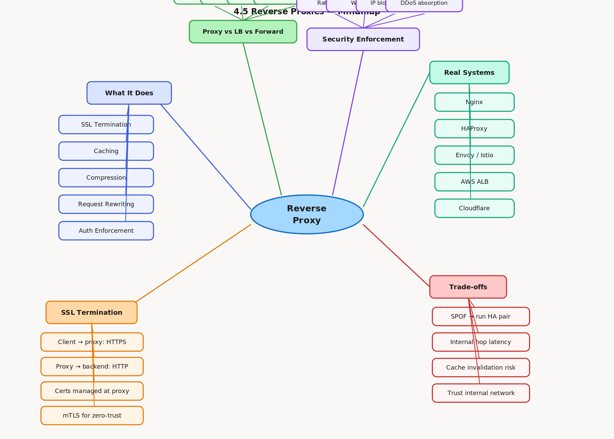

# 4.5 Reverse Proxies

> **Topic:** Topic 4 — Load Balancing
> **Phase:** B — Scalability Branch
> **Date studied:** 2026-05-21

---

## 0. 🗺️ Topic Overview

### What This Topic Is About

A reverse proxy sits between the internet and your backend servers, intercepting all incoming requests and forwarding them on behalf of the client. Unlike a load balancer (whose primary job is distributing traffic), a reverse proxy is a general-purpose intermediary that can perform SSL termination, caching, compression, request rewriting, authentication, and rate limiting — all before the request ever reaches your application servers. Mastering this topic means understanding where a reverse proxy lives in an architecture, what responsibilities it owns, and when to reach for it instead of (or alongside) a load balancer.

### 🎯 What to Focus On

**1. Reverse proxy vs. load balancer distinction.** The two are often conflated, but they answer different questions: a load balancer asks "which backend should handle this request?", while a reverse proxy asks "what should I do with this request before it reaches a backend?" Many tools (Nginx, HAProxy, Envoy) do both, which is why the distinction blurs — but conceptually they are separate responsibilities.

**2. What a reverse proxy terminates.** SSL termination at the proxy is the most common use case — offloading TLS handshake cost from app servers. Understand the full handshake flow, what gets decrypted, and what the downstream connection looks like (often plain HTTP on a private network).

**3. Caching and compression at the edge.** A reverse proxy can cache upstream responses and serve them without hitting the backend. This is fundamentally different from a CDN but uses the same principle — understand when this helps (static or semi-static responses) and when it's counterproductive (personalized responses).

**4. Nginx vs. HAProxy vs. Envoy.** Each tool has a different design center. Know the high-level tradeoff: Nginx is a multi-purpose web server / reverse proxy / static file server; HAProxy is purpose-built for high-performance L4/L7 proxying; Envoy is designed for the service mesh era (dynamic configuration via xDS API, observability built in). An interviewer may push on which you'd pick for a given context.

**5. Security and single ingress point.** A reverse proxy gives you one choke point to enforce: rate limiting, IP allowlisting/blocklisting, WAF rules, authentication headers, DDoS mitigation. Understanding this as an architectural pattern — centralizing cross-cutting concerns at ingress — is what separates a surface-level answer from a senior one.

---

## 1. 🎯 Goal of This Subtopic

> *Why are you studying this? What should you be able to do after this session?*

Be able to clearly articulate what a reverse proxy does, how it differs from a load balancer, and where it belongs in an architecture. Be able to list the specific functions a reverse proxy performs (SSL termination, caching, compression, auth, rate limiting, request rewriting) and justify which function belongs at the proxy vs. at the application layer. Be able to select between Nginx, HAProxy, and Envoy for a given scenario and explain the trade-off.

---

## 2. ✅ What Mastery Looks Like

> *Concrete, testable proof that you own this concept — not just familiarity.*

- [ ] Can explain the difference between a reverse proxy and a load balancer in one sentence without notes, and give a concrete example where you'd use each independently
- [ ] Can list five distinct functions a reverse proxy can perform and explain the architectural reason each belongs at the proxy layer rather than the app layer
- [ ] Can walk through SSL termination end-to-end: client TLS handshake → proxy decrypts → plain HTTP to backend → response encrypted back to client
- [ ] Can describe the security benefit of a reverse proxy as a single ingress point and name three cross-cutting concerns it centralizes
- [ ] Can compare Nginx, HAProxy, and Envoy at a high level and select the appropriate tool for a given interview scenario

> 💡 **Rule of thumb:** If you can teach it to someone else and field their follow-up questions, you've mastered it.

---

## 3. 🗓️ Study Phases to Achieve Mastery

> *A progressive plan from first exposure to interview-ready. Work through each phase in order. Don't move to the next until you can honestly tick every item.*

### Phase 1 — Acquire 📖 💪💪
*Goal: Read deeply enough that you could explain the concept without the doc.*

- [ ] Read **NGINX documentation — "NGINX Reverse Proxy"** at nginx.com/resources/glossary/reverse-proxy-server/
- [ ] Read **Cloudflare Learning — "What is a Reverse Proxy?"** at cloudflare.com/learning/cdn/glossary/reverse-proxy/
- [ ] Read **"Designing Data-Intensive Applications"** Ch. 1 — reliability, scalability concepts (covers proxy-adjacent load distribution concepts)
- [ ] Read through **Sections 5–9** (Core Definition → How It Works) carefully — don't skim
- [ ] Re-read the **Cheatsheet** (Section 4) and try to recite it from memory after

### Phase 2 — Consolidate ✍️ 💪💪💪
*Goal: Verify you can reproduce the knowledge in your own words without looking.*

- [ ] Close the doc — write out the **Core Definition** from memory, then compare
- [ ] Explain **First Principles** out loud without notes — what problem does this solve and why?
- [ ] Reconstruct the **How It Works** mechanics step by step from memory
- [ ] Restate each **Trade-off** row in your own words — if you can't explain the cost, you don't own it yet

### Phase 3 — Apply 🔧 💪💪💪💪
*Goal: Connect to real systems and simulate interview scenarios.*

- [ ] Go through **Real-World System Examples** (Section 10) — verify each claim independently and add anything missed to **My Notes**
- [ ] Practice the **Interview Application** (Section 12) out loud — say the trigger phrases and your response as if in a live interview
- [ ] Work through **Common Misconceptions** (Section 13) — for each, make sure you can explain *why* the misconception is wrong, not just that it is
- [ ] Trace the **Relationships to Other Concepts** (Section 14) — can you explain each connection without looking?

### Phase 4 — Validate 🧪 💪💪💪💪💪
*Goal: Confirm you actually own it, not just recognize it.*

- [ ] Answer every **Self-Check Quiz** question (Section 15) out loud without looking at your notes
- [ ] Recite the **Cheatsheet** (Section 4) from memory — if you can't, re-do Phase 2
- [ ] Tick off items in **What Mastery Looks Like** (Section 2) — only check a box if you can demonstrate it on demand, not just if it sounds familiar
- [ ] Teach this concept out loud to an imaginary interviewer for 2 minutes without hesitation or notes

---

## 4. 📋 Cheatsheet

> *Everything you need to recall this concept in 30 seconds — for quick review before an interview.*



```
ONE-LINER
  A reverse proxy is an intermediary that sits in front of backend servers,
  intercepting client requests to perform SSL termination, caching, auth,
  compression, and routing — before the request ever reaches your application.

KEY PROPERTIES / RULES
  1. Hides backend topology — clients see only the proxy's IP, never backend IPs
  2. Terminates TLS — decrypts at the edge, forwards plain HTTP internally
  3. Centralizes cross-cutting concerns — auth, rate limiting, WAF, compression at one choke point
  4. Can cache upstream responses — reduces backend load for cacheable content
  5. Different from a load balancer — LB picks a backend; reverse proxy transforms/filters the request

DECISION RULE
  Use a reverse proxy when: you need SSL termination, request/response transformation,
  centralized auth, caching, or a single security enforcement point in front of backends.
  Avoid using a reverse proxy as your only traffic distribution mechanism — pair it with
  a load balancer (or use a tool like Nginx/Envoy that does both) for horizontal scaling.

NUMBERS / FORMULAS
  TLS handshake cost: ~1–2 RTTs for TLS 1.3 (0-RTT resumption available)
  Nginx can handle ~10k–50k concurrent connections per instance (event-driven)
  HAProxy can handle millions of concurrent connections at L4

GOTCHA TO NEVER FORGET
  A reverse proxy and a load balancer are NOT the same thing — many tools do both,
  but in interviews, conflating them signals you don't understand the distinct roles.
```

---

## 5. 🧠 Core Definition

> *What is it, in one sentence?*

A **reverse proxy** is a server that sits in front of one or more backend servers, receiving all client requests on their behalf, optionally transforming or filtering them, and forwarding them to the appropriate backend — shielding the backend topology from the public internet and enabling centralization of cross-cutting concerns like TLS termination, caching, authentication, and compression.

---

## 6. 📦 Core Concepts

> *The essential building blocks of this subtopic.*

### SSL/TLS Termination
The reverse proxy handles the TLS handshake with the client and decrypts the traffic. The backend servers receive plain HTTP (or a new TLS connection in mTLS setups). This offloads expensive cryptographic computation from app servers, centralizes certificate management in one place, and simplifies backend deployments — backends don't need to manage certificates at all.

### Request Hiding and Backend Anonymity
Because all traffic flows through the proxy, clients never see backend IP addresses, port numbers, or server counts. This provides a security benefit (backend servers are not directly internet-reachable) and operational flexibility (you can add, remove, or replace backend instances without clients noticing). It also prevents direct DDoS targeting of individual app servers.

### Caching
A reverse proxy can cache upstream responses (e.g., HTTP 200 responses with appropriate `Cache-Control` headers) and serve subsequent identical requests without touching the backend. This is particularly powerful for read-heavy, low-personalization content — product pages, public API responses, static assets not yet on a CDN. It reduces backend load and latency for cache hits.

### Compression and Response Transformation
The proxy can gzip or Brotli-compress responses before sending them to clients, even if the backend doesn't support compression. It can also rewrite URLs, inject or strip headers, modify response bodies, and perform A/B routing based on headers or cookies. This keeps transformation logic out of application code.

### Single Ingress / Security Enforcement Point
By funneling all traffic through a single reverse proxy, you get a single enforcement point for rate limiting, IP allowlisting/blocklisting, WAF rules, and auth header validation. This is architecturally cleaner than scattering these concerns across every backend service — and much easier to audit and update.

---

## 7. 🔍 First Principles — Why Does This Exist?

> *What fundamental problem does this concept solve?*

Without a reverse proxy, every backend server is directly exposed to the internet. This creates several painful realities: each server must manage its own TLS certificate, implement its own rate limiting and authentication, handle its own compression, and be directly addressable (and therefore directly attackable) by clients. Scaling out means exposing more IPs. Rotating a certificate means touching every server. Adding a new cross-cutting security rule means deploying changes to every service.

The reverse proxy exists to solve the **single responsibility boundary problem at ingress**: separate the concerns of "how do I talk to the internet?" from "how do I implement my business logic?" It acts as a facade — the internet sees one stable, hardened entry point, and backends operate in a clean, trusted environment where the hard parts (TLS, auth enforcement, compression, caching) are already handled.

This is the same principle as an API gateway, a service mesh sidecar, and a CDN edge node — they're all variations of "put an intermediary at the boundary to centralize cross-cutting concerns."

---

## 8. 🗺️ Mental Models

> *Intuition frames that help you reason about this concept fast.*

### Model 1: The Hotel Concierge
A hotel concierge receives all guests at the front door, handles check-in (auth), gives them directions (routing), takes messages (caching common answers), and shields the rest of the hotel staff from direct public contact. Guests never walk directly to the kitchen or housekeeping — everything flows through the concierge desk. This captures both the request-handling role and the backend-hiding role perfectly.

**Where it breaks down:** A concierge doesn't transform what the guest is saying before relaying it — a reverse proxy can actively rewrite requests and responses, which goes beyond simple forwarding.

### Model 2: The Security Checkpoint at a Corporate Building
Every visitor enters through a single security gate where their badge is checked (auth), their bag is scanned (WAF/rate limiting), and they're told which floor to go to (routing). Backend employees (app servers) work in the building without ever worrying about validating visitor IDs themselves. The security checkpoint is the single enforcement point for all access control.

**Where it breaks down:** A security checkpoint doesn't cache anything or compress communication — it's purely a passthrough. A reverse proxy can also act on responses coming back from the building, which a security checkpoint doesn't model.

### Model 3: Reverse vs. Forward Proxy — Directional Clarity
A **forward proxy** sits in front of clients — clients know about it and route their requests through it (e.g., a corporate egress proxy that filters outbound traffic). A **reverse proxy** sits in front of servers — clients do NOT know about it and believe they're talking directly to the server. "Forward" = proxy for clients; "Reverse" = proxy for servers. This directional frame instantly disambiguates the two and prevents confusion in interviews.

---

## 9. ⚙️ How It Works — Mechanics

> *Step-by-step explanation of the internal mechanism.*

**Normal request flow (HTTPS with SSL termination):**

1. **Client initiates TLS handshake** with the reverse proxy's IP. The proxy presents its SSL certificate, negotiates cipher suite, and establishes the encrypted session. The client believes it is talking to the backend.
2. **Proxy decrypts the request.** Now the proxy has a plain HTTP request (e.g., `GET /api/products HTTP/1.1`). It can inspect, log, modify, or reject it at this point.
3. **Proxy applies cross-cutting logic.** In order: check rate limit counters, validate auth tokens (JWT, API key), check WAF rules, consult the response cache (if cache hit → return immediately without hitting backend), apply compression preferences.
4. **Proxy selects a backend and forwards the request.** If it's also functioning as a load balancer, it picks a backend using its configured routing algorithm. It opens a connection to the backend (plain HTTP or a new TLS connection for mTLS). It may add headers like `X-Forwarded-For` (original client IP), `X-Real-IP`, or `X-Request-ID`.
5. **Backend processes and returns a response.** The proxy receives it.
6. **Proxy transforms the response.** Optionally: compress (gzip/Brotli), cache the response for future requests, strip internal headers, inject security headers (HSTS, CSP), rewrite redirect URLs.
7. **Proxy encrypts and returns the response to the client** over the established TLS session.

**Failure handling:**

- If a backend fails to respond, the proxy can retry on another backend (if load balancing is also configured) or return a 502 Bad Gateway.
- If the proxy itself goes down, it becomes a SPOF — so reverse proxies are always run in HA pairs with a VIP (virtual IP) using keepalived or DNS-based failover.
- Proxy health: most production setups use active health checks against backends and remove unhealthy backends from the pool automatically.

**Connection pooling:** The proxy maintains persistent connection pools to backends (HTTP keep-alive, HTTP/2 multiplexing). This avoids paying the TCP 3-way handshake cost on every request, dramatically improving throughput.

---

## 10. 🏭 Real-World System Examples

> *Where does this appear in production systems you know?*

| System | How This Concept Applies | Notes |
|--------|--------------------------|-------|
| **Nginx** | The canonical reverse proxy / web server. Handles SSL termination, static file serving, upstream proxying, gzip, and basic caching in a single config. | Event-driven (epoll), handles thousands of concurrent connections with low memory. Config is declarative — `proxy_pass`, `upstream` blocks. |
| **Cloudflare** | Sits as a global reverse proxy in front of customer origins. Handles SSL termination at edge PoPs, DDoS absorption, WAF, caching, and smart routing — all before traffic reaches customer servers. | This is a CDN + reverse proxy hybrid at global scale. Customer origin never sees raw internet traffic. |
| **AWS ALB (Application Load Balancer)** | Operates at L7 as a managed reverse proxy — SSL termination, content-based routing, header inspection. | AWS handles HA, scaling, and cert management (via ACM). Effectively a managed Nginx/HAProxy for AWS-native workloads. |
| **Envoy Proxy** | Used as the data plane in Istio service mesh. Every pod has an Envoy sidecar that acts as a reverse proxy for both inbound and outbound traffic — applying mTLS, circuit breaking, retries, and observability. | Dynamic configuration via xDS API from the Istio control plane. Purpose-built for microservice-to-microservice proxying, not internet ingress. |
| **HAProxy** | Purpose-built for high-performance TCP/HTTP proxying. Used in front of databases, message brokers, and web tiers where raw connection throughput and ultra-low latency matter. | Often deployed in active-passive pairs with keepalived for HA. Single-threaded event loop; excellent at handling millions of concurrent connections. |

---

## 11. ⚖️ Trade-offs

> *Every design decision has a cost. What are you giving up?*

| ✅ Benefit | ❌ Cost / Limitation |
|-----------|---------------------|
| **SSL termination offloads crypto from app servers** | Traffic between proxy and backend is unencrypted (plain HTTP) unless you configure mTLS — creates a trust requirement for your internal network |
| **Single ingress point for security enforcement** | Single point of failure — the proxy must be run in HA pairs; if misconfigured, it can block all traffic or leak headers |
| **Hides backend topology from clients** | Adds a network hop with associated latency (typically 1–5ms) and resource cost; the proxy itself is now a component to operate, scale, and monitor |
| **Response caching reduces backend load** | Cache invalidation is hard — stale responses can be served if TTLs are misconfigured or if the backend updates data without cache busting |
| **Centralizes cross-cutting concerns (auth, rate limiting)** | Any logic centralized in the proxy is now a bottleneck for all traffic — a bug in the WAF rules or rate limiter affects every service, not just one |

---

## 12. 🎯 Interview Application

> *How do you use this concept in a design interview?*

**When an interviewer asks / says:**
- "How do you handle SSL termination for your API servers?"
- "Where do you enforce rate limiting and authentication in your architecture?"
- "How do you protect your backend servers from direct exposure to the internet?"
- "What's the difference between a load balancer and a reverse proxy in your design?"

**What you say / do:**
In the high-level design phase, place a reverse proxy (Nginx, HAProxy, or AWS ALB) as the first layer behind the DNS entry. Explicitly call out that it handles SSL termination and that backends operate on HTTP inside the VPC. In the deep-dive or trade-off discussion, mention that it centralizes auth header validation and rate limiting, and that it must be run in an HA pair to avoid SPOF. Distinguish it from the load balancer if you're using both.

**The trade-off statement (memorize this pattern):**
> "If we use a reverse proxy for SSL termination and auth enforcement, we get a clean separation where backends never touch certificates or auth logic — but we're trusting our internal network between the proxy and backends, so we'd add mTLS if this system requires zero-trust networking. For this design, a plain HTTP internal connection is acceptable given we're inside a private VPC."

---

## 13. ⚠️ Common Misconceptions & Gotchas

> *What do candidates get wrong?*

- ❌ **Misconception:** A reverse proxy and a load balancer are the same thing.
  ✅ **Reality:** They have distinct roles. A load balancer distributes traffic across multiple backends. A reverse proxy intermediates on behalf of backends to perform SSL termination, caching, auth, compression, etc. Many tools (Nginx, Envoy, ALB) do both — but they are conceptually separate concerns, and conflating them in an interview will be noticed.

- ❌ **Misconception:** SSL termination at the proxy means the entire connection is secure end-to-end.
  ✅ **Reality:** SSL termination means TLS ends at the proxy. Traffic from the proxy to the backend is plain HTTP unless you explicitly configure mTLS (or TLS re-encryption). This creates a security gap if your internal network is not trusted. Zero-trust environments require mTLS sidecar proxies (like Envoy) to re-encrypt the internal hop.

- ❌ **Misconception:** A reverse proxy eliminates the need for a CDN.
  ✅ **Reality:** A reverse proxy with caching reduces backend load from a single point, but it does not solve geographic latency — it's still one location. A CDN solves the latency problem by caching at hundreds of edge PoPs globally. For a globally distributed product, you need both: a CDN at the edge and a reverse proxy in front of your origin.

- ❌ **Misconception:** Adding a reverse proxy automatically makes you secure against DDoS.
  ✅ **Reality:** A reverse proxy gives you a single enforcement point for rate limiting and IP blocking — but if the proxy itself is saturated by volumetric DDoS traffic, it goes down just like a backend would. Real DDoS protection requires absorbing capacity at the network layer (BGP anycast, CDN with DDoS mitigation like Cloudflare or AWS Shield) before traffic reaches your proxy.

---

## 14. 🔗 Relationships to Other Concepts

> *How does this connect to adjacent subtopics?*

- **Builds on:** 4.1 L4 vs. L7 Load Balancers — a reverse proxy operates at L7 (HTTP), inspecting and acting on request content. Understanding what L7 means (headers, paths, cookies are visible) is the prerequisite for understanding what a reverse proxy can do.
- **Enables:** 4.6 Sticky Sessions — reverse proxies are the layer where sticky session logic (cookie-based affinity, IP hash routing) is implemented. Also enables 4.7 Global Load Balancing — the reverse proxy is the regional ingress that global DNS routes to.
- **Tension with:** 5.x Caching Systems — reverse proxy caching (server-side, origin-adjacent) and CDN caching (edge, distributed) both cache responses but solve different problems. Reverse proxy caching reduces backend load; CDN caching reduces geographic latency. Over-relying on reverse proxy caching instead of CDN for global users is a common architecture mistake.

---

## 15. 🧪 Self-Check Quiz

> *Can you answer these without looking? If not, you haven't internalized it yet.*

1. What is a reverse proxy, and how does it differ from a forward proxy and a load balancer?

   > 💡 *Think through your answer before expanding — if you hesitate, revisit Section 5 and Section 8.*

2. You're designing an API gateway for a fintech app. The team asks where to enforce JWT validation. Do you put it in the reverse proxy or in each microservice? Justify your answer with trade-offs.

   > 💡 *Think through your answer before expanding — if you hesitate, revisit Section 12.*

3. What specifically does SSL termination at the reverse proxy give you, and what security assumption does it require you to make?

   > 💡 *Think through your answer before expanding — if you hesitate, revisit Sections 6 and 13.*

4. Name two real production systems (not the same tool) that use a reverse proxy and explain concretely how it functions in each architecture.

   > 💡 *Think through your answer before expanding — if you hesitate, revisit Section 10.*

5. A high-traffic e-commerce site is using Nginx as a reverse proxy with response caching enabled. During a flash sale, prices change every 30 seconds but the cache TTL is 60 seconds. What goes wrong and how do you fix it?

   > 💡 *Think through your answer before expanding — if you hesitate, revisit Sections 6 and 13.*

---

## 16. 📚 Further Reading

> *Links and resources for deeper understanding.*

- [ ] **Cloudflare Learning — "What is a Reverse Proxy?"** — cloudflare.com/learning/cdn/glossary/reverse-proxy-server/ (concise, well-illustrated)
- [ ] **NGINX Documentation — "NGINX Reverse Proxy"** — docs.nginx.com/nginx/admin-guide/web-server/reverse-proxy/ (practical config examples)
- [ ] **HAProxy Documentation — Concepts** — cbonte.github.io/haproxy-dconv/ (deep dive on proxy modes and ACLs)
- [ ] **Envoy Proxy Introduction** — envoyproxy.io/docs/envoy/latest/intro/what_is_envoy (covers the xDS API and how Envoy differs from Nginx/HAProxy)
- [ ] **ByteByteGo — "What is an API Gateway?"** — blog.bytebytego.com (reverse proxy vs. API gateway vs. load balancer comparison, with diagrams)

---

## 17. ✍️ My Notes

> *Personal observations, things that confused me, analogies that helped.*

