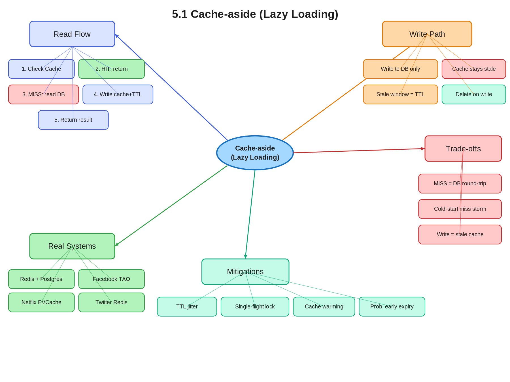

# 5.1 Cache-aside (Lazy Loading)

> **Topic:** Topic 5 — Caching Systems
> **Phase:** B — Scalability Branch
> **Date studied:** 2026-05-24

---

## 0. 🗺️ Topic Overview

### What This Topic Is About

Cache-aside (also called lazy loading) is the most common caching pattern in production systems. The application owns the cache interaction: on a read, it checks the cache first; on a miss, it loads from the database and populates the cache itself. This subtopic is about understanding exactly how that lifecycle works, when it is the right choice, and what failure modes it introduces — because nearly every read-heavy system you design in an interview will rely on it.

### 🎯 What to Focus On

**1. The three-step read path (check → miss → load → populate).** This is the core pattern you must be able to recite and draw. Every interview discussion of caching starts here.

**2. The cache miss cost and when it bites you.** Cold starts, cache flushes, and new deployments all produce bursts of misses. Understanding why this is expensive and how to mitigate it (warming, probabilistic expiry) differentiates a senior answer from a junior one.

**3. Staleness as a first-class concern.** Cache-aside only populates on read. Writes go directly to DB, leaving the cache stale until TTL expires or you explicitly invalidate. Know how stale data manifests and what the remediation options are.

**4. What cache-aside does NOT solve.** It does not guarantee consistency on write, does not protect against thundering herd on its own, and does not work well for write-heavy workloads. Knowing the limits is as important as knowing the pattern.

**5. Choosing the right TTL.** TTL is the primary consistency knob in cache-aside. Too short → high miss rate, too long → stale data. Be ready to reason about this trade-off given a system's read/write ratio and consistency requirements.

---

## 1. 🎯 Goal of This Subtopic

> *Why are you studying this? What should you be able to do after this session?*

Be able to explain the cache-aside read and write flow step by step, identify scenarios where it is the correct caching strategy, and articulate the consistency and cold-start trade-offs it introduces. You should be able to contrast it with write-through and write-back without hesitation, and propose a TTL and invalidation strategy for a given read/write pattern.

---

## 2. ✅ What Mastery Looks Like

> *Concrete, testable proof that you own this concept — not just familiarity.*

- [ ] Can walk through the full cache-aside read flow (hit path and miss path) in under 60 seconds without notes
- [ ] Can explain why cache-aside leaves the cache stale on writes, and propose at least two remediation strategies (explicit invalidation, TTL-based expiry)
- [ ] Can identify a scenario where cache-aside is the wrong choice (write-heavy workload, strong consistency required) and explain why
- [ ] Can describe the thundering herd problem in the context of a cold cache and propose a mitigation
- [ ] Can choose a TTL for a given system given its read/write ratio and staleness tolerance

> 💡 **Rule of thumb:** If you can teach it to someone else and field their follow-up questions, you've mastered it.

---

## 3. 🗓️ Study Phases to Achieve Mastery

> *A progressive plan from first exposure to interview-ready. Work through each phase in order. Don't move to the next until you can honestly tick every item.*

### Phase 1 — Acquire 📖 💪💪
*Goal: Read deeply enough that you could explain the concept without the doc.*

- [ ] Read **Designing Data-Intensive Applications** Ch. 5 (Replication) intro section on caching patterns — Martin Kleppmann
- [ ] Read **AWS ElastiCache Developer Guide** — Caching Strategies section (cache-aside / lazy loading)
- [ ] Read **ByteByteGo System Design Interview Vol. 1** — Chapter 6: Design a Key-Value Store (caching subsection)
- [ ] Read through **Sections 5–9** (Core Definition → How It Works) carefully — don't skim
- [ ] Re-read the **Cheatsheet** (Section 4) and try to recite it from memory after

### Phase 2 — Consolidate ✍️ 💪💪💪
*Goal: Verify you can reproduce the knowledge in your own words without looking.*

- [ ] Close the doc — write out the **Core Definition** from memory, then compare
- [ ] Explain **First Principles** out loud without notes — what problem does this solve and why?
- [ ] Reconstruct the **How It Works** mechanics step by step from memory
- [ ] Restate each **Trade-off** row in your own words — if you can't explain the cost, you don't own it yet

### Phase 3 — Apply 🔧 💪💪💪💪
*Goal: Connect to real systems and simulate interview scenarios.*

- [ ] Go through **Real-World System Examples** (Section 10) — verify each claim independently and add anything missed to **My Notes**
- [ ] Practice the **Interview Application** (Section 12) out loud — say the trigger phrases and your response as if in a live interview
- [ ] Work through **Common Misconceptions** (Section 13) — for each, make sure you can explain *why* the misconception is wrong, not just that it is
- [ ] Trace the **Relationships to Other Concepts** (Section 14) — can you explain each connection without looking?

### Phase 4 — Validate 🧪 💪💪💪💪💪
*Goal: Confirm you actually own it, not just recognize it.*

- [ ] Answer every **Self-Check Quiz** question (Section 15) out loud without looking at your notes
- [ ] Recite the **Cheatsheet** (Section 4) from memory — if you can't, re-do Phase 2
- [ ] Tick off items in **What Mastery Looks Like** (Section 2) — only check a box if you can demonstrate it on demand, not just if it sounds familiar
- [ ] Teach this concept out loud to an imaginary interviewer for 2 minutes without hesitation or notes

---

## 4. 📋 Cheatsheet

> *Everything you need to recall this concept in 30 seconds — for quick review before an interview.*



```
ONE-LINER
  Application checks cache first; on miss, loads from DB and populates cache itself.

KEY PROPERTIES / RULES
  Read path: Check cache → HIT: return. MISS: read DB → write cache → return.
  Write path: Write directly to DB. Cache entry becomes stale immediately.
  Cache is only populated on demand (lazy) — never pre-warmed by default.
  Resilient to cache failures — app falls back to DB transparently.
  Stale data window = TTL (or until explicit invalidation).

DECISION RULE
  Use cache-aside when: workload is read-heavy, data is read far more than written,
    some staleness is acceptable, and the app can tolerate cold-start miss bursts.
  Avoid cache-aside when: write-heavy workload (cache always stale), strong consistency
    required (can't accept stale reads), or data is too large/volatile to cache usefully.

NUMBERS / FORMULAS
  Cache hit rate target: ≥ 80–90% for cache to justify its cost
  TTL rule of thumb: set to the maximum acceptable staleness window
  Thundering herd risk: proportional to (miss_rate × concurrent_requests)

GOTCHA TO NEVER FORGET
  Writes go to DB only — the cached copy is immediately stale after every write.
```

---

## 5. 🧠 Core Definition

> *What is it, in one sentence?*

Cache-aside (lazy loading) is a read caching strategy where the application — not the cache — is responsible for loading data from the database on a cache miss and writing it into the cache, so the cache only ever contains data that has actually been requested.

---

## 6. 📦 Core Concepts

> *The essential building blocks of this subtopic — the terms and ideas you must have solid before going deeper.*

### The Miss Path (Lazy Population)
On a cache miss, the application queries the database, receives the result, writes it into the cache with a TTL, and returns it to the caller. The key insight is that the cache is populated *lazily* — only for keys that are actually requested. This means unused keys never consume cache memory, but it also means every first access to any key incurs a full database round-trip.

### Cache Hit vs. Miss Ratio
The hit rate measures how often the cache serves a request without touching the database. A high hit rate (>90%) means most reads are served at in-memory speed. A low hit rate means the cache is providing little value and the database is absorbing most of the load. Hit rate is the primary metric for evaluating cache effectiveness and is directly influenced by TTL, workload access patterns, and cache size.

### TTL (Time To Live)
TTL is the expiry time set on each cache entry at population time. When TTL expires, the key is evicted and the next request for it becomes a cache miss, triggering a fresh database read. TTL is the primary mechanism for bounding staleness in cache-aside: a shorter TTL means fresher data but a higher miss rate; a longer TTL means better hit rate but stale data for longer. There is no automatic cache invalidation on write — TTL is the only staleness guard unless you add explicit invalidation logic.

### Stale Data Window
After a write to the database, the cached copy is immediately stale. Any reader who hits the cache before TTL expires will receive the old value. This stale data window is `[time of write, time of TTL expiry]`. For some systems (product listings, recommendation feeds) this is acceptable. For others (account balances, inventory counts) it is not, and cache-aside without explicit invalidation is the wrong choice.

### Explicit Cache Invalidation
To reduce the stale data window below the TTL, applications can explicitly delete or update the cache entry on write. The safest pattern is to **delete** (not update) the cache key on write — on the next read, it is repopulated from the freshest database value. Updating the cache on write risks a race condition between concurrent writers.

---

## 7. 🔍 First Principles — Why Does This Exist?

> *What fundamental problem does this concept solve? Why was it invented?*

Databases are slow relative to in-memory stores. A typical PostgreSQL read under load takes 5–50ms; a Redis read takes <1ms. At scale, if every user request hits the database, the database becomes the bottleneck — it saturates on connections, CPU, or disk I/O, and response times climb.

The naive fix — cache everything on startup — is expensive and wasteful. Most data in large systems has a power-law access distribution: a small fraction of keys (hot keys) account for the vast majority of reads. Pre-loading everything wastes memory on cold data that will never be read.

Cache-aside solves this precisely: the cache grows organically to reflect the actual working set. Hot keys get cached quickly because they are requested often. Cold keys never enter the cache. The result is a cache that concentrates memory on what actually matters, without requiring the application to know in advance what that is.

---

## 8. 🗺️ Mental Models

> *Intuition frames that help you reason about this concept fast — especially under interview pressure.*

### Model 1: The Lazy Librarian
Imagine a librarian who never pre-stocks shelves. When you ask for a book, they check the shelf (cache). If it's there, they hand it to you instantly. If not, they walk to the archive (database), retrieve it, put a copy on the shelf for next time, and hand it to you. Books that nobody requests never end up on the shelf. Books that everyone requests are always on the shelf after the first request. The limitation: if someone edits the archive copy, the shelf copy is out of date until someone notices and swaps it. *This model breaks down when writes are frequent — the librarian's shelf is perpetually stale.*

### Model 2: The Miss-Driven Fill
Think of cache-aside as a self-organizing filter. Data flows from DB into cache only when pulled by actual demand. The cache naturally converges on the hot working set without any explicit configuration. The miss rate is highest at cold start (empty cache) and drops as the cache warms up. *This model highlights that cache-aside has a warm-up cost — expect elevated DB load immediately after a deployment or cache flush.*

### Model 3: The Cache as a Hint, Not the Source of Truth
In cache-aside, the database is always the source of truth. The cache is a performance hint that may be stale. Design decisions should be made with this frame in mind: if your system can't tolerate acting on a stale hint (banking transactions, inventory deduction), cache-aside is structurally wrong for that data type, regardless of TTL.

---

## 9. ⚙️ How It Works — Mechanics

> *Step-by-step or layered explanation of the internal mechanism.*

**Read path (happy path — cache hit):**
1. Application receives a read request for key `K`.
2. Application queries the cache for `K`.
3. Cache returns the value. Application returns it to the caller. Done. (~0.5ms)

**Read path (miss path):**
1. Application receives a read request for key `K`.
2. Application queries the cache for `K`. Cache returns nil/miss.
3. Application queries the database for `K`. (~5–50ms)
4. Application writes the result to the cache with TTL `T`.
5. Application returns the result to the caller.

**Write path:**
1. Application receives a write request updating key `K` to value `V`.
2. Application writes `V` directly to the database.
3. Application either:
   - Does nothing to the cache (cache entry expires at TTL), OR
   - Explicitly deletes the cache entry for `K` (preferred — prevents stale reads up to TTL).
4. The next read for `K` will be a cache miss and repopulate with the fresh value.

**Cold start behavior:**
On first deployment or after a cache flush, the cache is empty. Every read is a miss. The database absorbs 100% of read traffic until the cache warms. This is the most dangerous period for cache-aside systems — it can overwhelm the database if traffic is high. Mitigation: cache warming scripts, gradual traffic ramp-up, or read-replica fan-out during warm-up.

**TTL expiry:**
When a cache entry's TTL expires, the key is evicted. The next read becomes a miss and triggers the miss path. If many keys share the same TTL and were populated simultaneously (e.g., during a cache warm-up), they will all expire simultaneously — this is the **thundering herd** or **cache stampede** problem. Mitigation: add random jitter to TTLs (e.g., TTL = base ± 10%) to spread expiry times.

---

## 10. 🏭 Real-World System Examples

> *Where does this appear in production systems you know?*

| System | How This Concept Applies | Notes |
|--------|--------------------------|-------|
| Facebook TAO | Social graph edges and objects are lazily loaded into a distributed cache (TAO) on first access. Cache misses trigger reads from MySQL. | TAO adds explicit invalidation on write, not just TTL. |
| Twitter Timeline | User timelines and tweet objects are cached in Redis using cache-aside. A miss triggers a database or Cassandra read and repopulates the cache. | Hot users' timelines have near-100% hit rate; cold accounts may always miss. |
| Netflix EVCache | Metadata (titles, user preferences) is cached with cache-aside via EVCache (Memcached clusters). On miss, the backing store is queried and the result cached. | Netflix adds probabilistic early expiration to avoid synchronized stampedes. |
| Amazon Product Pages | Product listings, prices, and reviews are cached with TTL-based cache-aside. Writes (price updates) invalidate the cache entry explicitly. | Staleness of a few seconds on product price is acceptable to Amazon. |
| Redis + PostgreSQL (typical web app) | The canonical cache-aside pattern: app checks Redis → miss → query Postgres → write to Redis with TTL → return. | Used by Rails, Django, and most web frameworks via their caching middleware. |

---

## 11. ⚖️ Trade-offs

> *Every design decision has a cost. What are you giving up?*

| ✅ Benefit | ❌ Cost / Limitation |
|-----------|---------------------|
| Cache only holds data that is actually requested — efficient memory use | Cold start / cache flush causes a miss storm that hammers the database |
| Application is resilient to cache failure — falls back to DB transparently | Every cache miss has full DB round-trip latency; users during cold start get slow responses |
| Flexible: different TTLs per key type | Stale data window between a write and TTL expiry — data returned may be out of date |
| Simple to implement — no cache write path needed on reads | Thundering herd: many concurrent requests for the same key all miss simultaneously and all hit the DB |
| Works well with any key-value cache (Redis, Memcached) | Not suitable for write-heavy workloads — cache is constantly being bypassed and left stale |

---

## 12. 🎯 Interview Application

> *How do you use this concept in a design interview? What triggers it?*

**When an interviewer asks / says:**
- "How would you handle the read scalability of this system?"
- "This is a read-heavy workload — what would you do?"
- "How do you reduce load on the database?"
- "Walk me through how a user profile read works end to end."

**What you say / do:**
In the high-level design or deep dive phase, introduce the cache layer: "Since this is read-heavy, I'd put a Redis cache in front of the database using a cache-aside pattern. On a read, the application checks Redis first — on a hit, we return immediately. On a miss, we read from the database, populate Redis with a TTL of [X], and return the result." Then proactively address the trade-off before the interviewer asks.

**The trade-off statement (memorize this pattern):**
> "If we use cache-aside, we get sub-millisecond reads for hot data and automatically concentrate cache memory on the working set, but we pay with stale data up to TTL on writes and a miss storm on cold start. For this system, cache-aside is the right call because the workload is read-heavy with [X] read-to-write ratio, and we can tolerate [Y] seconds of staleness on [data type]."

---

## 13. ⚠️ Common Misconceptions & Gotchas

> *What do candidates get wrong? What nuance is the interviewer probing for?*

- ❌ **Misconception:** Cache-aside keeps the cache in sync with the database automatically.
  ✅ **Reality:** Cache-aside has no write synchronization. Writes go to the DB only; the cache entry becomes stale immediately and stays stale until TTL expires or you explicitly delete it. Sync is the application's responsibility.

- ❌ **Misconception:** Deleting the cache on write is unsafe — you should update the cache with the new value instead.
  ✅ **Reality:** Updating the cache on write (write-through on the write side of cache-aside) introduces a race condition between concurrent writers. The safer pattern is to delete the cache key on write; the next read will repopulate it from the database with the freshest value.

- ❌ **Misconception:** A longer TTL means better performance so you should always maximize it.
  ✅ **Reality:** Longer TTL reduces miss rate (good) but increases the staleness window (bad). The right TTL is determined by the system's consistency requirements, not by maximizing hit rate. A financial balance cached for 24 hours is unacceptable; a product image URL cached for 24 hours is fine.

- ❌ **Misconception:** Cache-aside handles the thundering herd problem automatically.
  ✅ **Reality:** Cache-aside by itself does nothing about thundering herd. When many goroutines/threads simultaneously miss the same key, all of them hit the database concurrently. Mitigation requires explicit locking (single-flight pattern), probabilistic early expiration, or background refresh.

---

## 14. 🔗 Relationships to Other Concepts

> *How does this connect to adjacent subtopics in this topic or across the roadmap?*

- **Builds on:** **5.4 Eviction policies (LRU, LFU, TTL)** — understanding how the cache evicts entries is necessary to reason about what happens when the cache is full and a new miss tries to populate it. Also builds on **2.5 Consistency vs. availability** — choosing cache-aside implicitly accepts eventual consistency between cache and DB.
- **Enables:** **5.2 Write-through caching** and **5.3 Write-back caching** — cache-aside is the baseline read-path pattern; write-through and write-back extend the write path to keep the cache in sync. **5.6 Cache stampede / thundering herd** — the cold-start and simultaneous-expiry problems in cache-aside are the root cause of stampedes.
- **Tension with:** **5.5 Cache consistency and invalidation** — cache-aside structurally creates inconsistency windows. The entire cache invalidation subtopic exists to solve the problem cache-aside creates. Also in tension with **2.1 CAP theorem** — choosing cache-aside means accepting that the cache and DB are not always consistent (availability over consistency at the caching layer).

---

## 15. 🧪 Self-Check Quiz

> *Can you answer these without looking? If not, you haven't internalized it yet.*

1. Walk me through the exact steps that happen when a user requests a piece of data that is not currently in the cache under the cache-aside pattern.

   > 💡 *Think through your answer before expanding — if you hesitate, revisit Section 9.*
Read path — cache miss
1. Application receives a read request for key K.
2. Application queries the cache for K. Cache returns nil/miss.
3. Application queries the database for K. (~5–50ms)
4. Application writes the result to the cache with TTL T.
5. Application returns the result to the caller.

Miss path (5 steps):
1. App receives read for key K.
2. App queries cache → nil (miss).
3. App queries DB → result R (~5–50ms latency added).
4. App writes R to cache with TTL T.
5. App returns R to caller.

Key details an interviewer probes:
- TTL must be set on the cache write (step 4) — omitting it means data lives forever.
- The DB query happens synchronously on the miss path — the caller bears the full latency cost.
- Subsequent reads for K hit the cache until TTL expires.

2. A product catalog service uses cache-aside with a 10-minute TTL. A product's price is updated in the database. A user requests that product 30 seconds later. What value do they receive, and why?

   > 💡 *Think through your answer before expanding — if you hesitate, revisit Sections 6 and 13.*
They will receive the old value because under cache-aside strategy, the price is not updated in cache after a successful DB write. The price in cache is stale by comparison with DB written price. To mitigate this stale data read, upon successful DB write, we should delete cache data, the next read will incur a cache miss and fetch the new price from DB.

MODEL ANSWER — Q2
The user receives the old (pre-update) price.

Why: Cache-aside has no write path. The DB write does not touch the cache.
The cached value remains valid until its TTL expires (~9.5 minutes remain).

Mitigation: explicit invalidation — on successful DB write, delete the cache key.
The next reader incurs a cache miss, fetches the new price from DB, and repopulates
the cache with a fresh TTL. No stale data served after the delete.

3. What is the main performance cost of cache-aside, and under what conditions does it become most severe?

   > 💡 *Think through your answer before expanding — if you hesitate, revisit Sections 8 and 11.*
Cache-aside structurally creates a window of possible stale data for the tradeoff of serving data with low latency. This strategy will be particularly severe for systems with low tolerance for stale data or when the application is write heavy, which creates stale data in cache on each write to DB.

MODEL ANSWER — Q3
Main performance cost: the cache miss penalty.
Every cache miss adds a full DB round-trip (5–50ms) on top of the cache lookup
(sub-millisecond). Under normal operation this is rare; under severe conditions it
compounds into a thundering herd.

Most severe conditions:
1. Cold start / cache flush — every key is missing; 100% of reads fall to DB.
2. Mass TTL expiry — many hot keys expire simultaneously; concurrent readers
   all miss and hammer the DB in the same window.
3. Single hot key expiry — thousands of concurrent requests for one key all
   miss at the same instant; DB gets N simultaneous identical queries.

Performance mitigations: TTL jitter (spread expirations), single-flight lock
(coalesce concurrent misses into one DB query), cache warming (pre-populate
before traffic arrives).

4. Name one real production system that uses cache-aside and explain concretely how it applies the pattern (not just "it uses a cache").

   > 💡 *Think through your answer before expanding — if you hesitate, revisit Section 10.*

MODEL ANSWER — Q4
Redis + PostgreSQL (canonical web app pattern):
- App checks Redis by key (e.g., user:{id}:profile) → miss
- App queries Postgres → row returned
- App serializes row, writes to Redis with TTL (e.g., 300s)
- App returns data; next N requests hit Redis until TTL expires

Other valid examples:
- Facebook TAO: graph objects cached aside from MySQL; explicit invalidation on write
- Twitter: tweet metadata cached in Redis aside from Manhattan/Manhattan
- CDN edge nodes: cache-aside at HTTP layer (Cache-Control: max-age as TTL)

5. You have a cache-aside setup where 10,000 cache keys all have the same TTL set at midnight. What problem occurs at midnight, and how do you fix it?

   > 💡 *Think through your answer before expanding — if you hesitate, revisit Sections 8 and 13.*

at midnight. all 10,000 cache data gets evicted from cache. any reads for such data incurs a cache miss. this effect drastically reduces the cache hit ratio and saturates the DB with connection requests. We can fix this by introcuing TTL jitter to every key TTL, so they do not all expire at the same time. Thereby smoothing out traffic to DB.

MODEL ANSWER — Q5
Problem: thundering herd via mass TTL expiry.
At midnight all 10,000 keys expire simultaneously. Every request for any of those
keys in the next window is a cache miss. The DB receives up to 10,000 concurrent
queries in a burst — connection pool exhausts, query latency spikes, DB may crash.

Fix — TTL jitter:
Set TTL = base_ttl + random(0, jitter_window).
Example: TTL = 3600 + rand(0, 600) seconds.
Keys now expire across a 10-minute spread instead of at one instant.
DB load is smoothed from a spike to a steady drip.

Additional mitigations:
- Single-flight lock: coalesce concurrent misses on the same key.
- Cache warming: pre-populate keys before the expiry window hits.

---

## 16. 📚 Further Reading

> *Optional: links, chapters, or resources for deeper understanding.*

- [ ] **Designing Data-Intensive Applications** (Martin Kleppmann) — Chapter 5, section on caching and replication lag
- [ ] **AWS ElastiCache Developer Guide** — "Caching Strategies: Lazy Loading" — https://docs.aws.amazon.com/AmazonElastiCache/latest/red-ug/Strategies.html
- [ ] **ByteByteGo System Design Interview Vol. 1** (Alex Xu) — Chapter 6: Design a Key-Value Store, caching subsection
- [ ] **Facebook Engineering Blog** — "TAO: Facebook's Distributed Data Store for the Social Graph" — https://www.usenix.org/system/files/conference/atc13/atc13-bronson.pdf
- [ ] **Cloudflare Blog** — "How we built rate limiting capable of scaling to millions of domains" — for TTL and cache invalidation patterns at scale

---

## 17. ✍️ My Notes

> *Personal observations, things that confused me, analogies that helped.*

One Liner
Cache aside caching strategy is a lazy caching approach where the application fetches data on read. if cache doesn't have this data, the application fetches from DB and writes to cache with TTL for future reads. 

A cache aside caching strategy aims to have > 80% cache hit ratio. Cache aside strategy makes cache working set self ordering. frequently accessed data sits in cache, while infrequently accessed data do not sit in cache. so the cache performs its intended function without additional configurations.

Use cache-aside when: workload is read-heavy, data is read far more than written,
    some staleness is acceptable, and the app can tolerate cold-start miss bursts.

When not to use cache aside?
- when our application is write heavy. Because every write leads to a stale data in cache.
- when our clients cannot tolerate our application serving stale data. 1 such data cateogry is financial data. Reading wrong/outdated data could have disastrous financial impacts.

Cache hit flow
1. client sends request for data
2. application queries cache for data with key, gets a cache hit
3. application returns cached data within 1ms.

Cache miss flow
1. client sends request for data
2. application queries cache for data with key, gets a cache miss
3. application queries DB for data and gets fresh data
4. applications writes fresh data to cache with TTL, then sends response to client

Write path
1. Application receives a write request updating key K to value V.
2. Application writes V directly to the database.
3. Application either: (a) does nothing to the cache — entry expires at TTL, OR (b) explicitly deletes the cache entry for K (preferred — prevents stale reads).
4. The next read for K will be a cache miss and repopulate with the fresh value.

Issues with cache aside caching strategy
- delete on write race condition. reader fetches old value → writer deletes cache → reader writes old value back → cache permanently stale until TTL.
- thundering herd. lots of requests of the same kind hits the application all at once and the data is not cached. as a result, application sends all these requests to DB requesting the same data. We need to stagger the requests to allow single flight requests to hit DB. all subsequent requests for same data hits cache instead
- delete cache instead of update cache. delete is an idempotent operation but update cache is not. we could run into a race condition when updating cache and leave stale data in cache even after the update.
- many cached data expire all at once. leading to cache miss spikes. we use a TTL jitter approach to add a few seconds to every TTL so they do not expire all at once.
- cold start. after a cache flush, no cached data sits in cache so all requests are cache misses. we need to warm the cache with previously hot working sets to avoid cold start cache misses.