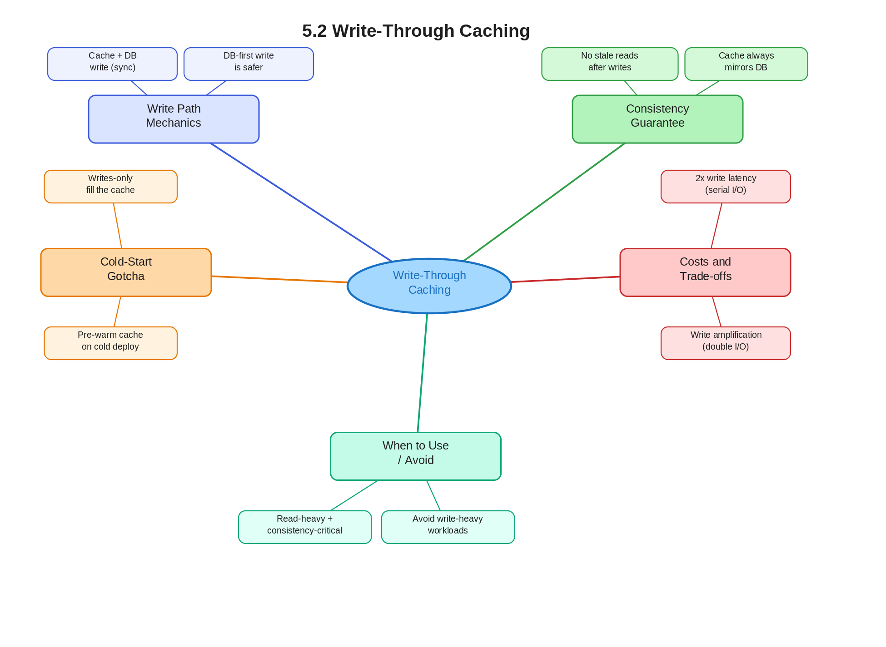

# 5.2 Write-Through Caching

> **Topic:** Topic 5 — Caching Systems
> **Phase:** B — Scalability Branch
> **Date studied:** 2026-05-26

---

## 0. 🗺️ Topic Overview

### What This Topic Is About

Write-through caching is a cache write strategy where every write to the cache is **synchronously propagated to the backing store** before the write is acknowledged to the client. It sits at the intersection of consistency and performance: every write pays a latency cost, but in return you get a cache that is always consistent with the database. Mastering this strategy means knowing when that consistency guarantee is worth the write-latency penalty — and when it isn't.

### 🎯 What to Focus On

**1. The write path contract.** In write-through, the application writes to the cache *and* the database in the same synchronous operation. Know this sequence cold — cache first or DB first, and why it matters.

**2. Consistency guarantee vs. write latency trade-off.** Write-through eliminates stale cache reads, but every write now incurs two I/O operations. Understand when that trade is favorable (read-heavy, consistency-critical) and when it's not (write-heavy workloads).

**3. The cold-start / cache-warming problem.** Write-through only populates the cache on writes — not on reads. New cache nodes or cold restarts have empty caches, so you often pair write-through with a warming strategy.

**4. Contrast with cache-aside and write-back.** In interviews, write-through is rarely discussed in isolation. Know the 3-strategy landscape so you can pick and justify the right one on demand.

**5. Where write-through is used in production.** Redis with a write-through application layer, CPU L1/L2 caches, and some ORM-level caching frameworks all use this pattern. Concrete examples keep your answer grounded.

---

## 1. 🎯 Goal of This Subtopic

> *Why are you studying this? What should you be able to do after this session?*

Be able to choose write-through caching for a given read/write workload, explain its consistency and performance implications precisely, and contrast it with cache-aside and write-back in a structured trade-off discussion. Specifically, you should be able to explain the write sequence, the latency cost, and the staleness guarantee — all without referring to notes.

---

## 2. ✅ What Mastery Looks Like

> *Concrete, testable proof that you own this concept — not just familiarity.*

- [ ] Can draw the write-through sequence (client → cache → DB) and explain exactly what happens if the DB write fails after the cache write succeeds
- [ ] Can choose write-through over cache-aside or write-back given a scenario with specific read/write ratio and consistency requirements — and justify with a concrete trade-off statement
- [ ] Can explain the cold-start problem in write-through caches and propose a mitigation strategy
- [ ] Can identify a real production system that uses write-through and explain *why* it was chosen there
- [ ] Can state the write amplification cost of write-through and explain when it becomes a bottleneck

> 💡 **Rule of thumb:** If you can teach it to someone else and field their follow-up questions, you've mastered it.

---

## 3. 🗓️ Study Phases to Achieve Mastery

> *A progressive plan from first exposure to interview-ready. Work through each phase in order. Don't move to the next until you can honestly tick every item.*

### Phase 1 — Acquire 📖 💪💪
*Goal: Read deeply enough that you could explain the concept without the doc.*

- [ ] Read the **Further Reading** resources (Section 16) — DDIA Ch. 5 (Replication & Caching), ByteByteGo "Cache Strategies" video, AWS ElastiCache write-through docs
- [ ] Read through **Sections 5–9** (Core Definition → How It Works) carefully — don't skim
- [ ] Re-read the **Cheatsheet** (Section 4) and try to recite it from memory after

### Phase 2 — Consolidate ✍️ 💪💪💪
*Goal: Verify you can reproduce the knowledge in your own words without looking.*

- [ ] Close the doc — write out the **Core Definition** from memory, then compare
- [ ] Explain **First Principles** out loud without notes — what problem does this solve and why?
- [ ] Reconstruct the **How It Works** mechanics step by step from memory
- [ ] Restate each **Trade-off** row in your own words — if you can't explain the cost, you don't own it yet

### Phase 3 — Apply 🔧 💪💪💪💪
*Goal: Connect to real systems and simulate interview scenarios.*

- [ ] Go through **Real-World System Examples** (Section 10) — verify each claim independently and add anything missed to **My Notes**
- [ ] Practice the **Interview Application** (Section 12) out loud — say the trigger phrases and your response as if in a live interview
- [ ] Work through **Common Misconceptions** (Section 13) — for each, make sure you can explain *why* the misconception is wrong, not just that it is
- [ ] Trace the **Relationships to Other Concepts** (Section 14) — can you explain each connection without looking?

### Phase 4 — Validate 🧪 💪💪💪💪💪
*Goal: Confirm you actually own it, not just recognize it.*

- [ ] Answer every **Self-Check Quiz** question (Section 15) out loud without looking at your notes
- [ ] Recite the **Cheatsheet** (Section 4) from memory — if you can't, re-do Phase 2
- [ ] Tick off items in **What Mastery Looks Like** (Section 2) — only check a box if you can demonstrate it on demand, not just if it sounds familiar
- [ ] Teach this concept out loud to an imaginary interviewer for 2 minutes without hesitation or notes

---

## 4. 📋 Cheatsheet

> *Everything you need to recall this concept in 30 seconds — for quick review before an interview.*



```
ONE-LINER
  Write-through: every write goes to cache AND database synchronously,
  guaranteeing the cache is never stale — at the cost of write latency.

KEY PROPERTIES / RULES
  1. Writes are synchronous: both cache and DB must confirm before ACK to client
  2. Cache is always consistent with DB — no stale reads after writes
  3. Cache is only populated on writes, not reads — cold-start leaves gaps
  4. Write latency = cache write time + DB write time (two I/Os every write)
  5. Read performance is excellent: cache hit rate is high for recently written data

DECISION RULE
  Use write-through when: read/write ratio is high AND consistency of reads is
  critical (e.g., user profile, inventory counts, auth tokens).
  Avoid write-through when: workload is write-heavy — the double-write overhead
  dominates; use write-back or skip caching writes entirely.

NUMBERS / FORMULAS
  Write latency ≈ cache_write_latency + db_write_latency (serial, not parallel)
  Cache-aside read miss cost: 1 DB read + 1 cache write
  Write-through write cost: 1 cache write + 1 DB write (every time, no misses)

GOTCHA TO NEVER FORGET
  Write-through does NOT populate the cache on reads — cold nodes or new data
  that has never been written through will still miss until a write occurs.
```

---

## 5. 🧠 Core Definition

> *What is it, in one sentence?*

Write-through caching is a write strategy where every data write is synchronously written to both the cache and the backing database before the operation is acknowledged to the client, ensuring the cache is always in sync with the source of truth.

---

## 6. 📦 Core Concepts

> *The essential building blocks of this subtopic — the terms and ideas you must have solid before going deeper.*

### Synchronous Write-Through Path
Every write request updates the cache first, then the database (or both in parallel), and the client receives acknowledgment only after both writes complete. This two-phase write is what gives write-through its consistency guarantee. The cost is latency: the client waits for two I/O operations instead of one.

### Cache Consistency Guarantee
Because every write populates the cache with the latest value, any subsequent read will hit the cache and return fresh data. Unlike cache-aside (where the cache is populated lazily on read misses), write-through has no window of stale reads after a write. This is the defining property and the primary reason to choose it.

### Write Amplification
Write-through doubles the number of write operations — every logical write becomes two physical writes. For write-heavy workloads (high write/read ratio), this amplification becomes a bottleneck. A system doing 100k writes/sec with write-through is pushing 200k write operations to two different storage tiers.

### Cold-Start / Cache Warming Gap
Write-through only populates cache entries on writes. If you deploy a new cache node, restart the cache, or have data that was last written before the cache existed, those keys will be absent. Reads will hit the database until a write for that key occurs. For read-heavy workloads, this means cache hit rate starts at 0 and climbs only as writes happen — you often pair write-through with a cache pre-warming step.

### Failure Atomicity Problem
Write-through creates a two-write sequence (cache → DB) that is not atomic. If the DB write fails after the cache write succeeds, the cache holds data that the DB does not — a consistency violation in reverse. Good implementations handle this via rollback (invalidate the cache key on DB write failure) or by writing to the DB first and only updating the cache on DB success.

---

## 7. 🔍 First Principles — Why Does This Exist?

> *What fundamental problem does this concept solve? Why was it invented?*

The root problem is **cache inconsistency after writes**. In a naive caching setup (cache-aside), you write to the database directly and the cache is only populated when a read misses. This means that immediately after a write, the cache may still hold the old value — any reader that hits the cache before the next miss+reload will see stale data. For some systems (shopping carts, banking balances, user auth state), stale reads are a correctness problem, not just a performance nuisance.

Write-through was the solution: make the cache an always-up-to-date mirror of the database by routing all writes through it. This trades write latency for read correctness. The pattern originates from CPU cache design — L1/L2 write-through caches existed for exactly the same reason: ensuring that memory-mapped reads always reflect the latest written value.

---

## 8. 🗺️ Mental Models

> *Intuition frames that help you reason about this concept fast — especially under interview pressure.*

### Model 1: The Synchronized Mirror
Think of write-through as keeping a mirror perfectly synchronized with the original. Every time the original changes, the mirror is updated immediately — before anyone looks at it. The cost is that every update requires two actions instead of one. The benefit is that anyone consulting the mirror always sees the current state. This breaks down as an analogy when you ask "what if the mirror update fails?" — physical mirrors don't fail, but your write-through cache can, which is why the failure atomicity problem matters.

### Model 2: The Bank Teller and Ledger Book
Imagine a bank teller (cache) keeping their own notes alongside the official ledger (database). In write-through, every transaction the teller processes is recorded in both the teller's notes *and* the ledger before the customer leaves the window. The customer waits longer than if the teller just updated their own notes and deferred the ledger entry, but there's never a discrepancy between the teller's notes and the official record. The failure case: if the teller updates their notes but the ledger update fails, the teller must erase their note — this is the rollback pattern.

### Model 3: The Write Amplification Tax
Every write-through operation charges you a "tax" — one extra write to the cache on top of the database write. For read-heavy systems (e.g., 95% reads), this tax is nearly invisible: the 5% of write operations pay double, but the 95% reads benefit from cache hits. For write-heavy systems (50%+ writes), the tax becomes dominant — you're doubling your write I/O for marginal read benefit. This mental model helps you quickly eliminate write-through as a candidate for write-heavy workloads without needing to reason through the full trade-off every time.

---

## 9. ⚙️ How It Works — Mechanics

> *Step-by-step or layered explanation of the internal mechanism.*

**Normal (Happy) Path:**

1. Client sends a write request (e.g., `SET user:123 → {name: "Gary"}`).
2. The application layer (or cache client library) writes the value to the cache: `cache.set("user:123", data)`.
3. Immediately after (or in parallel), the application writes the same value to the database: `db.write("user:123", data)`.
4. Only after **both** writes succeed does the application return a success response to the client.
5. Subsequent reads for `user:123` will hit the cache and return the fresh value — no DB hit required.

**Write Order — Cache First vs. DB First:**
- **Cache first:** Write cache → write DB. Risk: if DB write fails, cache holds a value the DB doesn't. Must invalidate cache key on DB failure.
- **DB first:** Write DB → write cache. Risk: if cache write fails after DB success, the next read misses cache and hits DB — acceptable degradation but not a correctness violation. **DB-first is generally safer.**

**Failure Handling:**
- If the DB write fails: invalidate (delete) the cache key so subsequent reads go to the DB and get the pre-write state. Do NOT leave the cache holding the new value the DB rejected.
- If the cache write fails (DB first): log the failure, proceed — the cache miss on the next read will simply reload from DB. Correctness is maintained; just a cold cache.

**Read Path (unchanged from cache-aside):**
1. Read from cache.
2. On hit: return cached value.
3. On miss: read from DB, optionally populate cache (but write-through doesn't guarantee this on reads — you may need to add a read-through layer for that).

**Key Formulas:**
- Write latency = `t_cache_write + t_db_write` (serial) or `max(t_cache_write, t_db_write)` (parallel writes, if your library supports it)
- For a 1ms cache write and 5ms DB write: serial write-through costs 6ms vs. 5ms for a direct DB write — a 20% overhead

---

## 10. 🏭 Real-World System Examples

> *Where does this appear in production systems you know?*

| System | How This Concept Applies | Notes |
|--------|--------------------------|-------|
| CPU L1/L2 caches (hardware) | Classic write-through: every cache line write also writes to main memory, keeping them in sync | Some CPUs switch to write-back under high write load — configurable |
| AWS ElastiCache (Redis) | Application-level write-through: app writes to Redis and RDS atomically; ElastiCache itself doesn't enforce this — the application code is responsible | Requires discipline; no built-in write-through at the Redis protocol level |
| Write-through ORM caching (e.g., Hibernate 2nd-level cache) | Hibernate's EhCache in write-through mode updates the cache synchronously on every entity persist/merge | Can be toggled per entity; most apps use read-through instead for performance |
| Google Spanner internal caches | Spanner uses write-through for its internal tablet caches to maintain linearizability guarantees across its strongly consistent storage | Critical for Spanner's external consistency promise |
| Financial transaction systems (e.g., balance cache) | Account balance caches are often write-through: every debit/credit updates both the cache and the ledger DB before ACK | Stale balance reads are a correctness violation, not just a UX issue |

---

## 11. ⚖️ Trade-offs

> *Every design decision has a cost. What are you giving up?*

| ✅ Benefit | ❌ Cost / Limitation |
|-----------|---------------------|
| Cache is always consistent with the DB — no stale reads after a write | Every write incurs two I/Os (cache + DB), increasing write latency |
| High cache hit rate for recently written data | Cache is cold at startup — no reads populate it; must pair with warming |
| Simplifies read path: no need to handle stale-data invalidation logic | Write amplification hurts throughput on write-heavy workloads |
| Reduces complexity of cache invalidation (no need to manually delete stale keys) | Not atomic — cache-DB consistency can break on partial failure; requires rollback logic |
| Natural fit for read-heavy workloads where writes are infrequent | If the cache evicts a write-through entry before it's read, the DB write was "wasted" (no read benefit) |

---

## 12. 🎯 Interview Application

> *How do you use this concept in a design interview? What triggers it?*

**When an interviewer asks / says:**
- "How do you keep your cache consistent with the database?"
- "What happens to the cache when a user updates their profile?"
- "Your system is read-heavy — how do you ensure reads always return fresh data?"
- "Walk me through the caching strategy for this write operation."

**What you say / do:**
In the deep-dive phase of your design, when discussing the cache layer, state: "For writes, I'd use a write-through strategy — every write propagates to both cache and DB synchronously before we ACK the client. This ensures the cache is always fresh without requiring a separate invalidation step. The trade-off is write latency, which is acceptable here given our read-heavy access pattern."

**The trade-off statement (memorize this pattern):**
> "If we choose write-through, we get a cache that's always in sync with the database — reads are always fresh. But we pay double write latency on every write operation. For this system, write-through is the right call because our workload is 90% reads and we can't afford stale reads on [user profile / inventory / auth state]."

---

## 13. ⚠️ Common Misconceptions & Gotchas

> *What do candidates get wrong? What nuance is the interviewer probing for?*

- ❌ **Misconception:** Write-through means the cache is always fully populated — if you write-through, you never have cache misses.
  ✅ **Reality:** Write-through only populates keys that have been written. New cache deployments, cache evictions, or data that has never been written through will still miss. You can still have cold reads; write-through only guarantees freshness for keys that *were* written through.

- ❌ **Misconception:** Write-through is always better than cache-aside because it's "more consistent."
  ✅ **Reality:** Write-through has double the write latency and write amplification. For write-heavy workloads, this is worse than cache-aside. Consistency matters only if you actually have stale-read problems — many systems tolerate eventual consistency just fine and don't need write-through.

- ❌ **Misconception:** Write-through is atomic — if you write-through, cache and DB are always consistent.
  ✅ **Reality:** There are two writes, not one atomic operation. If the DB write fails after the cache write succeeds, you have a consistency violation. Good implementations write DB first and roll back (invalidate) the cache on failure, or use a transactional wrapper. True atomicity requires distributed transactions, which are expensive.

- ❌ **Misconception:** Write-through and read-through are the same strategy.
  ✅ **Reality:** Write-through is about the write path — ensuring the cache is updated on every write. Read-through is about the read path — the cache itself fetches from the DB on a miss and returns the result to the caller. They are complementary, not synonymous, and can be combined.

---

## 14. 🔗 Relationships to Other Concepts

> *How does this connect to adjacent subtopics in this topic or across the roadmap?*

- **Builds on:** 5.1 Cache-aside (lazy loading) — write-through exists as the "eager write" alternative to the lazy read-populate pattern. You need to understand cache-aside to appreciate what write-through is trading away.
- **Enables:** 5.5 Cache consistency and invalidation strategies — write-through is one of three strategies for maintaining consistency; studying it sets up the full comparison in 5.5. It also enables the discussion in 5.6 (cache stampede) since write-through reduces stampedes by keeping the cache warm.
- **Tension with:** 5.3 Write-back (write-behind) caching — write-back is the opposite trade-off: defer the DB write to reduce write latency at the cost of durability risk. Write-through and write-back are in direct tension: pick one based on whether latency or consistency is more important.

---

## 15. 🧪 Self-Check Quiz

> *Can you answer these without looking? If not, you haven't internalized it yet.*

1. Describe the write-through sequence step by step. At what point is the client acknowledged?

   > 💡 *Think through the two-write path before answering — if you hesitate on the ACK timing, revisit Section 9.*

2. Your system stores user shopping cart data. Reads are 20x more frequent than writes. A product team says stale cart reads cause user complaints. Would you use write-through, cache-aside, or write-back? Justify your choice.

   > 💡 *Apply the decision rule from Section 4 — read ratio, plus the stale-read constraint.*

3. What is the write latency cost of write-through compared to a direct DB write? Under what workload does this cost become a real bottleneck?

   > 💡 *Think in terms of write amplification and write/read ratio — revisit Section 6 if unclear.*

4. Name a real production system that uses write-through and explain why write-through was chosen over cache-aside in that context.

   > 💡 *Use the examples from Section 10 — bonus points if you can explain the consistency requirement that drives the choice.*

5. You deploy write-through caching on Monday. On Tuesday you add 10 new cache nodes. What happens to the cache hit rate on those new nodes, and what is the fix?

   > 💡 *This tests the cold-start problem — revisit Section 6 (Cache Warming Gap) if you're unsure.*

---

## 16. 📚 Further Reading

> *Optional: links, chapters, or resources for deeper understanding.*

- [ ] **Designing Data-Intensive Applications** — Martin Kleppmann, Chapter 5 (Replication) — covers cache consistency in the context of replication lag and write propagation
- [ ] **ByteByteGo: "Top Caching Strategies"** — Alex Xu, YouTube / ByteByteGo newsletter — visual walkthrough of cache-aside vs. write-through vs. write-back with decision heuristics
- [ ] **AWS ElastiCache Developer Guide: Caching Strategies** — https://docs.aws.amazon.com/AmazonElastiCache/latest/red-ug/Strategies.html — practical write-through patterns with Redis examples
- [ ] **"Caching at Scale"** — Facebook Engineering Blog — covers write-through vs. invalidation approaches used in production at social-network scale
- [ ] **Redis documentation: Pipelining and atomicity** — https://redis.io/docs/manual/pipelining/ — relevant for understanding how to minimize write latency overhead in write-through implementations

---

## 17. ✍️ My Notes

> *Personal observations, things that confused me, analogies that helped.*

