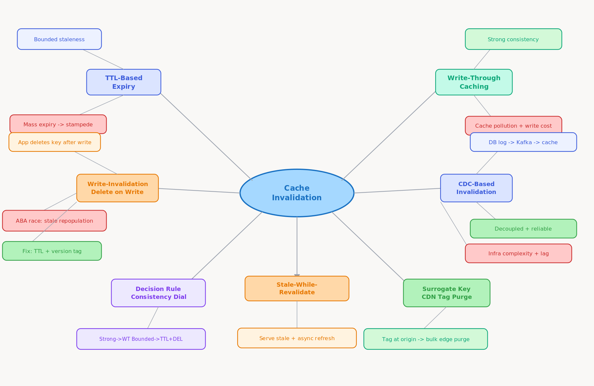
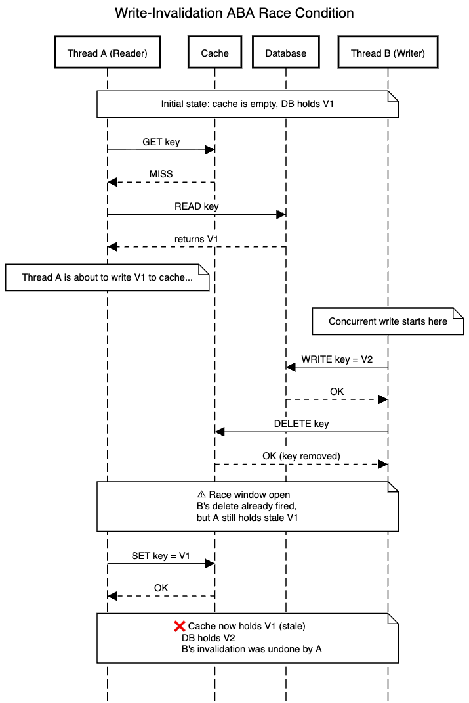

# 5.5 Cache Consistency and Invalidation Strategies

> **Topic:** Topic 5 — Caching Systems
> **Phase:** B — Scalability Branch
> **Date studied:** 2026-06-01

---

## 0. 🗺️ Topic Overview

### What This Topic Is About

Cache consistency is the problem of keeping a cache synchronized with the source of truth (usually a database) when data changes. The central tension is **freshness vs. simplicity**: the more strictly you enforce consistency, the more complex your invalidation logic becomes and the lower your effective cache hit rate. Mastering this subtopic means knowing which invalidation strategy fits which write pattern, and understanding the race conditions that make "just delete the key on write" harder than it sounds.

### 🎯 What to Focus On

**1. The four invalidation approaches and when each applies**
TTL-based expiry, write-invalidation (delete on write), write-through (update on write), and CDC-based propagation are not interchangeable. Each has a different consistency window, infrastructure requirement, and failure mode. Know the trade-off matrix cold.

**2. The cache-aside race condition**
The classic delete-on-write pattern has a subtle race: a read and a write can interleave so that a stale value ends up cached. This is the most common "gotcha" interviewers probe for. Know the sequence of events and the mitigation (short TTL as safety net, version tags, or Lua atomic scripts).

**3. TTL is the floor, not the ceiling**
TTL bounds your worst-case staleness window. It is not a substitute for proactive invalidation. Production systems use TTL + explicit invalidation together — TTL is the safety net; invalidation is the fast path.

**4. Surrogate keys / tag-based invalidation for CDN**
CDN edge caches have different invalidation semantics: HTTP purge APIs, surrogate key tags, and Cache-Control headers. Know how tag-based invalidation lets you invalidate thousands of edges with a single API call keyed by content tag, not by URL.

**5. Consistency models for caches**
Caches can be configured to provide strong consistency (always up-to-date, low hit rate), bounded staleness (TTL), or eventual consistency (lazy expiry). Matching the model to the business requirement is the skill — financial data needs strong or very short TTL; social media likes can tolerate 30-second staleness.

---

## 1. 🎯 Goal of This Subtopic

> *Why are you studying this? What should you be able to do after this session?*

Be able to choose and design the correct cache invalidation strategy for a given write pattern and consistency requirement. Be able to explain the cache-aside race condition, propose mitigations, and describe how TTL and explicit invalidation complement each other — without notes and under interview pressure.

---

## 2. ✅ What Mastery Looks Like

> *Concrete, testable proof that you own this concept — not just familiarity.*

- [ ] Can explain the four invalidation strategies (TTL, write-invalidation, write-through, CDC) and select the right one for a given use case
- [ ] Can walk through the cache-aside race condition step by step and propose at least two mitigations
- [ ] Can explain why TTL alone is insufficient and how explicit invalidation and TTL work as complements
- [ ] Can describe tag-based (surrogate key) CDN invalidation and explain when it's needed over URL-based purge
- [ ] Can classify a given system's cache consistency requirement (strong, bounded staleness, eventual) and map it to an appropriate strategy

> 💡 **Rule of thumb:** If you can teach it to someone else and field their follow-up questions, you've mastered it.

---

## 3. 🗓️ Study Phases to Achieve Mastery

> *A progressive plan from first exposure to interview-ready. Work through each phase in order. Don't move to the next until you can honestly tick every item.*

### Phase 1 — Acquire 📖 💪💪
*Goal: Read deeply enough that you could explain the concept without the doc.*

- [ ] Read **Designing Data-Intensive Applications (DDIA)** — Martin Kleppmann, Chapter 5 (replication) for consistency background; also skim the caching patterns sections
- [ ] Read **Facebook's memcache paper** — Nishtala et al. (2013): "Scaling Memcache at Facebook" — see Section 3 (Reducing Load) and Section 4 (Handling Failures) for invalidation at scale
- [ ] Read **AWS ElastiCache best practices** — cache invalidation patterns: https://aws.amazon.com/caching/best-practices/
- [ ] Read through **Sections 5–9** (Core Definition → How It Works) carefully — don't skim
- [ ] Re-read the **Cheatsheet** (Section 4) and try to recite it from memory after

### Phase 2 — Consolidate ✍️ 💪💪💪
*Goal: Verify you can reproduce the knowledge in your own words without looking.*

- [ ] Close the doc — write out the Core Definition from memory, then compare
- [ ] Explain First Principles out loud without notes — what problem does this solve and why?
- [ ] Reconstruct the write-invalidation race condition sequence from memory — draw the interleaving
- [ ] Restate each Trade-off row in your own words — if you can't explain the cost, you don't own it yet

### Phase 3 — Apply 🔧 💪💪💪💪
*Goal: Connect to real systems and simulate interview scenarios.*

- [ ] Go through **Real-World System Examples** (Section 10) — verify each claim independently and add anything missed to **My Notes**
- [ ] Practice the **Interview Application** (Section 12) out loud — say the trigger phrases and your response as if in a live interview
- [ ] Work through **Common Misconceptions** (Section 13) — for each, make sure you can explain *why* the misconception is wrong, not just that it is
- [ ] Trace the **Relationships to Other Concepts** (Section 14) — can you explain each connection without looking?

### Phase 4 — Validate 🧪 💪💪💪💪💪
*Goal: Confirm you actually own it, not just recognize it.*

- [ ] Answer every **Self-Check Quiz** question (Section 15) out loud without looking at your notes
- [ ] Recite the **Cheatsheet** (Section 4) from memory — if you can't, re-do Phase 2
- [ ] Tick off items in **What Mastery Looks Like** (Section 2) — only check a box if you can demonstrate it on demand, not just if it sounds familiar
- [ ] Teach this concept out loud to an imaginary interviewer for 2 minutes without hesitation or notes

---

## 4. 📋 Cheatsheet

> *Everything you need to recall this concept in 30 seconds — for quick review before an interview.*



```
ONE-LINER
  Cache invalidation is the act of removing or updating stale cache entries
  when the underlying data changes — the hardest part of caching at scale.

KEY PROPERTIES / RULES
  1. TTL = bounded staleness. Simplest but non-zero staleness window.
     Use as the safety net, never as the only strategy.
  2. Write-invalidation (delete on write) = fast consistency, race-condition risk.
     Classic ABA: read DB → write+delete cache → read DB → stale write to cache.
  3. Write-through = cache always updated on write. Strong consistency,
     higher write latency, cache pollution risk from cold keys.
  4. CDC (Change Data Capture) = DB transaction log → message queue → cache invalidation.
     Decoupled, reliable, slight lag. Best for high-write systems.
  5. Surrogate key / tag invalidation = CDN pattern. Tag content at write time;
     purge all tagged edges in one API call.

DECISION RULE
  Use TTL when: staleness window is tolerable and data update rate is low.
  Use write-invalidation when: data changes are infrequent but must be fast.
  Use write-through when: reads dominate and strong consistency is required.
  Use CDC when: write volume is high and cache is downstream of DB via pipeline.

NUMBERS / FORMULAS
  Consistency window with TTL = [0, TTL_seconds] seconds of staleness
  Race window = time between DB write and cache delete (typically <1ms on same host)

GOTCHA TO NEVER FORGET
  Delete-on-write is NOT atomic: a read can race between the write and the delete,
  repopulating the cache with stale data. Always add TTL as a safety net.
```

---

## 5. 🧠 Core Definition

> *What is it, in one sentence?*

**Cache invalidation** is the set of strategies for removing or updating cached entries when the underlying data changes, with the goal of preventing stale reads while maintaining cache effectiveness. The core challenge is that caches are optimistic read accelerators, while writes are the enemy of that optimism — every write to the source of truth creates a window where the cache may hold incorrect data.

---

## 6. 📦 Core Concepts

> *The essential building blocks of this subtopic — the terms and ideas you must have solid before going deeper.*

### TTL-Based Expiry
TTL (Time To Live) stamps each cache entry with a maximum age. Once elapsed, the entry is treated as a miss — the next read fetches fresh data from the database and re-populates the cache. TTL is the simplest invalidation mechanism: it requires zero coordination between the writer and the cache, and it bounds the worst-case staleness to the TTL duration. The cost is that during the TTL window you may serve stale data, and when many entries expire simultaneously you risk a cache stampede.

### Write-Invalidation (Delete on Write)
When a write occurs to the database, the application also deletes the corresponding cache key. The next read for that key will miss, fetch fresh data from the database, and populate a new cache entry. This is the most common pattern with cache-aside and is conceptually simple. The danger is a race condition: if two concurrent requests interleave — one reading and one writing — a stale value can be written back to cache *after* the invalidation delete. TTL is essential as a safety net to bound this race window.



### Write-Through
Write-through keeps the cache and database synchronized by updating both atomically on every write. A write to the database is immediately followed by an update (not just a delete) of the corresponding cache entry. This eliminates the stale window at the cost of increased write latency and the risk of cache pollution — you're caching data that may not be read again. Write-through is most appropriate when read frequency is very high and write frequency is moderate.

### CDC (Change Data Capture) Invalidation
CDC reads the database's transaction log (binlog, WAL, Debezium + Kafka) to detect writes and propagate invalidation events asynchronously to the cache layer. This decouples the application write path from cache invalidation — writers don't need to know the cache exists. CDC provides reliable, ordered invalidation at the cost of additional infrastructure and a small propagation lag (typically tens to hundreds of milliseconds). It is the preferred pattern at high write volumes.

### Surrogate Key / Tag-Based Invalidation
Used primarily in CDN and reverse proxy caches (Varnish, Fastly, Cloudflare). Content responses are tagged with logical identifiers (e.g., `article:123`, `user:456`) at write time via response headers. When that content changes, a single API call purges all cached responses bearing that tag across all edge nodes globally. This scales to thousands of edge cache invalidations from a single database write event without URL enumeration.

### Stale-While-Revalidate
A hybrid pattern where the cache serves the stale entry immediately while triggering an asynchronous background refresh. The user gets low latency (stale data), and the cache updates itself without a blocking miss. This is the pattern behind HTTP `Cache-Control: stale-while-revalidate` and background refresh strategies in application caches. The trade-off is that the first request after expiry always gets a stale response — acceptable for most use cases, unacceptable for financial or safety-critical data.

---

## 7. 🔍 First Principles — Why Does This Exist?

> *What fundamental problem does this concept solve? Why was it invented?*

Caches exist because reads vastly outnumber writes in most systems, and the database is a bottleneck for reads. The entire value proposition of a cache is to serve reads from fast memory without hitting the database. But this only works if the cached data is correct — which requires the cache to be notified or expiry to occur whenever the database changes.

The fundamental tension: **the write path and the read path are decoupled by design**, but consistency requires they be coordinated. There is no free lunch: the more strictly you enforce consistency, the more coordination overhead you add on the write path, the lower your cache efficiency, and the harder your system is to operate. Every invalidation strategy is a point on this trade-off curve.

Before TTL and explicit invalidation were formalized, early cache implementations either served stale data indefinitely (cache never invalidated) or bypassed the cache on every write (defeating its purpose). The need for a principled, tunable consistency mechanism drove the development of TTL, write-invalidation, and eventually CDC-based approaches as write volumes at companies like Facebook and Twitter made ad-hoc invalidation untenable.

---

## 8. 🗺️ Mental Models

> *Intuition frames that help you reason about this concept fast — especially under interview pressure.*

### Model 1: The Newspaper Delivery
Think of the cache as a stack of yesterday's newspapers. TTL is like setting a policy: "throw out any paper older than 24 hours." Write-invalidation is like having the newspaper delivery person knock on your door and remove the old paper the moment a new edition is printed. Write-through means every time the presses print a new edition, someone hand-delivers an updated copy to your door immediately. CDC is a notification system: the printing press sends a signal to a central dispatch, which tells all delivery people to replace their papers.

*Where this breaks down:* The newspaper analogy doesn't capture the race condition — the delivery person can knock right as you're reading the old paper, and if there's a delay, you might end up putting the old paper back after they removed it (the write-invalidation race).

### Model 2: The Two-Phase Race Condition Clock
Visualize the write-invalidation race as a clock with two hands. Hand 1 (Reader): reads from DB at T1, is about to write to cache. Hand 2 (Writer): writes new data to DB at T2, deletes cache key at T3. If T1 < T2 < T3 < T4 (Reader writes to cache), the cache now holds the pre-write value, and the delete at T3 is behind the reader's cache write at T4. The cache has been "helpfully" repopulated with stale data. The mitigation: use a short TTL so this stale entry expires quickly; or add a version/timestamp check before the cache write.

*Where this breaks down:* This only affects cache-aside. Write-through sidesteps this entirely because the application controls both the DB write and cache update in sequence — but introduces its own race if the cache update fails after the DB write succeeds.

### Model 3: The Consistency Dial
Imagine a dial with three settings: **Strong** (write-through, always consistent, highest write cost), **Bounded Staleness** (TTL + write-invalidation, small consistency window, medium cost), and **Eventual** (TTL-only, widest window, lowest cost). The right setting is determined by the business requirement, not technical preference: financial transactions → Strong, product listings → Bounded Staleness, social media engagement counts → Eventual. Most systems run different cache layers at different dial settings for different data types.

---

## 9. ⚙️ How It Works — Mechanics

> *Step-by-step or layered explanation of the internal mechanism.*

### TTL Expiry — Mechanics
Each cache entry is written with a creation timestamp and a TTL configuration (seconds). On read, the cache layer computes `now - created_at`. If the value exceeds the configured TTL, the entry is treated as a **miss** even though the key exists in memory. The entry is lazily removed from memory. Most production caches (Redis, Memcached) also run a background sweep thread that proactively expires and frees memory for entries past their TTL, preventing memory bloat from unreachable expired keys.

### Write-Invalidation — Normal Flow and Race
**Normal flow:** Application writes to DB → application calls `cache.delete(key)` → next cache read misses → DB read → cache repopulated with fresh data.

**Race condition (ABA pattern):**
1. Thread A: cache miss → reads from DB (gets value V1)
2. Thread B: writes V2 to DB → calls `cache.delete(key)`
3. Thread A: writes V1 to cache (stale!)
4. Now cache holds V1 but DB holds V2

**Mitigations:**
- **Short TTL as safety net**: even if race occurs, stale V1 expires quickly
- **Version tagging**: before writing to cache, compare the DB value's version with the current cache entry's version; only write if version is monotonically newer
- **Lua atomic script** (Redis): check-then-set the cache entry atomically, comparing a timestamp or version; reject the write if a newer version already exists
- **Write-through instead**: remove the race by always updating (not deleting) the cache on write

### Write-Through — Mechanics
Application writes to DB and cache in sequence (or transaction wrapper). Cache entry is always up-to-date immediately after the write transaction completes. The failure mode: if the cache write fails after the DB write succeeds, you have a DB-ahead-of-cache inconsistency. Mitigation: use a short TTL even in write-through (belt and suspenders), and treat a cache write failure as a trigger to delete the key rather than leave the old value.

### CDC-Based Invalidation — Mechanics
1. Application writes to DB (no cache knowledge required)
2. DB writes to its transaction log (WAL for Postgres, binlog for MySQL)
3. CDC connector (e.g., Debezium) reads the log and publishes a change event to Kafka topic
4. Cache invalidation consumer reads from Kafka, extracts the affected key(s), and issues `cache.delete(key)` or `cache.set(key, new_value)`
5. The lag between step 1 and step 5 is the consistency window (typically 50–500ms depending on infrastructure)

This pattern decouples application code from cache management and provides a reliable, ordered, replay-able invalidation stream. It also enables fan-out: one DB change can invalidate entries in multiple cache layers (Redis, CDN, application-level) by having multiple consumers on the same Kafka topic.

### Surrogate Key / Tag Invalidation — CDN Pattern
On response generation, the server adds a response header `Surrogate-Key: article:123 author:456`. CDN edge nodes store the mapping of each URL to all surrogate keys present in its cached response. On a content update, the origin sends a single purge request: `PURGE surrogate-key: article:123`. The CDN finds all cached URLs tagged with `article:123` and evicts them across all PoPs globally. This scales O(1) from the origin's perspective regardless of how many URLs share that content tag.

---

## 10. 🏭 Real-World System Examples

> *Where does this appear in production systems you know?*

| System | How This Concept Applies | Notes |
|--------|--------------------------|-------|
| **Facebook Memcache (TAO)** | Write-invalidation at massive scale — on DB write, a "lease" mechanism prevents thundering herd while ensuring no stale write back to cache | The lease system is their solution to the write-invalidation race condition: on a miss, cache issues a lease token; if a concurrent write arrives, the lease is revoked, forcing the reader to retry from DB |
| **Redis + application layer** | TTL + explicit `DEL` on write; Keyspace Notifications allow subscribers to react to key expiry events for downstream cache invalidation | Redis 6+ supports WAIT command for replica acknowledgment — useful for bounded-staleness guarantees across replica caches |
| **Varnish (HTTP reverse proxy)** | BAN invalidation and PURGE requests; grace period allows serving stale content while background revalidation occurs | Grace mode implements stale-while-revalidate natively: stale responses are served for a configurable grace window after TTL expiry |
| **Cloudflare / Fastly CDN** | Cache purge API by URL or surrogate key tag; `Cache-Control: stale-while-revalidate` honored at edge | Cloudflare Cache Tags allow bulk invalidation of edges globally in <150ms — essential for CMS-driven sites with shared content blocks |
| **DynamoDB Accelerator (DAX)** | Write-through by default — all DynamoDB writes go through DAX, keeping DAX cache consistent with the table | Item cache TTL configurable; for strongly consistent reads, DAX bypasses cache and reads directly from DynamoDB |
| **Netflix EVCache (Memcached-based)** | Zone-aware replication; invalidation broadcasted to all AZs using Kafka-based replication bus | EVCache replicates cache writes across AZs for availability; invalidation messages are replicated via Kafka to ensure all zones evict stale keys |

---

## 11. ⚖️ Trade-offs

> *Every design decision has a cost. What are you giving up?*

| ✅ Benefit | ❌ Cost / Limitation |
|-----------|---------------------|
| **TTL**: Zero coordination overhead on write path; cache layer is unaware of writes | Stale data is served during the TTL window; short TTLs → high miss rate + stampede risk |
| **Write-invalidation**: Fast path to consistency on write; easy to implement with cache-aside | Race condition (ABA) allows stale data back into cache; requires application to coordinate cache and DB writes |
| **Write-through**: Strong consistency — cache and DB always in sync after write | Higher write latency (two writes per operation); cache pollution from keys never re-read; cache write failure leaves DB and cache inconsistent |
| **CDC**: Decoupled from application; reliable ordered invalidation; enables multi-cache fan-out | Extra infrastructure (Debezium, Kafka); propagation lag = consistency window; operational complexity of Kafka consumer groups |
| **Surrogate key CDN**: O(1) origin invalidation for arbitrary URL sets | CDN-specific; requires CDN vendor support; edge-to-origin propagation has latency (100–500ms); no help for application-layer caches |

---

## 12. 🎯 Interview Application

> *How do you use this concept in a design interview? What triggers it?*

**When an interviewer asks / says:**
- "How do you keep the cache consistent when data changes?"
- "What happens if a user updates their profile but sees the old data for 5 minutes?"
- "Your system has high write throughput — how do you invalidate the cache?"
- "Design a caching layer for a product page that must show accurate inventory"

**What you say / do:**
In the deep dive or trade-off section, proactively state your invalidation strategy and tie it to the consistency requirement. For write-heavy systems, mention CDC. For simpler systems, use write-invalidation + TTL as safety net. Always call out the write-invalidation race condition to show depth — interviewers expect candidates to know it exists.

**The trade-off statement (memorize this pattern):**
> "If we choose write-invalidation, we get fast consistency with low infrastructure overhead, but we pay the risk of the ABA race condition on concurrent reads and writes. For this system, write-invalidation with a 30-second TTL safety net is the right call because write frequency is low and the staleness window is acceptable — if we needed sub-second consistency, I'd reach for write-through or CDC."

---

## 13. ⚠️ Common Misconceptions & Gotchas

> *What do candidates get wrong? What nuance is the interviewer probing for?*

- ❌ **Misconception:** Just delete the cache key on write — that's all you need for cache consistency.
  ✅ **Reality:** Delete-on-write is vulnerable to the ABA race condition: a concurrent read can repopulate the cache with stale data *after* the delete. TTL is essential as a safety net, and in high-concurrency systems you need additional guards (version tags, leases, or write-through).

- ❌ **Misconception:** Write-through provides perfect consistency — the cache is always correct.
  ✅ **Reality:** Write-through has its own failure mode: the DB write can succeed but the cache update can fail, leaving the cache behind the DB. Additionally, write-through caches cold keys (data written but never read), which pollutes the cache and reduces hit rate. TTL is still important even with write-through.

- ❌ **Misconception:** TTL-based invalidation is too slow/weak for production use.
  ✅ **Reality:** TTL is a foundational mechanism used by every major production cache. The right TTL value depends entirely on the business requirement — 1 second is fine for financial data, 5 minutes is fine for product descriptions, 24 hours is fine for static content. TTL is not weak; mismatched TTL is weak.

- ❌ **Misconception:** CDC is overkill — it's only for big companies.
  ✅ **Reality:** CDC via Debezium + Kafka is operationally straightforward and is the preferred pattern whenever the write path should not be coupled to cache management. It's appropriate any time write throughput is high, multiple cache layers need invalidation, or reliability of invalidation is critical.

---

## 14. 🔗 Relationships to Other Concepts

> *How does this connect to adjacent subtopics in this topic or across the roadmap?*

- **Builds on:** 5.1 Cache-aside (lazy loading) — write-invalidation is the write-side complement to cache-aside; you need to understand cache-aside's read pattern to understand why write-invalidation is necessary and where its race condition arises. Also builds on 5.4 Eviction Policies — TTL is an eviction mechanism as well as an invalidation mechanism.
- **Enables:** 5.6 Cache stampede and thundering herd — the connection is direct: mass TTL expiry and the post-invalidation miss spike are the primary triggers for cache stampede. Understanding invalidation mechanics is prerequisite to understanding stampede prevention.
- **Tension with:** 5.3 Write-back (write-behind) caching — write-back delays DB writes for performance, which means the cache is the temporary source of truth; this is in fundamental tension with write-invalidation strategies that assume DB is always the source of truth.

---

## 15. 🧪 Self-Check Quiz

> *Can you answer these without looking? If not, you haven't internalized it yet.*

1. What is the write-invalidation race condition? Walk through the exact sequence of events that allows stale data back into the cache after a delete-on-write.

   > 💡 *Think through your answer before expanding — if you hesitate, revisit Section 9 (Write-Invalidation Mechanics).*

2. A product page cache has a 5-minute TTL. Inventory drops to zero after a flash sale starts. Users are seeing "in stock" for up to 5 minutes. How do you fix this without dropping the TTL for all product cache entries?

   > 💡 *Think through which invalidation strategy targets specific keys on specific write events — if you hesitate, revisit Section 6 (Write-Invalidation) and Section 9.*

3. What does CDC-based cache invalidation buy you that write-invalidation does not? What does it cost?

   > 💡 *Think through coupling, reliability, and infrastructure — if you hesitate, revisit Section 6 (CDC) and Section 11 (Trade-offs).*

4. Name a real production system that uses surrogate key / tag-based invalidation and explain how it works.

   > 💡 *Think through CDN caching semantics — if you hesitate, revisit Section 6 (Surrogate Keys) and Section 10 (Real-World Examples).*

5. You're designing a write-through cache and the cache update fails after the DB write succeeds. What is the state of the system, and what should you do?

   > 💡 *Think through the failure mode of write-through — if you hesitate, revisit Section 9 (Write-Through Mechanics) and Section 13 (Misconception 2).*

---

## 16. 📚 Further Reading

> *Optional: links, chapters, or resources for deeper understanding.*

- [ ] **Designing Data-Intensive Applications (DDIA)** — Martin Kleppmann, Chapter 5 (Replication) — covers consistency models and propagation lag that underpin cache consistency
- [ ] **"Scaling Memcache at Facebook"** — Nishtala et al. (2013): https://www.usenix.org/system/files/conference/nsdi13/nsdi13-final170_update.pdf — Section 3 covers their lease mechanism for solving the write-invalidation race at scale
- [ ] **AWS ElastiCache Caching Best Practices** — https://aws.amazon.com/caching/best-practices/ — covers lazy loading vs. write-through with concrete trade-off analysis
- [ ] **Cloudflare Cache Rules and Surrogate Keys** — https://developers.cloudflare.com/cache/how-to/purge-cache/ — practical CDN tag-based invalidation implementation
- [ ] **Debezium CDC Documentation** — https://debezium.io/documentation/ — architecture and patterns for database change capture feeding cache invalidation pipelines

---

## 17. ✍️ My Notes

> *Personal observations, things that confused me, analogies that helped.*

