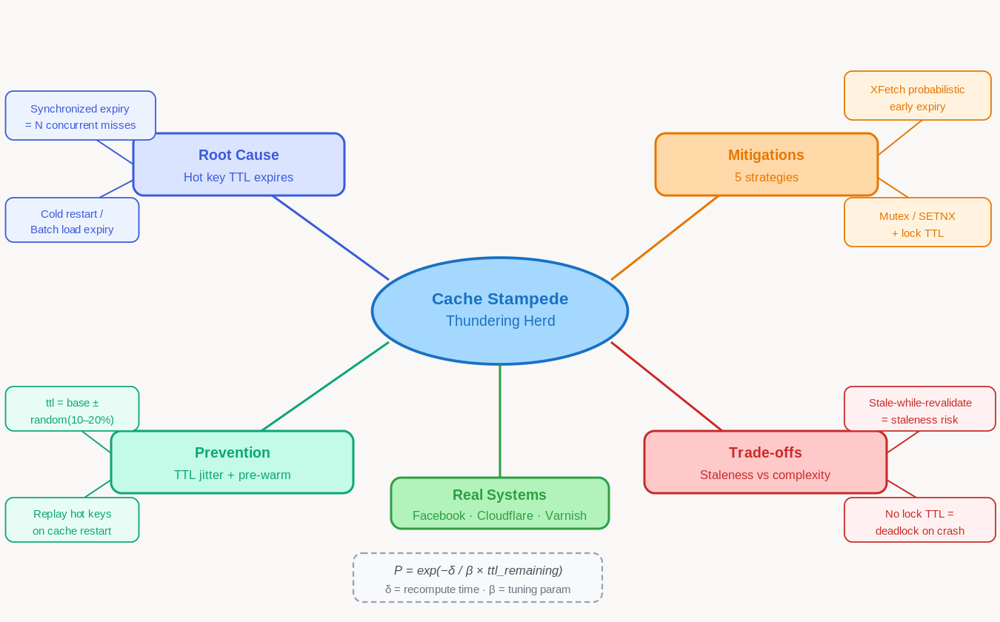

# 5.6 Cache Stampede and Thundering Herd

> **Topic:** Topic 5 — Caching Systems
> **Phase:** B — Scalability Branch
> **Date studied:** 2026-06-09

---

## 0. 🗺️ Topic Overview

### What This Topic Is About

Cache stampede (also called thundering herd or dogpile effect) is a failure mode where a popular cached item expires and many concurrent requests simultaneously miss the cache, all stampeding to the origin database at once. The resulting spike in DB load can overwhelm the origin, cause cascading failures, and ironically produce worse performance than having no cache at all. Mastering this topic means knowing not only how to detect this failure mode, but precisely which mitigation to apply given the read pattern, consistency requirement, and system scale.

### 🎯 What to Focus On

**1. Root cause mechanics.** Understand why TTL expiration of a hot key is inherently a thundering-herd trigger — this is the foundation for every mitigation.

**2. The five mitigation strategies and their trade-offs.** Probabilistic early expiration (XFetch), mutex/locking, background refresh, stale-while-revalidate, and TTL jitter each solve a different slice of the problem. Know when each applies and what each costs.

**3. Request coalescing vs. probabilistic refresh.** These are the two most interview-relevant mitigations. Be able to implement both conceptually and compare their consistency guarantees.

**4. Thundering herd on recovery.** Cache stampede isn't only a TTL problem — it also occurs when a cache server restarts cold after a crash. Know the cold-start variant and its mitigation.

**5. Interaction with retry logic.** Naive retries under load amplify thundering herd. Know why exponential backoff with jitter is the complement to stampede mitigation.

---

## 1. 🎯 Goal of This Subtopic

Be able to identify when cache stampede is occurring or likely to occur in a system design, explain the exact mechanism that causes it, and propose one or more concrete mitigations matched to the system's consistency requirements and scale. Be able to compare the mitigation strategies on staleness tolerance, implementation complexity, and failure isolation.

---

## 2. ✅ What Mastery Looks Like

> *Concrete, testable proof that you own this concept — not just familiarity.*

- [ ] Can explain the exact sequence of events that turns a single cache miss into a stampede, including the role of TTL and concurrent request volume
- [ ] Can describe the XFetch / probabilistic early expiration algorithm and explain why it prevents stampedes without requiring coordination
- [ ] Can design a mutex-based cache refresh pattern using Redis SETNX and explain what happens to waiting clients when the lock holder fails
- [ ] Can explain stale-while-revalidate semantics and identify use cases where serving stale data is acceptable vs. unacceptable
- [ ] Can explain why TTL jitter reduces stampede probability and calculate how much variance is needed at a given request rate
- [ ] Can identify the cold-start / cache warmup variant of thundering herd and propose a mitigation

> 💡 **Rule of thumb:** If you can teach it to someone else and field their follow-up questions, you've mastered it.

---

## 3. 🗓️ Study Phases to Achieve Mastery

> *A progressive plan from first exposure to interview-ready. Work through each phase in order.*

### Phase 1 — Acquire 📖 💪💪
*Goal: Read deeply enough that you could explain the concept without the doc.*

- [ ] Read **DDIA Chapter 11** (stream processing intro touches on thundering herd patterns) and **"An Analysis of Facebook Photo Caching"** (Meta eng blog)
- [ ] Read **"XFetch: Optimal Probabilistic Cache Stampede Prevention"** — Vattani, Chierichetti, Lowenstein (2015)
- [ ] Read through **Sections 5–9** carefully — don't skim
- [ ] Re-read the **Cheatsheet** (Section 4) and recite from memory after

### Phase 2 — Consolidate ✍️ 💪💪💪
*Goal: Reproduce the knowledge in your own words without looking.*

- [ ] Close the doc — write out the **Core Definition** from memory, then compare
- [ ] Explain **First Principles** out loud — what specifically causes the stampede and why caching alone doesn't prevent it?
- [ ] Reconstruct the **How It Works** mechanics for each mitigation strategy from memory
- [ ] Restate each **Trade-off** row — if you can't explain the cost, you don't own it yet

### Phase 3 — Apply 🔧 💪💪💪💪
*Goal: Connect to real systems and simulate interview scenarios.*

- [ ] Go through **Real-World System Examples** — verify each claim and add notes to **My Notes**
- [ ] Practice the **Interview Application** out loud — trigger phrases → response as in a live interview
- [ ] Work through **Common Misconceptions** — explain *why* each misconception is wrong
- [ ] Trace the **Relationships to Other Concepts** — explain each connection without looking

### Phase 4 — Validate 🧪 💪💪💪💪💪
*Goal: Confirm you actually own it, not just recognize it.*

- [ ] Answer every **Self-Check Quiz** question out loud without notes
- [ ] Recite the **Cheatsheet** from memory — if you can't, re-do Phase 2
- [ ] Tick off items in **What Mastery Looks Like** — only check if you can demonstrate on demand
- [ ] Teach this concept out loud to an imaginary interviewer for 2 minutes without hesitation

---

## 4. 📋 Cheatsheet

> *Everything you need to recall this concept in 30 seconds — for quick review before an interview.*



```
§ 1  WHY IT EXISTS
  Caches absorb load by serving repeated reads from memory. When a hot key
  expires, all requests that were being absorbed by the cache are now
  in-flight simultaneously — they all miss and all hit the DB at once.
  The DB, sized only for residual traffic, collapses under a spike it was
  never designed to handle. The more successful your cache, the worse
  the stampede when it expires — because the DB has been load-starved.

§ 2  WHAT EACH MITIGATION IS
  XFetch      — probabilistic early refresh per request as TTL → 0.
                P = exp(−δ / β × ttl_remaining). No coordination needed.
  Mutex/SETNX — 1st miss acquires a Redis lock; others wait or get stale.
                Guarantees at-most-one DB fetch per key per window.
  Stale-while — serve stale now, async background refresh (RFC 5861).
  revalidate    CDN/Nginx/Varnish native. Zero added client latency.
  TTL jitter  — ttl = base_ttl ± random(10–20%). Spreads batch expiry.
                Zero read-path overhead.
  BG refresh  — proactive warming: monitor TTL, refresh before expiry.
                Read path never misses for known-hot keys.

§ 3  THE 3 KEY DISTINCTIONS
  1. Stampede vs hot key: stampede is a transient spike triggered by
     a synchronized miss event; hot key is sustained overload. Not the
     same fix — both may co-exist on the same key.
  2. TTL jitter only fixes batch expiry. A single viral key still
     stampedes regardless of jitter — need XFetch or mutex for that.
  3. Mutex REQUIRES a lock TTL (EX param). Crashed lock holder with no
     TTL = permanent deadlock on that key. No exceptions.

§ 4  USE / AVOID
  XFetch:     reads are high-volume, some staleness tolerable, no lock infra.
  Mutex:      at-most-one DB fetch required (inventory, pricing, auth).
  Stale-while-revalidate: CDN or reverse proxy already in path.
  TTL jitter: batch-loaded key sets (startup, bulk import).
  BG refresh: predictable hot keys only — misses unexpected viral content.
  AVOID mutex without lock TTL — one crash = permanent key deadlock.

§ 5  INTERVIEW TRIGGERS
  -> "What happens when your cache expires for a popular item?"
  -> "How do you handle celebrity posts or viral content in the cache?"
  -> "Your cache just restarted — walk me through what happens to traffic."
  -> "How do you prevent your DB being overwhelmed if the cache fails?"

§ 6  FTAC
  F  "Tension: cache expiry is a synchronized event — all concurrent
     requests see a miss at the same instant, converting a single expiry
     into N simultaneous DB queries."
  T  "XFetch: zero coordination, slight staleness increase.
     Mutex: freshest data, but lock holder crash can deadlock the key.
     Stale-while-revalidate: best for CDN layer, not for strongly
     consistent reads like inventory or balances."
  A  "Assuming this is a read-heavy content system (social feed, catalog)
     tolerating a few seconds of staleness — Zipfian hot key distribution."
  C  "XFetch with β=1.0. Cost: occasional extra DB fetch before expiry.
     Also add TTL jitter on batch loads. No mutex needed at this scale."

§ 7  NUMBERS & GOTCHA
  Amplification: N = R req/s × recompute_time_seconds
    (10k req/s × 50ms = 500 simultaneous DB queries from 1 expiry)
  XFetch: P = exp(−δ / β × ttl_remaining); δ = recompute ms, β = 1.0
  Jitter range: ±10–20% of base TTL
  Lock TTL: max(recompute_time) × 2 as safety margin
  GOTCHA: mutex without EX param → crashed lock holder → permanent
  deadlock on that key for all future refreshes. Always SETNX + EX atomically.
```

---

## 5. 🧠 Core Definition

Cache stampede (thundering herd) is a failure mode where the simultaneous expiration or absence of a cached value causes a large number of concurrent requests to bypass the cache and hit the origin system at once, producing a load spike that can cascade into a system-wide outage. The problem is not the individual cache miss — it is the concurrent amplification of that miss across all in-flight requests.

---

## 6. 📦 Core Concepts

### Cache Miss Amplification
A single logical cache miss becomes many physical DB queries when request concurrency is high. For a key receiving 10,000 req/s with a 50ms TTL window, up to 500 requests can arrive between the first miss and the repopulated cache. Each of those 500 sees an empty cache and fires an independent DB query, turning one expired key into 500 simultaneous origin fetches.

### Thundering Herd vs. Hot Key Problem
These are related but distinct. A hot key problem is sustained overload on a single DB key due to high read volume; a thundering herd is a transient spike triggered by a synchronized miss event (TTL expiry, server restart, deployment). Hot key mitigation (replication, local caching) helps; so does stampede prevention — but they are not the same fix.

### Probabilistic Early Expiration (XFetch)
Before TTL reaches zero, each request independently computes a probability of refreshing early based on how close to expiry the key is and how expensive the recompute is. The probability increases exponentially as TTL approaches zero. No coordination is needed — the randomness naturally distributes refreshes across time, preventing synchronized expiry.

### Mutex-Based Refresh (Request Coalescing)
When a cache miss is detected, the first request acquires a distributed lock (e.g., Redis SETNX with TTL) and fetches from the DB. All other concurrent misses either: (a) wait and re-check the cache once the lock is released, or (b) are served stale data if a stale copy exists. This guarantees at-most-one DB fetch per key per refresh window.

### Stale-While-Revalidate
An HTTP/CDN caching directive (RFC 5861) that instructs the cache to serve stale content immediately while triggering an asynchronous background refresh. The client gets a fast response; the DB gets a single background refresh request. This is the CDN-layer equivalent of mutex-based refresh.

### TTL Jitter
Instead of all keys sharing a fixed TTL (e.g., all expire at T+3600), each key's TTL is randomized: `ttl = base_ttl + random(-jitter, +jitter)`. This spreads expirations over time and prevents batch-loaded keys from creating a synchronized stampede wave.

---

## 7. 🔍 First Principles — Why Does This Exist?

Caches work by trading freshness for performance: instead of computing or fetching the same answer repeatedly, you store it once and serve it many times. The performance gain depends on the cache hit rate staying high — but the moment a hot cached value expires, the cache provides zero protection. The problem is that all the requests that were previously absorbed by the cache are now in-flight simultaneously when the expiry occurs. The DB, which was designed to handle only the residual traffic that the cache doesn't cover, suddenly receives the full uncached load all at once. This is a systems-level thundering herd: many processes synchronized by a single shared event (the TTL clock), all waking up and competing for the same resource at the same moment.

---

## 8. 🗺️ Mental Models

### Model 1: The Roped-Off Queue at Midnight
Imagine a nightclub that closes its doors at midnight (TTL expiry). Everyone waiting outside rushes in simultaneously the moment the doors open — instead of a steady trickle. The stampede is caused not by the volume of people but by the synchronization of their arrival. Jitter is the equivalent of opening the doors at random times between 11:55 PM and 12:05 PM — the crowd self-distributes.

*Where it breaks down:* This model doesn't capture the lock-holder failure scenario — if the first person in (lock holder) collapses in the doorway, the model needs a bouncer (lock TTL + stale fallback) to handle it.

### Model 2: The Constructor in a Busy Office
When a popular shared document is checked out for editing (cache miss + lock acquired), everyone else who needs it pauses and waits. This is correct behavior — you don't want 500 people making the same edit simultaneously. But if the person who checked it out gets fired mid-edit (lock holder crashes), the document stays locked forever unless there's a policy to reclaim it after N minutes (lock TTL).

*Where it breaks down:* In the office analogy, waiting is clearly visible. In distributed systems, "waiting" means holding an HTTP connection open, consuming threads — the cost of waiting is often non-obvious until connections exhaust.

### Model 3: Probabilistic Early Departure
Consider a train that's scheduled to depart at 10:00 but has been known to leave early. Passengers who know this board randomly between 9:45 and 9:59 to avoid the 10:00 rush. This is XFetch: each passenger independently decides when to "board early" based on how close to departure time it is and how long it takes to get to the platform (recompute cost). The randomness breaks the synchrony without any central coordination.

*Where it breaks down:* If the cost of early departure (recompute) is very high, passengers avoid it too much and you still get a rush. XFetch's `beta` parameter controls this sensitivity.

---

## 9. ⚙️ How It Works — Mechanics

### The Stampede Sequence (without mitigation)

1. Key K is cached with TTL = T seconds.
2. K is a hot key receiving R requests/sec.
3. At time T, K expires. All in-flight requests simultaneously hit the cache and find a miss.
4. All R × (cache_read_latency_ms / 1000) concurrent requests fire DB queries.
5. DB receives a spike of N simultaneous queries, where N can be in the hundreds or thousands.
6. DB latency increases under load → requests queue up → more timeouts → retry storms compound the spike → cascading failure.

### Mitigation 1: TTL Jitter
```
ttl = base_ttl + random_integer(-jitter_range, +jitter_range)
```
Applied at cache write time. Spreads expiration across a window. Works best for batch-loaded keys that would otherwise all expire simultaneously. Zero coordination overhead, zero staleness increase (within jitter range), zero code change to the read path.

### Mitigation 2: Probabilistic Early Expiration (XFetch)
At read time, before the key expires, each request computes:
```
early_refresh = random() < exp(-delta / (beta × ttl_remaining))
```
Where `delta` = estimated recompute time (ms), `ttl_remaining` = seconds left. If true, the request voluntarily treats the cache as a miss and refreshes early. As TTL approaches zero, the probability approaches 1, ensuring the cache is refreshed before actual expiry. No locks, no coordination — just randomness distributing the refresh load.

### Mitigation 3: Mutex / Request Coalescing
```
1. Request arrives, checks cache → miss.
2. Request attempts to acquire lock: SETNX lock_key "1" EX <lock_ttl>
3a. Lock acquired: fetch from DB → write to cache → release lock.
3b. Lock not acquired: wait (sleep + retry cache read) OR return stale value.
4. All waiting requests find cache populated on next check.
```
Critical detail: the lock must have a TTL (EX param) so a crashed lock holder doesn't permanently block refreshes. The waiting strategy (sleep vs. stale) is a staleness tolerance choice.

### Mitigation 4: Background Refresh (Proactive Warming)
A background job monitors key TTLs and refreshes hot keys before they expire. The cache always has a valid value; the foreground read path never triggers a cache miss for warmed keys. Works well for predictable hot keys but requires an active monitoring process and doesn't handle unexpected hot key emergence.

### Mitigation 5: Stale-While-Revalidate
Cache serves stale data immediately while an asynchronous refresh runs in the background. The requester gets a response immediately (no wait, no DB spike). Only one background refresh is triggered per expiry. Common in HTTP caching (`Cache-Control: stale-while-revalidate=N`) and supported natively in Nginx, Varnish, and CDNs.

### Cold-Start Thundering Herd
When a cache server restarts empty (after crash, deployment, or scale-out), 100% of requests miss until the cache warms. Mitigation: pre-warm by replaying recent hot key requests before routing live traffic, or by loading from a persistent backup (Redis AOF/RDB restore). Circuit breakers at the cache layer can also shed load during the warmup window.

---

## 10. 🏭 Real-World System Examples

> *Where does this appear in production systems you know?*

| System | How This Concept Applies | Notes |
|--------|--------------------------|-------|
| Facebook / Meta | Uses probabilistic cache expiration at massive scale; "thundering herd" term originated from their 2013 Memcache at Scale paper | Also uses lease mechanism (similar to mutex) for L2 misses |
| Reddit | Historically suffered cache stampedes on popular post pages; addressed with coalesced refreshes and background warming | Especially pronounced during viral content spikes |
| Cloudflare CDN | Implements stale-while-revalidate natively at the edge; single background revalidation per PoP | Avoids stampede at CDN edge layer without touching origin |
| Redis (application layer) | SETNX + EX pattern for distributed mutex is the standard Redis stampede prevention implementation | Must use NX + EX atomically — separate SETNX + EXPIRE is not atomic |
| Varnish Cache | Built-in "grace mode" serves stale content during origin fetch, effectively implementing stale-while-revalidate | Configurable per request via VCL |
| DoorDash / food delivery | Menu cache stampedes during lunch/dinner peaks mitigated via jitter on restaurant menu TTLs | Predictable traffic spikes make jitter especially effective |

---

## 11. ⚖️ Trade-offs

> *Every design decision has a cost. What are you giving up?*

| ✅ Benefit | ❌ Cost / Limitation |
|-----------|---------------------|
| **Probabilistic expiry (XFetch):** zero coordination, self-distributing, no waiting clients | Serves slightly stale data more often than hard TTL; beta tuning requires empirical calibration |
| **Mutex/lock refresh:** guarantees at-most-one DB fetch per key; waiting clients always get fresh data | Lock holder failure can block all refreshes; adds latency for waiting clients; requires distributed lock infra |
| **Stale-while-revalidate:** zero added latency for clients; single background fetch | Clients may receive stale data for up to the revalidation window; not suitable for strongly consistent data (bank balances, inventory) |
| **TTL jitter:** trivial to implement; zero read-path overhead; prevents batch-expiry waves | Only helps for known-batch loads; doesn't prevent a single viral hot key from stampeding; adds operational variance to TTL reasoning |
| **Background refresh/warming:** read path never sees a miss for warmed keys | Requires a separate process; doesn't handle unexpected viral content; wastes resources refreshing unpopular keys |

---

## 12. 🎯 Interview Application

> *How do you use this concept in a design interview? What triggers it?*

**When an interviewer asks / says:**
- "What happens when your cache expires for a popular item?"
- "How do you handle a celebrity post or viral content in your cache layer?"
- "Your cache just restarted — walk me through what happens to traffic."
- "How would you prevent your DB from being overwhelmed if the cache fails?"

**What you say / do:**
In the deep-dive or trade-off discussion phase, when designing the caching layer, proactively raise stampede as a failure mode: "One thing I want to address is cache stampede — if this key is hot and expires, we could see a thundering herd to the DB. Here's how I'd prevent that…" Then propose the appropriate mitigation based on the system's staleness tolerance: XFetch or stale-while-revalidate for read-heavy social/content systems; mutex for inventory or pricing where staleness is costly.

**The trade-off statement (memorize this pattern):**
> "If we use a hard TTL, we get simplicity, but we pay with potential stampedes on hot keys. For this system, I'd use probabilistic early expiration because we can tolerate a few seconds of staleness and we want zero coordination overhead at scale."

---

## 13. ⚠️ Common Misconceptions & Gotchas

- ❌ **Misconception:** Cache stampede only happens when the cache is down.
  ✅ **Reality:** The most common cause is normal TTL expiration of a hot key. The cache is working perfectly — the stampede is caused by the expiry event itself, not a cache failure.

- ❌ **Misconception:** Setting a longer TTL prevents stampedes.
  ✅ **Reality:** A longer TTL delays the stampede but doesn't prevent it. When the key eventually expires, the same thundering herd occurs. Jitter, coalescing, or probabilistic expiry are the correct fixes.

- ❌ **Misconception:** A mutex lock around cache miss handling is sufficient on its own.
  ✅ **Reality:** A mutex without a TTL is a time bomb. If the lock holder crashes between acquiring the lock and writing to cache, the lock is never released and all future requests for that key are permanently serialized (or blocked). Always set a lock expiry.

- ❌ **Misconception:** Stale-while-revalidate causes consistency problems in all systems.
  ✅ **Reality:** Staleness is acceptable in many real systems: social feed rankings, product listings, user profile pictures, news headlines. The key question is the staleness window tolerance, not whether any staleness exists.

---

## 14. 🔗 Relationships to Other Concepts

- **Builds on:** 5.4 Eviction Policies (TTL is the trigger mechanism for stampedes) and 5.5 Cache Consistency & Invalidation (stampede is a consistency failure at the expiry boundary)
- **Enables:** 5.7 Hot Key Problem and Mitigation (hot keys are the subset most vulnerable to stampede; understanding stampede is prerequisite to understanding hot key mitigations)
- **Tension with:** Strong consistency requirements — stale-while-revalidate and probabilistic expiry both serve data that may be slightly outdated, which is incompatible with systems requiring linearizable reads (e.g., financial account balances, inventory reservation)

---

## 15. 🧪 Self-Check Quiz

> *Can you answer these without looking? If not, you haven't internalized it yet.*

1. What is cache stampede, and what specific conditions make it likely to occur?

   > 💡 *Think through your answer before expanding — if you hesitate, revisit Section 5.*

2. You're designing a read-heavy product catalog that can tolerate up to 5 seconds of stale data. Which stampede mitigation would you choose and why?

   > 💡 *Consider: coordination overhead, implementation complexity, and staleness tolerance. Revisit Section 9 if needed.*

3. What is the specific failure mode of a mutex-based stampede prevention that can cause worse behavior than having no mitigation at all?

   > 💡 *Think about what happens when the lock holder crashes mid-refresh. Revisit Section 9 Mitigation 3.*

4. Name a real production system that uses stale-while-revalidate and explain exactly how it prevents cache stampede at the CDN edge.

   > 💡 *Revisit Section 10 if you can't name a concrete system.*

5. A batch job loads 50,000 product records into Redis at startup with TTL = 1 hour. One hour later, the system receives a stampede. What was the root cause and what single change at write time would have prevented it?

   > 💡 *This is the batch-load variant. Revisit the TTL Jitter mechanism in Section 9.*

---

## 16. 📚 Further Reading

> *Links, chapters, or resources for deeper understanding.*

- [ ] **"Scaling Memcache at Facebook"** — Nishtala et al., NSDI 2013 — the paper that coined "thundering herd" in the caching context and introduced the lease mechanism
- [ ] **"XFetch: Optimal Probabilistic Cache Stampede Prevention"** — Vattani et al. (2015) — the algorithm behind probabilistic early expiration with mathematical analysis
- [ ] **DDIA Chapter 11** — Designing Data-Intensive Applications (Kleppmann) — covers backpressure and thundering herd in the context of stream processing
- [ ] **Cloudflare Blog: "How Cloudflare's CDN uses stale-while-revalidate"** — cloudflare.com/blog — practical CDN-layer implementation
- [ ] **Redis documentation: "Patterns — Distributed Locks"** — redis.io/docs/manual/patterns/distributed-locks — canonical SETNX + EX mutex pattern

---

## 17. ✍️ My Notes

> *Personal observations, things that confused me, analogies that helped.*

