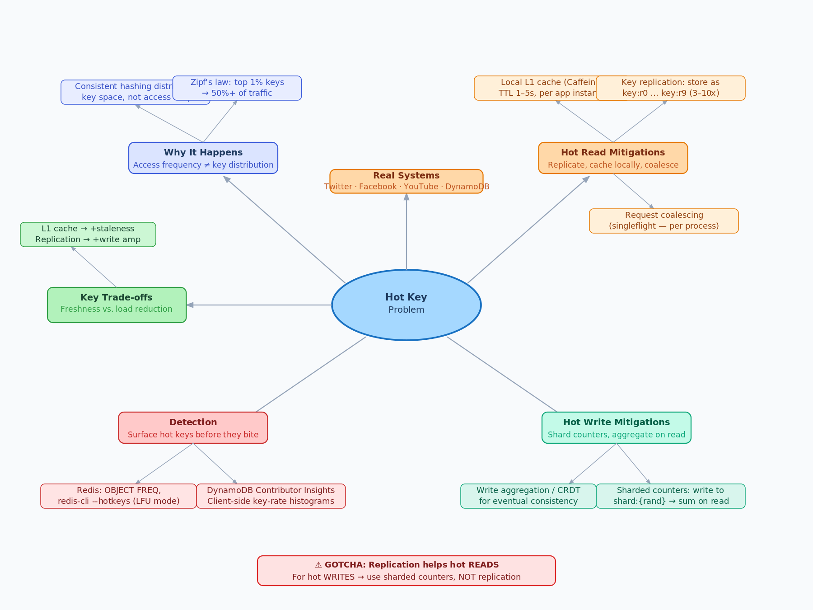

# 5.7 Hot Key Problem and Mitigation

> **Topic:** Topic 5 — Caching Systems
> **Phase:** B — Scalability Branch
> **Date studied:** 2026-06-12

---

## 0. 🗺️ Topic Overview

### What This Topic Is About

The hot key problem occurs when a small number of cache or data store keys attract a disproportionately large fraction of all traffic, causing the node(s) responsible for those keys to become saturated while the rest of the cluster sits idle. This is a structural scaling failure: you can add more nodes all day, but if all traffic concentrates on one key, you have a cluster-of-one bottleneck. Mastering this topic means knowing how to detect the imbalance, and applying the right mitigation at the right layer — from the cache client down to the data model.

### 🎯 What to Focus On

**1. Why consistent hashing alone doesn't solve it.** Consistent hashing distributes keys uniformly by *name*, not by *access frequency*. A single viral post or trending item will always land on one shard regardless of how many virtual nodes you add. Candidates who conflate "balanced sharding" with "no hot keys" make a fundamental error here.

**2. The three mitigation families and when each applies.** Local (in-process) caching eliminates network round-trips entirely. Key replication (shard cloning) spreads reads across N copies. Request coalescing (mutex/singleflight) serializes thundering requests for the same key. Each solves a different failure mode — knowing *which* to reach for given a workload is the core skill.

**3. The read-vs-write asymmetry.** Hot reads are much easier to mitigate (replicate, cache locally) than hot writes. Hot write keys — like a global counter or a single heavily-liked post — require fundamentally different patterns: write aggregation, sharded counters, or CRDT-based designs. Don't confuse the two in an interview.

**4. Detection before mitigation.** You cannot mitigate what you cannot see. Know how to surface hot keys: Redis `OBJECT FREQ`, DynamoDB Contributor Insights, memcached slab stats, and client-side hit-rate histograms are the practical instruments.

**5. Trade-off awareness: freshness vs. load.** Every mitigation that adds a layer of caching introduces a consistency gap. The harder you push to reduce hot key load, the more staleness you accept. Be explicit about this trade-off — it's what distinguishes a senior answer from a junior one.

---

## 1. 🎯 Goal of This Subtopic

Be able to identify a hot key failure mode in a system design and propose a layered mitigation strategy that distinguishes between hot reads and hot writes. Understand the mechanism behind each mitigation — local caching, key replication, request coalescing, sharded counters — well enough to explain the consistency and complexity cost of each without notes.

---

## 2. ✅ What Mastery Looks Like

> *Concrete, testable proof that you own this concept — not just familiarity.*

- [ ] Can explain why a hot key forms even in a well-sharded cluster and name two real scenarios that produce them (celebrity post, trending ticker, flash sale item)
- [ ] Can describe at least three distinct mitigation strategies, state when each is the right choice, and name the cost of each
- [ ] Can distinguish hot read keys from hot write keys and propose a different mitigation path for each
- [ ] Can explain sharded counters from first principles: why they work, how they aggregate, and when eventual vs. strong count consistency is acceptable
- [ ] Can apply the mitigation decision in an interview: given a system requirement (e.g., "a single product page is getting 100k rps") choose and justify the right technique

> 💡 **Rule of thumb:** If you can teach it to someone else and field their follow-up questions, you've mastered it.

---

## 3. 🗓️ Study Phases to Achieve Mastery

> *A progressive plan from first exposure to interview-ready. Work through each phase in order. Don't move to the next until you can honestly tick every item.*

### Phase 1 — Acquire 📖 💪💪
*Goal: Read deeply enough that you could explain the concept without the doc.*

- [ ] Read **Designing Data-Intensive Applications** Ch. 6 (partitioning hot spots) — Kleppmann
- [ ] Read **ByteByteGo** newsletter: "How to Handle Hot Key Problem in Redis" — Alex Xu
- [ ] Read **AWS re:Invent 2020 DAT310** — ElastiCache best practices (hot key detection segment)
- [ ] Read through **Sections 5–9** (Core Definition → How It Works) carefully — don't skim
- [ ] Re-read the **Cheatsheet** (Section 4) and try to recite it from memory after

### Phase 2 — Consolidate ✍️ 💪💪💪
*Goal: Verify you can reproduce the knowledge in your own words without looking.*

- [ ] Close the doc — write out the **Core Definition** from memory, then compare
- [ ] Explain **First Principles** out loud without notes — what problem does this solve and why?
- [ ] Reconstruct the **How It Works** mechanics step by step from memory
- [ ] Restate each **Trade-off** row in your own words — if you can't explain the cost, you don't own it yet

### Phase 3 — Apply 🔧 💪💪💪💪
*Goal: Connect to real systems and simulate interview scenarios.*

- [ ] Go through **Real-World System Examples** (Section 10) — verify each claim independently and add anything missed to **My Notes**
- [ ] Practice the **Interview Application** (Section 12) out loud — say the trigger phrases and your response as if in a live interview
- [ ] Work through **Common Misconceptions** (Section 13) — for each, make sure you can explain *why* the misconception is wrong, not just that it is
- [ ] Trace the **Relationships to Other Concepts** (Section 14) — can you explain each connection without looking?

### Phase 4 — Validate 🧪 💪💪💪💪💪
*Goal: Confirm you actually own it, not just recognize it.*

- [ ] Answer every **Self-Check Quiz** question (Section 15) out loud without looking at your notes
- [ ] Recite the **Cheatsheet** (Section 4) from memory — if you can't, re-do Phase 2
- [ ] Tick off items in **What Mastery Looks Like** (Section 2) — only check a box if you can demonstrate it on demand, not just if it sounds familiar
- [ ] Teach this concept out loud to an imaginary interviewer for 2 minutes without hesitation or notes

---

## 4. 📋 Cheatsheet

> *Everything you need to recall this concept in 30 seconds — for quick review before an interview.*



```
ONE-LINER
  A hot key is a single cache/store key that receives so much traffic it
  overwhelms the node responsible for it, regardless of cluster size.

KEY PROPERTIES / RULES
  • Consistent hashing distributes keys by name, not frequency — hot keys
    still land on one node even in a 100-shard cluster.
  • Hot reads: mitigate with local (L1) caching, key replication, or
    request coalescing (singleflight).
  • Hot writes: mitigate with sharded counters, write aggregation, or
    CRDTs — you cannot simply replicate a write target.
  • Every mitigation adds a staleness window; make this trade-off explicit.
  • Detection first: Redis OBJECT FREQ, DynamoDB Contributor Insights,
    client-side hit-rate histograms.

DECISION RULE
  Use local L1 cache when: read traffic is very high, slight staleness
    is acceptable, and network RTT is a bottleneck.
  Use key replication when: a single cache key is a true read hotspot
    and you can tolerate eventual consistency across replicas.
  Use sharded counters when: the hot key is a write-heavy counter
    (likes, views, inventory) — read as a sum, write to a random shard.
  Avoid naive replication when: the key receives heavy writes —
    replication amplifies write cost, not reduces it.

NUMBERS / FORMULAS
  Shard factor for sharded counters: N shards → write load / N per shard,
    but read cost = N (must sum all shards).
  Local TTL: typically 1–5 seconds — short enough to limit staleness,
    long enough to absorb traffic spikes.
  Key replication fan-out: typical range 3–10 replica copies per hot key.

GOTCHA TO NEVER FORGET
  Replicating a hot key helps reads but doubles (or Nx) your write
  invalidation cost — always ask "is this key read-heavy or write-heavy?"
  before choosing a mitigation.
```

---

## 5. 🧠 Core Definition

> *What is it, in one sentence?*

A hot key is a single key in a cache or distributed data store that receives a disproportionately large share of traffic, saturating the node or shard responsible for it while leaving the rest of the cluster underutilized — a concentration problem that no amount of horizontal scaling can solve without targeted mitigation.

---

## 6. 📦 Core Concepts

> *The essential building blocks of this subtopic — the terms and ideas you must have solid before going deeper.*

### Hot Key Formation
A hot key forms when access patterns are skewed — a celebrity's profile, a trending news article, a flash-sale product, or a real-time leaderboard entry. The key's name consistently hashes to the same node, so all requests funnel to one machine. This is distinct from a cache miss storm (5.6): the key is present and warm, but the node is still overwhelmed by sheer request volume.

### Local (L1) In-Process Caching
Each application instance maintains a small in-memory cache (e.g., a Guava LoadingCache or Caffeine cache) that holds hot keys for 1–5 seconds. Requests are served from process memory, completely bypassing the shared cache tier. This reduces remote cache load by a factor equal to the number of application nodes, at the cost of per-instance memory and a short staleness window.

### Key Replication / Shard Cloning
The hot key is stored under N differently-named keys (e.g., `product:42:r0` … `product:42:r9`) distributed across N shards. Readers pick a replica at random (or by node ID). Writers must invalidate or update all N copies. This spreads read traffic across shards but multiplies write fan-out — only appropriate for read-dominated hot keys.

### Request Coalescing (Singleflight)
When multiple goroutines/threads request the same key simultaneously, only the first is allowed to fetch from the origin; the rest block and receive the same result when the first completes. Go's `singleflight` and similar patterns in other languages implement this. It limits origin fan-out to one request per key regardless of concurrent callers.

### Sharded Counters
For hot *write* keys (likes, view counts, inventory), writes are distributed across N counter shards (e.g., `counter:post:42:shard:{0..N-1}`). Each write goes to a random shard. Reads aggregate all N shards. The count is eventually consistent in the short window between shard writes and aggregation. Used by Facebook for like counts, YouTube for view counts.

### Detection and Monitoring
You cannot mitigate what you cannot see. Redis exposes hot key frequency via `OBJECT FREQ` (requires LFU eviction policy) and `redis-cli --hotkeys`. DynamoDB has Contributor Insights. Client-side: track key-level request rates in a sliding window histogram and alert when any key exceeds a threshold (e.g., top 1% of keys consuming >50% of traffic).

---

## 7. 🔍 First Principles — Why Does This Exist?

> *What fundamental problem does this concept solve? Why was it invented?*

Distributed caches and data stores distribute keys across nodes under one assumption: *access will be roughly uniform across keys*. Every sharding algorithm — consistent hashing, range partitioning, hash partitioning — is designed to distribute *key space* evenly, not *access frequency*. In practice, access patterns follow a Zipf-like power law: a tiny fraction of keys (trending content, popular users, top products) accounts for the vast majority of traffic.

When this happens, the node holding the hot key becomes a single-node bottleneck inside your distributed system. Adding more nodes doesn't help — the hot key always maps to one node. The problem is not infrastructure scale; it is *concentration*. The mitigations all share one design principle: break the concentration by introducing redirection, replication, or aggregation that spreads the load across multiple nodes or eliminates remote calls entirely.

---

## 8. 🗺️ Mental Models

> *Intuition frames that help you reason about this concept fast — especially under interview pressure.*

### Model 1: The Superstar Cashier
Imagine a supermarket with 20 checkout lanes. 18 lanes have zero customers. One lane has 500 people queued because a celebrity employee is working it. Adding more checkout lanes doesn't help the 500-person queue. You fix it by: (a) letting managers handle some transactions locally (local L1 cache), (b) cloning the celebrity's workflow across 10 lanes (key replication), or (c) converting the problem so no single cashier handles a singular resource (sharded counters). The failure mode is concentration, not capacity.

*Where it breaks down:* The analogy doesn't capture the consistency cost — in a cache, "cloning" means keeping all clones in sync, which adds write overhead the supermarket model ignores.

### Model 2: The Power Law Curve
Hot key problems are a manifestation of Zipf's law — the most popular item gets twice the traffic of the second most popular, three times the third, etc. The cure isn't a bigger node (vertical scaling); it's flattening the distribution by spreading load. Any mitigation that reduces a single node's load by a factor of N is equivalent to adding N times the capacity at that node — but without having to buy that hardware.

*Where it breaks down:* Flattening always adds latency, complexity, or staleness. There is no free lunch — you are trading one problem (saturation) for another (consistency lag, added code complexity, or higher write amplification).

### Model 3: Reads vs. Writes Are Different Problems
Treat hot read keys and hot write keys as fundamentally different. A hot read key is like a very popular book at a library — the fix is to buy more copies (replicate). A hot write key is like a single shared bank account receiving thousands of simultaneous deposits — buying more copies doesn't help, because every copy needs to receive every write. The fix is to split the account into N sub-accounts and sum them on read (sharded counters). If you try to "replicate" a hot write key, you just amplify your write problem N-fold.

---

## 9. ⚙️ How It Works — Mechanics

> *Step-by-step or layered explanation of the internal mechanism.*

### Happy Path (No Hot Key)

1. Client requests `GET product:42`.
2. Consistent hash maps `product:42` → node 7 out of 20.
3. Node 7 returns the cached value in <1ms.
4. Traffic is roughly uniform across all 20 nodes.

### Hot Key Failure Path

1. A product goes viral. 50,000 rps all request `GET product:42`.
2. All 50,000 rps are routed to node 7 (same hash every time).
3. Node 7's CPU, network bandwidth, or connection pool is exhausted.
4. Latency for `product:42` rises; node 7 may begin dropping connections.
5. Other keys on node 7 also degrade (collateral damage).

### Mitigation 1: Local L1 Cache

Each app server maintains a local TTL cache (e.g., 2-second TTL). On a hit, the request never leaves the process. With 100 app servers, node 7 now receives at most ~50,000 / 100 = 500 rps (assuming cache is warm), plus one miss per app server per TTL cycle. The trade-off is 2 seconds of maximum staleness.

Implementation: `Caffeine.newBuilder().expireAfterWrite(2, SECONDS).maximumSize(1000).build()`.

### Mitigation 2: Key Replication

Write the value to `product:42:r0` … `product:42:r9` across 10 shards. Readers pick `product:42:r{random(0,9)}`. Each shard now receives ~5,000 rps instead of 50,000. Writers must update/invalidate all 10 replicas on change.

Critical: this works only if writes are infrequent relative to reads. If product:42 is updated every second and there are 10 replicas, your write amplification is 10x.

### Mitigation 3: Request Coalescing (Singleflight)

```
func getProduct(ctx, id) {
  result, err, _ := sfGroup.Do("product:"+id, func() (interface{}, error) {
    return cache.Get(ctx, "product:"+id)
  })
  return result, err
}
```

All concurrent requests for the same key within the same process share one underlying fetch. On a cache miss, only one goroutine hits the origin; all others block and receive the same result. Eliminates the thundering herd from a single process, but does not help across multiple processes.

### Mitigation 4: Sharded Counters (Hot Write Keys)

For `counter:likes:post:42`:
- Write: `INCR counter:likes:post:42:shard:{rand(0,N-1)}`
- Read: `SUM(counter:likes:post:42:shard:0 … shard:N-1)`

With N=100 shards, write load is distributed across 100 keys on 100 different nodes. Read cost increases from O(1) to O(N), but reads are cacheable and reads of aggregate counts are typically less frequent and more tolerant of slight staleness than writes.

### Key Thresholds
- Local TTL: 1–5 seconds is typical for most applications; push to 10–30 seconds for pure read-only reference data.
- Shard count: 50–200 shards for high-write counters (YouTube-scale view counts use ~200 shards per video).
- Replication fan-out: 3–10 replicas per hot read key — diminishing returns above 10 because write amplification becomes costly.

---

## 10. 🏭 Real-World System Examples

> *Where does this appear in production systems you know?*

| System | How This Concept Applies | Notes |
|--------|--------------------------|-------|
| **Twitter / X** | Timeline cache for celebrities (Obama, Katy Perry) caused hot keys — their follower lists were accessed by millions simultaneously | Solved via local L1 caching and fan-out-on-write pre-computation; hot user timelines are not fetched from a single key at read time |
| **Facebook** | Like counts and reaction counts on viral posts were hot write keys | Uses sharded counters (Tao system) — writes go to random shards, aggregation happens at read time; accepts ~1s eventual consistency |
| **YouTube** | View count on trending videos (billions of views/day) | Sharded counter per video (~200 shards), periodically flushed to persistent storage; displayed count is an approximation |
| **Redis Cluster** | Hot slot problem — Redis Cluster shards by hash slot, not access frequency; a single hot slot maxes out a primary node | Redis 7.0+ added read scaling on replicas for hot slots; client libraries can route reads to replicas |
| **Amazon DynamoDB** | Adaptive capacity mitigates hot partition traffic spikes automatically by borrowing capacity from cold partitions | Contributor Insights surfaces the top N hot keys for manual intervention; hot partition protection is not unlimited |
| **Memcached** | Hot item problem solved via "lease" mechanism — only one client is given a lease to fetch from DB on cache miss; others wait | Facebook's Memcached paper (2013) describes this pattern for stampede + hot key combined mitigation |

---

## 11. ⚖️ Trade-offs

> *Every design decision has a cost. What are you giving up?*

| ✅ Benefit | ❌ Cost / Limitation |
|-----------|---------------------|
| Local L1 cache eliminates network round-trips; reduces remote cache load by #app-servers | Each app instance has stale data for up to TTL seconds; memory footprint per instance; cache invalidation across instances is not possible without a pub/sub mechanism |
| Key replication spreads read load across N shards | Write amplification is N× — every update must invalidate or update all N replicas; eventual consistency window during propagation |
| Request coalescing (singleflight) prevents stampede from within a process | Only works within a single process; doesn't help across multiple app instances or cache nodes; adds latency for all waiters (serialized behind one fetch) |
| Sharded counters distribute write load evenly across N shards | Read requires aggregating N keys — O(N) reads instead of O(1); count is eventually consistent during the aggregation window; schema complexity increases |
| DynamoDB Adaptive Capacity handles moderate hot partition spikes automatically | Has limits — sustained hot partitions above the table's provisioned capacity still throttle; not a substitute for proper data modeling |

---

## 12. 🎯 Interview Application

> *How do you use this concept in a design interview? What triggers it?*

**When an interviewer asks / says:**
- "This is a very popular product — a single item could get millions of views during a flash sale."
- "We have celebrities with 100M followers — how do we handle their profile reads?"
- "Our cache seems to be getting overloaded even though we added more nodes."
- "How do you handle like counts on a viral post that's getting 500k reactions per minute?"

**What you say / do:**
First, clarify whether the hot key is read-heavy or write-heavy — this determines the entire mitigation path. For a read-heavy key (product page, celebrity profile), propose a local L1 cache with a short TTL as the first line of defense, followed by key replication if L1 alone is insufficient. For a write-heavy key (like counter, view count), propose sharded counters with an explicit aggregation strategy and acknowledge the eventual consistency trade-off.

**The trade-off statement (memorize this pattern):**
> "If we choose local L1 caching, we get near-zero remote load for hot keys, but we pay with up to N seconds of staleness per node and the inability to instantly invalidate across instances. For this system — where the product data changes infrequently and slight staleness is acceptable — L1 caching is the right call. If we needed strict consistency on every read, we'd need a pub/sub invalidation layer, which adds operational complexity."

---

## 13. ⚠️ Common Misconceptions & Gotchas

> *What do candidates get wrong? What nuance is the interviewer probing for?*

- ❌ **Misconception:** Adding more shards/nodes to the cluster eliminates hot key problems.
  ✅ **Reality:** Sharding distributes key *space*, not access *frequency*. A hot key always maps to one shard regardless of cluster size. You need to change how the hot key is accessed (local cache, replication, coalescing), not add more nodes.

- ❌ **Misconception:** Key replication works equally well for both hot reads and hot writes.
  ✅ **Reality:** Key replication helps hot reads by spreading load across N copies. For hot writes, replication *amplifies* the problem — every write must propagate to N replicas, making write load N× worse. Hot writes require sharded counters or write aggregation, not replication.

- ❌ **Misconception:** Request coalescing (singleflight) solves the hot key problem at scale.
  ✅ **Reality:** Singleflight serializes concurrent requests *within a single process*. With 200 app servers, you still have 200 concurrent requests reaching the cache (one per server). It mitigates stampede within a process but doesn't address the cross-process load on the cache node.

- ❌ **Misconception:** A sharded counter is always eventually consistent and therefore unsuitable for financial or inventory data.
  ✅ **Reality:** The consistency model is configurable. You can implement sharded counters with strong consistency using distributed transactions or a two-phase write, but at a higher latency cost. For inventory management (e.g., flash sales), many systems use a centralized lock + reservation pattern rather than sharded counters, accepting the serialization cost in exchange for accuracy.

---

## 14. 🔗 Relationships to Other Concepts

> *How does this connect to adjacent subtopics in this topic or across the roadmap?*

- **Builds on:** 5.6 Cache Stampede / Thundering Herd — both are failure modes caused by concentrated cache load; hot keys are the steady-state version while stampedes are the transient/expiry version. Also builds on 5.4 Eviction Policies — LFU eviction helps identify (and potentially evict) hot keys, but won't eliminate the load problem.
- **Enables:** Multi-level caching (5.8) — local L1 caching to handle hot keys is the primary motivation for L1/L2 cache hierarchies; understanding hot keys makes the L1 design choice obvious.
- **Tension with:** 5.5 Cache Consistency and Invalidation — every hot key mitigation that introduces local caching or replication adds a consistency gap. The harder you push to eliminate hot key load, the wider the consistency window. This is the core trade-off of the entire caching tier.
- **Cross-topic:** Topic 7 (Data Partitioning/Sharding) — hot partitions in databases are the same phenomenon as hot keys in caches; consistent hashing (7.4) and hot partition mitigation (7.6) are the database-side equivalents.

---

## 15. 🧪 Self-Check Quiz

> *Can you answer these without looking? If not, you haven't internalized it yet.*

1. A single product page is receiving 200,000 requests per second during a flash sale. Your cache cluster has 50 nodes, all of which are at 5% utilization except one, which is at 100%. What is happening and why doesn't adding more nodes help?

   > 💡 *Think through your answer before expanding — if you hesitate, revisit Section 7 (First Principles).*
Here we have a hot read key problem where the product page for the Flux cell is serving an outsize number of requests. This product page read request maps to a single key that is sitting in only one of the nodes. Therefore, this node is getting 100% utilization because all of the requests are in this single node. So because this is a concentration problem and not a capacity problem, if we were to add more nodes, the new nodes do not contain the requester key and therefore do not help in reducing the saturation on the single node. 

This is a hot READ key problem. A single cache key (the product page)
maps to exactly one node via consistent hashing. All 200,000 rps hash
to the same key name → same node → 100% utilization on that one node.

Why adding nodes doesn't help:
Consistent hashing distributes key SPACE, not access FREQUENCY.
Adding a 51st node redistributes some other keys to it — but
product:42 still maps to the same node it always did. The new node
contains no copy of the hot key and receives none of its traffic.

The fix is a mitigation at the access layer, not the cluster layer:
local L1 caching, key replication across N shards, or request
coalescing — all of which break the concentration without adding nodes.

2. You are designing the like count system for a social media platform. A single post can receive 500,000 like events per minute during viral spread. What storage pattern would you use and what consistency trade-off does it involve?

   > 💡 *Think through your answer before expanding — if you hesitate, revisit Section 6 (Sharded Counters).*

We are designing a Lighthouse system for a social media platform, and some posts can receive lots of events, especially for viral posts. In such viral posts, we are typically dealing with a write-heavy problem. The way to mitigate a write-heavy problem will be to use a shared counter mitigation strategy where, instead of writing the like counts to one node, we will now write to N distributed nodes. At read time for the like counts, we will aggregate all of the data from these N nodes and return the aggregated response. The trade off here is eventual consistency to reading the lag counts. Because there are two issues with using a shared counter approach:
1. We can experience read and write interleaving, leading to inconsistent count numbers.
2. The overhead of aggregating the read aggregated data increases the latency.

Pattern: Sharded counters.

Write path: INCR counter:likes:post:{id}:shard:{rand(0,N-1)}
            Each like event writes to a random shard out of N.
Read path:  SUM(counter:likes:post:{id}:shard:0 … shard:N-1)
            Aggregate all N shards; cache the result.

Consistency trade-off:
The count is eventually consistent. During the aggregation window
(typically milliseconds), a read that fires mid-write will miss the
most recent increments — the sum of shards won't yet reflect all
in-flight writes. For a like count, this is acceptable: displaying
"1,000,042" vs "1,000,043" has no business consequence.

NOT acceptable for: inventory counts, financial balances, anything
requiring strict accuracy. Use atomic DB decrement with floor check
or distributed locks instead.

3. Your team proposes replicating every hot cache key across 10 shards to solve a hot key problem. What question must you ask first, and under what condition does this proposal make things worse?

   > 💡 *Think through your answer before expanding — if you hesitate, revisit Section 8 (Mental Model 3: Reads vs. Writes).*
We must first ask ourselves: when we are solving the hotkey problem, we are replicating the hot cache key across test shots. Are we solving a read key problem, or are we solving a write key problem? If we are solving a read key problem, then this is the right approach because we now have the hot key sitting in ten shots. The read traffic will be distributed across these ten shots, thereby effectively solving the hot read key problem. If we actually have a write-heavy system and if we were to introduce 10 nodes, that means we are now effectively writing to 10 nodes to a hot write key. We are actually increasing the number of writes by n times, and this makes the write even worse because we increase n replicas to write. 

First question: Is this key read-heavy or write-heavy?

If READ-heavy:
  Replication across 10 shards is correct. Readers pick a random
  replica → read load spreads 10× across shards. Each shard handles
  ~10% of the original traffic. Write amplification is 10× but
  acceptable if writes are infrequent relative to reads.

If WRITE-heavy:
  Replication makes it worse. Every write must now propagate to all
  10 replicas → 10× write amplification. You've taken a saturated
  write node and turned it into 10 saturated write nodes.
  Correct fix for write-heavy: sharded counters, not replication.

Rule: Replication = hot read fix ONLY.

4. Name a production system that uses sharded counters and explain concretely how they implement read aggregation.

   > 💡 *Think through your answer before expanding — if you hesitate, revisit Section 10 (Real-World Examples).*

Another production system that uses the shared count bus is the YouTube Viewer Counts. Writing the viewer count, the system will write to n number of notes for viewer counts. At read viewer count time, the system will read from the n notes in order and aggregate the viewer count together to serve the aggregator view count data. 

YouTube view counts (~200 shards per video at scale).

Write path:
  Every view event increments a random shard:
  INCR viewcount:video:{id}:shard:{rand(0,200)}
  Write load is distributed evenly across 200 keys on up to
  200 different nodes.

Read path (aggregation):
  SUM(viewcount:video:{id}:shard:0 … shard:199)
  The aggregated result is itself cached — so the O(N) aggregation
  cost is not paid on every view, only on cache miss of the aggregate.

Consistency: displayed view count is an approximation. YouTube
  deliberately accepts ~1s eventual consistency for view counts —
  "1,482,301 views" vs "1,482,299 views" has no user-facing impact.

5. You implement local L1 caching with a 3-second TTL to handle a hot read key. An interviewer asks: "What happens if the underlying data changes?" Walk through the worst-case consistency scenario and propose a way to reduce the staleness window without eliminating L1 caching entirely.

   > 💡 *Think through your answer before expanding — if you hesitate, revisit Section 9 (Mitigation 1) and Section 11 (Trade-offs).*
Worst-case scenario:
  Key is updated 1ms after it's stored in L1 cache.
  All 100 app instances serve stale data for up to 3 seconds.
  If the change is a price drop from $100 to $50, users see the
  wrong price for 3 seconds.

Reducing staleness without removing L1:

Option 1 — Shorter TTL:
  Reduce from 3s to 1s. Staleness window drops by 3×, but L1 miss
  rate triples → more requests reach the shared cache tier.
  Trade-off: less staleness, more cache load.

Option 2 — Pub/sub invalidation (better):
  On data change, publish an invalidation event to a message bus
  (Redis Pub/Sub, Kafka). Each app instance subscribes and evicts
  the key immediately on receiving the event.
  Staleness window drops from TTL (seconds) to propagation latency
  (~milliseconds). TTL remains as a fallback safety net.
  Trade-off: added operational complexity of a pub/sub layer.

The pub/sub pattern is the production answer for systems that need
low staleness AND low cache tier load simultaneously.
---

## 16. 📚 Further Reading

> *Optional: links, chapters, or resources for deeper understanding.*

- [ ] **Designing Data-Intensive Applications** — Martin Kleppmann, Chapter 6 (Partitioning — "Skewed Workloads and Relieving Hot Spots")
- [ ] **Scaling Memcache at Facebook** — Nishtala et al. (2013 NSDI paper) — describes lease mechanism for hot key + stampede mitigation
- [ ] **ByteByteGo Newsletter** — "How to Handle Hot Key Problem in Redis" — Alex Xu (bytebytego.com)
- [ ] **AWS re:Invent DAT310** — Amazon ElastiCache Best Practices — hot key detection and adaptive capacity (YouTube)
- [ ] **Redis documentation** — `OBJECT FREQ` command and LFU eviction policy configuration (redis.io/docs)

---

## 17. ✍️ My Notes

> *Personal observations, things that confused me, analogies that helped.*

