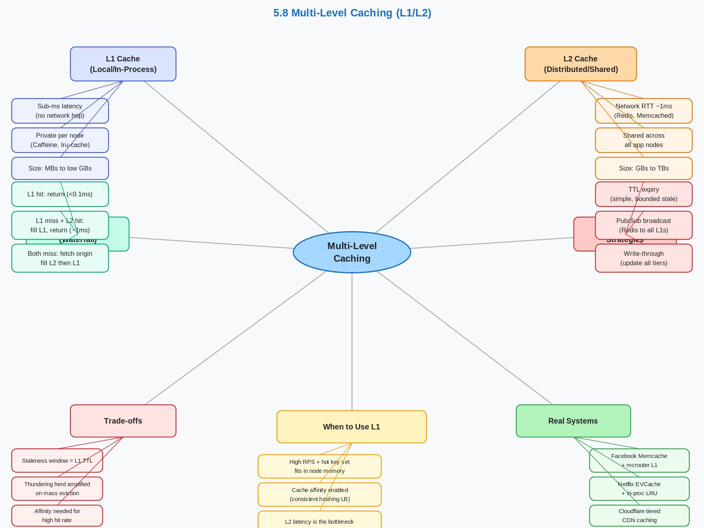

# 5.8 Multi-Level Caching (L1/L2, Local + Distributed)

> **Topic:** Topic 5 — Caching Systems
> **Phase:** B — Scalability Branch
> **Date studied:** 2026-06-15

---

## 0. 🗺️ Topic Overview

### What This Topic Is About

Multi-level caching is the practice of stacking two or more cache tiers — typically a fast, small in-process cache (L1) and a larger, shared distributed cache (L2) — to maximize cache hit rate while minimizing latency and backend load. The core tension is between speed and coherence: L1 caches are nanosecond-fast but private per node, creating consistency challenges; L2 caches are shared but add network round-trip overhead. Mastering this topic means knowing exactly when to add each layer, how to keep them coherent, and what failure modes emerge at scale.

### 🎯 What to Focus On

**1. Layer responsibilities and sizing.** Each cache tier has a different job — L1 holds the hottest keys per node, L2 holds the broader working set across the fleet. In an interview, you must be able to size each layer and explain what percentage of traffic each tier is expected to absorb.

**2. Consistency and invalidation across tiers.** The hardest operational problem with multi-level caching is that a write must invalidate L1 on every node and L2 in the cluster. Know the invalidation patterns (TTL-based, pub/sub broadcast, event-driven) and their failure modes.

**3. Read path: L1 miss → L2 miss → origin.** Be fluent with the read waterfall and understand the latency budget at each stage. An interviewer asking "how does a read work?" expects you to trace through all three tiers.

**4. Write path options.** Writes can go to L2 only (easiest, but L1 becomes stale), write-through all tiers (consistent, but slower), or write-invalidate (purge on write, reload lazily). Know when each is appropriate.

**5. When NOT to add L1.** If request fan-out is low, L1 per-node hit rate is negligible. Adding L1 with poor cache affinity wastes memory and creates consistency complexity without material latency benefit.

---

## 1. 🎯 Goal of This Subtopic

After studying this, you should be able to design a complete multi-level cache architecture for a given system — specifying which data lives at each tier, the TTL strategy per layer, the invalidation mechanism, and the consistency guarantees provided. You should also be able to identify when multi-level caching is unnecessary overhead versus when it's a critical optimization.

---

## 2. ✅ What Mastery Looks Like

> *Concrete, testable proof that you own this concept — not just familiarity.*

- [ ] Can draw the read and write paths through a two-tier cache stack (L1 → L2 → origin) and explain the latency at each hop
- [ ] Can explain why L1 caches create per-node inconsistency and describe two mechanisms to handle it (TTL expiry and pub/sub invalidation)
- [ ] Can choose between local-only, distributed-only, and multi-level caching for a given system based on traffic shape, node count, and consistency requirements
- [ ] Can identify the cache stampede risk at L2 during a cold start or mass invalidation event, and propose a mitigation
- [ ] Can estimate memory sizing for an L1 tier given hit rate targets, object sizes, and node count

> 💡 **Rule of thumb:** If you can teach it to someone else and field their follow-up questions, you've mastered it.

---

## 3. 🗓️ Study Phases to Achieve Mastery

> *A progressive plan from first exposure to interview-ready. Work through each phase in order. Don't move to the next until you can honestly tick every item.*

### Phase 1 — Acquire 📖 💪💪
*Goal: Read deeply enough that you could explain the concept without the doc.*

- [ ] Read **"Designing Data-Intensive Applications" Chapter 5 (Replication) — caching sidebar** and **Chapter 11 overview of caching tiers** (Martin Kleppmann)
- [ ] Read **ByteByteGo — "A Crash Course in Caching"** (https://blog.bytebytego.com/p/a-crash-course-in-caching-part-1)
- [ ] Read **Facebook's Memcache at scale paper** (https://www.usenix.org/system/files/conference/nsdi13/nsdi13-final170_update.pdf) — focus on regional pools and tiered invalidation
- [ ] Read through **Sections 5–9** (Core Definition → How It Works) carefully — don't skim
- [ ] Re-read the **Cheatsheet** (Section 4) and try to recite it from memory after

### Phase 2 — Consolidate ✍️ 💪💪💪
*Goal: Verify you can reproduce the knowledge in your own words without looking.*

- [ ] Close the doc — write out the **Core Definition** from memory, then compare
- [ ] Explain **First Principles** out loud without notes — what problem does multi-level caching solve and why?
- [ ] Reconstruct the **How It Works** mechanics step by step from memory
- [ ] Restate each **Trade-off** row in your own words — if you can't explain the cost, you don't own it yet

### Phase 3 — Apply 🔧 💪💪💪💪
*Goal: Connect to real systems and simulate interview scenarios.*

- [ ] Go through **Real-World System Examples** (Section 10) — verify each claim independently and add anything missed to **My Notes**
- [ ] Practice the **Interview Application** (Section 12) out loud — say the trigger phrases and your response as if in a live interview
- [ ] Work through **Common Misconceptions** (Section 13) — for each, make sure you can explain *why* the misconception is wrong, not just that it is
- [ ] Trace the **Relationships to Other Concepts** (Section 14) — can you explain each connection without looking?

### Phase 4 — Validate 🧪 💪💪💪💪💪
*Goal: Confirm you actually own it, not just recognize it.*

- [ ] Answer every **Self-Check Quiz** question (Section 15) out loud without looking at your notes
- [ ] Recite the **Cheatsheet** (Section 4) from memory — if you can't, re-do Phase 2
- [ ] Tick off items in **What Mastery Looks Like** (Section 2) — only check a box if you can demonstrate it on demand, not just if it sounds familiar
- [ ] Teach this concept out loud to an imaginary interviewer for 2 minutes without hesitation or notes

---

## 4. 📋 Cheatsheet

> *Everything you need to recall this concept in 30 seconds — for quick review before an interview.*



### 🗺️ Cache Tier Decision Map

```
Is read latency / DB load a problem?
├── No  ──────────────────────────────────────► No cache needed yet
└── Yes
    │
    ▼
Multiple nodes need shared data OR writes are frequent?
├── Yes ──────────────────────────────────────► L2 Only (Redis/Memcached)
└── No
    │
    ▼
Is L2 latency (~1ms) still the bottleneck, or hot key saturating it?
├── No  ──────────────────────────────────────► L2 Only is sufficient
└── Yes
    │
    ▼
Can you enable cache affinity (consistent-hash / sticky routing)?
├── No  ──────────────────────────────────────► Key replication or request coalescing
│                                               (L1 hit rate ≈ 0% without affinity)
└── Yes
    │
    ▼
Writes infrequent enough to tolerate a staleness window (TTL or pub/sub)?
├── No  ──────────────────────────────────────► L2 Only (writes too hot for L1)
└── Yes
    │
    ▼
    ┌─────────────────────────────────────────────────────┐
    │           L1 + L2  (Multi-Level Caching)            │
    │  In-process L1 (Caffeine, TTL 5–30s)                │
    │  + Shared L2 (Redis/Memcached)                      │
    └─────────────────────────────────────────────────────┘
    ⚠️  Must invalidate BOTH tiers on write:
        DEL from L2  +  pub/sub broadcast to all L1s
    ⚠️  Mass eviction = N× thundering herd:
        Protect origin with SET NX mutex at L2
```

```
§ 1  WHY IT EXISTS
A single-tier L2 cache (Redis) solves DB offload but at extreme scale even 1ms per
read is the latency floor. When a hot key absorbs millions of reads per second, the
network hop itself is the bottleneck. Multi-level caching eliminates that hop for the
hottest keys by adding an in-process L1 tier — zero network cost on hit. The compound
hit rate gains (L1 hit rate × L2 hit rate on remainder) are only achievable by layering:
90% L1 + 50% L2 on misses → 20× fewer origin queries vs. no caching.

§ 2  WHAT EACH TIER IS
L1  — in-process cache (Caffeine, lru-cache, cachetools). Sub-ms reads.
        Private per node. Staleness bounded by TTL or pub/sub eviction.
L2  — shared distributed cache (Redis, Memcached). ~1ms RTT.
        Shared across all nodes. A single write is immediately visible to all L2 readers.
Read waterfall:
  L1 hit → return (<0.1ms)
  L1 miss → L2 hit → populate L1 → return (~1ms)
  Both miss → fetch origin → populate L2 then L1 → return (~10ms)
Write-invalidate (most common):
  Write to DB → DEL key from L2 → publish INVALIDATE to pub/sub →
  all nodes evict L1 → next read re-populates from fresh data.
Write-through:
  Write to DB → write new value to L2 → broadcast to all L1s.
  Stronger consistency but higher write cost; rarely used.

§ 3  THE 3 KEY DISTINCTIONS
1. Affinity vs. no affinity: without sticky routing (round-robin LB), each key
   lands on a different node each request — L1 hit rate ≈ 0%. With consistent-
   hash routing, L1 hit rates reach 70–90% for hot keys. Affinity is the
   prerequisite for multi-level caching to deliver any benefit.
2. TTL ordering: L1 TTL must always be ≤ L2 TTL. If L1 TTL > L2 TTL, a node
   can serve data from L1 long after L2's copy has expired — the staleness window
   is extended beyond what you intended. Enforce: L1 TTL ≤ L2 TTL always.
3. Invalidation scope: deleting from L2 alone is insufficient. All nodes' L1s
   retain the old value until their TTL expires or a pub/sub invalidation message
   arrives. Must explicitly invalidate ALL tiers after a write.

§ 4  USE / AVOID
Use L1:              RPS is high, hot key set fits in node memory, L2 latency is
                     the bottleneck, cache affinity (consistent hashing LB) is enabled.
Use TTL invalidation: writes are infrequent; staleness up to L1 TTL is acceptable.
Use pub/sub:          staleness window must be milliseconds, not seconds.
Avoid L1:             round-robin load balancing (no affinity), very high write rate
                     (invalidation complexity outweighs benefit), strong consistency req'd.
AVOID L1 TTL > L2 TTL — always enforce L1 TTL ≤ L2 TTL.
AVOID skipping L1 invalidation on write — DEL from L2 alone leaves all L1s stale.

§ 5  INTERVIEW TRIGGERS
→ "The system needs sub-millisecond latency at very high read QPS."
→ "We have a hot key problem — certain Redis keys get millions of hits per second."
→ "How would you reduce latency further? We already have Redis in place."
→ "The cache is becoming a bottleneck even after scaling out the Redis cluster."

§ 6  FTAC
F  "At high read QPS, even Redis at ~1ms per read accumulates significant latency for
   hot keys. Multi-level caching adds an in-process L1 on each node so hot keys are
   served in microseconds — no network hop."
T  "L1 gives sub-ms reads and reduces L2 traffic by the L1 hit rate. The cost is a
   per-node staleness window (bounded by L1 TTL or pub/sub propagation delay) and added
   invalidation complexity. Cache affinity is required for meaningful hit rates."
A  "Assuming this is read-heavy, writes are infrequent, and eventual consistency within
   5–10 seconds is acceptable —"
C  "Add Caffeine L1 (10s TTL) in front of Redis. On writes: DEL from L2, publish
   INVALIDATE via Redis Pub/Sub. Cost: up to 10s staleness fleet-wide; pub/sub dependency."

§ 7  NUMBERS & GOTCHA
L1 TTL:            1–30s typical; must always be ≤ L2 TTL
L2 TTL:            60s–hours depending on freshness tolerance
L1 sizing:         (hot key count) × (avg object size) — e.g. 10K keys × 2KB = 20MB/node
L1 hit rate:       70–90% for hot keys with affinity; ~0% without affinity
GOTCHA: After mass invalidation (deploy / cache flush), ALL N nodes simultaneously miss
  L1 AND L2 and fire concurrent origin fetches for the same key. This thundering herd is
  N× worse than single-tier. Protect with SET NX mutex at L2: only one node fetches per
  key; the rest wait and read from L2 after repopulation.
```

---

## 5. 🧠 Core Definition

> *What is it, in one sentence?*

Multi-level caching is an architecture where data requests traverse a hierarchy of cache tiers — typically a fast in-process local cache (L1) followed by a slower but larger shared distributed cache (L2) — before reaching the origin data store, maximizing cache hit rate while minimizing read latency for the hottest data.

---

## 6. 📦 Core Concepts

> *The essential building blocks of this subtopic — the terms and ideas you must have solid before going deeper.*

### L1 Cache (Local / In-Process Cache)
L1 is an in-memory cache that lives inside the application process itself — typically a bounded map or LRU structure (e.g., Caffeine in Java, `lru-cache` in Node.js, or a dictionary with TTL in Python). Reads from L1 complete in under a microsecond because there is no network hop. The downside is that L1 is private to each node: a write on one node does not automatically update L1 on other nodes, creating a window of stale data bounded only by TTL or an explicit invalidation signal.

### L2 Cache (Distributed / Shared Cache)
L2 is a shared caching tier accessible by all application nodes over the network — most commonly Redis or Memcached. Because L2 is shared, a write to L2 is immediately visible to all nodes that query L2 next (for the keys they don't have in L1). L2 latency is typically 0.5–2ms in a co-located data center, which is fast for most workloads but still orders of magnitude slower than L1. L2 holds a much larger working set than any single L1, making it the primary cache hit driver for the fleet.

### Cache Read Waterfall
The canonical read path is: check L1 → on hit, return immediately; on miss, check L2 → on hit, populate L1 and return; on miss, fetch from origin → populate both L2 and L1 and return. This "waterfall" ensures that hot data migrates up to L1 after the first L2 hit, making subsequent reads on that node L1-fast. The origin is only reached when both tiers miss simultaneously.

### L1 Invalidation
Because L1 is private, invalidation is the hardest problem in multi-level caching. There are two main approaches: (1) **TTL-based expiry** — set L1 TTL short enough (e.g., 5 seconds) that stale data is bounded and naturally expires; simple but tolerates staleness proportional to TTL. (2) **Broadcast invalidation via pub/sub** — when a write occurs, publish an invalidation message to a channel (e.g., Redis Pub/Sub); all nodes subscribe and evict that key from their local L1 immediately; this bounds staleness to propagation delay (~milliseconds) but adds operational complexity and a message bus dependency.

### Cache Affinity (Sticky Routing)
L1 hit rates are substantially higher when the same key is consistently routed to the same application node — a pattern called cache affinity or sticky routing (via consistent hashing or session pinning at the load balancer layer). Without affinity, each node independently caches the same keys, wasting memory and giving each node a cold L1 for any key it hasn't recently served. With affinity, L1 hit rates can reach 70–90% for hot keys, dramatically reducing L2 and origin load.

---

## 7. 🔍 First Principles — Why Does This Exist?

> *What fundamental problem does this concept solve? Why was it invented?*

A single-tier distributed cache (L2 only) solved the problem of offloading the database but introduced its own bottleneck: at extreme scale, even a Redis cluster at 1ms per read becomes the latency floor for every request. If you have 10,000 requests per second flowing through a single application node and 80% of them hit the same 1,000 hot keys, those 8,000 reads/second are all paying 1ms in network round-trips to Redis — adding ~8 seconds of aggregate wait per second per node.

The insight behind L1 caching is that network latency is unnecessary for data that is already in the same process. By keeping the hottest subset of data in-process, you short-circuit the network entirely for those reads. The result is that only cache misses — which are relatively rare on a hot key set — pay the L2 round-trip cost. A system that achieves 90% L1 hit rate reduces L2 traffic by 10x, and a 50% L2 hit rate of that remaining traffic reduces origin traffic by 20x compared to no caching at all — compound gains that are only achievable by layering.

---

## 8. 🗺️ Mental Models

> *Intuition frames that help you reason about this concept fast — especially under interview pressure.*

### Model 1: The CPU Cache Hierarchy
Multi-level caching in software mirrors the L1/L2/L3 cache hierarchy inside a CPU. L1 CPU cache is tiny and blazing fast; L2 is larger and slightly slower; main memory (analogous to the distributed cache) is much larger but orders of magnitude slower; disk (analogous to the database) is the authoritative source but the slowest. The engineering principle is identical: keep the hottest data in the fastest, closest tier and let misses fall through to progressively slower tiers. This model works because it captures why adding layers is worthwhile — each tier exploits locality differently. It breaks down when thinking about invalidation: CPU caches are coherent by hardware design; software caches require explicit invalidation logic.

### Model 2: The Grocery Store / Warehouse Model
Think of L1 as the shelf stock visible to the cashier (fast, limited), L2 as the store's back room (larger, takes 30 seconds to retrieve), and the origin/database as the regional warehouse (authoritative, takes hours to ship). A popular product gets restocked from the back room to the shelf automatically. Invalidation is like a product recall: the warehouse sends a notice, the back room removes the item, and the cashier's shelf version expires by end of day (TTL). Where this model breaks down: in a real store, one cashier seeing the shelf means all cashiers see it. In multi-level caching, each application node has its own shelf — so the recall (invalidation) must reach every node independently.

### Model 3: The Latency Budget Frame
Think of every cache read as drawing from a latency budget. L1 hit costs ~0.1μs. L2 hit costs ~1ms (10,000x more). Origin hit costs ~10ms (100,000x more). A page load with 10 cache reads at L2 miss rate 100% costs 10ms in cache overhead alone; at 90% L1 hit rate, it costs 9 × 0.1μs + 1 × 1ms ≈ 1ms. The math shows L1 doesn't just improve latency — it dramatically changes the latency distribution, especially at the p99 tail. This model is useful in interviews to justify the added complexity: the latency savings are not incremental, they are multiplicative.

---

## 9. ⚙️ How It Works — Mechanics

> *Step-by-step or layered explanation of the internal mechanism.*

**Read path (happy case — L1 hit):**
1. Request arrives at application node.
2. Node checks its local L1 cache (in-process, e.g., Caffeine with LRU eviction and a 10-second TTL).
3. Key is found in L1, not yet expired → return value immediately. Total latency: ~microseconds.

**Read path (L1 miss, L2 hit):**
1. Request arrives; L1 miss (key not present or TTL expired).
2. Node queries L2 (e.g., Redis) over the network.
3. L2 hit → value returned. Node populates L1 with this value and an L1 TTL. Return value to caller. Total latency: L2 network RTT (~1ms).

**Read path (both miss — origin fetch):**
1. L1 miss, then L2 miss.
2. Node fetches from origin (database or service). On success, populate L2 first (so all nodes can benefit), then populate L1. Return value. Total latency: origin RTT (~5–20ms).
3. Risk: if many nodes simultaneously miss on the same key after a cold start or invalidation event, they all fetch from origin concurrently (thundering herd). Mitigation: use a per-key mutex or probabilistic early expiry at L2 to ensure only one request hits origin.

**Write path (write-invalidate, most common):**
1. Write goes to the primary data store.
2. Delete (invalidate) the key from L2.
3. Broadcast an invalidation message to all nodes (e.g., via Redis Pub/Sub on channel `cache:invalidations`).
4. All nodes receive the message and evict the key from their local L1.
5. Next read on any node will miss L1 and L2, fetch fresh data from origin, and re-populate both tiers.

**Write path (write-through all tiers):**
1. Write the new value to origin.
2. Write the new value to L2 (update, not delete).
3. Broadcast the new value to all nodes' L1 (requires a message with value, not just key).
4. Stronger consistency but more expensive: every write pays the cost of updating all L1s synchronously.

**TTL strategy:**
- L1 TTL must always be ≤ L2 TTL. If L1 TTL > L2 TTL, a node could serve stale data from L1 even after L2 has evicted the (now stale) version, and a fresh fetch would appear to make things inconsistent.
- Typical L1 TTL: 1–30 seconds (short enough to bound stale window; long enough to be useful for hot keys).
- Typical L2 TTL: 60 seconds to hours depending on data freshness tolerance.

**Key sizing:**
- L1 should hold only the hottest keys. Size it based on: (expected hot key count) × (average object size). E.g., 10,000 hot objects × 2KB each = 20MB of L1 per node — well within JVM heap or process memory.
- L2 holds the full working set. Size it based on: (total cacheable dataset size) × (desired cache coverage), factoring in replication overhead for Redis cluster.

---

## 10. 🏭 Real-World System Examples

> *Where does this appear in production systems you know?*

| System | How This Concept Applies | Notes |
|--------|--------------------------|-------|
| **Facebook / Meta Memcache** | Regional pools (L2) with per-web-server mcrouter local cache (L1); invalidation via McSqueal pub/sub pipeline | Described in the 2013 NSDI paper; invalidation at FB scale required a dedicated invalidation bus because pub/sub latency was critical |
| **Instagram (Django + Redis)** | In-process Python dict / `cachetools` LRU (L1) in front of Redis (L2) for user session and feed data | Hot user profiles served L1-fast for duration of a request; Redis used as the cross-process shared truth |
| **Netflix (EVCache / Memcached)** | EVCache is a multi-region distributed cache (L2); Netflix's API servers maintain in-process LRU caches (L1) for config data and metadata | EVCache replicates across AZs; local caches handle ultra-hot data like active show metadata |
| **Cloudflare CDN** | Edge PoP cache (L2-equivalent) is backed by a tiered shield origin (L1-equivalent at a regional consolidation layer); only a fraction of misses ever reach the true origin | Their "tiered caching" is essentially multi-level caching at CDN scale |
| **Google Guava / Caffeine + Redis in Java microservices** | Pattern used across many high-traffic Java services: Caffeine as L1 (in-JVM, ~nanosecond), Redis as L2 (~1ms); L1 invalidated via short TTL or Redis Pub/Sub | Caffeine with `maximumSize` and `expireAfterWrite` is the most common L1 implementation in the JVM ecosystem |

---

## 11. ⚖️ Trade-offs

> *Every design decision has a cost. What are you giving up?*

| ✅ Benefit | ❌ Cost / Limitation |
|-----------|---------------------|
| Dramatic latency reduction for hot keys (microseconds vs. milliseconds) | Increased operational complexity: now two cache tiers to monitor, size, and tune independently |
| Reduces L2 traffic by the L1 hit rate (e.g., 80% fewer L2 reads) | Per-node inconsistency window: L1 caches can serve stale data until TTL expires or invalidation propagates |
| Protects L2 from hot key overload (single key shielded by N nodes' L1s) | Mass invalidation causes thundering herd at both L1 and L2 simultaneously — origin load spike is worse than single-tier |
| Reduces network bandwidth consumption across the fleet | Higher memory footprint per application node (L1 consumes process memory, competes with heap/application objects) |
| Enables per-region or per-node customization of cached data | Cache affinity (sticky routing) required for high L1 hit rate; breaks simple round-robin load balancing |

---

## 12. 🎯 Interview Application

> *How do you use this concept in a design interview? What triggers it?*

**When an interviewer asks / says:**
- "The system needs to handle very high read QPS with sub-millisecond latency"
- "We have a hot key problem in our Redis cluster — certain keys are getting millions of hits per second"
- "How would you reduce latency further? We already have Redis in place"
- "The cache is becoming a bottleneck at this scale"

**What you say / do:**
In the deep dive or optimization phase, introduce multi-level caching as a targeted optimization for hot keys. Say something like: "Given the read pattern here, I'd add an in-process L1 cache in front of Redis — something like Caffeine with a 10-second TTL. The hot 1% of keys will stay L1-resident on each node, cutting L2 traffic by an order of magnitude. The main challenge is invalidation: I'd use a Redis Pub/Sub broadcast so all nodes evict their L1 entry within milliseconds of a write."

**The trade-off statement (memorize this pattern):**
> "If we add an L1 in-process cache, we get sub-millisecond reads for hot keys and dramatically reduce L2 traffic, but we accept a staleness window bounded by L1 TTL (or invalidation propagation latency). For this system, where user profile data changes infrequently and eventual consistency within 5 seconds is acceptable, L1 caching is the right call."

---

## 13. ⚠️ Common Misconceptions & Gotchas

> *What do candidates get wrong? What nuance is the interviewer probing for?*

- ❌ **Misconception:** Adding L1 in front of Redis always improves performance.
  ✅ **Reality:** L1 only provides significant benefit when the same node repeatedly serves the same keys (cache affinity). In a round-robin load balanced system where any node can serve any key, L1 hit rates are near zero and you're just adding memory overhead and complexity.

- ❌ **Misconception:** L1 TTL can be longer than L2 TTL — L1 will just fetch from L2 on expiry.
  ✅ **Reality:** If L1 TTL > L2 TTL, the L2 entry expires first. When L1 eventually expires and tries to repopulate from L2, L2 may serve a new version (or a miss to origin). Worse, if a write has occurred since L2 expiry, L1 could hold a version that is older than what L2 would have served, creating an inconsistency window longer than intended. L1 TTL must always be ≤ L2 TTL.

- ❌ **Misconception:** Invalidating L2 is sufficient to keep the system consistent.
  ✅ **Reality:** Invalidating L2 is necessary but not sufficient — all nodes' L1 caches may still hold the old value until their TTL expires or an explicit invalidation broadcast arrives. You must also invalidate L1s, or accept that stale data persists in L1 for up to L1 TTL duration after a write.

- ❌ **Misconception:** Multi-level caching solves the thundering herd problem.
  ✅ **Reality:** Multi-level caching can make the thundering herd problem *worse* at mass invalidation time. A single origin key suddenly missing from both L1 (on all N nodes) and L2 causes up to N concurrent origin fetches for the same key simultaneously. You need explicit request coalescing or a mutex-pattern at L2 to prevent this.

---

## 14. 🔗 Relationships to Other Concepts

> *How does this connect to adjacent subtopics in this topic or across the roadmap?*

- **Builds on:** 5.6 Cache Stampede / Thundering Herd — understanding stampede is a prerequisite because multi-level caching amplifies stampede risk during mass invalidation; and 5.7 Hot Key Problem — L1 caching is one of the two primary mitigations for hot keys
- **Enables:** CDN architecture (Topic 6) — a CDN edge cache + origin shield is a form of multi-level caching at the network layer; understanding the same tiered principles makes CDN design intuitive
- **Tension with:** 5.5 Cache Consistency and Invalidation — every L1 tier is a new invalidation target; the more layers, the harder it is to guarantee that all tiers reflect the same truth after a write

---

## 15. 🧪 Self-Check Quiz

> *Can you answer these without looking? If not, you haven't internalized it yet.*

1. What is the read path through a two-tier cache system? Walk through all three scenarios: L1 hit, L1 miss / L2 hit, both miss.

   > 💡 *Think through your answer before expanding — if you hesitate, revisit Section 9.*
L1 HIT:            Check L1 → hit → return value (<0.1ms)

L1 MISS / L2 HIT:  Check L1 → miss → check L2 → hit →
                   populate L1 from response → return value (~1ms)

BOTH MISS:         Check L1 → miss → check L2 → miss →
                   fetch from DB → populate L2 → populate L1 → return value (~10ms)

Key rule: on miss-fill, always write L2 first (shared tier benefits all nodes),
then write L1 from the same in-memory value — not by re-reading L2.

2. You have a Redis cluster (L2) and are considering adding an in-process L1 cache. Your load balancer uses round-robin. Should you add L1? Why or why not?

   > 💡 *Think through your answer before expanding — if you hesitate, revisit Section 6 (Cache Affinity) and Section 13.*
We should not implement an L1 cache with round robin because in a round robin system mechanism, we hardly get any caches, because the requests are randomly assigned to the nodes. We cannot guarantee that there will be consistent cache hits with certain hotkeys. In fact, the cache hit with a round robin mechanism will be near 0% cache hit rate. If we want to implement an L1 cache, we will need cache affinity. That means we will need to use a consistent hashing mechanism to make sure that the same request for a key will always hit the same node. In this case, we can achieve a 70 to 90% cache rate for L1 cache. 

DO NOT add L1 with round-robin load balancing.

Why: each request for key K lands on a random node. The same key
is served by a different node each time, so L1 is almost never warm.
L1 hit rate ≈ 0% → you've added memory overhead and invalidation
complexity for zero latency benefit.

Prerequisite for L1: cache affinity via consistent-hash routing.
Same key → same 1–3 nodes every time → L1 hit rates reach 70–90%
for hot keys. Without affinity, L2-only is the correct architecture.

3. A write occurs to a user's profile. You update the database and delete the key from Redis (L2). What could still go wrong, and what additional step is required?

   > 💡 *Think through your answer before expanding — if you hesitate, revisit Section 9 (Write Path) and Section 13.*
Delete the key from Redis L2, but the L1 cache key is still present and within the TTL. That means further requests will continue to be serving the cached L1 data throughout the TTL period. We will also need to have a Redis Pub/Sub to emit an event to invalidate the L1 cache keys. 

Problem: deleting from L2 alone leaves all N nodes' L1 caches
holding the old value until their TTL expires — up to 5–30 seconds
of stale data fleet-wide.

Required additional step:
  1. DEL key from L2
  2. Publish INVALIDATE event via Redis Pub/Sub
  3. All nodes' L1 cache listeners receive event → evict the key locally
  4. Next read misses L1 → misses L2 → fetches fresh data from DB

Caveat: pub/sub delivery is best-effort (not guaranteed).
TTL is the correctness backstop — size L1 TTL to the maximum
staleness your SLA can tolerate in case a message is dropped.

4. Name a real production system that uses multi-level caching and explain specifically how the two tiers are structured and why.

   > 💡 *Think through your answer before expanding — if you hesitate, revisit Section 10.*
Facebook memcache users are L1 and L2 multi-tier caching. Facebook has regional main cache pools L2 per web server, and there is also an MC router local cache L1. When a key is to be deleted, the app servers will first of all delete the L2 cache keys and, in addition, broadcast a delete key event so that all the L1 nodes can delete their local cache data. 

Facebook's Memcached at scale (NSDI 2013):

L1 — mcrouter (local in-process proxy cache) on each web server.
     Serves the hottest keys with sub-ms latency, no network hop.

L2 — regional Memcached pools, shared across all web servers in a region.
     Holds the broader working set; ~1ms RTT.

Invalidation path:
  Write to MySQL → McSqueal reads binlog → sends DEL to L2 Memcached
  → L2 DEL also triggers invalidation broadcast to all L1 mcrouters.

Why two tiers: celebrity / viral content creates hot keys that
saturate individual Memcached nodes. L1 absorbs that traffic
locally so L2 nodes don't become single points of saturation.

5. Your system has just done a cache-clearing deploy. All L1 and L2 entries are gone simultaneously. What specific failure mode is now at highest risk, and how would you mitigate it in a system that handles 50,000 requests per second?

   > 💡 *Think through your answer before expanding — if you hesitate, revisit Sections 9 and 13 (thundering herd amplification).*
By having a cache clearing deploy, all of the L1 and L2 cache are empty and therefore will have 100% cache miss. All of the requests will hit the database, so we are looking at a thundering herd problem.
To mitigate the thundering herd problem, we can do a few mitigations:
1. Pre-warming of the caches before bringing it back online. We can pre-warm the cache we previously knew was hot working sets and populate them into the cache before subjecting the cache to traffic again.
2. We can also have a request coalescing so that all of the requests asking for the same keys will now filter through to the database as one single request, or all the other requests will wait for the DB to return data.
After the data is returned from DB, app servers will populate L2 cache first and then populate L1 cache. Subsequent requests will be using the cached data instead of hitting the DB.

Failure mode: THUNDERING HERD — amplified N× in two-tier systems.
All 500 nodes simultaneously miss L1 AND L2 → all 500 fire concurrent
DB reads for the same keys. At 50K req/sec across 500 nodes = 100
req/sec per node, but ALL hitting origin = 50K simultaneous DB queries.

Mitigations:

1. SET NX MUTEX AT L2 (request coalescing)
   First node to miss acquires Redis lock: SET key:lock NX EX 1
   That node fetches from DB, populates L2, releases lock.
   All other nodes spin-wait or serve stale until L2 is warm.
   Prevents N duplicate DB fetches for the same key.

2. CACHE PRE-WARMING before re-opening traffic
   Identify the known hot working set (top keys by frequency).
   Write them into L2 before routing live traffic to the new cluster.
   Reduces cold-start miss rate from 100% to the tail of the distribution.

3. GRADUAL TRAFFIC RAMP (bonus)
   Route 1% of traffic → 10% → 100% with time between steps.
   Allows caches to warm organically before absorbing full load.

On miss-fill: populate L2 first (shared tier) → then L1 (local node).
---

## 16. 📚 Further Reading

> *Optional: links, chapters, or resources for deeper understanding.*

- [ ] **Facebook's Memcache at Scale (NSDI 2013)** — https://www.usenix.org/system/files/conference/nsdi13/nsdi13-final170_update.pdf — the canonical multi-level caching paper; focus on regional pools and the invalidation pipeline
- [ ] **ByteByteGo "A Crash Course in Caching"** — https://blog.bytebytego.com/p/a-crash-course-in-caching-part-1 — covers multi-level caching patterns accessibly
- [ ] **Caffeine (Java) documentation** — https://github.com/ben-manes/caffeine — understand the L1 implementation choices: `maximumSize`, `expireAfterWrite`, `refreshAfterWrite`
- [ ] **Redis Pub/Sub docs** — https://redis.io/docs/manual/pubsub/ — the standard mechanism for broadcasting L1 invalidation events
- [ ] **DDIA Chapter 5** (Kleppmann) — covers replication lag and consistency models that underpin why multi-level caching creates consistency challenges

---

## 17. ✍️ My Notes

> *Personal observations, things that confused me, analogies that helped.*

