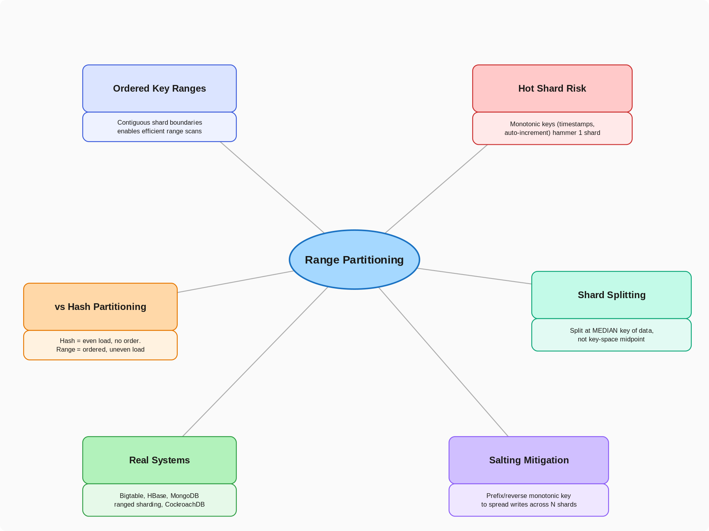

# 7.3 Range Partitioning

> **Topic:** Topic 7 — Data Partitioning / Sharding
> **Phase:** B — Scalability Branch
> **Date studied:** 2026-07-14

---

## 0. 🗺️ Topic Overview

### What This Topic Is About

Range partitioning splits a dataset across shards by dividing the key space into contiguous, ordered ranges — shard 1 holds keys A–F, shard 2 holds G–M, and so on. Unlike hash partitioning, which scatters keys pseudo-randomly to spread load evenly, range partitioning preserves the natural ordering of keys, which means a query for "all users created in March" or "all events between 9am and 10am" can be answered by scanning one or two contiguous shards instead of fanning out to every shard in the cluster. The core tension is **query efficiency vs. load distribution**: preserving order unlocks efficient range scans, but the same property makes range partitioning acutely vulnerable to hot shards whenever the write pattern is monotonic (timestamps, auto-incrementing IDs, sequential order numbers).

### 🎯 What to Focus On

**1. Why range partitioning exists at all.** It exists because hash partitioning destroys order — if your access pattern depends on scanning contiguous key ranges, hashing forces a scatter-gather across every shard. Range partitioning trades load-balance guarantees for query efficiency.

**2. The hot-shard failure mode.** The single most-tested scenario for this subtopic: what happens when the partition key is monotonically increasing (e.g., a timestamp or auto-increment ID)? All new writes land on the last shard, creating a hot spot while every other shard sits idle. Know this cold — it is the signature gotcha of range partitioning.

**3. Split point selection and rebalancing.** Range partitions aren't fixed forever — as a shard grows past a size threshold, it splits into two. Understand how split points are chosen (median key, not midpoint of key space) and what triggers a split.

**4. Range partitioning vs. hash partitioning — the direct comparison.** You must be able to articulate, without hesitation, when to pick each: range wins when range queries and ordered scans dominate; hash wins when point lookups dominate and even load distribution is the priority.

**5. Real systems that use it.** Bigtable/HBase, MongoDB's ranged sharding, and CockroachDB/Spanner's range-based key space are the canonical examples — know how each handles the hot-shard problem in practice.

---

## 1. 🎯 Goal of This Subtopic

After studying this, you should be able to decide whether range partitioning is the right strategy for a given access pattern, articulate the specific hot-shard risk it introduces, and design a mitigation (key salting, composite keys, or auto-splitting) for a partition key that would otherwise be monotonic. You should also be able to compare range partitioning against hash partitioning on command, citing the concrete trade-off between range-query efficiency and load distribution.

---

## 2. ✅ What Mastery Looks Like

> *Concrete, testable proof that you own this concept — not just familiarity.*

- [ ] Can explain how range partitioning maps keys to shards using ordered, contiguous boundaries — and contrast this with hash partitioning's pseudo-random distribution
- [ ] Can identify why a monotonically increasing partition key (timestamp, auto-increment ID) creates a hot shard under range partitioning, and propose at least two mitigations
- [ ] Can compare hash partitioning vs. range partitioning and select the right one given a specific access pattern (range queries vs. random key lookups) — this is an explicit roadmap Mastery Criterion for Topic 7
- [ ] Can explain how shard splitting works — what triggers it, how the split point is chosen, and what happens to in-flight requests during a split
- [ ] Can name a real system that uses range partitioning and describe specifically how it avoids or tolerates hot shards

> 💡 **Rule of thumb:** If you can teach it to someone else and field their follow-up questions, you've mastered it.

---

## 3. 🗓️ Study Phases to Achieve Mastery

> *A progressive plan from first exposure to interview-ready. Work through each phase in order. Don't move to the next until you can honestly tick every item.*

### Phase 1 — Acquire 📖 💪💪
*Goal: Read deeply enough that you could explain the concept without the doc.*

- [ ] Read **"Designing Data-Intensive Applications" Chapter 6 — Partitioning** (Martin Kleppmann), especially the "Partitioning by Key Range" section
- [ ] Read the **Google Bigtable paper (OSDI 2006)**, Section 2 — tablet splitting and row-key range assignment
- [ ] Read **MongoDB Ranged Sharding docs** — https://www.mongodb.com/docs/manual/core/ranged-sharding/
- [ ] Read through **Sections 5–9** of this doc (Core Definition → How It Works) carefully — don't skim
- [ ] Re-read the **Cheatsheet** (Section 4) and try to recite it from memory after

### Phase 2 — Consolidate ✍️ 💪💪💪
*Goal: Verify you can reproduce the knowledge in your own words without looking.*

- [ ] Close the doc — write out the **Core Definition** from memory, then compare
- [ ] Explain **First Principles** out loud without notes — what problem does range partitioning solve that hash partitioning doesn't?
- [ ] Reconstruct the **How It Works** mechanics — shard boundary lookup, split, and rebalance — step by step from memory
- [ ] Restate each **Trade-off** row in your own words — if you can't explain the cost, you don't own it yet

### Phase 3 — Apply 🔧 💪💪💪💪
*Goal: Connect to real systems and simulate interview scenarios.*

- [ ] Go through **Real-World System Examples** (Section 10) — verify each claim independently and add anything missed to **My Notes**
- [ ] Practice the **Interview Application** (Section 12) out loud — say the trigger phrases and your response as if in a live interview
- [ ] Work through **Common Misconceptions** (Section 13) — for each, make sure you can explain *why* the misconception is wrong, not just that it is
- [ ] Trace the **Relationships to Other Concepts** (Section 14) — can you explain each connection without looking?

### Phase 4 — Validate 🧪 💪💪💪💪💪
*Goal: Confirm you actually own it, not just recognize it.*

- [ ] Answer every **Self-Check Quiz** question (Section 15) out loud without looking at your notes
- [ ] Recite the **Cheatsheet** (Section 4) from memory — if you can't, re-do Phase 2
- [ ] Tick off items in **What Mastery Looks Like** (Section 2) — only check a box if you can demonstrate it on demand, not just if it sounds familiar
- [ ] Teach this concept out loud to an imaginary interviewer for 2 minutes without hesitation or notes

---

## 4. 📋 Cheatsheet

> *Everything you need to recall this concept in 30 seconds — for quick review before an interview.*



### 🗺️ Range vs. Hash Partitioning Decision Map

```
Does the workload need range scans / ordered queries
(e.g., "all events between T1 and T2", "users A–F")?
├── No  ───────────────────────────────────────────► Hash Partitioning
│                                                     (even load, O(1) point lookups)
└── Yes
    │
    ▼
Is the partition key monotonically increasing
(timestamp, auto-increment ID, sequential order #)?
├── No  ───────────────────────────────────────────► Range Partitioning
│                                                     (safe — writes spread across ranges)
└── Yes
    │
    ▼
Can you salt/shard-prefix the key or reverse it
to break monotonicity while preserving range scans
within each prefix bucket?
├── Yes ───────────────────────────────────────────► Range Partitioning + Salted Prefix
│                                                     (bucketed writes, ranged reads within bucket)
└── No
    │
    ▼
    ┌─────────────────────────────────────────────────────┐
    │        High Hot-Shard Risk — Reconsider              │
    │  Use hash partitioning, or accept hot shard and       │
    │  scale it vertically / add auto-splitting             │
    └─────────────────────────────────────────────────────┘
    ⚠️  Auto-split thresholds must be tuned — too small
        causes split storms; too large causes long hot windows
```

```
§ 1  WHY IT EXISTS
Hash partitioning solves load distribution but destroys key order — a range query
("all orders from March") becomes a scatter-gather across every shard. Range
partitioning preserves the natural ordering of the key space so ordered scans and
range queries touch only the shards that contain the relevant range, at the cost
of even load distribution.

§ 2  HOW IT WORKS
Keys are divided into contiguous, non-overlapping ranges, each owned by one shard:
  Shard 1: keys [A, F)
  Shard 2: keys [F, M)
  Shard 3: keys [M, T)
  Shard 4: keys [T, Z]
A routing layer (or the client) holds a boundary map and directs each request to
the shard owning that key's range. As a shard grows past a size threshold
(e.g., 1–4GB in Bigtable), it SPLITS at the median key into two shards — this
keeps shard sizes roughly balanced even though the key space isn't.

§ 3  THE HOT-SHARD PROBLEM (signature gotcha)
If the partition key is monotonically increasing (timestamp, auto-increment ID,
sequential order number), ALL new writes land on the highest-range shard.
Every other shard goes idle for writes while one shard absorbs 100% of write
traffic — the opposite of what partitioning is supposed to achieve.
Mitigations:
  1. Salt/prefix the key (e.g., hash-prefix + timestamp) to bucket writes across
     N shards, then range-scan within each bucket.
  2. Reverse the key (e.g., reversed timestamp) to scatter writes, sacrificing
     natural chronological ordering.
  3. Use a compound key with a well-distributed leading field (e.g., user_id
     then timestamp) so writes for different users land on different shards.

§ 4  USE / AVOID
Use range partitioning:  workload needs range scans, ordered iteration, or
                        "give me everything between X and Y" queries.
Avoid range partitioning: partition key is monotonically increasing and you
                        can't salt/prefix it — hash partitioning is safer.
Use auto-splitting:     shard size varies unpredictably over time (Bigtable,
                        CockroachDB, Spanner all auto-split by size).
AVOID choosing the midpoint of the key space as the split point — always split
  at the MEDIAN KEY by actual data volume, not by key-space midpoint.

§ 5  INTERVIEW TRIGGERS
→ "We need to support range queries like 'all events in the last hour.'"
→ "How would you shard a time-series database?"
→ "One of our shards is getting way more write traffic than the others."
→ "How do you handle queries that need results sorted by key?"

§ 6  FTAC
F  "Range partitioning divides the key space into contiguous ordered ranges, one
   per shard, so range queries only touch the shards that overlap the query range."
T  "It gives efficient ordered scans and avoids scatter-gather for range queries,
   but the same ordering property means a monotonic write pattern concentrates
   all writes on a single shard — a hot shard."
A  "Assuming the access pattern includes range scans (e.g., time-series or
   sorted feed queries) and write keys are not strictly monotonic, or can be
   salted —"
C  "Partition by key range with auto-splitting at ~1–4GB per shard, and salt the
   write key with a low-cardinality prefix if the natural key is monotonic, to
   spread writes across N buckets while preserving range scans within a bucket."

§ 7  NUMBERS & GOTCHA
Typical shard split threshold: 1–4GB (Bigtable tablets), configurable per system.
Salting cardinality: choose N (bucket count) ≈ number of shards you want writes
  spread across — too high fragments range scans, too low doesn't fix hot shard.
GOTCHA: Splitting at the key-space MIDPOINT (not the median by data volume)
  produces lopsided shards when data isn't uniformly distributed across the key
  space — e.g., splitting "A–Z" at "M" when 90% of keys start with "A–C" leaves
  one shard nearly empty and the other still overloaded. Always split by median
  key of actual stored data, not alphabetic/numeric midpoint.
```

---

## 5. 🧠 Core Definition

> *What is it, in one sentence?*

Range partitioning is a sharding strategy that assigns each shard a contiguous, ordered range of the key space, so that data with nearby keys is co-located on the same shard — enabling efficient range scans at the cost of uneven load distribution when writes are concentrated in a narrow part of the key range.

---

## 6. 📦 Core Concepts

> *The essential building blocks of this subtopic — the terms and ideas you must have solid before going deeper.*

### Key Range / Shard Boundary

Each shard owns a contiguous half-open interval of the key space, e.g., `[A, F)` meaning keys starting with A through E. A routing component (a config service, coordinator, or client-side metadata cache) maintains the boundary map and directs each read/write to the shard whose range contains the key. Bigtable calls this boundary map the METADATA table; CockroachDB calls it the range descriptor.

### Range Scan

A query that reads all keys within a contiguous interval, e.g., "all orders between 2026-01-01 and 2026-01-31." Because range partitioning preserves key order, a range scan touches only the shards whose ranges overlap the query interval — often just one or two shards — instead of fanning out to the entire cluster as hash partitioning would require.

### Shard Splitting

As a shard accumulates data and crosses a size threshold (commonly 1–4GB in systems like Bigtable), it is split into two shards at a chosen split point. The split point should be the MEDIAN KEY of the actual stored data (not the midpoint of the theoretical key space) so both resulting shards end up roughly equal in size, since real-world key distributions are rarely uniform.

### Monotonic Key / Hot Shard

A monotonic key (auto-increment ID, timestamp, sequence number) always increases, so every new write's key falls after all previously written keys — meaning every new write lands on the same (rightmost) shard. This concentrates 100% of write throughput onto one shard while every other shard is idle for writes, the defining failure mode of range partitioning.

### Key Salting / Prefixing

A mitigation for monotonic keys: prepend a low-cardinality, well-distributed prefix (e.g., a hash of the user ID mod N, or a random shard-bucket digit) to the natural key before partitioning. Writes now spread across N buckets/shards. Range scans across the *entire* dataset now require querying all N buckets, but scans *within* a bucket (e.g., one user's timeline) remain efficient — the trade-off is scoped rather than eliminated.

---

## 7. 🔍 First Principles — Why Does This Exist?

> *What fundamental problem does this concept solve? Why was it invented?*

Once a dataset outgrows a single machine, it must be split across nodes — but the splitting strategy has consequences for query patterns. Hash partitioning was the first instinct for many systems because it distributes load evenly and requires no coordination on boundaries: hash the key, mod by shard count, done. But hashing intentionally destroys the ordering relationship between keys — key "2026-01-01" and key "2026-01-02" end up on completely unrelated shards. For any workload that needs to read a contiguous range of data (time-series queries, sorted leaderboards, alphabetical directory scans, log retrieval by time window), hash partitioning forces a scatter-gather: query every single shard and merge results client-side, even though the caller only wanted a narrow slice of data.

Range partitioning was invented to preserve locality of reference for ordered data. By keeping shard assignment aligned with the natural order of the key space, a range query becomes a targeted operation against a small number of shards instead of a full-cluster fan-out. The cost of this choice is that the even-load guarantee hash partitioning offered for free is now something you must engineer explicitly — auto-splitting, load-aware rebalancing, and key design (salting monotonic keys) all exist specifically to claw back the load-balance properties that ordering sacrifices.

---

## 8. 🗺️ Mental Models

> *Intuition frames that help you reason about this concept fast — especially under interview pressure.*

### Model 1: The Phone Book / Library Shelving Analogy

Range partitioning is like a library that shelves books alphabetically by author surname across multiple rooms: Room 1 holds A–F, Room 2 holds G–M, and so on. If you want "everything by an author whose name starts with C," you walk straight to Room 1 — you don't search every room. But if a wildly popular author whose name starts with "Z" gets released every week, Room 6 (holding T–Z) becomes overcrowded and overworked while Room 1 sits quiet. This captures both the query-efficiency win and the hot-shard risk. It breaks down when thinking about splits: a library can't easily "split Room 1 into Room 1a and Room 1b" mid-operation the way a range-partitioned database dynamically re-splits a shard.

### Model 2: The Sorted Array vs. Hash Table Frame

Think of the entire cluster as one giant sorted array (range partitioning) versus one giant hash table (hash partitioning). A sorted array gives you O(log n + k) range queries (binary search to the start, then scan k results) but degrades badly under skewed insertions at one end (like repeatedly `push_back`-ing into an array — the "end" becomes a bottleneck). A hash table gives O(1) average point lookups and naturally distributes inserts, but has no concept of "next key" — you cannot efficiently ask for a contiguous range. This model works well for reasoning about Big-O trade-offs quickly in an interview; it breaks down because a distributed shard isn't literally a single sorted array — physical shard boundaries and network hops matter in ways an in-memory array doesn't capture.

### Model 3: The Highway On-Ramp Bottleneck

Imagine a highway divided into ordered mile-marker sections, each maintained by a different regional crew (shard). If all new traffic (writes) always enters at mile marker 100 (the highest, newest section) because that's where "now" always lives — think a timestamp-keyed log — then the crew responsible for mile marker 100 is perpetually overwhelmed while crews at mile markers 0–99 have nothing new to do. The fix mirrors key salting: build multiple on-ramps (buckets) that feed into the same corridor at staggered points, spreading the incoming traffic across several crews instead of funneling it all into one.

---

## 9. ⚙️ How It Works — Mechanics

> *Step-by-step or layered explanation of the internal mechanism.*

**Read/write path (happy case):**
1. Client or coordinator computes the key for the operation (e.g., `user_id`, `order_timestamp`, `event_id`).
2. A routing layer consults the boundary/metadata map — an ordered list of `(range_start, range_end, shard_id)` tuples — and performs a lookup (typically binary search) to find which shard owns that key.
3. The operation is forwarded directly to the owning shard. For a point lookup, this is a single-shard operation. For a range query `[K1, K2]`, the router identifies all shards whose range overlaps `[K1, K2]` (usually 1–2 shards for a narrow range) and queries only those, merging results in key order.

**Shard growth and splitting:**
1. Each shard tracks its data size (or row count) against a configured threshold (e.g., 1–4GB per Bigtable tablet).
2. When a shard exceeds the threshold, the system selects a split point — the MEDIAN KEY among the shard's actual stored data, not the arithmetic midpoint of the key range — so the resulting two shards are balanced by data volume.
3. The shard is split into two: the metadata/boundary map is updated atomically to reflect the new two-range assignment, and the underlying data is physically or logically divided (implementation varies — Bigtable splits tablets referencing the same underlying SSTables; CockroachDB physically moves data ranges).
4. In-flight requests during a split are typically handled via a brief redirect/retry: the router detects a stale boundary map (via a version number or "not the owner" response) and re-fetches the updated map.

**Handling the hot-shard / monotonic-key case:**
1. If the partition key is monotonically increasing, every new write's key sorts after all existing keys, so it always lands on the shard owning the highest range.
2. Mitigation — salting: prepend an N-way distributed prefix (e.g., `hash(user_id) % N`) to the key before partitioning. This spreads writes across N shards/buckets. Range scans over a single user's data remain efficient (scoped to one bucket); a full-dataset chronological scan now requires querying all N buckets and merging.
3. Mitigation — reversal: store a bit-reversed or inverted timestamp as (part of) the key, scattering insert order while sacrificing natural chronological ordering for full-range scans.
4. Mitigation — auto-splitting with load awareness: some systems (Bigtable, CockroachDB) split not just on size but on request-rate/QPS to a shard, proactively splitting a hot range even if it isn't large, to spread load sooner.

**Key formulas / thresholds worth memorizing:**
- Split trigger: shard size threshold (commonly 1–4GB) OR request-rate threshold (QPS-based auto-split in some systems).
- Split point: MEDIAN key by data volume, not key-space midpoint.
- Salting bucket count N: chosen to match desired write parallelism — too small under-mitigates the hot shard, too large fragments range scans unnecessarily.

---

## 10. 🏭 Real-World System Examples

> *Where does this appear in production systems you know?*

| System | How This Concept Applies | Notes |
|--------|--------------------------|-------|
| **Google Bigtable** | Rows are range-partitioned into "tablets," each ~100–200MB originally (now larger); tablets auto-split at a size threshold and are reassigned across tablet servers | The canonical range-partitioning system; row-key design (e.g., reversing a monotonic timestamp) is explicitly recommended in Google's own docs to avoid hot tablets |
| **HBase** | Directly modeled on Bigtable — regions (its term for tablets/shards) are range-partitioned by row key and auto-split by size | Region hotspotting from sequential row keys (e.g., timestamps) is a well-documented HBase anti-pattern with the same salting fix |
| **MongoDB (ranged sharding)** | Chunks are contiguous ranges of the shard key; the balancer migrates chunks between shards to keep size roughly even, and MongoDB explicitly warns against monotonically increasing shard keys | MongoDB offers "hashed sharding" as an alternative specifically to avoid this failure mode when range queries aren't needed |
| **CockroachDB / Spanner** | Data is range-partitioned into fixed-size "ranges" (~512MB in Spanner-derived systems) that are automatically split and rebalanced across nodes via a Raft-based consensus layer per range | Both use range-based partitioning as the default because both are built for strongly consistent, globally ordered transactions where key ordering matters |
| **DynamoDB (with sort keys)** | Within a single partition (determined by hash of the partition key), items are range-partitioned by the sort key, enabling efficient range queries scoped to one partition key | This is a hybrid: hash partitioning across partition keys, range partitioning within each partition — illustrates the composite-key mitigation pattern directly |

---

## 11. ⚖️ Trade-offs

> *Every design decision has a cost. What are you giving up?*

| ✅ Benefit | ❌ Cost / Limitation |
|-----------|---------------------|
| Range queries and ordered scans touch only the relevant shard(s) instead of the whole cluster | Monotonically increasing keys create a severe hot-shard problem — one shard absorbs all writes |
| Natural support for pagination, sorted iteration, and "next N items" queries without extra indexing | Load distribution is not automatic — requires active shard splitting and rebalancing to stay balanced |
| Predictable, debuggable data locality — you can reason about "where does key X live" from the boundary map alone | Split operations add operational complexity: choosing split points, migrating data, and updating routing atomically |
| Composable with salting/prefixing to selectively regain load distribution where needed | Salting sacrifices global ordering — full-range scans across all buckets require merging, unlike a single sorted range |

---

## 12. 🎯 Interview Application

> *How do you use this concept in a design interview? What triggers it?*

**When an interviewer asks / says:**
- "The system needs to support queries like 'all events in the last hour' or 'all orders in March'"
- "How would you shard a time-series or log-based dataset?"
- "We noticed one of our shards is much hotter than the others — why might that happen?"
- "How do you support pagination or sorted results across a sharded dataset?"

**What you say / do:**
In the data model / partitioning section of the design, introduce range partitioning when the access pattern includes ordered scans or range queries. Say something like: "Since we need to query events by time window, I'd range-partition by timestamp so a query for a given hour only touches one or two shards. The risk is that a raw timestamp key is monotonic, so I'd salt it with a low-cardinality prefix — say, hash of device ID mod N — to spread writes across N shards while keeping per-device time-range scans efficient within each bucket."

**The trade-off statement (memorize this pattern):**
> "If we range-partition by timestamp, we get efficient range scans for time-window queries, but we risk concentrating all writes on the newest shard since timestamps are monotonic. For this system, I'd salt the key with a device or shard-bucket prefix to spread writes across N shards, accepting that a full cross-bucket chronological scan now requires merging N ranges instead of reading one."

---

## 13. ⚠️ Common Misconceptions & Gotchas

> *What do candidates get wrong? What nuance is the interviewer probing for?*

- ❌ **Misconception:** Range partitioning always gives worse load distribution than hash partitioning, so it should be avoided.
  ✅ **Reality:** Range partitioning gives worse load distribution only when the write pattern is skewed toward one part of the key space (most commonly, monotonic keys). For uniformly distributed key spaces with heavy range-query needs, range partitioning is strictly better than hash partitioning — you get both reasonable load balance AND efficient range scans.

- ❌ **Misconception:** Splitting a hot shard in half will always fix a hot-shard problem.
  ✅ **Reality:** If the hot shard's hotness comes from a monotonically increasing key, splitting it in half only delays the problem — the new "highest" half-shard immediately becomes the new hot shard as writes continue to increase. Splitting solves size imbalance, not write-pattern-driven hot shards; that requires salting or key redesign.

- ❌ **Misconception:** The split point for a shard should be the midpoint of its key range (e.g., splitting "A–Z" at "M").
  ✅ **Reality:** The split point should be the median key by actual stored data volume. If 90% of your data starts with "A–C," splitting "A–Z" at "M" leaves one shard nearly empty and the other still overloaded — you must split based on where the data actually is, not where the alphabet happens to sit.

- ❌ **Misconception:** Once you salt a monotonic key, you lose the ability to do range queries entirely.
  ✅ **Reality:** You lose *global* ordering across the full key space, but range queries scoped to a single salt bucket (e.g., one user's or one device's timeline) remain efficient. Cross-bucket range queries require querying all N buckets and merging, which is more expensive but still far cheaper than the pre-partitioning full scan — and is the same cost hash partitioning would have paid for every range query anyway.

---

## 14. 🔗 Relationships to Other Concepts

> *How does this connect to adjacent subtopics in this topic or across the roadmap?*

- **Builds on:** [[topic_7.1_horizontal_partitioning_vs_vertical_partitioning]] 7.1 Horizontal vs. Vertical Partitioning — range partitioning is one specific strategy for implementing horizontal partitioning; and 7.2 Hash Partitioning — understanding hash partitioning's even-distribution property is the direct contrast that makes range partitioning's trade-offs legible
- **Enables:** 7.5 Rebalancing (adding/removing nodes) — shard splitting mechanics introduced here are the foundation for how range-partitioned systems rebalance; and 7.6 Hot Partitions — detection and mitigation — the monotonic-key hot-shard problem introduced here is the primary case study for that later subtopic
- **Tension with:** 7.2 Hash Partitioning — the two strategies are direct alternatives representing opposite points on the query-efficiency vs. load-distribution spectrum; choosing one is a genuine either/or decision (or a hybrid, as DynamoDB demonstrates with hash partition key + range sort key)

---

## 15. 🧪 Self-Check Quiz

> *Can you answer these without looking? If not, you haven't internalized it yet.*

1. What is range partitioning, and how does it differ from hash partitioning in how it maps keys to shards?

   > 💡 *Think through your answer before expanding — if you hesitate, revisit Section 5 and Section 6.*
Range partitioning is a sharding strategy that assigns each shard a contiguous,
ordered range of the key space, so that keys near each other are co-located on
the same shard — enabling efficient range scans at the cost of uneven load
distribution when writes concentrate in a narrow part of the key range.

Difference from hash partitioning: it's an access-pattern trade-off. Range
partitioning wins when the workload needs range scans / ordered iteration
(nearby keys are guaranteed to be co-located). Hash partitioning wins when the
workload is point lookups and even load distribution matters more than order
(hashing destroys locality on purpose, scattering every key independently).


2. Your team is designing a time-series metrics store where the primary access pattern is "give me all data points for sensor X between time T1 and T2." Would you choose range partitioning or hash partitioning, and why?

   > 💡 *Think through your answer before expanding — if you hesitate, revisit Section 12.*
Choose range partitioning. The access pattern is a range scan scoped to one
sensor ("between T1 and T2"), and range partitioning preserves data locality —
nearby keys (e.g., timestamps for the same sensor) are co-located on the same
shard. The query only needs to touch 1-2 shards instead of scatter-gathering
across the whole cluster, which is what hash partitioning would force.

Caveat worth naming: a raw timestamp-only key risks becoming monotonic and
creating a hot shard on the newest range. A compound key like
(sensor_id, timestamp) with sensor_id leading avoids this while keeping the
per-sensor time-range scan efficient.

3. What specific risk does range partitioning introduce when the partition key is an auto-incrementing order ID, and name two concrete mitigations.

   > 💡 *Think through your answer before expanding — if you hesitate, revisit Section 9 (Core Concepts: Monotonic Key / Hot Shard) and Section 6.*
Risk: auto-incrementing order_id is monotonically increasing, so every new
write's key sorts after all previous keys — 100% of writes concentrate on the
shard covering the highest key range (the hot-shard problem), while every
other shard stays idle for writes.

Two mitigations:
1. Salting/prefixing — prepend a low-cardinality, evenly distributed prefix
   to order_id before partitioning; writes spread across N shards, at the
   cost of needing to know the prefix to do a targeted range scan.
2. Key reversal — reverse the bits/digits of order_id; scatters writes, but
   destroys ALL range-scan locality (not preserved anywhere, unlike salting).
3. (bonus, you named this too) Composite key — lead with a well-distributed
   field like user_id; scatters writes across shards by user while preserving
   per-user chronological ordering within each shard.

4. Name a real production system that uses range partitioning and describe specifically how it handles shard growth over time.

   > 💡 *Think through your answer before expanding — if you hesitate, revisit Section 10.*
ystem: Google Cloud Spanner (shares the underlying range-partitioned
architecture with Bigtable).

Spanner explicitly documents this exact problem in its schema design guidance:
a monotonically increasing key (auto-increment ID, timestamp) directs all
insert traffic to one range/split, creating a write bottleneck on a single
server.

Three documented mitigation techniques:
1. Bit-reversed sequences — Spanner has a built-in "bit-reversed sequence" key
   type: generate sequential numbers normally, then bit-reverse them before
   use as the key. Preserves uniqueness, destroys monotonic ordering.
2. UUID v4 — random UUIDs distribute writes evenly, but only if the generator
   doesn't embed a timestamp in the high-order bits (which would silently
   reintroduce the monotonic problem).
3. Reorder composite keys — put a well-distributed, non-monotonic column first
   in the key (exactly the user_id-before-order_id pattern from your earlier
   answer), so the monotonic field only affects intra-shard ordering, not
   shard assignment.

This is Spanner formalizing, as first-class schema guidance, the same
mitigation family you already reasoned through — composite key reordering is
one of three named techniques, alongside a purpose-built bit-reversal key type
and UUID keys.

5. You split a shard covering key range "A–Z" exactly at "M" because that seemed like the natural midpoint. Two weeks later, the "A–M" shard is still overloaded while "N–Z" is nearly empty. What went wrong, and how should the split have been performed?

   > 💡 *Think through your answer before expanding — if you hesitate, revisit Section 9 (Shard Splitting mechanics) and Section 13.*
What went wrong: the split point was chosen as the alphabetic/key-space
midpoint ("M") rather than the median of actual stored data. Real-world key
distributions are rarely uniform — if most data clusters in "A-C," a midpoint
split leaves "A-M" still holding the bulk of the data while "N-Z" is nearly
empty.

Correct approach: choose the split point as the MEDIAN KEY by actual data
volume (or by load/QPS, if using load-aware splitting), not the theoretical
midpoint of the key space. This guarantees both resulting shards end up
roughly balanced regardless of how skewed the underlying key distribution is.

---

## 16. 📚 Further Reading

> *Optional: links, chapters, or resources for deeper understanding.*

- [ ] **"Designing Data-Intensive Applications" Chapter 6 — Partitioning** (Martin Kleppmann) — the "Partitioning by Key Range" section directly covers this subtopic and its hot-spot risks
- [ ] **Google Bigtable paper (OSDI 2006)** — https://static.googleusercontent.com/media/research.google.com/en//archive/bigtable-osdi06.pdf — Section 2 covers tablets, splitting, and row-key design
- [ ] **MongoDB Ranged Sharding docs** — https://www.mongodb.com/docs/manual/core/ranged-sharding/ — practical guidance on shard key selection and monotonic key pitfalls
- [ ] **AWS DynamoDB "Choosing the Right DynamoDB Partition Key"** — AWS Database Blog — illustrates the hybrid hash + range (sort key) pattern in a widely used production system
- [ ] **CockroachDB Architecture docs — "Range Splits"** — https://www.cockroachlabs.com/docs/stable/architecture/distribution-layer — modern take on automatic range splitting and rebalancing

---

## 17. ✍️ My Notes

> *Personal observations, things that confused me, analogies that helped.*

Criterion 1
Range partitioning is a sharding strategy that assigns each shard a contiguous,
ordered range of the key space, so that keys near each other are co-located on
the same shard — enabling efficient range scans at the cost of uneven load
distribution when writes concentrate in a narrow part of the key range.

Difference from hash partitioning: it's an access-pattern trade-off. Range
partitioning wins when the workload needs range scans / ordered iteration
(nearby keys are guaranteed to be co-located). Hash partitioning wins when the
1. What is range partitioning, and how does it differ from hash partitioning in how it maps keys to shards?

   > 💡 *Think through your answer before expanding — if you hesitate, revisit Section 5 and Section 6.*
Range partitioning is a sharding strategy that assigns each shard a contiguous,
ordered range of the key space, so that keys near each other are co-located on
the same shard — enabling efficient range scans at the cost of uneven load
distribution when writes concentrate in a narrow part of the key range.

Difference from hash partitioning: it's an access-pattern trade-off. Range
partitioning wins when the workload needs range scans / ordered iteration
(nearby keys are guaranteed to be co-located). Hash partitioning wins when the
workload is point lookups and even load distribution matters more than order
(hashing destroys locality on purpose, scattering every key independently).


2. Your team is designing a time-series metrics store where the primary access pattern is "give me all data points for sensor X between time T1 and T2." Would you choose range partitioning or hash partitioning, and why?

   > 💡 *Think through your answer before expanding — if you hesitate, revisit Section 12.*
i will choose range parititoning. this access pattern is a range scan so we need the query for ranges to be efficient.
Range partitioning preserves the data locality between datasets. since sequential data sits close to each other, fetching data for range queries is efficient because the request is only routed to 1/2 shards. 

3. What specific risk does range partitioning introduce when the partition key is an auto-incrementing order ID, and name two concrete mitigations.

   > 💡 *Think through your answer before expanding — if you hesitate, revisit Section 9 (Core Concepts: Monotonic Key / Hot Shard) and Section 6.*
an auto-incrementing order ID is monotonically increasing. so it introduces a hot shard problem where all of the writes is concentrated at the rightmost shard with the highest range sequence.
mitigations are:
- salting. add a prefix value(high cardinality, even distribution) to the order_id and use that as the key
- reverse. reverse the order_id bit wise to create a scatter key so writes can distribute evenly to all shards
- composite key. add a user_id to order_id as composite keys

4. Name a real production system that uses range partitioning and describe specifically how it handles shard growth over time.

   > 💡 *Think through your answer before expanding — if you hesitate, revisit Section 10.*
ystem: Google Cloud Spanner (shares the underlying range-partitioned
architecture with Bigtable).

Spanner explicitly documents this exact problem in its schema design guidance:
a monotonically increasing key (auto-increment ID, timestamp) directs all
insert traffic to one range/split, creating a write bottleneck on a single
server.

Three documented mitigation techniques:
1. Bit-reversed sequences — Spanner has a built-in "bit-reversed sequence" key
   type: generate sequential numbers normally, then bit-reverse them before
   use as the key. Preserves uniqueness, destroys monotonic ordering.
2. UUID v4 — random UUIDs distribute writes evenly, but only if the generator
   doesn't embed a timestamp in the high-order bits (which would silently
   reintroduce the monotonic problem).
3. Reorder composite keys — put a well-distributed, non-monotonic column first
   in the key (exactly the user_id-before-order_id pattern from your earlier
   answer), so the monotonic field only affects intra-shard ordering, not
   shard assignment.

This is Spanner formalizing, as first-class schema guidance, the same
mitigation family you already reasoned through — composite key reordering is
one of three named techniques, alongside a purpose-built bit-reversal key type
and UUID keys.

5. You split a shard covering key range "A–Z" exactly at "M" because that seemed like the natural midpoint. Two weeks later, the "A–M" shard is still overloaded while "N–Z" is nearly empty. What went wrong, and how should the split have been performed?

   > 💡 *Think through your answer before expanding — if you hesitate, revisit Section 9 (Shard Splitting mechanics) and Section 13.*
we chose a wrong split key. instead of choosing the split key by middle range, we should choose the MEDIAN data key so splits across 2 shards have even datasets.

---

## 16. 📚 Further Reading

> *Optional: links, chapters, or resources for deeper understanding.*

- [ ] **"Designing Data-Intensive Applications" Chapter 6 — Partitioning** (Martin Kleppmann) — the "Partitioning by Key Range" section directly covers this subtopic and its hot-spot risks
- [ ] **Google Bigtable paper (OSDI 2006)** — https://static.googleusercontent.com/media/research.google.com/en//archive/bigtable-osdi06.pdf — Section 2 covers tablets, splitting, and row-key design
- [ ] **MongoDB Ranged Sharding docs** — https://www.mongodb.com/docs/manual/core/ranged-sharding/ — practical guidance on shard key selection and monotonic key pitfalls
- [ ] **AWS DynamoDB "Choosing the Right DynamoDB Partition Key"** — AWS Database Blog — illustrates the hybrid hash + range (sort key) pattern in a widely used production system
- [ ] **CockroachDB Architecture docs — "Range Splits"** — https://www.cockroachlabs.com/docs/stable/architecture/distribution-layer — modern take on automatic range splitting and rebalancing

---

## 17. ✍️ My Notes

> *Personal observations, things that confused me, analogies that helped.*

Criterion 1
Range partitioning is a sharding strategy that assigns each shard a contiguous,
ordered range of the key space, so that keys near each other are co-located on
the same shard — enabling efficient range scans at the cost of uneven load
distribution when writes concentrate in a narrow part of the key range.

Difference from hash partitioning: it's an access-pattern trade-off. Range
partitioning wins when the workload needs range scans / ordered iteration
(nearby keys are guaranteed to be co-located). Hash partitioning wins when the
workload is point lookups and even load distribution matters more than order
(hashing destroys locality on purpose, scattering every key independently).

Criterion 2
Problem: order_id is monotonically increasing, so under pure range partitioning every
write's key sorts after all previous keys — 100% of writes land on the rightmost shard.
All other shards go idle for writes. This is the hot-shard problem.

Mitigation chosen: composite key (user_id, order_id).
- user_id is non-monotonic, high-cardinality, evenly distributed.
- Using it as the leading field means writes for different users land on different
  shards, breaking the write concentration.
- Cost: global ordering of order_id across the whole dataset is lost. Per-user
  ordering is preserved (one user's orders stay contiguous and sorted), so
  "this user's order history" range scans stay cheap.
- Cross-user, cross-shard time-range scans ("all orders in the last hour, any user")
  become the rare, more expensive case — acceptable if that access pattern is uncommon.

Alternatives considered:
1. Salting — prepend a derived prefix (e.g., hash(order_id) % N) to scatter writes.
   Achieves distribution, but the prefix carries no business meaning: you can't
   range-scan "prefix range X-Y" and get anything interpretable, and you must
   recompute the hash to know which bucket a given key lives in.
2. Key reversal — reverse the digits of order_id. Scatters insert order, but
   destroys ALL ordering, including any chronological meaning order_id had.

Why composite key wins here specifically: user_id isn't just high-cardinality and
evenly distributed — it's a meaningful, independently queryable dimension. The
prefix stays useful for range queries (e.g. "orders for user IDs 1000-2000"),
something a hash salt cannot offer. Salting buys pure write distribution; a
well-chosen natural composite key buys write distribution AND preserved
semantic range-scan capability.

Criterion 4
Trigger: a shard crosses a threshold — either data volume/size (e.g., 1-4GB) or
write/request load (QPS) — signaling it needs to split to stay within safe
capacity and keep serving latency low.

Split point: chosen as the MEDIAN key by actual stored data volume (or load, if
load-based), not the arithmetic midpoint of the key-space range. Real-world key
distributions are rarely uniform, so a midpoint split (e.g., "A-Z" split at "M")
can leave one half overloaded and the other nearly empty if most data clusters
near one end.

In-flight requests during a split:
1. The split executes as an atomic metadata update: the routing/boundary table
   removes the old shard's single range entry and inserts two new entries, one
   per resulting shard.
2. A request already in flight when the split occurs either fails against the
   old (now-removed) shard reference, or the shard signals it's no longer the
   owner of that key.
3. The client/router retries, querying the now-updated routing table, which
   resolves the key to whichever of the two new shards actually owns that
   range.
4. The retry lands correctly and completes the read/write.

The retry only succeeds because the routing table was already updated before
the retry — a blind retry against stale routing info would just fail again
the same way.

Criterion 5
System: Google Cloud Spanner (shares the underlying range-partitioned
architecture with Bigtable).

Spanner explicitly documents this exact problem in its schema design guidance:
a monotonically increasing key (auto-increment ID, timestamp) directs all
insert traffic to one range/split, creating a write bottleneck on a single
server.

Three documented mitigation techniques:
1. Bit-reversed sequences — Spanner has a built-in "bit-reversed sequence" key
   type: generate sequential numbers normally, then bit-reverse them before
   use as the key. Preserves uniqueness, destroys monotonic ordering.
2. UUID v4 — random UUIDs distribute writes evenly, but only if the generator
   doesn't embed a timestamp in the high-order bits (which would silently
   reintroduce the monotonic problem).
3. Reorder composite keys — put a well-distributed, non-monotonic column first
   in the key (exactly the user_id-before-order_id pattern from your earlier
   answer), so the monotonic field only affects intra-shard ordering, not
   shard assignment.

This is Spanner formalizing, as first-class schema guidance, the same
mitigation family you already reasoned through — composite key reordering is
one of three named techniques, alongside a purpose-built bit-reversal key type
and UUID keys.