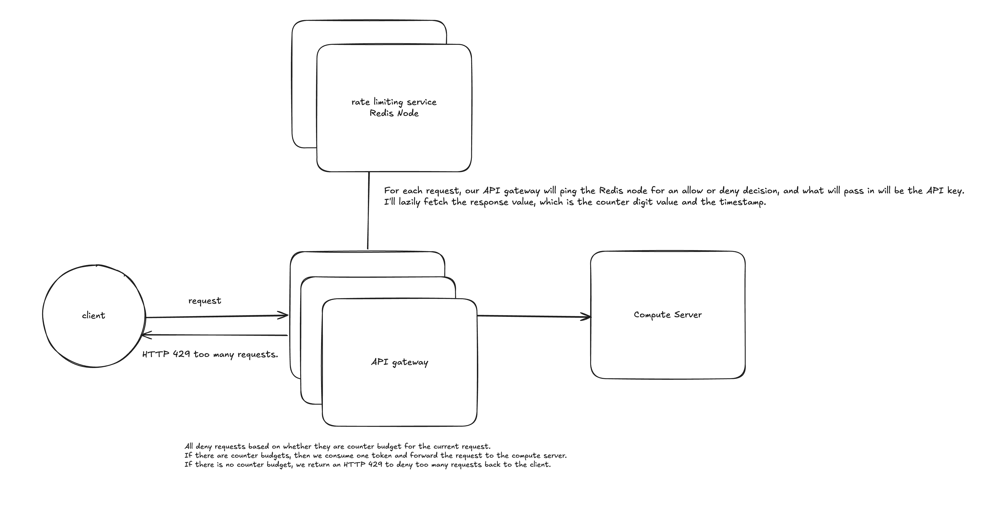

# 1. Requirements
Functional
- rate limit requests per authenticated API key
- API is purely HTTP-based
- when the limit is hit, return HTTP 429 Too Many Requests

Out of scope
- no persistence of rate-limiting data
- no analytical queries on rate-limiting behavior

Non-Functional
- favor availability over consistency
- P99 latency for the rate-limiting service must be < 10ms
- under partition/failure, dynamic fail-open vs. fail-close: default fail-open, switch to fail-close when the service itself is under saturation (per-API and aggregate request counters checked against a threshold)

Context gathered via clarifying questions
- every request is authenticated via an API key; clients are billed/tiered by plan, so limiting is per-API-key, not per-IP
- general-purpose public API for third-party developers — bursty traffic from many independent clients, not payments/transaction-critical

# 2. Estimation

Given: 500M requests/day system-wide, peak ≈ 5x average, ~50,000 active API keys

Average QPS
- 500M / 100K (rounded day) = 5,000 req/s

Peak QPS
- 5,000 * 5 = 25,000 req/s

Storage per key
- 8B key + ~42B counter/timestamp/aux fields = ~50B/key
- 50,000 * 50B = 2.5MB total

-> storage is trivial at this scale, confirmed after being pushed on it. QPS (25K peak) is the actual constraint, not storage.

# 3. API

Request
```
HTTP <any> /v1/{resource}
Header: Authorization: Bearer <api_key>
```

Response (allowed)
```
HTTP 200 (or whatever the underlying resource returns)
Header: X-RateLimit-Remaining: {count}
Header: X-RateLimit-Reset: {timestamp}
```

Response (limited)
```
HTTP 429 Too Many Requests
Header: X-RateLimit-Remaining: 0
Header: X-RateLimit-Reset: {timestamp}
```

# 4. High-level



Request flow
1. client makes a request with its API key
2. request hits one of several redundant API gateways — TLS termination happens here
3. gateway parses the API key and calls the rate-limiting store (Redis) to fetch the counter + timestamp for that key
4. if there's counter budget, decrement the token and forward the request to the compute server
5. if there's no counter budget, return HTTP 429 to the client

Where the rate limiter sits — three options considered
- in-process on each service machine — rejected: each machine has its own local counter, becomes a distributed-counter problem (starvation or oversubscription depending on which instance a request lands on)
- in the API gateway — chosen, alongside a shared store: gateway already does TLS termination and has the auth context (API key) it needs, and running gateways redundantly avoids a gateway-tier single point of failure

Algorithm choice — token bucket, chosen over fixed window and rolling window
- fixed window: rejected — up to 2x burst at the boundary between two windows
- rolling window (log): rejected — requires storing every request's timestamp per key, more storage than needed for the stated goals
- token bucket: chosen — bounded storage (single counter + timestamp per key), naturally tolerates bursty traffic, refill logic is simple

Token bucket mechanics
- lazy refill: on each request, compute elapsed time since last stored timestamp, refill tokens accordingly (refill every ~30s), capped at ~1.5x budget to allow for burst headroom
- if counter > 0: decrement and forward; if counter == 0: return 429
- no proactive/background refill job — counters only update lazily when a request actually arrives for that key

Pushback and initial gaps (both required a direct prompt, not self-identified)
- the first-pass design had a single Redis node behind the redundant gateways — a hard single point of failure, inconsistent with the reasoning used to justify redundant gateways in the first place
- the read-modify-write on the counter (read → decrement → write) was not originally atomic — under concurrent requests for the same API key landing on different gateways, this races and can let more requests through than the budget allows

# 5. Data model

```
api-key: { counter: <int>, timestamp: <last-updated> }
```

Sharding (introduced after the SPOF pushback)
- shard by API key: high cardinality (50,000 distinct keys) and evenly distributed
- each key lives on exactly one shard — no distributed-counter problem across shards
- primary + 2 replicas per shard, primary-replica mode, for durability

Concurrency fix (introduced after the race-condition pushback)
- the read-decrement-write on the token counter is done via a Lua script executed atomically on Redis: read counter, check budget, decrement, write new value, return allow/deny — all as a single atomic operation, so two concurrent gateways can't both read the same pre-decrement value

# 6. Deep dive

Scenario given: it's peak traffic (25K req/s), and the primary Redis node for one shard goes down mid-traffic. Walk through what happens.

- gateway-side timeout of ~8ms: if a request to Redis doesn't return within that window, the gateway treats the node as down
- based on the saturation-state signal established in NFRs, the gateway then decides fail-open vs. fail-close for that request
- failover: primary and replicas exchange periodic health pings; on consecutive failed pings, a majority quorum (2 of 3 nodes) promotes a replica to primary
- replica lag during the gap means the promoted primary's counter can be slightly stale — accepted as consistent with "favor availability over consistency," quantified concretely: e.g. a 100 req/s budget could effectively become ~110 req/s under lag

Question: you said a replica gets "promoted to a quorum." What does that quorum actually consist of — who's voting, how many need to agree, and where do they live relative to the Redis nodes? And separately — suppose the primary isn't actually dead, just partitioned from some subset of gateways. Those gateways time out and trigger a promotion, while the old primary is still alive serving a different set of gateways. What stops you from ending up with two primaries for the same shard?

Answer: quorum needs to be a majority — at least 3 nodes, with 2 agreeing on which replica becomes the new primary. To avoid split-brain, nodes periodically check the cluster for more than one primary; if two are found, one gets demoted back to a replica. This can happen after a partition heals, or when two primaries' health pings cross each other.

Question: two follow-ups on that answer. First — what does "two must agree" actually mean: that they see each other as healthy, or is there a real tie-breaker like a term/epoch number, so two isolated pairs during a partition can't each independently claim to be the majority? Second — if two primaries were both accepting writes during the split, and one later gets demoted, what happens to the counter decrements the demoted one already returned "allow" for?

Answer: last-filled timestamp wins — whichever primary has the latest write timestamp is the one adopted as correct going forward.

*(Note: this last answer is the weakest point in the deep dive — wall-clock last-write-wins is fragile across nodes with clock skew, and doesn't fully resolve what happens to the already-accepted writes from the losing side. The more standard technique here is a monotonic term/epoch number issued by the quorum itself, or a fencing token, rather than relying on wall-clock timestamps. See Roadmap Follow-Up below.)*

# 7. Wrap

So our system made the following choices:
- token bucket algorithm, chosen for burst tolerance over fixed/rolling window
- rate limiter colocated with the API gateway (owns TLS termination + auth context; could support per-tier limits later)
- dynamic fail-open (default) / fail-close (under saturation) based on a saturation signal from per-API and aggregate request counters
- HTTP 429 response with `X-RateLimit-Remaining` / `X-RateLimit-Reset` headers
- Redis sharded by API key, primary + 2 replicas per shard, atomic Lua-script token decrement, quorum-based failover

My design weaknesses (self-identified in wrap-up)
- no design for how rate-limit *configuration* itself gets updated across gateways — considered pull (poll every 30s) vs. push; push preferred if limits need to react within seconds during distress, but the mechanism itself wasn't designed
- no multi-region design — assumes a single region; cross-region round trip (~200ms) would blow the 10ms latency budget on its own. Proposed direction: region-based rate limiting with a global counter split informed by historical regional traffic patterns, not designed in detail
- (surfaced by interviewer, not self-identified) split-brain resolution relies on wall-clock last-write-wins rather than a term/epoch-based tie-breaker or fencing token, leaving the fate of writes accepted by a demoted primary unresolved

# 8. Interviewer Grading (Staff / L6 bar)

| Dimension | Score | Notes |
|---|---|---|
| Requirements gathering | 6/10 | Good initial questions; asked the interviewer to validate the requirements list instead of owning the call; the tiered-billing detail given early on was never explored as a functional requirement |
| High-level design quality | 7/10 | Strong, specific algorithm trade-off reasoning (fixed vs. rolling vs. token bucket); the Redis SPOF and the counter race condition both needed a direct prompt rather than being caught proactively |
| Deep-dive rigor | 6/10 | Solid failure-detection mechanics (timeout, health pings, majority quorum); the epoch/term tie-breaker question and the fate of a demoted primary's already-accepted writes were left unresolved |
| Trade-off articulation | 8/10 | Strongest dimension — consistently tied decisions back to the availability/consistency trade-off and quantified the cost concretely (100 → 110 req/s under lag), not just naming CAP/PACELC |
| Communication clarity | 7/10 | Organized, sequential reasoning; good diagram; some hedging language before landing on a decision |

**Verdict: Lean No — not yet at the Staff bar.** Closer to a strong Senior / borderline Staff performance. Real correctness gaps (SPOF, race condition) surfaced only after direct pushback rather than proactive self-review, and the split-brain resolution mechanism named at the end (wall-clock last-write-wins) is a known-fragile technique that wasn't reconciled with the term/epoch concept raised directly.

**Keep:** trade-off articulation — quantifying the consistency cost concretely.
**Primary growth area:** proactively red-teaming your own design ("what breaks this") before the interviewer has to ask.

# 9. Roadmap Follow-Up

Cross-referenced against `system_design_study_roadmap.md`. All listed subtopics are currently unstarted.

Direct hits
- **Topic 18 — Consensus & Leader Election** (18.1–18.6) — split-brain cause/prevention (18.5), Raft leader election (18.2), and Raft log commitment with a stale leader (18.3) map directly to the unresolved deep-dive questions
- **Topic 15 — Distributed Storage Systems** (15.1–15.6) — quorum math (R+W>N, 15.3), sync vs. async replication (15.5), replication lag (15.6) — the formal framework behind the "majority of three" and replica-lag reasoning done by instinct here
- **16.3 — Conflict resolution (LWW, vector clocks, CRDTs)** — directly targets the naive wall-clock last-write-wins answer
- **28.4 — Fencing tokens** — answers the unresolved "what happens to a demoted primary's already-accepted writes" question

Reinforcement
- **Topic 25 — Rate Limiting Systems** (all subtopics) — this exact archetype; 25.5 (distributed rate limiting with Redis) maps to the race-condition gap
- **Topic 19 — Fault Tolerance & Resilience** — targets the top growth area: proactively identifying SPOFs before being asked
- **Topic 17 — Consistency Models** (17.6, 17.7) — deepens the already-solid CAP/PACELC instinct into concrete system mapping

Suggested order: Topic 18 → Topic 15 → re-run a mock interview on a different replication-heavy problem (e.g. distributed cache or key-value store) to test whether the gap closes.
