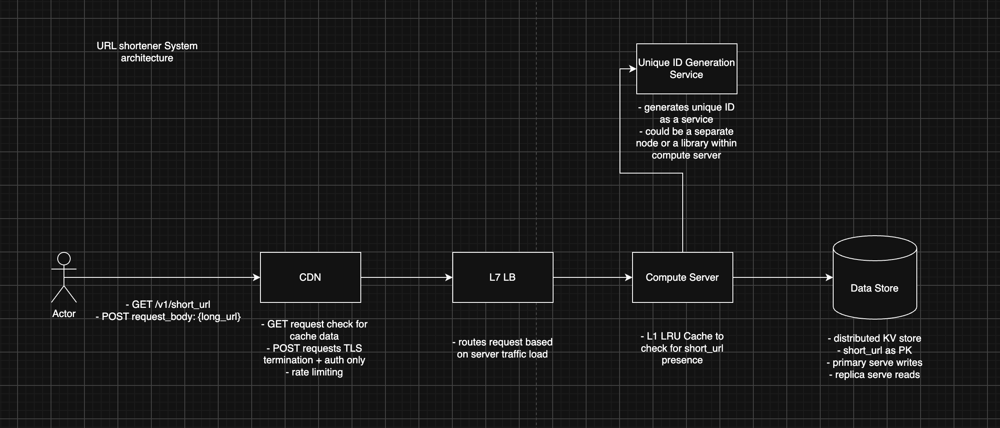
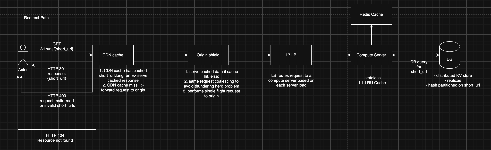
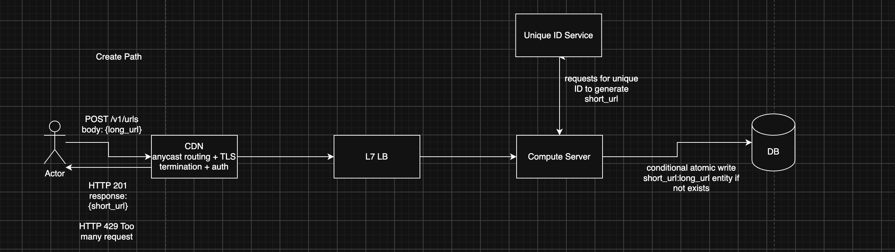

# 1. Requirements
Functional
- users can make requests with a short_url and gets redirected to the long url page
- users can create a short_url by passing in a long_url and get back a response with the short url 
- users must authenticate before they can create short_urls

Out of scope
- social sharing and features are not supported
- custom urls are not supported
- users cannot edit short_urls once created
- analytical features are not supported

Non-Functional
- For the read path, the p99 latency will be 50 ms 
- For the write path: the P99 latency will be 300 ms. 
- our system aims to have a 99.99% read availability, that's 8s of downtime a day
- And aims to have a 99.9% write availability, that's ~2min downtime a day
- system needs to be highly available, eventually consistent is acceptable

# 2. Estimation

Estimate 200M DAU
- each user redirects 10 short_urls per day
    - 2B reads/day
- 10% of users creates 1 short_urls per day
    - 20M writes/day
- service is used globally

QPS
- assume peak 3x
    - Read
        - 2B / 100K = 20K average QPS
        - peak 60K QPS
    - Write 
        - 20M / 100K = 200 average QPS
        - peak 600 QPS

-> write QPS is trivial, a typical compute server can handle 5K QPS easily
-> read QPS is heavy

Estimated per URL entity = 400B
    - short_url 8B
    - created_at 8B
    - long_url 300B
    - status 4B
    - aux data

Bandwidth (dominant)
    - Read response
        - 60K * 0.4KB = 24MB/s
    - Write request
        - 0.6K * 0.4KB = 240KB/s
-> 1 typical NIC is 10Mbps, so this bandwidth requirement is trivial

Storage
- assume storage for 10 years
storage per day: 20M * 0.4KB = 8GB
storage 10 years = 8 * 365 * 10 = 29TB

- assume indexing overhead 10%
- assume replication 3x
29TB * 1.1 * 3 = 95TB

-> 95TB of storage is trivial.

Conclusion
- the read QPS is heavy => we'll need to explore a caching architecture
- short_urls must be globally unique => we need a unique ID generation approach
- data storage selection and storage mechanism for read/write is at the core of the architecture
- p99 50ms read requirement and p99 300ms write requirement is a challenge. our design should target meeting this SLA with right trade-offs
above 3 conclusions are the core exploration of this design

# 3. API
Read API
Request
HTTP GET /tinyurl.com/{short_url}

Response
HTTP 301 Redirect to long_url

HTTP 404 - Resource not found

Write API
Request
HTTP POST /tinyurl.com/create_short_url
request_header: Bearer<Auth_token>
request_body: {
    url: {long_url}
}

Response
HTTP 201 Created
response_body: {
    short_url: {short_url},
    status: ACTIVE
}

HTTP 400 Bad request
HTTP 429 Too Many Request

# 4. High-level

Read Path

1. client makes `GET /v1/short_url` request
2. request routed to nearest CDN PoP. check for short_url cache data. if cache data present, serve as response
3. route to origin shield to collect same requests and coalesce into single flight request
4. L7 application level LB analyze the request and route based on least server connections
5. Compute server with L1 LRU cache checks for short_url presence
6. Forward to L2 Redis Cache to check short_url
7. Server looks up data store for short_url, Data store returns long_url
8. Server constructs response and sends response back to client as HTTP 301 redirect
9. browser redirects user to long_url site

Write Path

1. client makes POST /urls request with request body
2. request hits CDN PoPs, does TLS termination + authentication. Forwards request to LB
3. LB routes request to server based on least server connections
4. Server parses and validates the request long_url
5. Server consults Unique ID service  to generate a short_url
6. Server conditionally atomic write to KV store on new url_entity
7. Server responds to client with HTTP 201 Created

System Architecture

* CDN PoPs handles geographical regional requests 
   * Checks cache for GET requests
   * TLS termination + Auth for POST requests
   * Defends L3/L4/L7DDoS attacks
* Load Balancers
   * routes request to servers based on least connection routing mechanism
* Compute Server
   * stateless servers
   * L1 LRU cache
   * parses and validates requests
* Unique ID Generation Service
   * generates unique IDs to be used as url entity PK
* KV Data Store
   * url entity
      * short_url PK
      * long_url
      * created_at
      * status
   * primary for writes
   * replicas for reads

L2 Redis Cache

* Redis Cache is consulted for short_url cache key if L1 Cache miss.
* Redis cache is a real independent node that requires Server to make a network hop
* L1 LRU cache holds about 1GB hot keys, L2 Redis cache holds 50GB hot keys
* At 350K QPS, we need L2 cache because it can hold more keys so our cache hit rate increases with the tradeoff of a network hop from server to Redis.

Auth 

* Authentication is required for write path only. i've made changes on the diagram
* Rate limit enforcement happens at CDN PoPs, updated in diagram. we enforce rate limiting by authenticated user_id. 

Cache

* What's described here is a DDoS L7 application attack problem. For this we have 3 mechanisms
   * 1. sanitize short_urls to be alphanumeric and equals to our defined character size. failing sanitization means the request is scrubbed at CDN level
   * 2. cache negative lookup. the first time a valid looking short_url goes straight to DB and return empty. it's cached via short_url: empty. so subsequent same_url lookups get served the empty response(HTTP 404) instead of propagating to server. Negative lookup TTL is the tension between stale data false negatives and server load impact. We should have a negative lookup TTL of 30sec, assuming that's the normal retry duration for real users. all negative short_url requests are absorbed by cache.
   * 3. rate limiting by IP address. at L3 level, we do rate limiting by IP address to prevent any single IP address from flooding the server with read requests.

authentication applies to write path only and write path latency requirement is p99 <300ms. However, we still can't afford to do network round trip to auth service because every legit write hits origin server, which could be across regions. cross region network hops could be up to 200ms round trip, so this physical boundary itself already consumes ⅔ of our latency boundary. we need the remaining 100ms for other budgets like short_url key collisions, network hops to Redis, network hops to data store etc.

# 5. Data model

access patterns
Read
`WHERE short_url = ?`
Write
`INSERT INTO ... (short_url = ?, long_url =?, status = "ACTIVE", ...)`

* hot path read access is a point lookup, no joins, not ordering required
* our read write ratio is 100:1, so DB should aim to optimize read traffic over writes

ACID guarantee?

* short_url/long_url use cases are not sensitive or impactful enough to require ACID guarantees. we are trading data consistency for lower latency across read and write traffic

we expect high read fan out for short_url reads. and this fan out traffic is unpredictable for viral urls.

as such, we choose a NoSQL key-value family data store such as DynamoDB. because:

* access pattern is a point lookup, no joins and no filter, ordering required
* each read query to DB is a single partition read, so latency stays flat as data volume grows
* we expect a total storage of 95TB, so we need horizontal scalability, which is what DynamoDB excels at because partitioning is built into the data store design
* we avoid relational DB because the biggest benefit, ACID guarantee is not a requirement for our use case. 

In choosing DynamoDB, we are trading data consistency for lower latency. on hot read path, our p99 latency budget is 50ms so we can't afford to choose Relational DB which has higher latency due to stronger consistency effort, which isn't our requirement in the first place. for our service as an availability service, users  can tolerate a few seconds of data not found but can't tolerate service being unavailable. if ACID transactions becomes a requirement or we need the short_url to long_url redirect to be strictly correct, then we can revisit our data store choice.

our short_url generated from unique ID generation service naturally serves as the partition key because:

* the access pattern always provides the short_url as a point lookup. querying DynamoDB via a point lookup always hits 1 partition only, so latency stays flat as data volume grows
* access pattern is random, so no ordering of data is required.

partition strategy:

* we'll use hash partition with consistent hashing to evenly map hash keys onto available partitions and by extension, physical nodes.
* because both read/write access is random, we don't expect hot partition risks to surface due to key skews.
* but we do expect certain short_urls to be viral and contribute an uneven high amount of read traffic than others. for traffic load, this hot partition can be mitigated via a mix of caching and replication strategies.

For reads

* for short_url creator, upon successful writes and return response result, we'll implement read-your-own-write guarantee by capturing `user_id+short_url:serverX` combination and implement a short TTL(30s) sticky session on the Load balancer so subsequent user_id requests always routes to the same compute server that made the write. compute server will have the cached short_url: long_url key to be returned to the author. When TTL expires, we expect replicas to catch up with the writes so further reads become standard short_url reads
* for all other reads, LB routes based on server connection load and hits replicas

For writes

* all writes will hit our primary DB, and be subjected to higher latency. write 300ms as opposed to read 50ms requirements. since only a small fraction of users create short_urls as opposed to high volume reads, it's better acceptable for a small group of users affected with higher latency as opposed to the majority

Question: "No ACID" isn't quite the precise reason to avoid a relational DB. DynamoDB actually supports ACID transactions (TransactWriteItems) and strongly-consistent reads as opt-in features — it's not "no ACID" by nature, it defaults to eventually-consistent for lower latency/cost but lets you pay for stronger guarantees per-request when needed. So what's the more precise reason you're steering away from a relational engine — is it really about ACID, or is it about the operational difficulty of horizontally partitioning/scaling a relational database compared to a data store built partition-native from the ground up?

Answer: The logical partitioning strategy is genuinely the same in both cases — hash the key, route to a shard. What's different is who owns building and operating that infrastructure.

With DynamoDB, partition splitting, rebalancing as data grows or a partition gets hot, replica placement, failover, and request routing to the correct physical partition are all internal to the managed service — you send a request with the partition key and DynamoDB handles the rest, transparently, as your data and traffic grow.

With a manually sharded relational database (via something like Vitess or Citus, or a hand-rolled shard router), you have to build and operate all of that yourself: a shard map that tracks which key ranges live on which physical database, logic to split a shard and migrate data live without downtime as it grows, a routing layer that directs each query to the correct shard's connection, and — critically — each shard is its own independent relational database instance, so you're now provisioning, monitoring, and failing over N separate primary/replica clusters instead of one.

So the real reason isn't "relational can't do point-lookup partitioning" — it's that DynamoDB gives you managed, elastic partitioning as a built-in service property, while a sharded relational setup makes that entire operational layer your team's responsibility. Given your storage trajectory (95TB, growing) and global read fan-out, that's a meaningful amount of undifferentiated engineering work you'd rather not own.

# 6. Deep dive
# 7 Wrap
